# 第一阶段：深度解析与需求盘点看板

> 生成时间：2026-08-14
> 项目：数据服务平台 20 yiyun（亿云数据服务平台）
> 项目路径：/Users/zhanghuimin/Downloads/000服务平台/sjfwpt

---

## 0. 项目基本信息

| 项 | 值 |
|---|---|
| 产品名称 | 数据服务平台 20 yiyun（亿云数据服务平台） |
| 产品类型 | **AI 企业应用**（`ai_enterprise_app`，B 端应用 + AI 产品） |
| 平台形态 | Web-PC（Tailwind CSS + Font Awesome，CDN 直引，纯前端原型） |
| 主要用户 | 业务用户（政务部门、数据提供方、数据消费方、平台运营人员、开发者） |
| 页面总数 | 50 个业务页面 + 3 个辅助测试页面 |
| 导航体系 | 双入口：门户侧（`portal_common.js`）+ 开发者后台（`developer_nav.js`） |
| AI 特征 | 智能问答助手、AI 监控提示、AI 运营优化建议、智能审核（4 类审核页）、智能搜索、需求定制 AI 填充 |

---

## 2.1 业务架构概览 (Functional Architecture Map)

### 顶层业务拓扑

```mermaid
flowchart TD
    Portal[门户侧 - 业务用户消费端]
    Dev[开发者后台 - 运营/供给管理端]
    Portal --> P21[门户首页]
    Portal --> P29[数据中心]
    Portal --> P27[应用中心]
    Portal --> P32[场景中心]
    Portal --> P31[材料中心]
    Portal --> P37[数据超市]
    Portal --> P34[工作动态]
    Portal --> P46[智能问答助手 AI]
    Portal --> P14[数据篮]
    Portal --> P06[P06/P07 已申请/已授权数据]
    Portal --> P24[我的消息]
    Portal --> P08[能力封装申请]
    Dev --> P04[工作台]
    Dev --> RC[资源中心]
    Dev --> SD[供需中心]
    Dev --> OB[异议中心]
    Dev --> MN[监控中心 AI]
    Dev --> ST[统计中心 AI]
    Dev --> CF[配置中心]
    Dev --> AP[审批中心 隐藏]
    Dev --> P20[帮助中心 隐藏]
    RC --> P09[目录编制]
    RC --> P10[目录审核]
    RC --> DU[数据更新审核]
    RC --> P12[数据模型]
    RC --> P44[服务注册]
    RC --> P42[服务交付]
    SD --> P41[场景管理]
    SD --> P19[需求受理]
    AP --> P15[数据申请工单]
    AP --> P16[数据申请审核]
    AP --> P17[续期工单]
    AP --> P18[续期审核]
    AP --> P35[配额申请工单]
    AP --> P36[配额分配审核]
```

### 核心功能路径及页面识别

> 标注说明：`[Pxx]` = 独立页面；`[Dxx]` = 二级弹窗/抽屉

#### 📂 门户侧（业务用户消费端）— 数据资源一站式发现与消费

- 🛠️ **门户首页与导航**
  - [P21] index.html - 门户首页
- 🛠️ **数据资源发现与检索**
  - [P29] portal_data_center.html - 数据中心（目录浏览/检索）
  - [P30] portal_data_detail.html - 数据详情（字段/接口/样例）
  - [P37] resource_supermarket.html - 数据超市
  - [P38] resource_supermarket_detail.html - 资源详情（库表）
  - [P39] resource_supermarket_detail_api.html - 资源详情（接口）
- 🛠️ **场景化应用发现**
  - [P32] portal_scene_center.html - 场景中心
  - [P33] portal_scene_detail.html - 场景详情
  - [P27] portal_app_center.html - 应用中心
  - [P28] portal_app_detail.html - 应用详情
- 🛠️ **资源申请与消费管理**
  - [P14] data_basket.html - 数据篮
  - [P06] applied_data_resources.html - 已申请数据（消费侧）
  - [P07] authorized_data_resources.html - 已授权数据
  - [P08] capability_pack_list.html - 能力封装申请
- 🛠️ **辅助内容与消息**
  - [P31] portal_material_center.html - 材料中心
  - [P34] portal_work_dynamics.html - 工作动态
  - [P24] my_messages.html - 我的消息
- 🛠️ **AI 智能问答**
  - [P46] smart_chat.html - 智能问答助手（AI 对话页）

#### 📂 开发者后台 — 资源供给侧管理与运营治理

- 🛠️ **工作台与任务**
  - [P04] admin_workbench.html - 工作台（待办/审批入口）
  - [P50] workbench.html - 开发工作台
  - [P49] task_detail.html - 任务详情
- 🛠️ **资源中心 — 目录管理**
  - [P09] catalog_manage.html - 目录编制（列表）
  - [P11] catalog_add.html - 目录编制（新增/编辑表单）
  - [P10] catalog_audit.html - 目录审核（含 5 个智能审核标注）
  - [P51] data_update_audit.html - 数据更新审核（含 5 个智能审核标注）
  - [P12] catalog_tables.html - 数据模型
- 🛠️ **资源中心 — 服务管理**
  - [P44] service_register.html - 服务注册（列表）
  - [P45] service_register_add.html - 服务注册新增（表单，含智能填写 AI 抽屉）
  - [P42] service_delivery.html - 服务交付（列表，含 3 个智能审核标注）
  - [P43] service_delivery_add.html - 服务交付新增（表单）
- 🛠️ **供需中心**
  - [P41] scene_center.html - 场景管理
  - [P40] scene_add.html - 新增场景（表单）
  - [P19] demand_accept.html - 需求受理（含 4 个智能审核标注）
- 🛠️ **异议中心**
  - [P25] objection_accept.html - 异议受理（含 AI 智能审核）
- 🛠️ **监控中心（AI 赋能）**
  - [P22] monitor_dashboard.html - 监控看板（AI 提示卡片）
  - [P23] monitor_service_monitor.html - 供给服务监控
  - [P05] alert_messages.html - 告警消息
- 🛠️ **统计中心（AI 赋能）**
  - [P48] statistics_dashboard.html - 运营看板（AI 建议）
- 🛠️ **配置中心**
  - [P13] config_center.html - 场景配置
- 🛠️ **审批中心（导航隐藏，工单流转）**
  - [P15] data_resource_apply.html - 数据申请工单（已发起）
  - [P16] data_resource_audit.html - 数据申请审核
  - [P17] data_resource_renew.html - 资源续期工单
  - [P18] data_resource_renew_audit.html - 资源续期审核
  - [P35] quota_apply_work_order.html - 配额申请工单
  - [P36] quota_audit.html - 配额分配审核
- 🛠️ **开发工具**
  - [P26] online_dev.html - 在线开发（Python）
  - [P47] sql_develop.html - SQL 开发
- 🛠️ **帮助中心（导航隐藏）**
  - [P20] help_center.html - 帮助中心

#### 📂 辅助测试页面（不进入 PRD 功能范围）
- _app_test.html - 应用中心自动化测试夹具
- _flow_test.html - 数据中心需求提交流程测试夹具
- _modal_template.html - 弹窗组件占位模板

---

## 2.2 页面盘点清单（完整 50 页）

### 门户侧页面（15 页）

| ID | 文件 | 页面名称 | 页面类型 | 核心功能 | AI 功能 |
|---|---|---|---|---|---|
| P21 | index.html | 门户首页 | 看板式落地页 | 平台总览、能力展示、流量分发 | 智能问答入口 |
| P29 | portal_data_center.html | 数据中心 | 列表页（分类树+筛选+搜索） | 数据目录浏览、检索、加入数据篮 | 智能搜索、需求定制 AI 填充 |
| P30 | portal_data_detail.html | 数据详情 | 详情页（Tab 切换） | 基本信息/数据项/服务信息（库表/接口/文件三选一） | 需求定制 AI 填充 |
| P32 | portal_scene_center.html | 场景中心 | 列表页（卡片网格） | 场景域筛选、场景卡片浏览 | 智能问答入口 |
| P33 | portal_scene_detail.html | 场景详情 | 详情页 | 场景说明、关联数据资源、关联应用 | 智能问答入口 |
| P27 | portal_app_center.html | 应用中心 | 列表页（Tab+卡片网格） | 热门应用/创新案例切换、应用域筛选 | AI 智能分类 |
| P28 | portal_app_detail.html | 应用详情 | 详情页（Tab 切换） | 应用介绍/功能特性/数据资源/应用案例 | - |
| P31 | portal_material_center.html | 材料中心 | 列表页（卡片网格） | 材料分类筛选、下载/预览 | 智能问答入口 |
| P34 | portal_work_dynamics.html | 工作动态 | 列表页（时间线） | 动态分类筛选、排序、置顶 | 智能问答入口 |
| P14 | data_basket.html | 数据篮 | 列表页+抽屉 | 接口类/库表类资源管理、提交申请工单 | - |
| P06 | applied_data_resources.html | 已申请数据 | 列表页+详情抽屉 | 已申请资源查看、取消授权 | - |
| P07 | authorized_data_resources.html | 已授权数据 | 列表页+详情抽屉 | 已授权资源查看、取消授权 | - |
| P08 | capability_pack_list.html | 能力封装申请 | 列表页+详情抽屉 | 模型列表、能力封装详情查看 | - |
| P24 | my_messages.html | 我的消息 | 列表页 | 审批结果与系统通知查看 | - |
| P46 | smart_chat.html | 智能问答助手 | 对话页（AI） | 自然语言对话、历史会话、快捷问题 | **AI 核心功能** |

### 后台 — 工作台与开发工具（5 页）

| ID | 文件 | 页面名称 | 页面类型 | 核心功能 | AI 功能 |
|---|---|---|---|---|---|
| P04 | admin_workbench.html | 工作台 | 看板页 | 待办、审批入口、快捷操作 | - |
| P50 | workbench.html | 开发工作台 | 看板页 | 开发任务管理 | - |
| P49 | task_detail.html | 任务详情 | 详情页 | 任务执行详情 | - |
| P26 | online_dev.html | 在线开发 | 工具页 | Python 代码编辑器、运行日志 | - |
| P47 | sql_develop.html | SQL 开发 | 工具页 | SQL 编辑器、执行结果、运行日志 | - |

### 后台 — 资源中心：目录管理（5 页）

| ID | 文件 | 页面名称 | 页面类型 | 核心功能 | AI 功能 |
|---|---|---|---|---|---|
| P09 | catalog_manage.html | 目录编制 | 列表页 | 目录列表、搜索筛选、新建/编辑/删除 | - |
| P11 | catalog_add.html | 目录编制新增 | 向导表单页 | 分步表单（基本信息/共享开放/信息项） | - |
| P10 | catalog_audit.html | 目录审核 | 列表页+审核抽屉 | 目录审核（5 个审核标注点） | **智能审核** |
| P51 | data_update_audit.html | 数据更新审核 | 列表页+审核抽屉 | 数据更新审核（5 个审核标注点） | **智能审核** |
| P12 | catalog_tables.html | 数据模型 | 列表页 | 数据表结构管理 | - |

### 后台 — 资源中心：服务管理（4 页）

| ID | 文件 | 页面名称 | 页面类型 | 核心功能 | AI 功能 |
|---|---|---|---|---|---|
| P44 | service_register.html | 服务注册 | 列表页 | 服务列表、新建/编辑 | - |
| P45 | service_register_add.html | 服务注册新增 | 向导表单页 | 分步表单（基本信息/接口信息） | **智能填写 AI 抽屉** |
| P42 | service_delivery.html | 服务交付 | 列表页+详情抽屉 | 服务交付列表、查看详情（3 个审核标注点） | **智能审核** |
| P43 | service_delivery_add.html | 服务交付新增 | 向导表单页 | 分步表单、自动测试 | 自动测试 |

### 后台 — 供需中心（3 页）

| ID | 文件 | 页面名称 | 页面类型 | 核心功能 | AI 功能 |
|---|---|---|---|---|---|
| P41 | scene_center.html | 场景管理 | 列表页 | 场景列表、新建/编辑 | - |
| P40 | scene_add.html | 新增场景 | 表单页 | 场景创建、关联目录 | - |
| P19 | demand_accept.html | 需求受理 | 列表页+审核抽屉 | 需求受理（4 个审核标注点） | **智能审核** |

### 后台 — 异议中心（1 页）

| ID | 文件 | 页面名称 | 页面类型 | 核心功能 | AI 功能 |
|---|---|---|---|---|---|
| P25 | objection_accept.html | 异议受理 | 列表页+受理抽屉 | 异议受理、查看 | **智能审核** |

### 后台 — 监控中心（3 页）

| ID | 文件 | 页面名称 | 页面类型 | 核心功能 | AI 功能 |
|---|---|---|---|---|---|
| P22 | monitor_dashboard.html | 监控看板 | 看板页 | 服务健康总览、告警统计 | **AI 提示卡片** |
| P23 | monitor_service_monitor.html | 供给服务监控 | 列表页+详情 | 供给服务列表与详情 | - |
| P05 | alert_messages.html | 告警消息 | 列表页 | 告警消息列表与处理 | - |

### 后台 — 统计中心（1 页）

| ID | 文件 | 页面名称 | 页面类型 | 核心功能 | AI 功能 |
|---|---|---|---|---|---|
| P48 | statistics_dashboard.html | 运营看板 | 看板页 | 多维度统计、目录/资源/部门/区县 | **AI 发现+优化建议** |

### 后台 — 配置中心（1 页）

| ID | 文件 | 页面名称 | 页面类型 | 核心功能 | AI 功能 |
|---|---|---|---|---|---|
| P13 | config_center.html | 场景配置 | 列表页（分类树+列表） | 领域分类树、场景 CRUD | - |

### 后台 — 审批中心（导航隐藏，6 页）

| ID | 文件 | 页面名称 | 页面类型 | 核心功能 | AI 功能 |
|---|---|---|---|---|---|
| P15 | data_resource_apply.html | 数据申请工单 | 列表页+详情抽屉 | 已发起的数据申请查看 | - |
| P16 | data_resource_audit.html | 数据申请审核 | 列表页+审核抽屉 | 数据申请审核（通过/退回） | - |
| P17 | data_resource_renew.html | 资源续期工单 | 列表页+详情抽屉 | 续期工单查看 | - |
| P18 | data_resource_renew_audit.html | 资源续期审核 | 列表页+审核抽屉 | 续期审核（通过/驳回） | - |
| P35 | quota_apply_work_order.html | 配额申请工单 | 列表页（简单） | 配额申请查看 | - |
| P36 | quota_audit.html | 配额分配审核 | 列表页+审核抽屉+分配弹窗 | 配额分配（CPU/内存） | - |

### 后台 — 帮助中心（导航隐藏，1 页）

| ID | 文件 | 页面名称 | 页面类型 | 核心功能 | AI 功能 |
|---|---|---|---|---|---|
| P20 | help_center.html | 帮助中心 | 列表页 | FAQ 搜索、分类浏览 | - |

---

## 2.3 业务需求卡片 (Business Intent Cards)

### 📦 模块 A：门户数据资源发现与消费（业务用户侧）

- **💡 核心意图**：为业务用户提供一站式数据资源发现、检索、申请、消费入口，降低数据使用门槛
- **🛠️ 核心能力与页面分布**：
  1. **资源总览与导航** → 📄 [P21] 门户首页
  2. **数据目录浏览检索**（部门/区县/基础库/事项分类） → 📄 [P29] 数据中心、📄 [P30] 数据详情
  3. **数据超市选购**（库表/接口分类） → 📄 [P37] 数据超市、📄 [P38][P39] 资源详情
  4. **场景化应用发现** → 📄 [P32] 场景中心、📄 [P33] 场景详情、📄 [P27] 应用中心、📄 [P28] 应用详情
  5. **数据篮与申请管理** → 📄 [P14] 数据篮、📄 [P06] 已申请数据、📄 [P07] 已授权数据
  6. **能力封装申请** → 📄 [P08] 能力封装申请
  7. **材料与动态浏览** → 📄 [P31] 材料中心、📄 [P34] 工作动态
  8. **消息通知** → 📄 [P24] 我的消息
- **📊 关键数据清单**：数据资源目录代码、数据资源名称、资源类型（库表/接口/文件）、共享类型、开放类型、提供机构、更新频率、字段定义、接口地址、接口文档

### 📦 模块 B：AI 智能问答助手（AI 核心能力）

- **💡 核心意图**：通过自然语言对话帮助业务用户快速找到所需数据资源、理解字段含义、获取使用建议
- **🛠️ 核心能力与页面分布**：
  1. **对话式数据查询** → 📄 [P46] smart_chat.html（对话页：消息流 + 输入框 + 历史会话）
  2. **上下文多轮对话** → 基于历史会话保持上下文
  3. **结构化回复** → AI 回复可含数据资源卡片、链接卡片
  4. **快捷问题推荐** → 欢迎页展示常见问题按钮
- **📊 关键数据清单**：用户问题、会话历史、AI 回答、引用资源、置信度

### 📦 模块 C：资源中心 — 目录与服务管理（供给侧）

- **💡 核心意图**：实现政务数据资源目录的一站式编制、审核、发布与生命周期管理，以及基于目录的服务注册与交付
- **🛠️ 核心能力与页面分布**：
  1. **目录编制**（基本信息/共享开放/信息项分步表单） → 📄 [P09] 目录编制列表、📄 [P11] 目录编制表单
  2. **目录审核**（5 个审核标注点：名称/颗粒度/共享类型/摘要/信息项） → 📄 [P10] 目录审核
  3. **数据更新审核**（5 个审核标注点：模板/空值/重复/公式/日期） → 📄 [P51] 数据更新审核
  4. **数据模型管理** → 📄 [P12] 数据模型
  5. **服务注册**（含智能填写 AI 抽屉） → 📄 [P44] 服务注册列表、📄 [P45] 服务注册表单
  6. **服务交付**（含自动测试 + 3 个审核标注点：服务名称/接口地址/接口文档） → 📄 [P42] 服务交付列表、📄 [P43] 服务交付表单
- **📊 关键数据清单**：目录代码、目录名称、信息资源名称、共享类型、开放类型、提供机构、更新频率、信息项（名称/描述/类型/长度/是否主键）、服务名称、服务类型、接口地址、接口文档

### 📦 模块 D：供需中心 — 场景与需求管理

- **💡 核心意图**：以业务场景驱动供需对接，实现"场景 → 需求 → 受理 → 交付"闭环
- **🛠️ 核心能力与页面分布**：
  1. **场景管理** → 📄 [P41] 场景管理
  2. **新增场景** → 📄 [P40] 新增场景
  3. **需求受理**（4 个审核标注点：场景清晰度/系统名称/附件/申请依据） → 📄 [P19] 需求受理
- **📊 关键数据清单**：场景名称、所属领域、关联目录、需求级别、需求目录、需求服务、服务类型、需求方单位、申请依据、附件

### 📦 模块 E：配置中心 — 场景配置

- **💡 核心意图**：统一管理平台对外展示的业务场景配置，支撑门户场景中心的内容供给
- **🛠️ 核心能力与页面分布**：
  1. **领域分类树 + 场景列表 CRUD** → 📄 [P13] 场景配置
  2. **新增场景**（与供需中心共用） → 📄 [P40] 新增场景
- **📊 关键数据清单**：领域分类、场景名称、数据目录数、状态、更新时间、场景图标

### 📦 模块 F：审批中心 — 工单流转（导航隐藏）

- **💡 核心意图**：承载数据资源申请、续期、配额申请的全生命周期工单流转
- **🛠️ 核心能力与页面分布**：
  1. **数据资源申请工单** → 📄 [P15] 数据申请工单
  2. **数据资源审核**（通过/退回） → 📄 [P16] 数据申请审核
  3. **续期工单与审核** → 📄 [P17] 资源续期工单、📄 [P18] 资源续期审核
  4. **配额申请工单与审核**（CPU/内存分配） → 📄 [P35] 配额申请工单、📄 [P36] 配额分配审核
- **📊 关键数据清单**：资源名称、资源类型、数据申请方、数据所属方、申请时间、授权开始/结束时间、状态、配额量、部门名称

### 📦 模块 G：监控中心（AI 赋能）

- **💡 核心意图**：实时监控平台服务健康状态，通过 AI 智能识别异常、风险与处置建议
- **🛠️ 核心能力与页面分布**：
  1. **监控看板**（AI 提示卡片：慢接口预警/异常波动/处置建议） → 📄 [P22] 监控看板
  2. **供给服务监控** → 📄 [P23] 供给服务监控
  3. **告警消息** → 📄 [P05] 告警消息
- **📊 关键数据清单**：服务名称、所属部门、调用次数、P99 响应时间、告警底座、告警时间、告警内容、状态
- **AI 功能**：AI 提示卡片（慢接口预警、异常波动、处置建议）

### 📦 模块 H：统计中心（AI 赋能）

- **💡 核心意图**：多维度统计平台运营数据，通过 AI 识别短板并给出优先处理方向
- **🛠️ 核心能力与页面分布**：
  1. **运营看板**（目录/资源/部门/区县多维统计 + AI 发现/优化建议卡片） → 📄 [P48] 运营看板
- **📊 关键数据清单**：部门名称、目录总数、已挂接目录数、挂接率、资源总数、库表/文件/接口资源数、资源被申请次数
- **AI 功能**：AI 发现卡片（挂接推进薄弱等）、AI 优化建议卡片

### 📦 模块 I：异议中心

- **💡 核心意图**：受理数据资源/服务相关的异议与数据质量反馈
- **🛠️ 核心能力与页面分布**：
  1. **异议受理**（含 AI 智能审核：完整性核查/类型识别/相关性分析/历史比对） → 📄 [P25] 异议受理
- **📊 关键数据清单**：异议标题、异议对象、服务名称、异议提出单位、创建时间、受理状态

### 📦 模块 J：开发工具与帮助

- **💡 核心意图**：为开发者提供在线代码/SQL 开发环境，为用户提供帮助文档
- **🛠️ 核心能力与页面分布**：
  1. **在线开发**（Python 编辑器 + 运行日志） → 📄 [P26] 在线开发
  2. **SQL 开发**（SQL 编辑器 + 执行结果） → 📄 [P47] SQL 开发
  3. **帮助中心**（FAQ + 搜索） → 📄 [P20] 帮助中心
- **📊 关键数据清单**：文件名、代码内容、运行日志、执行结果表、FAQ 分类/标题/内容

---

## 2.4 原型一致性风险雷达 (Consistency Alarm)

| 风险点 | 表现描述 | 潜在影响 | 建议处理方式 |
|---|---|---|---|
| 死胡同-1 | `developer_nav.js` 中"服务审核"navKey 存在但 `disabled:true`，无对应 HTML | 导航残留 | PRD 中标注为规划中功能，本期不实现 |
| 死胡同-2 | 异议中心仅"异议受理"可用，提出/核查/审查/评价均 disabled | 异议全流程断裂 | PRD 描述完整状态流转，标注本期仅实现"受理" |
| 死胡同-3 | 统计中心二级菜单（13 项）全部 disabled，仅看板页 | 统计下钻缺失 | PRD 仅描述看板页，二级菜单列为 roadmap |
| 死胡同-4 | 监控中心二级菜单（申请/场景/服务监控/告警/心跳）全部 disabled | 监控覆盖不全 | PRD 仅描述已实现的 3 个监控页面 |
| 死胡同-5 | 供需中心"我的需求/需求审核/需求交付/我的供给/扩容审核"均 disabled | 供需闭环缺失 | PRD 描述供需闭环，标注本期仅实现场景管理+需求受理 |
| 死胡同-6 | 审批中心、帮助中心在顶部导航被 JS 强制 `display:none` | 用户无法从顶部导航进入 | PRD 说明入口在门户侧我的消息/工作台/用户菜单 |
| 命名冲突-1 | `workbench.html`（开发工作台）与 `admin_workbench.html`（工作台）功能相似 | 角色边界不清 | PRD 明确：[P04] 运营管理工作台，[P50] 开发者工作台 |
| 命名冲突-2 | `data_resource_apply.html` 标题"已申请数据"与 `applied_data_resources.html` 同名 | 语义混淆 | PRD 统一：[P15] 数据申请工单(已发起)，[P06] 已申请数据(消费侧) |
| 命名冲突-3 | `resource_supermarket_detail.html` 与 `_api.html` 标题均为"资源详情" | 类型不清 | PRD 区分：[P38] 库表型详情，[P39] 接口型详情 |
| 异常缺失-1 | `smart_chat.html` 未展示模型超时/无响应/降级状态 | AI 交互不完整 | PRD 第 11 章补充 AI 降级方案 |
| 异常缺失-2 | 监控/统计 AI 卡片"查看详情"跳转目标未明确 | AI 建议无法下钻 | PRD 描述为"抽屉/弹窗展示详情"，列入待确认 |
| 异常缺失-3 | 各列表页无空状态/加载失败/无权限状态设计 | 交互不完整 | PRD 统一补充空/异常状态规范 |
| 状态残留 | `_app_test.html`、`_flow_test.html`、`_modal_template.html` 为测试夹具 | 混入 PRD | PRD 排除，不纳入功能范围 |
| Mock 数据 | 首页指标数字（9261/1914/7347）为 Mock | 误导研发 | PRD 描述为"动态指标卡"，不写死数值 |

---

## 2.5 待确认问题清单与评估 (Open Questions)

| ID | 关键问题 | 阻塞级别 | 建议负责人 |
|---|---|---|---|
| Q01 | **PRD 覆盖范围**：是否需要覆盖全部 50 个业务页面？ | **P0** | 业务方/PM |
| Q02 | 审批中心与帮助中心在顶部导航被隐藏，是否有其他入口？入口在哪？ | P0 | 业务方 |
| Q03 | `workbench.html`（P50）与 `admin_workbench.html`（P04）的角色定位差异？ | P1 | 业务方 |
| Q04 | 智能问答助手（smart_chat）的 AI 能力边界：仅检索推荐？还是支持数据查询/图表生成/字段解释？ | P1 | PM/AI 产品 |
| Q05 | 监控/统计 AI 卡片"查看详情"的落地形式：抽屉？弹窗？独立详情页？ | P1 | PM |
| Q06 | 异议中心、统计中心、监控中心、供需中心大量 disabled 菜单是否属于本期 roadmap？ | P1 | 业务方 |
| Q07 | 数据资源申请工单的完整状态流转定义？ | P1 | 业务方 |
| Q08 | 角色权限体系：平台运营/数据提供方/数据消费方/开发者/审批人的权限矩阵？ | P1 | 业务方 |
| Q09 | 在线开发/SQL 开发的执行环境是真实执行还是仅原型演示？ | P2 | 技术方 |
| Q10 | 能力封装申请（P08）的"能力封装"具体指什么？模型封装？API 聚合？ | P2 | 业务方 |
| Q11 | 门户侧与开发者后台是否共用同一套用户体系？用户登录后如何切换？ | P1 | 业务方 |

---

## 决策确认

请确认以下关键决策：

1. **PRD 覆盖范围（Q01）**：
   - 方案 A：覆盖全部 50 个业务页面（推荐，全量逆向）
   - 方案 B：仅覆盖核心模块（门户+资源中心+服务管理+供需+监控统计）
   - 方案 C：自定义范围

2. **产品类型确认**：AI 应用模板？（智能问答助手 + 4 类智能审核 + 监控/统计 AI 卡片 + 智能填写 + 智能搜索）

3. **待确认问题清单**中是否有 P0 问题可以现在解答？
