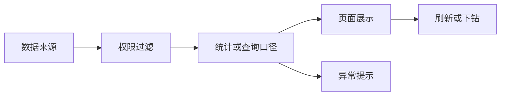
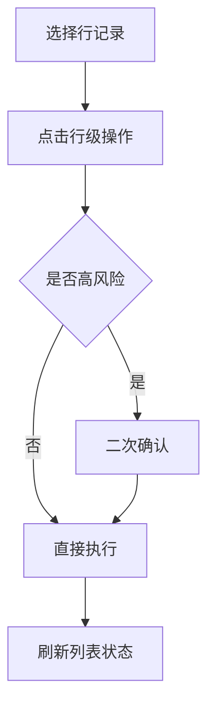
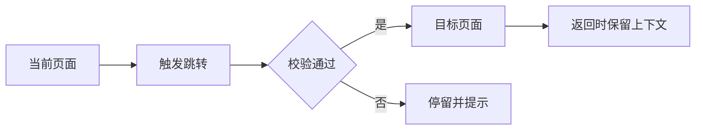

# 原型标注说明文档

## 1. 产品信息

- 产品名称：数据服务平台 20 yiyun
- 产品类型：ai_enterprise_app
- 产品形态：B端应用、AI产品、数据产品、SaaS产品、内容/工具产品
- 主要用户：业务用户
- 标注模式：standard
- 启用标注类型：P、E、C、A、J、S、R、PERM、DATA、AI、PROMPT、CTX、HITL、FALLBACK、METRIC、SOURCE、FILTER、REFRESH、DRILL、ROLE、PLAN、TENANT、CONTENT、PUBLISH、MOD、REC、TRACK

## 2. 页面清单

| 页面 | 页面名称 | 页面类型 | 路径 | 角色 |
|---|---|---|---|---|
| P01 | _app_test | 未提供 | _app_test.html | 未提供 |
| P02 | _flow_test | 未提供 | _flow_test.html | 未提供 |
| P03 | 添加弹窗组件 - 占位 | 未提供 | _modal_template.html | 未提供 |
| P04 | 数据服务平台 - 工作台 | 未提供 | admin_workbench.html | 未提供 |
| P05 | 数据服务平台 - 告警消息 | 未提供 | alert_messages.html | 未提供 |
| P06 | 数据服务平台 - 已申请数据 | 未提供 | applied_data_resources.html | 未提供 |
| P07 | 数据服务平台 - 已授权数据 | 未提供 | authorized_data_resources.html | 未提供 |
| P08 | 数据服务平台 - 能力封装申请 | 未提供 | capability_pack_list.html | 未提供 |
| P09 | 数据服务平台 - 目录编制 | 未提供 | catalog_add.html | 未提供 |
| P10 | 数据服务平台 - 目录审核 | 未提供 | catalog_audit.html | 未提供 |
| P11 | 数据服务平台 - 目录编制 | 未提供 | catalog_manage.html | 未提供 |
| P12 | 数据服务平台 - 数据模型 | 未提供 | catalog_tables.html | 未提供 |
| P13 | 数据服务平台 - 场景配置 | 未提供 | config_center.html | 未提供 |
| P14 | 数据服务平台 - 数据篮 | 未提供 | data_basket.html | 未提供 |
| P15 | 数据服务平台 - 已申请数据 | 未提供 | data_resource_apply.html | 未提供 |
| P16 | 数据服务平台 - 数据申请审核 | 未提供 | data_resource_audit.html | 未提供 |
| P17 | 数据服务平台 - 资源续期工单 | 未提供 | data_resource_renew.html | 未提供 |
| P18 | 数据服务平台 - 资源续期审核 | 未提供 | data_resource_renew_audit.html | 未提供 |
| P19 | 数据服务平台 - 需求受理 | 未提供 | demand_accept.html | 未提供 |
| P20 | 数据服务平台 - 帮助中心 | 未提供 | help_center.html | 未提供 |
| P21 | 数据服务平台 - 门户首页 | 未提供 | index.html | 未提供 |
| P22 | 数据服务平台 - 监控看板 | 未提供 | monitor_dashboard.html | 未提供 |
| P23 | 数据服务平台 - 供给服务监控 | 未提供 | monitor_service_monitor.html | 未提供 |
| P24 | 数据服务平台 - 我的消息 | 未提供 | my_messages.html | 未提供 |
| P25 | 数据服务平台 - 异议受理 | 未提供 | objection_accept.html | 未提供 |
| P26 | 数据服务平台 - 在线开发 | 未提供 | online_dev.html | 未提供 |
| P27 | 数据服务平台 - 应用中心 | 未提供 | portal_app_center.html | 未提供 |
| P28 | 应用详情 - 数据服务平台 | 未提供 | portal_app_detail.html | 未提供 |
| P29 | 数据服务平台 - 数据中心 | 未提供 | portal_data_center.html | 未提供 |
| P30 | 数据服务平台 - 数据详情 | 未提供 | portal_data_detail.html | 未提供 |
| P31 | 数据服务平台 - 材料中心 | 未提供 | portal_material_center.html | 未提供 |
| P32 | 数据服务平台 - 场景中心 | 未提供 | portal_scene_center.html | 未提供 |
| P33 | 数据服务平台 - 场景详情 | 未提供 | portal_scene_detail.html | 未提供 |
| P34 | 数据服务平台 - 工作动态 | 未提供 | portal_work_dynamics.html | 未提供 |
| P35 | 数据服务平台 - 配额申请工单 | 未提供 | quota_apply_work_order.html | 未提供 |
| P36 | 数据服务平台 - 配额分配审核 | 未提供 | quota_audit.html | 未提供 |
| P37 | 数据服务平台 - 数据超市 | 未提供 | resource_supermarket.html | 未提供 |
| P38 | 数据服务平台 - 资源详情 | 未提供 | resource_supermarket_detail.html | 未提供 |
| P39 | 数据服务平台 - 资源详情 | 未提供 | resource_supermarket_detail_api.html | 未提供 |
| P40 | 数据服务平台 - 新增场景 | 未提供 | scene_add.html | 未提供 |
| P41 | 数据服务平台 - 场景管理 | 未提供 | scene_center.html | 未提供 |
| P42 | 数据服务平台 - 服务交付 | 未提供 | service_delivery.html | 未提供 |
| P43 | 数据服务平台 - 服务交付 | 未提供 | service_delivery_add.html | 未提供 |
| P44 | 数据服务平台 - 服务注册 | 未提供 | service_register.html | 未提供 |
| P45 | 数据服务平台 - 服务注册新增 | 未提供 | service_register_add.html | 未提供 |
| P46 | 智能问答助手 - 数据服务平台 | 未提供 | smart_chat.html | 未提供 |
| P47 | 数据服务平台 - SQL开发 | 未提供 | sql_develop.html | 未提供 |
| P48 | 数据服务平台 - 运营看板 | 未提供 | statistics_dashboard.html | 未提供 |
| P49 | 数据服务平台 - 任务详情 | 未提供 | task_detail.html | 未提供 |
| P50 | 数据服务平台 - 开发工作台 | 未提供 | workbench.html | 未提供 |

## 3. 标注总览

| 序号 | 标注ID | 类型 | 标题 | 页面 | 摘要 |
|---|---|---|---|---|---|
| 1 | ANN-P01-002 | C | 数据资源中心 | _app_test | 业务含义 按发布时间倒序 |
| 2 | ANN-P01-003 | P | $1 · 页面介绍 | _app_test | 页面功能介绍 本页面用于帮助【业务用户】完成与「$1」相关的核心任务。 核心内容 页面对象：围绕「$1」呈现核心业务信息、状态和可执行操作。 … |
| 3 | ANN-P01-004 | DATA | 数据口径 | _app_test | 业务含义 「数据资源中心」用于说明当前页面中数据、指标或列表内容的来源、口径和刷新边界。 数据规则 明确数据来源、统计范围和权限过滤规则。 指… |
| 1 | ANN-P02-001 | P | $1 · 页面介绍 | _flow_test | 页面功能介绍 本页面用于帮助【业务用户】完成与「$1」相关的核心任务。 核心内容 页面对象：围绕「$1」呈现核心业务信息、状态和可执行操作。 … |
| 1 | ANN-P03-001 | P | 确 定 · 页面介绍 | 添加弹窗组件 - 占位 | 页面功能介绍 本页面用于帮助【业务用户】完成与「确 定」相关的核心任务。 核心内容 页面对象：围绕「确 定」呈现核心业务信息、状态和可执行操作… |
| 1 | ANN-P04-001 | P | 欢迎登录，yiyun！ · 页面介绍 | 数据服务平台 - 工作台 | 页面功能介绍 本页面用于帮助【业务用户】完成与「欢迎登录，yiyun！」相关的核心任务。 核心内容 页面对象：围绕「欢迎登录，yiyun！」呈… |
| 2 | ANN-P04-002 | A | 5 目录发布审核 | 数据服务平台 - 工作台 | 业务含义 「5 目录发布审核」关键操作入口。 交互规则 用户点击「5 目录发布审核」后，系统应执行与该入口对应的业务动作。 操作前应校验当前用… |
| 3 | ANN-P04-003 | A | 2 需求审核 | 数据服务平台 - 工作台 | 业务含义 「2 需求审核」关键操作入口。 交互规则 用户点击「2 需求审核」后，系统应执行与该入口对应的业务动作。 操作前应校验当前用户、当前… |
| 1 | ANN-P05-001 | P | 消息中心 / 告警消息 任务名称：… · 页面介绍 | 数据服务平台 - 告警消息 | 页面功能介绍 本页面用于帮助【业务用户】完成与「消息中心 / 告警消息 任务名称： 告警底座： 请选择 重置 查询 资源告警列表 序号 任务名… |
| 2 | ANN-P05-002 | C | 数据列表 | 数据服务平台 - 告警消息 | 业务含义 「序号 任务名称 告警底座 消息内容 告警时间 1 zh测试任务…」承载本页列表或表格数据的浏览、筛选与操作任务。 使用场景 用户需… |
| 1 | ANN-P06-001 | P | 数据服务平台 - 已申请数据 · 页面介绍 | 数据服务平台 - 已申请数据 | 页面功能介绍 本页面用于帮助【业务用户】完成与「数据服务平台 - 已申请数据」相关的核心任务。 核心内容 页面对象：围绕「数据服务平台 - 已… |
| 2 | ANN-P06-002 | C | 数据列表 | 数据服务平台 - 已申请数据 | 业务含义 「序号 资源名称 资源类型 资源所属方 资源申请方 状态 已授权…」承载本页列表或表格数据的浏览、筛选与操作任务。 使用场景 用户需… |
| 3 | ANN-P06-003 | C | 未命名标注 | 数据服务平台 - 已申请数据 | 业务含义 「当前区域」是当前二级界面中的业务字段，用于记录、筛选或确认与当前操作直接相关的信息。 填写规则 优先以字段标签、分组标题和页面说明… |
| 1 | ANN-P07-001 | P | 数据服务平台 - 已授权数据 · 页面介绍 | 数据服务平台 - 已授权数据 | 页面功能介绍 本页面用于帮助【业务用户】完成与「数据服务平台 - 已授权数据」相关的核心任务。 核心内容 页面对象：围绕「数据服务平台 - 已… |
| 2 | ANN-P07-002 | C | 数据列表 | 数据服务平台 - 已授权数据 | 业务含义 「序号 资源名称 资源类型 资源所属方 资源申请方 状态 已授权…」承载本页列表或表格数据的浏览、筛选与操作任务。 使用场景 用户需… |
| 1 | ANN-P08-001 | P | 工作台 / 部署封装 / 能力封装… · 页面介绍 | 数据服务平台 - 能力封装申请 | 页面功能介绍 本页面用于帮助【业务用户】完成与「工作台 / 部署封装 / 能力封装申请 模型名称： 任务名称： 重置 查询 模型列表 新增 序… |
| 2 | ANN-P08-002 | A | 行级操作 | 数据服务平台 - 能力封装申请 | 业务含义 行级操作用于对列表中的单条数据进行查看、编辑、启用、停用、授权、下载或删除等管理动作。 操作规则 用户点击某一行的操作按钮时，仅影响… |
| 1 | ANN-P09-001 | P | 返回列表 1 数据资源目录维护 2… · 页面介绍 | 数据服务平台 - 目录编制 | 页面功能介绍 本页面用于帮助【业务用户】完成与「返回列表 1 数据资源目录维护 2 信息项维护 基本信息 数据资源目录名称 * 数据资源目录摘… |
| 2 | ANN-P09-002 | C | 数据列表 | 数据服务平台 - 目录编制 | 业务含义 「序号 信息项名称 共享类型 共享条件 开放类型 开放条件 是否…」承载本页列表或表格数据的浏览、筛选与操作任务。 使用场景 用户需… |
| 3 | ANN-P09-003 | C | 搜索筛选 | 数据服务平台 - 目录编制 | 业务含义 「按表名/中文名/字段关键词搜索...」是当前二级界面中的业务字段，用于记录、筛选或确认与当前操作直接相关的信息。 填写规则 优先以… |
| 4 | ANN-P09-004 | C | table-select | 数据服务平台 - 目录编制 | 业务含义 「table-select」是当前二级界面中的业务字段，用于记录、筛选或确认与当前操作直接相关的信息。 填写规则 优先以字段标签、分… |
| 5 | ANN-P09-005 | C | 未命名标注 | 数据服务平台 - 目录编制 | 业务含义 「当前区域」是当前二级界面中的业务字段，用于记录、筛选或确认与当前操作直接相关的信息。 填写规则 优先以字段标签、分组标题和页面说明… |
| 6 | ANN-P09-006 | C | 搜索筛选 | 数据服务平台 - 目录编制 | 业务含义 「请输入目录描述，或点击上方按钮上传文件让AI分析...」是当前二级界面中的业务字段，用于记录、筛选或确认与当前操作直接相关的信息。… |
| 7 | ANN-P09-007 | J | 未命名标注 | 数据服务平台 - 目录编制 | 业务含义 「跳转」用于连接当前页面与下一步业务流程。 跳转规则 用户完成当前操作后进入目标页面。 跳转时需要带入当前业务对象的标识信息。 返回… |
| 8 | ANN-P09-008 | C | 未命名标注 | 数据服务平台 - 目录编制 | 业务含义 「当前区域」是当前二级界面中的业务字段，用于记录、筛选或确认与当前操作直接相关的信息。 填写规则 优先以字段标签、分组标题和页面说明… |
| 9 | ANN-P09-009 | C | 未命名标注 | 数据服务平台 - 目录编制 | 业务含义 「当前区域」是当前二级界面中的业务字段，用于记录、筛选或确认与当前操作直接相关的信息。 填写规则 优先以字段标签、分组标题和页面说明… |
| 10 | ANN-P09-010 | A | 未命名标注 | 数据服务平台 - 目录编制 | 业务含义 「操作」关键操作入口。 交互规则 用户点击「操作」后，系统应执行与该入口对应的业务动作。 操作前应校验当前用户、当前对象状态和必要输… |
| 1 | ANN-P10-001 | P | 目录发布待审核列表 · 页面介绍 | 数据服务平台 - 目录审核 | 页面功能介绍 本页面用于帮助【业务用户】完成与「目录发布待审核列表」相关的核心任务。 核心内容 页面对象：围绕「目录发布待审核列表」呈现核心业… |
| 2 | ANN-P10-002 | A | 行级操作 | 数据服务平台 - 目录审核 | 业务含义 行级操作用于对列表中的单条数据进行查看、编辑、启用、停用、授权、下载或删除等管理动作。 操作规则 用户点击某一行的操作按钮时，仅影响… |
| 3 | ANN-P10-003 | C | 数据列表 | 数据服务平台 - 目录审核 | 业务含义 「序号 数据资源目录代码 数据资源名称 数据资源提供方 审批结果…」承载本页列表或表格数据的浏览、筛选与操作任务。 使用场景 用户需… |
| 4 | ANN-P10-004 | J | 未命名标注 | 数据服务平台 - 目录审核 | 业务含义 「跳转」用于连接当前页面与下一步业务流程。 跳转规则 用户完成当前操作后进入目标页面。 跳转时需要带入当前业务对象的标识信息。 返回… |
| 1 | ANN-P11-001 | P | 目录待提交列表 · 页面介绍 | 数据服务平台 - 目录编制 | 页面功能介绍 本页面用于帮助【业务用户】完成与「目录待提交列表」相关的核心任务。 核心内容 页面对象：围绕「目录待提交列表」呈现核心业务信息、… |
| 2 | ANN-P11-002 | A | 行级操作 | 数据服务平台 - 目录编制 | 业务含义 行级操作用于对列表中的单条数据进行查看、编辑、启用、停用、授权、下载或删除等管理动作。 操作规则 用户点击某一行的操作按钮时，仅影响… |
| 1 | ANN-P12-001 | P | 数据模型列表 · 页面介绍 | 数据服务平台 - 数据模型 | 页面功能介绍 本页面用于帮助【业务用户】完成与「数据模型列表」相关的核心任务。 核心内容 页面对象：围绕「数据模型列表」呈现核心业务信息、状态… |
| 2 | ANN-P12-002 | A | 行级操作 | 数据服务平台 - 数据模型 | 业务含义 行级操作用于对列表中的单条数据进行查看、编辑、启用、停用、授权、下载或删除等管理动作。 操作规则 用户点击某一行的操作按钮时，仅影响… |
| 3 | ANN-P12-003 | S | 连接状态 | 数据服务平台 - 数据模型 | 业务含义 「连接状态」用于告诉用户当前事项所处阶段，并影响页面可执行操作。 状态规则 不同状态下，页面展示内容和可操作按钮可能不同。 状态变化… |
| 4 | ANN-P12-004 | C | 未命名标注 | 数据服务平台 - 数据模型 | 业务含义 「当前区域」是当前二级界面中的业务字段，用于记录、筛选或确认与当前操作直接相关的信息。 填写规则 优先以字段标签、分组标题和页面说明… |
| 5 | ANN-P12-005 | C | 未命名标注 | 数据服务平台 - 数据模型 | 业务含义 「当前区域」是当前二级界面中的业务字段，用于记录、筛选或确认与当前操作直接相关的信息。 填写规则 优先以字段标签、分组标题和页面说明… |
| 6 | ANN-P12-006 | C | 未命名标注 | 数据服务平台 - 数据模型 | 业务含义 「当前区域」是当前二级界面中的业务字段，用于记录、筛选或确认与当前操作直接相关的信息。 填写规则 优先以字段标签、分组标题和页面说明… |
| 7 | ANN-P12-007 | C | 未命名标注 | 数据服务平台 - 数据模型 | 业务含义 「当前区域」是当前二级界面中的业务字段，用于记录、筛选或确认与当前操作直接相关的信息。 填写规则 优先以字段标签、分组标题和页面说明… |
| 8 | ANN-P12-008 | AI | AI处理逻辑 | 数据服务平台 - 数据模型 | 业务含义 「数据模型列表」由 AI 辅助完成信息识别、生成、推荐或判断，减少用户手动处理成本。 AI 输入 AI 输入应限定在「数据服务平台 … |
| 9 | ANN-P12-009 | FALLBACK | AI 失败兜底 | 数据服务平台 - 数据模型 | 业务含义 失败兜底用于保证 AI 能力不可用、生成失败或结果不准确时，用户仍然可以继续完成业务流程。 触发场景 AI 处理失败。 AI 返回结… |
| 1 | ANN-P13-001 | P | 配置中心 / 场景配置 领域分类 … · 页面介绍 | 数据服务平台 - 场景配置 | 页面功能介绍 本页面用于帮助【业务用户】完成与「配置中心 / 场景配置 领域分类 共 类 8 场景列表 全部领域 场景名称： 查询 新增 序号… |
| 2 | ANN-P13-002 | C | 数据列表 | 数据服务平台 - 场景配置 | 业务含义 「序号 场景名称 数据目录数 状态 更新时间 操作」承载本页列表或表格数据的浏览、筛选与操作任务。 使用场景 用户需要查看多条业务记… |
| 3 | ANN-P13-003 | C | 数据列表 | 数据服务平台 - 场景配置 | 业务含义 「选择 目录名称 服务类型 所属单位」承载本页列表或表格数据的浏览、筛选与操作任务。 使用场景 用户需要查看多条业务记录、对比关键字… |
| 1 | ANN-P14-001 | P | 数据篮 · 页面介绍 | 数据服务平台 - 数据篮 | 页面功能介绍 本页面用于帮助【业务用户】完成与「数据篮」相关的核心任务。 核心内容 页面对象：围绕「数据篮」呈现核心业务信息、状态和可执行操作… |
| 2 | ANN-P14-002 | C | 数据列表 | 数据服务平台 - 数据篮 | 业务含义 「需求级别 需求目录 需求服务 服务类型 数据提供部门 调用频次…」承载本页列表或表格数据的浏览、筛选与操作任务。 使用场景 用户需… |
| 3 | ANN-P14-003 | C | 搜索筛选 | 数据服务平台 - 数据篮 | 业务含义 「请输入平均调用频次」是当前二级界面中的业务字段，用于记录、筛选或确认与当前操作直接相关的信息。 填写规则 优先以字段标签、分组标题… |
| 4 | ANN-P14-004 | C | 搜索筛选 | 数据服务平台 - 数据篮 | 业务含义 「请输入峰值调用频次」是当前二级界面中的业务字段，用于记录、筛选或确认与当前操作直接相关的信息。 填写规则 优先以字段标签、分组标题… |
| 5 | ANN-P14-005 | C | 未命名标注 | 数据服务平台 - 数据篮 | 业务含义 「当前区域」是当前二级界面中的业务字段，用于记录、筛选或确认与当前操作直接相关的信息。 填写规则 优先以字段标签、分组标题和页面说明… |
| 6 | ANN-P14-006 | C | 数据列表 | 数据服务平台 - 数据篮 | 业务含义 「序号 附件名称 附件类型 上传人 所属数据 说明 1 示例：数…」承载本页列表或表格数据的浏览、筛选与操作任务。 使用场景 用户需… |
| 1 | ANN-P15-001 | P | 数据申请工单 · 页面介绍 | 数据服务平台 - 已申请数据 | 页面功能介绍 本页面用于帮助【业务用户】完成与「数据申请工单」相关的核心任务。 核心内容 页面对象：围绕「数据申请工单」呈现核心业务信息、状态… |
| 2 | ANN-P15-002 | A | 行级操作 | 数据服务平台 - 已申请数据 | 业务含义 行级操作用于对列表中的单条数据进行查看、编辑、启用、停用、授权、下载或删除等管理动作。 操作规则 用户点击某一行的操作按钮时，仅影响… |
| 1 | ANN-P16-001 | P | 审批中心 / 待处理 / 数据申请… · 页面介绍 | 数据服务平台 - 数据申请审核 | 页面功能介绍 本页面用于帮助【业务用户】完成与「审批中心 / 待处理 / 数据申请审核 待审核 已审核 资源名称： 资源类型： 全部 API … |
| 2 | ANN-P16-002 | A | 行级操作 | 数据服务平台 - 数据申请审核 | 业务含义 行级操作用于对列表中的单条数据进行查看、编辑、启用、停用、授权、下载或删除等管理动作。 操作规则 用户点击某一行的操作按钮时，仅影响… |
| 3 | ANN-P16-003 | C | 数据列表 | 数据服务平台 - 数据申请审核 | 业务含义 「序号 资源名称 资源类型 数据申请方 数据所属方 审批结果 已…」承载本页列表或表格数据的浏览、筛选与操作任务。 使用场景 用户需… |
| 4 | ANN-P16-004 | C | 审核通过 | 数据服务平台 - 数据申请审核 | 业务含义 「审核通过」是当前二级界面中的业务字段，用于记录、筛选或确认与当前操作直接相关的信息。 填写规则 优先以字段标签、分组标题和页面说明… |
| 5 | ANN-P16-005 | A | 取消 | 数据服务平台 - 数据申请审核 | 业务含义 「取消」用于关闭当前二级界面并返回主页面，不提交或保存当前内容。 交互规则 用户点击后关闭当前抽屉、弹窗或确认框。 关闭后主页面保持… |
| 1 | ANN-P17-001 | P | 数据资源续期工单 · 页面介绍 | 数据服务平台 - 资源续期工单 | 页面功能介绍 本页面用于帮助【业务用户】完成与「数据资源续期工单」相关的核心任务。 核心内容 页面对象：围绕「数据资源续期工单」呈现核心业务信… |
| 2 | ANN-P17-002 | C | 数据列表 | 数据服务平台 - 资源续期工单 | 业务含义 「序号 目录名称 服务名称 服务类型 数据申请方 数据所属方 状…」承载本页列表或表格数据的浏览、筛选与操作任务。 使用场景 用户需… |
| 1 | ANN-P18-001 | P | 审批中心 / 待处理 / 资源续期… · 页面介绍 | 数据服务平台 - 资源续期审核 | 页面功能介绍 本页面用于帮助【业务用户】完成与「审批中心 / 待处理 / 资源续期审核 待审核 已审核 目录名称： 服务名称： 服务类型： 全… |
| 2 | ANN-P18-002 | C | 数据列表 | 数据服务平台 - 资源续期审核 | 业务含义 「序号 目录名称 服务名称 数据申请方 数据所属方 申请时间 操…」承载本页列表或表格数据的浏览、筛选与操作任务。 使用场景 用户需… |
| 3 | ANN-P18-003 | C | 数据列表 | 数据服务平台 - 资源续期审核 | 业务含义 「序号 目录名称 服务名称 数据申请方 数据所属方 状态 审批时…」承载本页列表或表格数据的浏览、筛选与操作任务。 使用场景 用户需… |
| 1 | ANN-P19-001 | P | 需求待受理列表 · 页面介绍 | 数据服务平台 - 需求受理 | 页面功能介绍 本页面用于帮助【业务用户】完成与「需求待受理列表」相关的核心任务。 核心内容 页面对象：围绕「需求待受理列表」呈现核心业务信息、… |
| 2 | ANN-P19-002 | C | 数据列表 | 数据服务平台 - 需求受理 | 业务含义 「序号 需求场景 需求类型 需求目录 需求服务 数据需求单位 数…」承载本页列表或表格数据的浏览、筛选与操作任务。 使用场景 用户需… |
| 3 | ANN-P19-003 | C | 数据列表 | 数据服务平台 - 需求受理 | 业务含义 「序号 需求场景 需求类型 需求目录 需求服务 数据需求单位 数…」承载本页列表或表格数据的浏览、筛选与操作任务。 使用场景 用户需… |
| 4 | ANN-P19-004 | J | 未命名标注 | 数据服务平台 - 需求受理 | 业务含义 「跳转」用于连接当前页面与下一步业务流程。 跳转规则 用户完成当前操作后进入目标页面。 跳转时需要带入当前业务对象的标识信息。 返回… |
| 1 | ANN-P20-001 | P | 帮助中心 搜索 ? 忘记密码怎么办… · 页面介绍 | 数据服务平台 - 帮助中心 | 页面功能介绍 本页面用于帮助【业务用户】完成与「帮助中心 搜索 ? 忘记密码怎么办？ 查看解答>> ? 如何上传数据文件？ 查看解答>> 共 … |
| 2 | ANN-P20-002 | A | 查看解答>> | 数据服务平台 - 帮助中心 | 业务含义 「查看解答>>」关键操作入口。 交互规则 用户点击「查看解答>>」后，系统应执行与该入口对应的业务动作。 操作前应校验当前用户、当前… |
| 1 | ANN-P21-001 | P | 数据驱动价值 服务赋能创新 · 页面介绍 | 数据服务平台 - 门户首页 | 页面功能介绍 本页面用于帮助【业务用户】完成与「数据驱动价值 服务赋能创新」相关的核心任务。 核心内容 页面对象：围绕「数据驱动价值 服务赋能… |
| 2 | ANN-P21-002 | A | 01 2026-08 … | 数据服务平台 - 门户首页 | 业务含义 「01 2026-08 数据服务平台 3.0 版本正式上线，全新…」关键操作入口。 交互规则 用户点击「01 2026-08 数据服… |
| 3 | ANN-P21-003 | A | 28 2026-07 … | 数据服务平台 - 门户首页 | 业务含义 「28 2026-07 智能问答助手升级：支持自然语言查询数据资…」关键操作入口。 交互规则 用户点击「28 2026-07 智能问… |
| 1 | ANN-P22-001 | P | 监控看板 · 页面介绍 | 数据服务平台 - 监控看板 | 页面功能介绍 本页面用于帮助【业务用户】完成与「监控看板」相关的核心任务。 核心内容 页面对象：围绕「监控看板」呈现核心业务信息、状态和可执行… |
| 1 | ANN-P23-001 | P | 供给服务监控列表 · 页面介绍 | 数据服务平台 - 供给服务监控 | 页面功能介绍 本页面用于帮助【业务用户】完成与「供给服务监控列表」相关的核心任务。 核心内容 页面对象：围绕「供给服务监控列表」呈现核心业务信… |
| 2 | ANN-P23-002 | C | 数据列表 | 数据服务平台 - 供给服务监控 | 业务含义 「序号 服务名称 所属部门 更新时间 操作 1 婚姻状态查询接口…」承载本页列表或表格数据的浏览、筛选与操作任务。 使用场景 用户需… |
| 1 | ANN-P24-001 | P | 消息中心 / 我的消息 未读消息 … · 页面介绍 | 数据服务平台 - 我的消息 | 页面功能介绍 本页面用于帮助【业务用户】完成与「消息中心 / 我的消息 未读消息 历史消息 未读消息列表 序号 消息 审批结果 发送时间 操作… |
| 2 | ANN-P24-002 | C | 数据列表 | 数据服务平台 - 我的消息 | 业务含义 「序号 消息 审批结果 发送时间 操作 1 【进度消息】您申请的…」承载本页列表或表格数据的浏览、筛选与操作任务。 使用场景 用户需… |
| 1 | ANN-P25-001 | P | 异议待受理列表 · 页面介绍 | 数据服务平台 - 异议受理 | 页面功能介绍 本页面用于帮助【业务用户】完成与「异议待受理列表」相关的核心任务。 核心内容 页面对象：围绕「异议待受理列表」呈现核心业务信息、… |
| 2 | ANN-P25-002 | C | 数据列表 | 数据服务平台 - 异议受理 | 业务含义 「异议标题 异议对象 服务名称 异议提出单位 创建时间 操作 测…」承载本页列表或表格数据的浏览、筛选与操作任务。 使用场景 用户需… |
| 3 | ANN-P25-003 | C | 数据列表 | 数据服务平台 - 异议受理 | 业务含义 「异议标题 异议对象 服务名称 异议提出单位 受理结果 受理时间…」承载本页列表或表格数据的浏览、筛选与操作任务。 使用场景 用户需… |
| 4 | ANN-P25-004 | J | 未命名标注 | 数据服务平台 - 异议受理 | 业务含义 「跳转」用于连接当前页面与下一步业务流程。 跳转规则 用户完成当前操作后进入目标页面。 跳转时需要带入当前业务对象的标识信息。 返回… |
| 1 | ANN-P26-001 | P | 返回列表 任务详情 加工资源 开发… · 页面介绍 | 数据服务平台 - 在线开发 | 页面功能介绍 本页面用于帮助【业务用户】完成与「返回列表 任务详情 加工资源 开发团队 在线开发 文件： main.py 保存 运行 重置 #… |
| 1 | ANN-P27-001 | P | 应用中心 · 页面介绍 | 数据服务平台 - 应用中心 | 页面功能介绍 本页面用于帮助【业务用户】完成与「应用中心」相关的核心任务。 核心内容 页面对象：围绕「应用中心」呈现核心业务信息、状态和可执行… |
| 2 | ANN-P27-002 | C | 搜索筛选 | 数据服务平台 - 应用中心 | 业务含义 「搜索应用名称...」用于帮助用户在当前页面快速查找与业务目标相关的内容。帮助用户在 数据服务平台 20 yiyun 中完成与「数据… |
| 1 | ANN-P28-001 | P | 智能审批助手 · 页面介绍 | 应用详情 - 数据服务平台 | 页面功能介绍 本页面用于帮助【业务用户】完成与「智能审批助手」相关的核心任务。 核心内容 页面对象：围绕「智能审批助手」呈现核心业务信息、状态… |
| 1 | ANN-P29-001 | P | 数据中心 · 页面介绍 | 数据服务平台 - 数据中心 | 页面功能介绍 本页面用于帮助【业务用户】完成与「数据中心」相关的核心任务。 核心内容 页面对象：围绕「数据中心」呈现核心业务信息、状态和可执行… |
| 2 | ANN-P29-002 | C | 搜索筛选 | 数据服务平台 - 数据中心 | 业务含义 「请输入关键词搜索数据目录...」用于帮助用户在当前页面快速查找与业务目标相关的内容。帮助用户在 数据服务平台 20 yiyun 中… |
| 3 | ANN-P29-003 | S | 税务登记信息 有条件共… | 数据服务平台 - 数据中心 | 业务含义 「税务登记信息 有条件共享 有条件开放 提供机构： 市税务局 信…」用于告诉用户当前事项所处阶段，并影响页面可执行操作。 状态规则 … |
| 4 | ANN-P29-004 | S | 电子证照信息 无条件共… | 数据服务平台 - 数据中心 | 业务含义 「电子证照信息 无条件共享 无条件开放 提供机构： 市行政审批服…」用于告诉用户当前事项所处阶段，并影响页面可执行操作。 状态规则 … |
| 5 | ANN-P29-005 | J | 未命名标注 | 数据服务平台 - 数据中心 | 业务含义 「跳转」用于连接当前页面与下一步业务流程。 跳转规则 用户完成当前操作后进入目标页面。 跳转时需要带入当前业务对象的标识信息。 返回… |
| 6 | ANN-P29-006 | C | 未命名标注 | 数据服务平台 - 数据中心 | 业务含义 「当前区域」是当前二级界面中的业务字段，用于记录、筛选或确认与当前操作直接相关的信息。 填写规则 优先以字段标签、分组标题和页面说明… |
| 7 | ANN-P29-007 | C | demand-level | 数据服务平台 - 数据中心 | 业务含义 「demand-level」是当前二级界面中的业务字段，用于记录、筛选或确认与当前操作直接相关的信息。 填写规则 优先以字段标签、分… |
| 8 | ANN-P29-008 | C | 请选择数据提供单位 市… | 数据服务平台 - 数据中心 | 业务含义 「请选择数据提供单位 市大数据局 市市场监督管理局 市税务局 市…」是当前二级界面中的业务字段，用于记录、筛选或确认与当前操作直接相… |
| 9 | ANN-P29-009 | C | 搜索筛选 | 数据服务平台 - 数据中心 | 业务含义 「请输入」是当前二级界面中的业务字段，用于记录、筛选或确认与当前操作直接相关的信息。 填写规则 优先以字段标签、分组标题和页面说明确… |
| 10 | ANN-P29-010 | C | demand-type | 数据服务平台 - 数据中心 | 业务含义 「demand-type」是当前二级界面中的业务字段，用于记录、筛选或确认与当前操作直接相关的信息。 填写规则 优先以字段标签、分组… |
| 1 | ANN-P30-001 | P | 企业工商登记信息 · 页面介绍 | 数据服务平台 - 数据详情 | 页面功能介绍 本页面用于帮助【业务用户】完成与「企业工商登记信息」相关的核心任务。 核心内容 页面对象：围绕「企业工商登记信息」呈现核心业务信… |
| 2 | ANN-P30-002 | C | 数据列表 | 数据服务平台 - 数据详情 | 业务含义 「字段名称 字段描述 类型 是否必填 enterpriseNam…」承载本页列表或表格数据的浏览、筛选与操作任务。 使用场景 用户需… |
| 3 | ANN-P30-003 | J | 未命名标注 | 数据服务平台 - 数据详情 | 业务含义 「跳转」用于连接当前页面与下一步业务流程。 跳转规则 用户完成当前操作后进入目标页面。 跳转时需要带入当前业务对象的标识信息。 返回… |
| 4 | ANN-P30-004 | C | 未命名标注 | 数据服务平台 - 数据详情 | 业务含义 「当前区域」是当前二级界面中的业务字段，用于记录、筛选或确认与当前操作直接相关的信息。 填写规则 优先以字段标签、分组标题和页面说明… |
| 5 | ANN-P30-005 | C | demand-level | 数据服务平台 - 数据详情 | 业务含义 「demand-level」是当前二级界面中的业务字段，用于记录、筛选或确认与当前操作直接相关的信息。 填写规则 优先以字段标签、分… |
| 6 | ANN-P30-006 | C | 请选择数据提供单位 市… | 数据服务平台 - 数据详情 | 业务含义 「请选择数据提供单位 市大数据局 市市场监督管理局 市税务局 市…」是当前二级界面中的业务字段，用于记录、筛选或确认与当前操作直接相… |
| 7 | ANN-P30-007 | C | 搜索筛选 | 数据服务平台 - 数据详情 | 业务含义 「请输入」是当前二级界面中的业务字段，用于记录、筛选或确认与当前操作直接相关的信息。 填写规则 优先以字段标签、分组标题和页面说明确… |
| 8 | ANN-P30-008 | C | demand-type | 数据服务平台 - 数据详情 | 业务含义 「demand-type」是当前二级界面中的业务字段，用于记录、筛选或确认与当前操作直接相关的信息。 填写规则 优先以字段标签、分组… |
| 9 | ANN-P30-009 | C | 未命名标注 | 数据服务平台 - 数据详情 | 业务含义 「当前区域」是当前二级界面中的业务字段，用于记录、筛选或确认与当前操作直接相关的信息。 填写规则 优先以字段标签、分组标题和页面说明… |
| 10 | ANN-P30-010 | A | 关闭 | 数据服务平台 - 数据详情 | 业务含义 「关闭」用于关闭当前二级界面并返回主页面，不提交或保存当前内容。 交互规则 用户点击后关闭当前抽屉、弹窗或确认框。 关闭后主页面保持… |
| 1 | ANN-P31-001 | P | 材料中心 · 页面介绍 | 数据服务平台 - 材料中心 | 页面功能介绍 本页面用于帮助【业务用户】完成与「材料中心」相关的核心任务。 核心内容 页面对象：围绕「材料中心」呈现核心业务信息、状态和可执行… |
| 2 | ANN-P31-002 | C | 搜索筛选 | 数据服务平台 - 材料中心 | 业务含义 「搜索材料名称...」用于帮助用户在当前页面快速查找与业务目标相关的内容。帮助用户在 数据服务平台 20 yiyun 中完成与「数据… |
| 1 | ANN-P32-001 | P | 场景中心 · 页面介绍 | 数据服务平台 - 场景中心 | 页面功能介绍 本页面用于帮助【业务用户】完成与「场景中心」相关的核心任务。 核心内容 页面对象：围绕「场景中心」呈现核心业务信息、状态和可执行… |
| 2 | ANN-P32-002 | C | 搜索筛选 | 数据服务平台 - 场景中心 | 业务含义 「搜索场景名称...」用于帮助用户在当前页面快速查找与业务目标相关的内容。帮助用户在 数据服务平台 20 yiyun 中完成与「数据… |
| 3 | ANN-P32-003 | S | 政务服务 婚姻登记查询… | 数据服务平台 - 场景中心 | 业务含义 「政务服务 婚姻登记查询 提供婚姻登记信息查询服务，支持婚姻状态…」用于告诉用户当前事项所处阶段，并影响页面可执行操作。 状态规则 … |
| 1 | ANN-P33-001 | P | 婚姻登记查询 · 页面介绍 | 数据服务平台 - 场景详情 | 页面功能介绍 本页面用于帮助【业务用户】完成与「婚姻登记查询」相关的核心任务。 核心内容 页面对象：围绕「婚姻登记查询」呈现核心业务信息、状态… |
| 2 | ANN-P33-002 | C | 搜索筛选 | 数据服务平台 - 场景详情 | 业务含义 「搜索数据资源...」用于帮助用户在当前页面快速查找与业务目标相关的内容。帮助用户在 数据服务平台 20 yiyun 中完成与「数据… |
| 1 | ANN-P34-001 | P | 工作动态 · 页面介绍 | 数据服务平台 - 工作动态 | 页面功能介绍 本页面用于帮助【业务用户】完成与「工作动态」相关的核心任务。 核心内容 页面对象：围绕「工作动态」呈现核心业务信息、状态和可执行… |
| 2 | ANN-P34-002 | C | 搜索筛选 | 数据服务平台 - 工作动态 | 业务含义 「搜索动态标题...」用于帮助用户在当前页面快速查找与业务目标相关的内容。帮助用户在 数据服务平台 20 yiyun 中完成与「数据… |
| 1 | ANN-P35-001 | P | 配额申请工单 · 页面介绍 | 数据服务平台 - 配额申请工单 | 页面功能介绍 本页面用于帮助【业务用户】完成与「配额申请工单」相关的核心任务。 核心内容 页面对象：围绕「配额申请工单」呈现核心业务信息、状态… |
| 2 | ANN-P35-002 | A | 行级操作 | 数据服务平台 - 配额申请工单 | 业务含义 行级操作用于对列表中的单条数据进行查看、编辑、启用、停用、授权、下载或删除等管理动作。 操作规则 用户点击某一行的操作按钮时，仅影响… |
| 1 | ANN-P36-001 | P | 审批中心 / 待处理 / 配额分配… · 页面介绍 | 数据服务平台 - 配额分配审核 | 页面功能介绍 本页面用于帮助【业务用户】完成与「审批中心 / 待处理 / 配额分配审核 待审核 已审核 部门名称： 重置 查询 配额分配待审核… |
| 2 | ANN-P36-002 | C | 数据列表 | 数据服务平台 - 配额分配审核 | 业务含义 「序号 部门名称 申请时间 操作 1 数据要素事业部 2026-…」承载本页列表或表格数据的浏览、筛选与操作任务。 使用场景 用户需… |
| 3 | ANN-P36-003 | C | 数据列表 | 数据服务平台 - 配额分配审核 | 业务含义 「序号 部门名称 审核结果 已分配 已驳回 确定 重置 审核时间…」承载本页列表或表格数据的浏览、筛选与操作任务。 使用场景 用户需… |
| 4 | ANN-P36-004 | C | 10 条/页 | 数据服务平台 - 配额分配审核 | 业务含义 「10 条/页」是当前二级界面中的业务字段，用于记录、筛选或确认与当前操作直接相关的信息。 填写规则 优先以字段标签、分组标题和页面… |
| 5 | ANN-P36-005 | C | 未命名标注 | 数据服务平台 - 配额分配审核 | 业务含义 「当前区域」是当前二级界面中的业务字段，用于记录、筛选或确认与当前操作直接相关的信息。 填写规则 优先以字段标签、分组标题和页面说明… |
| 6 | ANN-P36-006 | C | 未命名标注 | 数据服务平台 - 配额分配审核 | 业务含义 「当前区域」是当前二级界面中的业务字段，用于记录、筛选或确认与当前操作直接相关的信息。 填写规则 优先以字段标签、分组标题和页面说明… |
| 7 | ANN-P36-007 | C | 未命名标注 | 数据服务平台 - 配额分配审核 | 业务含义 「当前区域」是当前二级界面中的业务字段，用于记录、筛选或确认与当前操作直接相关的信息。 填写规则 优先以字段标签、分组标题和页面说明… |
| 8 | ANN-P36-008 | A | 取消 | 数据服务平台 - 配额分配审核 | 业务含义 「取消」用于关闭当前二级界面并返回主页面，不提交或保存当前内容。 交互规则 用户点击后关闭当前抽屉、弹窗或确认框。 关闭后主页面保持… |
| 9 | ANN-P36-009 | C | 未命名标注 | 数据服务平台 - 配额分配审核 | 业务含义 「当前区域」是当前二级界面中的业务字段，用于记录、筛选或确认与当前操作直接相关的信息。 填写规则 优先以字段标签、分组标题和页面说明… |
| 1 | ANN-P37-001 | P | 数据中心 / 数据申请 / 数据超… · 页面介绍 | 数据服务平台 - 数据超市 | 页面功能介绍 本页面用于帮助【业务用户】完成与「数据中心 / 数据申请 / 数据超市 领域专区 经济 宏观经济 微观经济 教育 财税金融 社会… |
| 2 | ANN-P37-002 | C | 搜索筛选 | 数据服务平台 - 数据超市 | 业务含义 「搜索」用于帮助用户在当前页面快速查找与业务目标相关的内容。帮助用户在 数据服务平台 20 yiyun 中完成与「数据服务平台 - … |
| 3 | ANN-P37-003 | A | 提交申请 | 数据服务平台 - 数据超市 | 业务含义 「提交申请」用于提交当前二级界面中的有效内容，并在成功后同步主页面状态。 交互规则 用户点击后，系统校验当前界面的必填字段、格式和业… |
| 4 | ANN-P37-004 | C | 未命名标注 | 数据服务平台 - 数据超市 | 业务含义 「当前区域」是当前二级界面中的业务字段，用于记录、筛选或确认与当前操作直接相关的信息。 填写规则 优先以字段标签、分组标题和页面说明… |
| 5 | ANN-P37-005 | C | 未命名标注 | 数据服务平台 - 数据超市 | 业务含义 「当前区域」是当前二级界面中的业务字段，用于记录、筛选或确认与当前操作直接相关的信息。 填写规则 优先以字段标签、分组标题和页面说明… |
| 6 | ANN-P37-006 | C | 未命名标注 | 数据服务平台 - 数据超市 | 业务含义 「当前区域」是当前二级界面中的业务字段，用于记录、筛选或确认与当前操作直接相关的信息。 填写规则 优先以字段标签、分组标题和页面说明… |
| 7 | ANN-P37-007 | A | 行级操作 | 数据服务平台 - 数据超市 | 业务含义 行级操作用于对列表中的单条数据进行查看、编辑、启用、停用、授权、下载或删除等管理动作。 操作规则 用户点击某一行的操作按钮时，仅影响… |
| 1 | ANN-P38-001 | P | 数据要素数据资源-库表003 · 页面介绍 | 数据服务平台 - 资源详情 | 页面功能介绍 本页面用于帮助【业务用户】完成与「数据要素数据资源-库表003」相关的核心任务。 核心内容 页面对象：围绕「数据要素数据资源-库… |
| 2 | ANN-P38-002 | A | 提交申请 | 数据服务平台 - 资源详情 | 业务含义 「提交申请」用于提交当前二级界面中的有效内容，并在成功后同步主页面状态。 交互规则 用户点击后，系统校验当前界面的必填字段、格式和业… |
| 3 | ANN-P38-003 | C | 未命名标注 | 数据服务平台 - 资源详情 | 业务含义 「当前区域」是当前二级界面中的业务字段，用于记录、筛选或确认与当前操作直接相关的信息。 填写规则 优先以字段标签、分组标题和页面说明… |
| 4 | ANN-P38-004 | C | 未命名标注 | 数据服务平台 - 资源详情 | 业务含义 「当前区域」是当前二级界面中的业务字段，用于记录、筛选或确认与当前操作直接相关的信息。 填写规则 优先以字段标签、分组标题和页面说明… |
| 5 | ANN-P38-005 | A | 取消 | 数据服务平台 - 资源详情 | 业务含义 「取消」用于关闭当前二级界面并返回主页面，不提交或保存当前内容。 交互规则 用户点击后关闭当前抽屉、弹窗或确认框。 关闭后主页面保持… |
| 6 | ANN-P38-006 | A | 确认加入数据篮 | 数据服务平台 - 资源详情 | 业务含义 「确认加入数据篮」用于提交当前二级界面中的有效内容，并在成功后同步主页面状态。 交互规则 用户点击后，系统校验当前界面的必填字段、格… |
| 7 | ANN-P38-007 | C | 未命名标注 | 数据服务平台 - 资源详情 | 业务含义 「当前区域」是当前二级界面中的业务字段，用于记录、筛选或确认与当前操作直接相关的信息。 填写规则 优先以字段标签、分组标题和页面说明… |
| 8 | ANN-P38-008 | C | 未命名标注 | 数据服务平台 - 资源详情 | 业务含义 「当前区域」是当前二级界面中的业务字段，用于记录、筛选或确认与当前操作直接相关的信息。 填写规则 优先以字段标签、分组标题和页面说明… |
| 9 | ANN-P38-009 | C | 未命名标注 | 数据服务平台 - 资源详情 | 业务含义 「当前区域」是当前二级界面中的业务字段，用于记录、筛选或确认与当前操作直接相关的信息。 填写规则 优先以字段标签、分组标题和页面说明… |
| 10 | ANN-P38-010 | A | 行级操作 | 数据服务平台 - 资源详情 | 业务含义 行级操作用于对列表中的单条数据进行查看、编辑、启用、停用、授权、下载或删除等管理动作。 操作规则 用户点击某一行的操作按钮时，仅影响… |
| 1 | ANN-P39-001 | P | 数据要素数据资源-接口003 · 页面介绍 | 数据服务平台 - 资源详情 | 页面功能介绍 本页面用于帮助【业务用户】完成与「数据要素数据资源-接口003」相关的核心任务。 核心内容 页面对象：围绕「数据要素数据资源-接… |
| 2 | ANN-P39-002 | A | 行级操作 | 数据服务平台 - 资源详情 | 业务含义 行级操作用于对列表中的单条数据进行查看、编辑、启用、停用、授权、下载或删除等管理动作。 操作规则 用户点击某一行的操作按钮时，仅影响… |
| 3 | ANN-P39-003 | S | 错误代码 | 数据服务平台 - 资源详情 | 业务含义 「错误代码」用于告诉用户当前事项所处阶段，并影响页面可执行操作。 状态规则 不同状态下，页面展示内容和可操作按钮可能不同。 状态变化… |
| 4 | ANN-P39-004 | A | 提交申请 | 数据服务平台 - 资源详情 | 业务含义 「提交申请」用于提交当前二级界面中的有效内容，并在成功后同步主页面状态。 交互规则 用户点击后，系统校验当前界面的必填字段、格式和业… |
| 5 | ANN-P39-005 | C | 未命名标注 | 数据服务平台 - 资源详情 | 业务含义 「当前区域」是当前二级界面中的业务字段，用于记录、筛选或确认与当前操作直接相关的信息。 填写规则 优先以字段标签、分组标题和页面说明… |
| 6 | ANN-P39-006 | C | 未命名标注 | 数据服务平台 - 资源详情 | 业务含义 「当前区域」是当前二级界面中的业务字段，用于记录、筛选或确认与当前操作直接相关的信息。 填写规则 优先以字段标签、分组标题和页面说明… |
| 7 | ANN-P39-007 | C | 未命名标注 | 数据服务平台 - 资源详情 | 业务含义 「当前区域」是当前二级界面中的业务字段，用于记录、筛选或确认与当前操作直接相关的信息。 填写规则 优先以字段标签、分组标题和页面说明… |
| 8 | ANN-P39-008 | C | 搜索筛选 | 数据服务平台 - 资源详情 | 业务含义 「请输入」是当前二级界面中的业务字段，用于记录、筛选或确认与当前操作直接相关的信息。 填写规则 优先以字段标签、分组标题和页面说明确… |
| 9 | ANN-P39-009 | A | 取消 | 数据服务平台 - 资源详情 | 业务含义 「取消」用于关闭当前二级界面并返回主页面，不提交或保存当前内容。 交互规则 用户点击后关闭当前抽屉、弹窗或确认框。 关闭后主页面保持… |
| 1 | ANN-P40-001 | P | 配置中心 场景配置 新增场景 返回… · 页面介绍 | 数据服务平台 - 新增场景 | 页面功能介绍 本页面用于帮助【业务用户】完成与「配置中心 场景配置 新增场景 返回列表 基本信息配置 * 场景名称 * 图标 * 支持 Fon… |
| 2 | ANN-P40-002 | C | 数据列表 | 数据服务平台 - 新增场景 | 业务含义 「选择框 目录名称 服务类型 所属单位 发布时间 操作」承载本页列表或表格数据的浏览、筛选与操作任务。 使用场景 用户需要查看多条业… |
| 1 | ANN-P41-001 | P | 供需中心 / 场景管理 场景名称：… · 页面介绍 | 数据服务平台 - 场景管理 | 页面功能介绍 本页面用于帮助【业务用户】完成与「供需中心 / 场景管理 场景名称： 是否关联数据： 请选择 已关联 未关联 重置 查询 我的场… |
| 2 | ANN-P41-002 | J | 未命名标注 | 数据服务平台 - 场景管理 | 业务含义 「跳转」用于连接当前页面与下一步业务流程。 跳转规则 用户完成当前操作后进入目标页面。 跳转时需要带入当前业务对象的标识信息。 返回… |
| 3 | ANN-P41-003 | C | 搜索筛选 | 数据服务平台 - 场景管理 | 业务含义 「请输入场景名称」是当前二级界面中的业务字段，用于记录、筛选或确认与当前操作直接相关的信息。 填写规则 优先以字段标签、分组标题和页… |
| 4 | ANN-P41-004 | C | sceneType | 数据服务平台 - 场景管理 | 业务含义 「sceneType」是当前二级界面中的业务字段，用于记录、筛选或确认与当前操作直接相关的信息。 填写规则 优先以字段标签、分组标题… |
| 5 | ANN-P41-005 | C | 未命名标注 | 数据服务平台 - 场景管理 | 业务含义 「当前区域」是当前二级界面中的业务字段，用于记录、筛选或确认与当前操作直接相关的信息。 填写规则 优先以字段标签、分组标题和页面说明… |
| 6 | ANN-P41-006 | A | 确认 | 数据服务平台 - 场景管理 | 业务含义 「确认」用于提交当前二级界面中的有效内容，并在成功后同步主页面状态。 交互规则 用户点击后，系统校验当前界面的必填字段、格式和业务前… |
| 1 | ANN-P42-001 | P | 服务交付待审核列表 · 页面介绍 | 数据服务平台 - 服务交付 | 页面功能介绍 本页面用于帮助【业务用户】完成与「服务交付待审核列表」相关的核心任务。 核心内容 页面对象：围绕「服务交付待审核列表」呈现核心业… |
| 2 | ANN-P42-002 | A | 行级操作 | 数据服务平台 - 服务交付 | 业务含义 行级操作用于对列表中的单条数据进行查看、编辑、启用、停用、授权、下载或删除等管理动作。 操作规则 用户点击某一行的操作按钮时，仅影响… |
| 3 | ANN-P42-003 | C | 未命名标注 | 数据服务平台 - 服务交付 | 业务含义 「当前区域」是当前二级界面中的业务字段，用于记录、筛选或确认与当前操作直接相关的信息。 填写规则 优先以字段标签、分组标题和页面说明… |
| 4 | ANN-P42-004 | C | 未命名标注 | 数据服务平台 - 服务交付 | 业务含义 「当前区域」是当前二级界面中的业务字段，用于记录、筛选或确认与当前操作直接相关的信息。 填写规则 优先以字段标签、分组标题和页面说明… |
| 5 | ANN-P42-005 | C | 数据列表 | 数据服务平台 - 服务交付 | 业务含义 「序号 服务名称 接口来源 数据资源目录名称 数据资源提供方 审…」承载本页列表或表格数据的浏览、筛选与操作任务。 使用场景 用户需… |
| 1 | ANN-P43-001 | P | 返回列表 1 服务配置 2 服务测… · 页面介绍 | 数据服务平台 - 服务交付 | 页面功能介绍 本页面用于帮助【业务用户】完成与「返回列表 1 服务配置 2 服务测试 资源目录名称： 行政复议被申请人信息 服务类型： * 接… |
| 2 | ANN-P43-002 | C | 数据列表 | 数据服务平台 - 服务交付 | 业务含义 「参数名称 参数描述 参数位置 是否必填 顺序 参数默认值 操作…」承载本页列表或表格数据的浏览、筛选与操作任务。 使用场景 用户需… |
| 3 | ANN-P43-003 | C | 数据列表 | 数据服务平台 - 服务交付 | 业务含义 「参数名称 参数值 描述 AR_ID 复议案件ID」承载本页列表或表格数据的浏览、筛选与操作任务。 使用场景 用户需要查看多条业务记… |
| 4 | ANN-P43-004 | C | 数据列表 | 数据服务平台 - 服务交付 | 业务含义 「参数名称 参数值 描述 暂无数据」承载本页列表或表格数据的浏览、筛选与操作任务。 使用场景 用户需要查看多条业务记录、对比关键字段… |
| 5 | ANN-P43-005 | C | 未命名标注 | 数据服务平台 - 服务交付 | 业务含义 「当前区域」是当前二级界面中的业务字段，用于记录、筛选或确认与当前操作直接相关的信息。 填写规则 优先以字段标签、分组标题和页面说明… |
| 6 | ANN-P43-006 | C | 未命名标注 | 数据服务平台 - 服务交付 | 业务含义 「当前区域」是当前二级界面中的业务字段，用于记录、筛选或确认与当前操作直接相关的信息。 填写规则 优先以字段标签、分组标题和页面说明… |
| 7 | ANN-P43-007 | J | 未命名标注 | 数据服务平台 - 服务交付 | 业务含义 「跳转」用于连接当前页面与下一步业务流程。 跳转规则 用户完成当前操作后进入目标页面。 跳转时需要带入当前业务对象的标识信息。 返回… |
| 8 | ANN-P43-008 | C | 未命名标注 | 数据服务平台 - 服务交付 | 业务含义 「当前区域」是当前二级界面中的业务字段，用于记录、筛选或确认与当前操作直接相关的信息。 填写规则 优先以字段标签、分组标题和页面说明… |
| 9 | ANN-P43-009 | C | 未命名标注 | 数据服务平台 - 服务交付 | 业务含义 「当前区域」是当前二级界面中的业务字段，用于记录、筛选或确认与当前操作直接相关的信息。 填写规则 优先以字段标签、分组标题和页面说明… |
| 10 | ANN-P43-010 | A | 未命名标注 | 数据服务平台 - 服务交付 | 业务含义 「操作」关键操作入口。 交互规则 用户点击「操作」后，系统应执行与该入口对应的业务动作。 操作前应校验当前用户、当前对象状态和必要输… |
| 1 | ANN-P44-001 | P | 服务注册列表 · 页面介绍 | 数据服务平台 - 服务注册 | 页面功能介绍 本页面用于帮助【业务用户】完成与「服务注册列表」相关的核心任务。 核心内容 页面对象：围绕「服务注册列表」呈现核心业务信息、状态… |
| 2 | ANN-P44-002 | A | 行级操作 | 数据服务平台 - 服务注册 | 业务含义 行级操作用于对列表中的单条数据进行查看、编辑、启用、停用、授权、下载或删除等管理动作。 操作规则 用户点击某一行的操作按钮时，仅影响… |
| 1 | ANN-P45-001 | P | 返回列表 1 选择目录 2 注册服… · 页面介绍 | 数据服务平台 - 服务注册新增 | 页面功能介绍 本页面用于帮助【业务用户】完成与「返回列表 1 选择目录 2 注册服务 搜索 目录名称 数据项 操作 行政复议被申请人信息 否主… |
| 2 | ANN-P45-002 | C | 数据列表 | 数据服务平台 - 服务注册新增 | 业务含义 「目录名称 数据项 操作 行政复议被申请人信息 否主送、备注、被…」承载本页列表或表格数据的浏览、筛选与操作任务。 使用场景 用户需… |
| 3 | ANN-P45-003 | C | 数据列表 | 数据服务平台 - 服务注册新增 | 业务含义 「参数名称 参数描述 参数位置 是否必填 顺序 参数默认值 操作…」承载本页列表或表格数据的浏览、筛选与操作任务。 使用场景 用户需… |
| 4 | ANN-P45-004 | C | 未命名标注 | 数据服务平台 - 服务注册新增 | 业务含义 「当前区域」是当前二级界面中的业务字段，用于记录、筛选或确认与当前操作直接相关的信息。 填写规则 优先以字段标签、分组标题和页面说明… |
| 5 | ANN-P45-005 | C | 未命名标注 | 数据服务平台 - 服务注册新增 | 业务含义 「当前区域」是当前二级界面中的业务字段，用于记录、筛选或确认与当前操作直接相关的信息。 填写规则 优先以字段标签、分组标题和页面说明… |
| 6 | ANN-P45-006 | J | 未命名标注 | 数据服务平台 - 服务注册新增 | 业务含义 「跳转」用于连接当前页面与下一步业务流程。 跳转规则 用户完成当前操作后进入目标页面。 跳转时需要带入当前业务对象的标识信息。 返回… |
| 7 | ANN-P45-007 | C | 未命名标注 | 数据服务平台 - 服务注册新增 | 业务含义 「当前区域」是当前二级界面中的业务字段，用于记录、筛选或确认与当前操作直接相关的信息。 填写规则 优先以字段标签、分组标题和页面说明… |
| 8 | ANN-P45-008 | C | 未命名标注 | 数据服务平台 - 服务注册新增 | 业务含义 「当前区域」是当前二级界面中的业务字段，用于记录、筛选或确认与当前操作直接相关的信息。 填写规则 优先以字段标签、分组标题和页面说明… |
| 9 | ANN-P45-009 | A | 未命名标注 | 数据服务平台 - 服务注册新增 | 业务含义 「操作」关键操作入口。 交互规则 用户点击「操作」后，系统应执行与该入口对应的业务动作。 操作前应校验当前用户、当前对象状态和必要输… |
| 1 | ANN-P46-001 | P | 你好，我是智能问答助手 · 页面介绍 | 智能问答助手 - 数据服务平台 | 页面功能介绍 本页面用于帮助【业务用户】完成与「你好，我是智能问答助手」相关的核心任务。 核心内容 页面对象：围绕「你好，我是智能问答助手」呈… |
| 1 | ANN-P47-001 | P | 数据沙箱 / 开发任务 / SQL… · 页面介绍 | 数据服务平台 - SQL开发 | 页面功能介绍 本页面用于帮助【业务用户】完成与「数据沙箱 / 开发任务 / SQL开发 任务上下文 开发中 任务名称 企业画像分析任务 已申请… |
| 2 | ANN-P47-002 | A | 运行SQL | 数据服务平台 - SQL开发 | 业务含义 「运行SQL」关键操作入口。 交互规则 用户点击「运行SQL」后，系统应执行与该入口对应的业务动作。 操作前应校验当前用户、当前对象… |
| 3 | ANN-P47-003 | C | 数据列表 | 数据服务平台 - SQL开发 | 业务含义 「enterprise_name credit_code ind…」承载本页列表或表格数据的浏览、筛选与操作任务。 使用场景 用户需… |
| 1 | ANN-P48-001 | P | 统计看板 · 页面介绍 | 数据服务平台 - 运营看板 | 页面功能介绍 本页面用于帮助【业务用户】完成与「统计看板」相关的核心任务。 核心内容 页面对象：围绕「统计看板」呈现核心业务信息、状态和可执行… |
| 2 | ANN-P48-002 | A | 行级操作 | 数据服务平台 - 运营看板 | 业务含义 行级操作用于对列表中的单条数据进行查看、编辑、启用、停用、授权、下载或删除等管理动作。 操作规则 用户点击某一行的操作按钮时，仅影响… |
| 3 | ANN-P48-003 | C | 数据列表 | 数据服务平台 - 运营看板 | 业务含义 「部门/地市名称 资源总数 库表资源数 文件资源数 接口资源数 …」承载本页列表或表格数据的浏览、筛选与操作任务。 使用场景 用户需… |
| 4 | ANN-P48-004 | C | 数据列表 | 数据服务平台 - 运营看板 | 业务含义 「部门/地市名称 资源被申请次数 被申请资源数 资源被申请率 使…」承载本页列表或表格数据的浏览、筛选与操作任务。 使用场景 用户需… |
| 5 | ANN-P48-005 | S | 异议状态分布 | 数据服务平台 - 运营看板 | 业务含义 「异议状态分布」用于告诉用户当前事项所处阶段，并影响页面可执行操作。 状态规则 不同状态下，页面展示内容和可操作按钮可能不同。 状态… |
| 6 | ANN-P48-006 | C | 输入您的问题 | 数据服务平台 - 运营看板 | 业务含义 「输入您的问题...」是当前二级界面中的业务字段，用于记录、筛选或确认与当前操作直接相关的信息。 填写规则 优先以字段标签、分组标题… |
| 7 | ANN-P48-007 | C | 未命名标注 | 数据服务平台 - 运营看板 | 业务含义 「当前区域」是当前二级界面中的业务字段，用于记录、筛选或确认与当前操作直接相关的信息。 填写规则 优先以字段标签、分组标题和页面说明… |
| 1 | ANN-P49-001 | P | 企业信用评估分析任务 · 页面介绍 | 数据服务平台 - 任务详情 | 页面功能介绍 本页面用于帮助【业务用户】完成与「企业信用评估分析任务」相关的核心任务。 核心内容 页面对象：围绕「企业信用评估分析任务」呈现核… |
| 2 | ANN-P49-002 | C | 数据列表 | 数据服务平台 - 任务详情 | 业务含义 「目录名称 服务名称 服务类型 授权开始时间 授权结束时间 操作…」承载本页列表或表格数据的浏览、筛选与操作任务。 使用场景 用户需… |
| 3 | ANN-P49-003 | C | 数据列表 | 数据服务平台 - 任务详情 | 业务含义 「资源名称 资源类型 更新时间 操作 企业标签接口 API 20…」承载本页列表或表格数据的浏览、筛选与操作任务。 使用场景 用户需… |
| 4 | ANN-P49-004 | C | 数据列表 | 数据服务平台 - 任务详情 | 业务含义 「姓名 账号 电话 单位名称 张三 zhangsan 13800…」承载本页列表或表格数据的浏览、筛选与操作任务。 使用场景 用户需… |
| 5 | ANN-P49-005 | C | 搜索筛选 | 数据服务平台 - 任务详情 | 业务含义 「请输入」是当前二级界面中的业务字段，用于记录、筛选或确认与当前操作直接相关的信息。 填写规则 优先以字段标签、分组标题和页面说明确… |
| 6 | ANN-P49-006 | C | 全部 API 数据库 | 数据服务平台 - 任务详情 | 业务含义 「全部 API 数据库」是当前二级界面中的业务字段，用于记录、筛选或确认与当前操作直接相关的信息。 填写规则 优先以字段标签、分组标… |
| 7 | ANN-P49-007 | A | 取消 | 数据服务平台 - 任务详情 | 业务含义 「取消」用于关闭当前二级界面并返回主页面，不提交或保存当前内容。 交互规则 用户点击后关闭当前抽屉、弹窗或确认框。 关闭后主页面保持… |
| 1 | ANN-P50-001 | P | 欢迎登录，yiyun！ · 页面介绍 | 数据服务平台 - 开发工作台 | 页面功能介绍 本页面用于帮助【业务用户】完成与「欢迎登录，yiyun！」相关的核心任务。 核心内容 页面对象：围绕「欢迎登录，yiyun！」呈… |
| 4 | ANN-P21-005 | C | 丰富的数据资源，助力业务创新发展 | 数据服务平台 - 门户首页 | 业务含义 按照发布时间倒序 |
| 11 | ANN-P29-011 | C | 资源类型： 全部 接口 库表 文件 未挂接 共享 | 数据服务平台 - 数据中心 | 业务含义 122112 |
| 12 | ANN-P29-012 | C | 全部 接口 库表 文件 未挂接 | 数据服务平台 - 数据中心 | 业务含义 1212 |
| 13 | ANN-P29-013 | C | 测试新增标注显示 | 数据服务平台 - 数据中心 | 业务含义 |
| 14 | ANN-P29-014 | C | 不予共享 | 数据服务平台 - 数据中心 | 业务含义 2121231 |
| 15 | ANN-P29-015 | C | 测试新增标注显示 | 数据服务平台 - 数据中心 | 业务含义 |
| 16 | ANN-P29-016 | C | 测试新增标注显示 | 数据服务平台 - 数据中心 | 业务含义 |

## 4. 页面级标注详情

### 页面：_app_test

#### 当前页面

#### 1. 数据资源中心

- 稳定ID：ANN-P01-002
- 标注类型：C
- 原有类型：note
- 维度：未提供
- 主题：未提供
- 二级界面：未提供
- 未打开时展示：未提供
- 摘要：业务含义 按发布时间倒序
- 关联：未提供
- 来源：manual / 页面内新增

详情：

### 业务含义

按发布时间倒序

#### 2. $1 · 页面介绍

- 稳定ID：ANN-P01-003
- 标注类型：P
- 原有类型：note
- 维度：Page overview
- 主题：source、business、flow
- 二级界面：未提供
- 未打开时展示：未提供
- 摘要：页面功能介绍 本页面用于帮助【业务用户】完成与「$1」相关的核心任务。 核心内容 页面对象：围绕「$1」呈现核心业务信息、状态和可执行操作。 …
- 关联：需确认本页在完整业务流程中的入口、出口和服务对象。、该说明基于原型结构推断，需确认 PRD、上游页面级需求说明文档或人工评审中的最终规则。
- 来源：prototype / page-map:P01-E001

详情：

### 页面功能介绍

本页面用于帮助【业务用户】完成与「$1」相关的核心任务。

### 核心内容

- 页面对象：围绕「$1」呈现核心业务信息、状态和可执行操作。
- 页面目标：帮助用户在 数据服务平台 20 yiyun 中完成与「_app_test」相关的业务操作。

### 业务流程

- 进入页面：用户进入「$1」后先识别当前对象、状态和可处理事项。
- 完成任务：用户通过页面中的关键操作推进业务处理，系统同步反馈成功、失败或待确认状态。
- 离开页面：用户完成处理后返回上级页面或进入下一步业务流程。


### 主要操作

- 先确认本页在业务流程中的入口、出口和服务对象。
- 阅读页面内其他标注时，重点关注非显而易见的交互规则、状态、权限和数据变化。

### 待确认

- 页面是否还需要区分不同角色的展示内容？
- 是否需要补充空状态、异常状态或权限不足状态？


#### 3. 数据口径

- 稳定ID：ANN-P01-004
- 标注类型：DATA
- 原有类型：data
- 维度：Data explanation
- 主题：data、business、dependency
- 二级界面：未提供
- 未打开时展示：未提供
- 摘要：业务含义 「数据资源中心」用于说明当前页面中数据、指标或列表内容的来源、口径和刷新边界。 数据规则 明确数据来源、统计范围和权限过滤规则。 指…
- 关联：需确认数据来源、刷新时机、统计口径和权限过滤范围。、指标口径、数据来源和刷新频率是否已确认？
- 来源：mixed / productProfile.data

详情：

### 业务含义

「数据资源中心」用于说明当前页面中数据、指标或列表内容的来源、口径和刷新边界。

### 数据规则

- 明确数据来源、统计范围和权限过滤规则。
- 指标或列表刷新后，应保持筛选条件和展示口径一致。
- 口径变更需要同步影响说明、验收用例和对外展示文案。

### 状态与异常

- 数据加载中应展示加载状态。
- 无数据时展示空状态，并说明用户下一步可做什么。
- 数据获取失败时保留当前筛选条件并提供重试入口。

### 数据链路




### 待确认

- 数据来源、刷新频率和统计口径是否已确认？
- 不同角色是否看到不同数据范围？


### 页面：_flow_test

#### 当前页面

#### 1. $1 · 页面介绍

- 稳定ID：ANN-P02-001
- 标注类型：P
- 原有类型：note
- 维度：Page overview
- 主题：source、business、flow
- 二级界面：未提供
- 未打开时展示：未提供
- 摘要：页面功能介绍 本页面用于帮助【业务用户】完成与「$1」相关的核心任务。 核心内容 页面对象：围绕「$1」呈现核心业务信息、状态和可执行操作。 …
- 关联：需确认本页在完整业务流程中的入口、出口和服务对象。、该说明基于原型结构推断，需确认 PRD、上游页面级需求说明文档或人工评审中的最终规则。
- 来源：prototype / page-map:P02-E001

详情：

### 页面功能介绍

本页面用于帮助【业务用户】完成与「$1」相关的核心任务。

### 核心内容

- 页面对象：围绕「$1」呈现核心业务信息、状态和可执行操作。
- 页面目标：帮助用户在 数据服务平台 20 yiyun 中完成与「_flow_test」相关的业务操作。

### 业务流程

- 进入页面：用户进入「$1」后先识别当前对象、状态和可处理事项。
- 完成任务：用户通过页面中的关键操作推进业务处理，系统同步反馈成功、失败或待确认状态。
- 离开页面：用户完成处理后返回上级页面或进入下一步业务流程。


### 主要操作

- 先确认本页在业务流程中的入口、出口和服务对象。
- 阅读页面内其他标注时，重点关注非显而易见的交互规则、状态、权限和数据变化。

### 待确认

- 页面是否还需要区分不同角色的展示内容？
- 是否需要补充空状态、异常状态或权限不足状态？


### 页面：添加弹窗组件 - 占位

#### 二级界面：surface-P03-confirmmodal

- surfaceId：surface-P03-confirmmodal
- 类型：confirm
- 入口：未提供

#### 1. 确 定 · 页面介绍

- 稳定ID：ANN-P03-001
- 标注类型：P
- 原有类型：note
- 维度：Page overview
- 主题：source、business、flow
- 二级界面：surface-P03-confirmmodal
- 未打开时展示：sidebar-only
- 摘要：页面功能介绍 本页面用于帮助【业务用户】完成与「确 定」相关的核心任务。 核心内容 页面对象：围绕「确 定」呈现核心业务信息、状态和可执行操作…
- 关联：需确认本页在完整业务流程中的入口、出口和服务对象。、该说明基于原型结构推断，需确认 PRD、上游页面级需求说明文档或人工评审中的最终规则。
- 来源：prototype / page-map:P03-E002

详情：

### 页面功能介绍

本页面用于帮助【业务用户】完成与「确 定」相关的核心任务。

### 核心内容

- 页面对象：围绕「确 定」呈现核心业务信息、状态和可执行操作。
- 页面目标：帮助用户在 数据服务平台 20 yiyun 中完成与「添加弹窗组件 - 占位」相关的业务操作。

### 业务流程

- 进入页面：用户进入「确 定」后先识别当前对象、状态和可处理事项。
- 完成任务：用户通过页面中的关键操作推进业务处理，系统同步反馈成功、失败或待确认状态。
- 离开页面：用户完成处理后返回上级页面或进入下一步业务流程。


### 主要操作

- 先确认本页在业务流程中的入口、出口和服务对象。
- 阅读页面内其他标注时，重点关注非显而易见的交互规则、状态、权限和数据变化。

### 待确认

- 页面是否还需要区分不同角色的展示内容？
- 是否需要补充空状态、异常状态或权限不足状态？


### 页面：数据服务平台 - 工作台

#### 当前页面

#### 1. 欢迎登录，yiyun！ · 页面介绍

- 稳定ID：ANN-P04-001
- 标注类型：P
- 原有类型：note
- 维度：Page overview
- 主题：source、business、flow
- 二级界面：未提供
- 未打开时展示：未提供
- 摘要：页面功能介绍 本页面用于帮助【业务用户】完成与「欢迎登录，yiyun！」相关的核心任务。 核心内容 页面对象：围绕「欢迎登录，yiyun！」呈…
- 关联：需确认本页在完整业务流程中的入口、出口和服务对象。、该说明基于原型结构推断，需确认 PRD、上游页面级需求说明文档或人工评审中的最终规则。
- 来源：prototype / page-map:P04-E006

详情：

### 页面功能介绍

本页面用于帮助【业务用户】完成与「欢迎登录，yiyun！」相关的核心任务。

### 核心内容

- 页面对象：围绕「欢迎登录，yiyun！」呈现核心业务信息、状态和可执行操作。
- 页面目标：帮助用户在 数据服务平台 中完成与「数据服务平台 - 工作台」相关的业务操作。

### 业务流程

- 进入页面：用户进入「欢迎登录，yiyun！」后先识别当前对象、状态和可处理事项。
- 完成任务：用户通过页面中的关键操作推进业务处理，系统同步反馈成功、失败或待确认状态。
- 离开页面：用户完成处理后返回上级页面或进入下一步业务流程。


### 主要操作

- 5 目录发布审核
- 2 需求审核

### 待确认

- 页面是否还需要区分不同角色的展示内容？
- 是否需要补充空状态、异常状态或权限不足状态？

#### 2. 5 目录发布审核

- 稳定ID：ANN-P04-002
- 标注类型：A
- 原有类型：interaction
- 维度：Primary action
- 主题：business、interaction、flow
- 二级界面：未提供
- 未打开时展示：未提供
- 摘要：业务含义 「5 目录发布审核」关键操作入口。 交互规则 用户点击「5 目录发布审核」后，系统应执行与该入口对应的业务动作。 操作前应校验当前用…
- 关联：点击 `5 目录发布审核` 后需要确认页面/弹窗/状态变化、成功反馈和失败处理。、该说明基于原型结构推断，需确认 PRD、上游页面级需求说明文档或人工评审中的最终规则。
- 来源：prototype / page-map:P04-E009

详情：

### 业务含义

「5 目录发布审核」关键操作入口。

### 交互规则

- 用户点击「5 目录发布审核」后，系统应执行与该入口对应的业务动作。
- 操作前应校验当前用户、当前对象状态和必要输入是否满足条件。
- 若该入口用于跳转，应进入 `catalog_audit.html?nav=resource-catalog-audit` 对应页面并保留必要上下文。

### 状态与异常

- 处理中：按钮应进入 loading 或禁用状态，避免重复触发。
- 失败：保留当前页面状态，并提示用户可执行的修正或重试方式。

### 证据

- 页面文本：5 目录发布审核
- selector：a[href="catalog_audit.html?nav=resource-catalog-audit"]

### 待确认

- 点击后的目标页面、弹窗或状态变化是否已确认？
- 是否存在角色权限、状态限制或二次确认要求？
- 候选证据是否与 PRD 或上游页面级需求说明文档一致？


#### 3. 2 需求审核

- 稳定ID：ANN-P04-003
- 标注类型：A
- 原有类型：interaction
- 维度：Primary action
- 主题：business、interaction、flow
- 二级界面：未提供
- 未打开时展示：未提供
- 摘要：业务含义 「2 需求审核」关键操作入口。 交互规则 用户点击「2 需求审核」后，系统应执行与该入口对应的业务动作。 操作前应校验当前用户、当前…
- 关联：点击 `2 需求审核` 后需要确认页面/弹窗/状态变化、成功反馈和失败处理。、该说明基于原型结构推断，需确认 PRD、上游页面级需求说明文档或人工评审中的最终规则。
- 来源：prototype / page-map:P04-E012

详情：

### 业务含义

「2 需求审核」关键操作入口。

### 交互规则

- 用户点击「2 需求审核」后，系统应执行与该入口对应的业务动作。
- 操作前应校验当前用户、当前对象状态和必要输入是否满足条件。
- 若该入口用于跳转，应进入 `demand_audit.html?nav=demand-audit` 对应页面并保留必要上下文。

### 状态与异常

- 操作完成后：20
- 操作完成后：查看更多

### 证据

- 页面文本：2 需求审核
- selector：a[href="demand_audit.html?nav=demand-audit"]
- 短暂反馈：20
- 短暂反馈：查看更多

### 待确认

- 点击后的目标页面、弹窗或状态变化是否已确认？
- 是否存在角色权限、状态限制或二次确认要求？
- 候选证据是否与 PRD 或上游页面级需求说明文档一致？


### 页面：数据服务平台 - 告警消息

#### 当前页面

#### 1. 消息中心 / 告警消息 任务名称：… · 页面介绍

- 稳定ID：ANN-P05-001
- 标注类型：P
- 原有类型：note
- 维度：Page overview
- 主题：source、business、flow
- 二级界面：未提供
- 未打开时展示：未提供
- 摘要：页面功能介绍 本页面用于帮助【业务用户】完成与「消息中心 / 告警消息 任务名称： 告警底座： 请选择 重置 查询 资源告警列表 序号 任务名…
- 关联：需确认本页在完整业务流程中的入口、出口和服务对象。、该说明基于原型结构推断，需确认 PRD、上游页面级需求说明文档或人工评审中的最终规则。
- 来源：prototype / page-map:P05-E004

详情：

### 页面功能介绍

本页面用于帮助【业务用户】完成与「消息中心 / 告警消息 任务名称： 告警底座： 请选择 重置 查询 资源告警列表 序号 任务名称 告警底座 消息内容 告警时间 1 zh测试任务_0310 离线沙箱 套餐共有5个离线镜像资源，还剩下1个可用！ 2026-05-29 17:25:29 2 多底座套餐任务004_20260201 离线沙箱 套餐共有5个离线」相关的核心任务。

### 核心内容

- 页面对象：围绕「消息中心 / 告警消息 任务名称： 告警底座： 请选择 重置 查询 资源告警列表 序号 任务名称 告警底座 消息内容 告警时间 1 zh测试任务_0310 离线沙箱 套餐共有5个离线镜像资源，还剩下1个可用！ 2026-05-29 17:25:29 2 多底座套餐任务004_20260201 离线沙箱 套餐共有5个离线」呈现核心业务信息、状态和可执行操作。
- 页面目标：帮助用户在 数据服务平台 20 yiyun 中完成与「数据服务平台 - 告警消息」相关的业务操作。

### 业务流程

- 进入页面：用户进入「消息中心 / 告警消息 任务名称： 告警底座： 请选择 重置 查询 资源告警列表 序号 任务名称 告警底座 消息内容 告警时间 1 zh测试任务_0310 离线沙箱 套餐共有5个离线镜像资源，还剩下1个可用！ 2026-05-29 17:25:29 2 多底座套餐任务004_20260201 离线沙箱 套餐共有5个离线」后先识别当前对象、状态和可处理事项。
- 完成任务：用户通过页面中的关键操作推进业务处理，系统同步反馈成功、失败或待确认状态。
- 离开页面：用户完成处理后返回上级页面或进入下一步业务流程。


### 主要操作

- 请输入
- 请选择
- 10 条/页
- 序号 任务名称 告警底座 消息内容 告警时间 …

### 待确认

- 页面是否还需要区分不同角色的展示内容？
- 是否需要补充空状态、异常状态或权限不足状态？


#### 2. 数据列表

- 稳定ID：ANN-P05-002
- 标注类型：C
- 原有类型：table
- 维度：Table and list
- 主题：business、data、state
- 二级界面：未提供
- 未打开时展示：未提供
- 摘要：业务含义 「序号 任务名称 告警底座 消息内容 告警时间 1 zh测试任务…」承载本页列表或表格数据的浏览、筛选与操作任务。 使用场景 用户需…
- 关联：该说明基于原型结构推断，需确认 PRD、上游页面级需求说明文档或人工评审中的最终规则。、当前 selector 较脆弱，建议补充 data-ann 或 data-testid。
- 来源：prototype / page-map:P05-E010

详情：

### 业务含义

「序号 任务名称 告警底座 消息内容 告警时间 1 zh测试任务…」承载本页列表或表格数据的浏览、筛选与操作任务。

### 使用场景

用户需要查看多条业务记录、对比关键字段，或从列表中选择目标对象继续操作。

### 展示规则

- 关注列含义、排序/筛选条件、空状态和分页规则。
- 同名行操作应在一条说明中描述整体规则，避免逐行重复。

### 状态与异常

- 加载中：展示加载状态。
- 无数据：展示空状态并提示下一步操作。
- 接口失败：保留筛选条件并提示重试。

### 待确认

- 是否需要支持批量操作？
- 行级操作的权限边界是否已明确？


### 页面：数据服务平台 - 已申请数据

#### 当前页面

#### 1. 数据服务平台 - 已申请数据 · 页面介绍

- 稳定ID：ANN-P06-001
- 标注类型：P
- 原有类型：note
- 维度：Page overview
- 主题：source、business、flow
- 二级界面：未提供
- 未打开时展示：未提供
- 摘要：页面功能介绍 本页面用于帮助【业务用户】完成与「数据服务平台 - 已申请数据」相关的核心任务。 核心内容 页面对象：围绕「数据服务平台 - 已…
- 关联：需确认本页在完整业务流程中的入口、出口和服务对象。、该说明基于原型结构推断，需确认 PRD、上游页面级需求说明文档或人工评审中的最终规则。
- 来源：prototype / page-map:P06-E004

详情：

### 页面功能介绍

本页面用于帮助【业务用户】完成与「数据服务平台 - 已申请数据」相关的核心任务。

### 核心内容

- 页面对象：围绕「数据服务平台 - 已申请数据」呈现核心业务信息、状态和可执行操作。
- 页面目标：帮助用户在 数据服务平台 20 yiyun 中完成与「数据服务平台 - 已申请数据」相关的业务操作。

### 业务流程

- 进入页面：用户进入「数据服务平台 - 已申请数据」后先识别当前对象、状态和可处理事项。
- 完成任务：用户通过页面中的关键操作推进业务处理，系统同步反馈成功、失败或待确认状态。
- 离开页面：用户完成处理后返回上级页面或进入下一步业务流程。


### 主要操作

- 请输入
- 全部 接口 库表
- 10 条/页
- 序号 资源名称 资源类型 资源所属方 资源申请…

### 待确认

- 页面是否还需要区分不同角色的展示内容？
- 是否需要补充空状态、异常状态或权限不足状态？


#### 2. 数据列表

- 稳定ID：ANN-P06-002
- 标注类型：C
- 原有类型：table
- 维度：Table and list
- 主题：business、data、state
- 二级界面：未提供
- 未打开时展示：未提供
- 摘要：业务含义 「序号 资源名称 资源类型 资源所属方 资源申请方 状态 已授权…」承载本页列表或表格数据的浏览、筛选与操作任务。 使用场景 用户需…
- 关联：该说明基于原型结构推断，需确认 PRD、上游页面级需求说明文档或人工评审中的最终规则。、当前 selector 较脆弱，建议补充 data-ann 或 data-testid。
- 来源：prototype / page-map:P06-E010

详情：

### 业务含义

「序号 资源名称 资源类型 资源所属方 资源申请方 状态 已授权…」承载本页列表或表格数据的浏览、筛选与操作任务。

### 使用场景

用户需要查看多条业务记录、对比关键字段，或从列表中选择目标对象继续操作。

### 展示规则

- 关注列含义、排序/筛选条件、空状态和分页规则。
- 同名行操作应在一条说明中描述整体规则，避免逐行重复。

### 状态与异常

- 加载中：展示加载状态。
- 无数据：展示空状态并提示下一步操作。
- 接口失败：保留筛选条件并提示重试。

### 待确认

- 是否需要支持批量操作？
- 行级操作的权限边界是否已明确？


#### 二级界面：surface-P06-renewmodal

- surfaceId：surface-P06-renewmodal
- 类型：modal
- 入口：未提供

#### 3. 未命名标注

- 稳定ID：ANN-P06-003
- 标注类型：C
- 原有类型：form
- 维度：Surface field
- 主题：surface、form、field、field-rule
- 二级界面：surface-P06-renewmodal
- 未打开时展示：sidebar-only
- 摘要：业务含义 「当前区域」是当前二级界面中的业务字段，用于记录、筛选或确认与当前操作直接相关的信息。 填写规则 优先以字段标签、分组标题和页面说明…
- 关联：该说明基于原型结构推断，需确认 PRD、上游页面级需求说明文档或人工评审中的最终规则。
- 来源：prototype / page-map:P06-E033

详情：

### 业务含义

「当前区域」是当前二级界面中的业务字段，用于记录、筛选或确认与当前操作直接相关的信息。

### 填写规则

- 优先以字段标签、分组标题和页面说明确定字段含义，placeholder 只能作为输入示例。
- 必填字段为空时，应在提交前提示用户补充；非必填字段应允许留空。
- 字段内容变更后，应只影响当前二级界面中的待保存内容，提交成功前不直接改动主页面数据。

### 状态与异常

- 校验失败时，应在字段附近展示错误提示。
- 保存失败时，应保留用户已填写内容。
- 关闭界面前，如果存在未保存内容，应根据业务需要提示用户确认。

### 待确认

- 字段是否必填？
- 默认值从哪里来？


### 页面：数据服务平台 - 已授权数据

#### 当前页面

#### 1. 数据服务平台 - 已授权数据 · 页面介绍

- 稳定ID：ANN-P07-001
- 标注类型：P
- 原有类型：note
- 维度：Page overview
- 主题：source、business、flow
- 二级界面：未提供
- 未打开时展示：未提供
- 摘要：页面功能介绍 本页面用于帮助【业务用户】完成与「数据服务平台 - 已授权数据」相关的核心任务。 核心内容 页面对象：围绕「数据服务平台 - 已…
- 关联：需确认本页在完整业务流程中的入口、出口和服务对象。、该说明基于原型结构推断，需确认 PRD、上游页面级需求说明文档或人工评审中的最终规则。
- 来源：prototype / page-map:P07-E004

详情：

### 页面功能介绍

本页面用于帮助【业务用户】完成与「数据服务平台 - 已授权数据」相关的核心任务。

### 核心内容

- 页面对象：围绕「数据服务平台 - 已授权数据」呈现核心业务信息、状态和可执行操作。
- 页面目标：帮助用户在 数据服务平台 20 yiyun 中完成与「数据服务平台 - 已授权数据」相关的业务操作。

### 业务流程

- 进入页面：用户进入「数据服务平台 - 已授权数据」后先识别当前对象、状态和可处理事项。
- 完成任务：用户通过页面中的关键操作推进业务处理，系统同步反馈成功、失败或待确认状态。
- 离开页面：用户完成处理后返回上级页面或进入下一步业务流程。


### 主要操作

- 请输入
- 全部 接口 库表
- 10 条/页
- 序号 资源名称 资源类型 资源所属方 资源申请…

### 待确认

- 页面是否还需要区分不同角色的展示内容？
- 是否需要补充空状态、异常状态或权限不足状态？


#### 2. 数据列表

- 稳定ID：ANN-P07-002
- 标注类型：C
- 原有类型：table
- 维度：Table and list
- 主题：business、data、state
- 二级界面：未提供
- 未打开时展示：未提供
- 摘要：业务含义 「序号 资源名称 资源类型 资源所属方 资源申请方 状态 已授权…」承载本页列表或表格数据的浏览、筛选与操作任务。 使用场景 用户需…
- 关联：该说明基于原型结构推断，需确认 PRD、上游页面级需求说明文档或人工评审中的最终规则。、当前 selector 较脆弱，建议补充 data-ann 或 data-testid。
- 来源：prototype / page-map:P07-E010

详情：

### 业务含义

「序号 资源名称 资源类型 资源所属方 资源申请方 状态 已授权…」承载本页列表或表格数据的浏览、筛选与操作任务。

### 使用场景

用户需要查看多条业务记录、对比关键字段，或从列表中选择目标对象继续操作。

### 展示规则

- 关注列含义、排序/筛选条件、空状态和分页规则。
- 同名行操作应在一条说明中描述整体规则，避免逐行重复。

### 状态与异常

- 加载中：展示加载状态。
- 无数据：展示空状态并提示下一步操作。
- 接口失败：保留筛选条件并提示重试。

### 待确认

- 是否需要支持批量操作？
- 行级操作的权限边界是否已明确？


### 页面：数据服务平台 - 能力封装申请

#### 当前页面

#### 1. 工作台 / 部署封装 / 能力封装… · 页面介绍

- 稳定ID：ANN-P08-001
- 标注类型：P
- 原有类型：note
- 维度：Page overview
- 主题：source、business、flow
- 二级界面：未提供
- 未打开时展示：未提供
- 摘要：页面功能介绍 本页面用于帮助【业务用户】完成与「工作台 / 部署封装 / 能力封装申请 模型名称： 任务名称： 重置 查询 模型列表 新增 序…
- 关联：需确认本页在完整业务流程中的入口、出口和服务对象。、该说明基于原型结构推断，需确认 PRD、上游页面级需求说明文档或人工评审中的最终规则。
- 来源：prototype / page-map:P08-E004

详情：

### 页面功能介绍

本页面用于帮助【业务用户】完成与「工作台 / 部署封装 / 能力封装申请 模型名称： 任务名称： 重置 查询 模型列表 新增 序号 模型名称 任务名称 关联接口名称 状态 创建时间 操作 1 306001 公积金数据任务_0815 xxx企业数据查询 运营机构审核 2026-03-06 13:45:17 查看 2 测试是否能重复使用 测试任务_2026」相关的核心任务。

### 核心内容

- 页面对象：围绕「工作台 / 部署封装 / 能力封装申请 模型名称： 任务名称： 重置 查询 模型列表 新增 序号 模型名称 任务名称 关联接口名称 状态 创建时间 操作 1 306001 公积金数据任务_0815 xxx企业数据查询 运营机构审核 2026-03-06 13:45:17 查看 2 测试是否能重复使用 测试任务_2026」呈现核心业务信息、状态和可执行操作。
- 页面目标：帮助用户在 数据服务平台 20 yiyun 中完成与「数据服务平台 - 能力封装申请」相关的业务操作。

### 业务流程

- 进入页面：用户进入「工作台 / 部署封装 / 能力封装申请 模型名称： 任务名称： 重置 查询 模型列表 新增 序号 模型名称 任务名称 关联接口名称 状态 创建时间 操作 1 306001 公积金数据任务_0815 xxx企业数据查询 运营机构审核 2026-03-06 13:45:17 查看 2 测试是否能重复使用 测试任务_2026」后先识别当前对象、状态和可处理事项。
- 完成任务：用户通过页面中的关键操作推进业务处理，系统同步反馈成功、失败或待确认状态。
- 离开页面：用户完成处理后返回上级页面或进入下一步业务流程。


### 主要操作

- 请输入
- 10 \u6761/\u9875
- 序号 模型名称 任务名称 关联接口名称 状态 …

### 待确认

- 页面是否还需要区分不同角色的展示内容？
- 是否需要补充空状态、异常状态或权限不足状态？


#### 2. 行级操作

- 稳定ID：ANN-P08-002
- 标注类型：A
- 原有类型：interaction
- 维度：Table row actions
- 主题：table、row-action、permission、risk
- 二级界面：未提供
- 未打开时展示：未提供
- 摘要：业务含义 行级操作用于对列表中的单条数据进行查看、编辑、启用、停用、授权、下载或删除等管理动作。 操作规则 用户点击某一行的操作按钮时，仅影响…
- 关联：该说明基于原型结构推断，需确认 PRD、上游页面级需求说明文档或人工评审中的最终规则。、当前 selector 较脆弱，建议补充 data-ann 或 data-testid。
- 来源：prototype / page-map:P08-E010

详情：

### 业务含义

行级操作用于对列表中的单条数据进行查看、编辑、启用、停用、授权、下载或删除等管理动作。

### 操作规则

- 用户点击某一行的操作按钮时，仅影响当前行对应的数据。
- 高风险操作，例如删除、停用、重置密钥，需要二次确认。
- 不同状态下可执行操作不同，禁用状态下应隐藏或置灰不可用操作。
- 权限不足时，应隐藏操作入口或置灰展示。

### 状态与异常

- 操作成功后刷新当前列表或更新当前行状态。
- 操作失败时保留当前列表状态，并提示失败原因。
- 高风险操作应记录操作日志。

### 操作流程



### 待确认

- 哪些角色可以执行编辑、删除、启用、停用、授权等操作？
- 删除后是否允许恢复？
- 下载或密钥类操作是否需要二次验证？


### 页面：数据服务平台 - 目录编制

#### 当前页面

#### 1. 返回列表 1 数据资源目录维护 2… · 页面介绍

- 稳定ID：ANN-P09-001
- 标注类型：P
- 原有类型：note
- 维度：Page overview
- 主题：source、business、flow
- 二级界面：未提供
- 未打开时展示：未提供
- 摘要：页面功能介绍 本页面用于帮助【业务用户】完成与「返回列表 1 数据资源目录维护 2 信息项维护 基本信息 数据资源目录名称 * 数据资源目录摘…
- 关联：需确认本页在完整业务流程中的入口、出口和服务对象。、该说明基于原型结构推断，需确认 PRD、上游页面级需求说明文档或人工评审中的最终规则。
- 来源：prototype / page-map:P09-E005

详情：

### 页面功能介绍

本页面用于帮助【业务用户】完成与「返回列表 1 数据资源目录维护 2 信息项维护 基本信息 数据资源目录名称 * 数据资源目录摘要 * 所属领域 * 请选择 经济建设 教育科技 社会保障 医疗卫生 城市建设 公共安全 主题资源分类 请选择 人口基础信息 法人基础信息 空间地理基础信息 社会信用基础信息 电子证照基础信息 是否包含电子证照 * 是 否 应」相关的核心任务。

### 核心内容

- 页面对象：围绕「返回列表 1 数据资源目录维护 2 信息项维护 基本信息 数据资源目录名称 * 数据资源目录摘要 * 所属领域 * 请选择 经济建设 教育科技 社会保障 医疗卫生 城市建设 公共安全 主题资源分类 请选择 人口基础信息 法人基础信息 空间地理基础信息 社会信用基础信息 电子证照基础信息 是否包含电子证照 * 是 否 应」呈现核心业务信息、状态和可执行操作。
- 页面目标：帮助用户在 数据服务平台 20 yiyun 中完成与「数据服务平台 - 目录编制」相关的业务操作。

### 业务流程

- 进入页面：用户进入「返回列表 1 数据资源目录维护 2 信息项维护 基本信息 数据资源目录名称 * 数据资源目录摘要 * 所属领域 * 请选择 经济建设 教育科技 社会保障 医疗卫生 城市建设 公共安全 主题资源分类 请选择 人口基础信息 法人基础信息 空间地理基础信息 社会信用基础信息 电子证照基础信息 是否包含电子证照 * 是 否 应」后先识别当前对象、状态和可处理事项。
- 完成任务：用户通过页面中的关键操作推进业务处理，系统同步反馈成功、失败或待确认状态。
- 离开页面：用户完成处理后返回上级页面或进入下一步业务流程。


### 主要操作

- 以概况政务数据资源目录内容的标题和“信息”字样…
- 请选择 经济建设 教育科技 社会保障 医疗卫生…
- 请选择 人口基础信息 法人基础信息 空间地理基…
- has-license
- 请选择 政务服务 市场监管 公共安全 城市治理…

### 待确认

- 页面是否还需要区分不同角色的展示内容？
- 是否需要补充空状态、异常状态或权限不足状态？


#### 2. 数据列表

- 稳定ID：ANN-P09-002
- 标注类型：C
- 原有类型：table
- 维度：Table and list
- 主题：business、data、state
- 二级界面：未提供
- 未打开时展示：未提供
- 摘要：业务含义 「序号 信息项名称 共享类型 共享条件 开放类型 开放条件 是否…」承载本页列表或表格数据的浏览、筛选与操作任务。 使用场景 用户需…
- 关联：该说明基于原型结构推断，需确认 PRD、上游页面级需求说明文档或人工评审中的最终规则。
- 来源：prototype / page-map:P09-E040

详情：

### 业务含义

「序号 信息项名称 共享类型 共享条件 开放类型 开放条件 是否…」承载本页列表或表格数据的浏览、筛选与操作任务。

### 使用场景

用户需要查看多条业务记录、对比关键字段，或从列表中选择目标对象继续操作。

### 展示规则

- 关注列含义、排序/筛选条件、空状态和分页规则。
- 同名行操作应在一条说明中描述整体规则，避免逐行重复。

### 状态与异常

- 加载中：展示加载状态。
- 无数据：展示空状态并提示下一步操作。
- 接口失败：保留筛选条件并提示重试。

### 待确认

- 是否需要支持批量操作？
- 行级操作的权限边界是否已明确？


#### 7. 未命名标注

- 稳定ID：ANN-P09-007
- 标注类型：J
- 原有类型：flow
- 维度：Flow and navigation
- 主题：interaction、flow
- 二级界面：未提供
- 未打开时展示：未提供
- 摘要：业务含义 「跳转」用于连接当前页面与下一步业务流程。 跳转规则 用户完成当前操作后进入目标页面。 跳转时需要带入当前业务对象的标识信息。 返回…
- 关联：触发 `该元素` 后需要确认目标页面、返回路径或二级承载面。、该说明基于原型结构推断，需确认 PRD、上游页面级需求说明文档或人工评审中的最终规则。
- 来源：prototype / page-map:P09-E060

详情：

### 业务含义

「跳转」用于连接当前页面与下一步业务流程。

### 跳转规则

- 用户完成当前操作后进入目标页面。
- 跳转时需要带入当前业务对象的标识信息。
- 返回时应保留用户上一次的筛选或编辑状态。

### 跳转流程



### 分支情况

- 成功：进入目标页面。
- 失败：停留当前页面并提示原因。
- 权限不足：提示无权限或隐藏入口。

### 待确认

- 跳转目标页面是否已明确？
- 是否需要区分不同角色的跳转路径？


#### 10. 未命名标注

- 稳定ID：ANN-P09-010
- 标注类型：A
- 原有类型：interaction
- 维度：Primary action
- 主题：business、interaction、flow
- 二级界面：未提供
- 未打开时展示：未提供
- 摘要：业务含义 「操作」关键操作入口。 交互规则 用户点击「操作」后，系统应执行与该入口对应的业务动作。 操作前应校验当前用户、当前对象状态和必要输…
- 关联：点击 `该元素` 后需要确认页面/弹窗/状态变化、成功反馈和失败处理。、该说明基于原型结构推断，需确认 PRD、上游页面级需求说明文档或人工评审中的最终规则。
- 来源：prototype / page-map:P09-E068

详情：

### 业务含义

「操作」关键操作入口。

### 交互规则

- 用户点击「操作」后，系统应执行与该入口对应的业务动作。
- 操作前应校验当前用户、当前对象状态和必要输入是否满足条件。
- 若操作在当前页完成，应给出明确成功反馈并更新相关区域。

### 状态与异常

- 操作完成后：20

### 证据

- selector：button[onclick="this.closest('#smart-upload-preview').querySelectorAll('.smart-upload-item').length>1?this.closest('.smart-upload-item').remove():(document.getElementById('smart-upload-preview').classList.add('hidden'),document.getElementById('smart-upload-preview').innerHTML='');document.getElementById('smart-upload-input').value='';"]
- 短暂反馈：20

### 待确认

- 点击后的目标页面、弹窗或状态变化是否已确认？
- 是否存在角色权限、状态限制或二次确认要求？
- 候选证据是否与 PRD 或上游页面级需求说明文档一致？


#### 二级界面：智能编目

- surfaceId：surface-P09-smart-catalog-drawer
- 类型：drawer
- 入口：未提供

#### 3. 搜索筛选

- 稳定ID：ANN-P09-003
- 标注类型：C
- 原有类型：form
- 维度：Surface field
- 主题：surface、form、field、field-rule
- 二级界面：surface-P09-smart-catalog-drawer
- 未打开时展示：sidebar-only
- 摘要：业务含义 「按表名/中文名/字段关键词搜索...」是当前二级界面中的业务字段，用于记录、筛选或确认与当前操作直接相关的信息。 填写规则 优先以…
- 关联：该说明基于原型结构推断，需确认 PRD、上游页面级需求说明文档或人工评审中的最终规则。
- 来源：prototype / page-map:P09-E052

详情：

### 业务含义

「按表名/中文名/字段关键词搜索...」是当前二级界面中的业务字段，用于记录、筛选或确认与当前操作直接相关的信息。

### 填写规则

- 优先以字段标签、分组标题和页面说明确定字段含义，placeholder 只能作为输入示例。
- 必填字段为空时，应在提交前提示用户补充；非必填字段应允许留空。
- 字段内容变更后，应只影响当前二级界面中的待保存内容，提交成功前不直接改动主页面数据。

### 状态与异常

- 校验失败时，应在字段附近展示错误提示。
- 保存失败时，应保留用户已填写内容。
- 关闭界面前，如果存在未保存内容，应根据业务需要提示用户确认。

### 待确认

- 字段是否必填？
- 默认值从哪里来？


#### 4. table-select

- 稳定ID：ANN-P09-004
- 标注类型：C
- 原有类型：form
- 维度：Surface field
- 主题：surface、form、field、field-rule
- 二级界面：surface-P09-smart-catalog-drawer
- 未打开时展示：sidebar-only
- 摘要：业务含义 「table-select」是当前二级界面中的业务字段，用于记录、筛选或确认与当前操作直接相关的信息。 填写规则 优先以字段标签、分…
- 关联：该说明基于原型结构推断，需确认 PRD、上游页面级需求说明文档或人工评审中的最终规则。
- 来源：prototype / page-map:P09-E053

详情：

### 业务含义

「table-select」是当前二级界面中的业务字段，用于记录、筛选或确认与当前操作直接相关的信息。

### 填写规则

- 优先以字段标签、分组标题和页面说明确定字段含义，placeholder 只能作为输入示例。
- 必填字段为空时，应在提交前提示用户补充；非必填字段应允许留空。
- 字段内容变更后，应只影响当前二级界面中的待保存内容，提交成功前不直接改动主页面数据。

### 状态与异常

- 校验失败时，应在字段附近展示错误提示。
- 保存失败时，应保留用户已填写内容。
- 关闭界面前，如果存在未保存内容，应根据业务需要提示用户确认。

### 待确认

- 字段是否必填？
- 默认值从哪里来？


#### 5. 未命名标注

- 稳定ID：ANN-P09-005
- 标注类型：C
- 原有类型：form
- 维度：Surface field
- 主题：surface、form、field、field-rule
- 二级界面：surface-P09-smart-catalog-drawer
- 未打开时展示：sidebar-only
- 摘要：业务含义 「当前区域」是当前二级界面中的业务字段，用于记录、筛选或确认与当前操作直接相关的信息。 填写规则 优先以字段标签、分组标题和页面说明…
- 关联：该说明基于原型结构推断，需确认 PRD、上游页面级需求说明文档或人工评审中的最终规则。
- 来源：prototype / page-map:P09-E057

详情：

### 业务含义

「当前区域」是当前二级界面中的业务字段，用于记录、筛选或确认与当前操作直接相关的信息。

### 填写规则

- 优先以字段标签、分组标题和页面说明确定字段含义，placeholder 只能作为输入示例。
- 必填字段为空时，应在提交前提示用户补充；非必填字段应允许留空。
- 字段内容变更后，应只影响当前二级界面中的待保存内容，提交成功前不直接改动主页面数据。

### 状态与异常

- 校验失败时，应在字段附近展示错误提示。
- 保存失败时，应保留用户已填写内容。
- 关闭界面前，如果存在未保存内容，应根据业务需要提示用户确认。

### 待确认

- 字段是否必填？
- 默认值从哪里来？


#### 6. 搜索筛选

- 稳定ID：ANN-P09-006
- 标注类型：C
- 原有类型：form
- 维度：Surface field
- 主题：surface、form、field、field-rule
- 二级界面：surface-P09-smart-catalog-drawer
- 未打开时展示：sidebar-only
- 摘要：业务含义 「请输入目录描述，或点击上方按钮上传文件让AI分析...」是当前二级界面中的业务字段，用于记录、筛选或确认与当前操作直接相关的信息。…
- 关联：该说明基于原型结构推断，需确认 PRD、上游页面级需求说明文档或人工评审中的最终规则。
- 来源：prototype / page-map:P09-E058

详情：

### 业务含义

「请输入目录描述，或点击上方按钮上传文件让AI分析...」是当前二级界面中的业务字段，用于记录、筛选或确认与当前操作直接相关的信息。

### 填写规则

- 优先以字段标签、分组标题和页面说明确定字段含义，placeholder 只能作为输入示例。
- 必填字段为空时，应在提交前提示用户补充；非必填字段应允许留空。
- 字段内容变更后，应只影响当前二级界面中的待保存内容，提交成功前不直接改动主页面数据。

### 状态与异常

- 校验失败时，应在字段附近展示错误提示。
- 保存失败时，应保留用户已填写内容。
- 关闭界面前，如果存在未保存内容，应根据业务需要提示用户确认。

### 待确认

- 字段是否必填？
- 默认值从哪里来？


#### 二级界面：智能添加信息项

- surfaceId：surface-P09-smart-fill-modal
- 类型：modal
- 入口：未提供

#### 8. 未命名标注

- 稳定ID：ANN-P09-008
- 标注类型：C
- 原有类型：form
- 维度：Surface field
- 主题：surface、form、field、field-rule
- 二级界面：surface-P09-smart-fill-modal
- 未打开时展示：sidebar-only
- 摘要：业务含义 「当前区域」是当前二级界面中的业务字段，用于记录、筛选或确认与当前操作直接相关的信息。 填写规则 优先以字段标签、分组标题和页面说明…
- 关联：该说明基于原型结构推断，需确认 PRD、上游页面级需求说明文档或人工评审中的最终规则。
- 来源：prototype / page-map:P09-E063

详情：

### 业务含义

「当前区域」是当前二级界面中的业务字段，用于记录、筛选或确认与当前操作直接相关的信息。

### 填写规则

- 优先以字段标签、分组标题和页面说明确定字段含义，placeholder 只能作为输入示例。
- 必填字段为空时，应在提交前提示用户补充；非必填字段应允许留空。
- 字段内容变更后，应只影响当前二级界面中的待保存内容，提交成功前不直接改动主页面数据。

### 状态与异常

- 校验失败时，应在字段附近展示错误提示。
- 保存失败时，应保留用户已填写内容。
- 关闭界面前，如果存在未保存内容，应根据业务需要提示用户确认。

### 待确认

- 字段是否必填？
- 默认值从哪里来？


#### 9. 未命名标注

- 稳定ID：ANN-P09-009
- 标注类型：C
- 原有类型：form
- 维度：Surface field
- 主题：surface、form、field、field-rule
- 二级界面：surface-P09-smart-fill-modal
- 未打开时展示：sidebar-only
- 摘要：业务含义 「当前区域」是当前二级界面中的业务字段，用于记录、筛选或确认与当前操作直接相关的信息。 填写规则 优先以字段标签、分组标题和页面说明…
- 关联：该说明基于原型结构推断，需确认 PRD、上游页面级需求说明文档或人工评审中的最终规则。
- 来源：prototype / page-map:P09-E065

详情：

### 业务含义

「当前区域」是当前二级界面中的业务字段，用于记录、筛选或确认与当前操作直接相关的信息。

### 填写规则

- 优先以字段标签、分组标题和页面说明确定字段含义，placeholder 只能作为输入示例。
- 必填字段为空时，应在提交前提示用户补充；非必填字段应允许留空。
- 字段内容变更后，应只影响当前二级界面中的待保存内容，提交成功前不直接改动主页面数据。

### 状态与异常

- 校验失败时，应在字段附近展示错误提示。
- 保存失败时，应保留用户已填写内容。
- 关闭界面前，如果存在未保存内容，应根据业务需要提示用户确认。

### 待确认

- 字段是否必填？
- 默认值从哪里来？


### 页面：数据服务平台 - 目录审核

#### 当前页面

#### 1. 目录发布待审核列表 · 页面介绍

- 稳定ID：ANN-P10-001
- 标注类型：P
- 原有类型：note
- 维度：Page overview
- 主题：source、business、flow
- 二级界面：未提供
- 未打开时展示：未提供
- 摘要：页面功能介绍 本页面用于帮助【业务用户】完成与「目录发布待审核列表」相关的核心任务。 核心内容 页面对象：围绕「目录发布待审核列表」呈现核心业…
- 关联：需确认本页在完整业务流程中的入口、出口和服务对象。、该说明基于原型结构推断，需确认 PRD、上游页面级需求说明文档或人工评审中的最终规则。、当前 selector 较脆弱，建议补充 data-ann 或 data-testid。
- 来源：prototype / page-map:P10-E012

详情：

### 页面功能介绍

本页面用于帮助【业务用户】完成与「目录发布待审核列表」相关的核心任务。

### 核心内容

- 页面对象：围绕「目录发布待审核列表」呈现核心业务信息、状态和可执行操作。
- 页面目标：帮助用户在 数据服务平台 20 yiyun 中完成与「数据服务平台 - 目录审核」相关的业务操作。

### 业务流程

- 进入页面：用户进入「目录发布待审核列表」后先识别当前对象、状态和可处理事项。
- 完成任务：用户通过页面中的关键操作推进业务处理，系统同步反馈成功、失败或待确认状态。
- 离开页面：用户完成处理后返回上级页面或进入下一步业务流程。


### 主要操作

- 请输入
- 请选择 人民出版社有限公司 xx市民政局 xx…
- 序号 数据资源目录代码 数据资源名称 数据资源…

### 待确认

- 页面是否还需要区分不同角色的展示内容？
- 是否需要补充空状态、异常状态或权限不足状态？


#### 2. 行级操作

- 稳定ID：ANN-P10-002
- 标注类型：A
- 原有类型：interaction
- 维度：Table row actions
- 主题：table、row-action、permission、risk
- 二级界面：未提供
- 未打开时展示：未提供
- 摘要：业务含义 行级操作用于对列表中的单条数据进行查看、编辑、启用、停用、授权、下载或删除等管理动作。 操作规则 用户点击某一行的操作按钮时，仅影响…
- 关联：该说明基于原型结构推断，需确认 PRD、上游页面级需求说明文档或人工评审中的最终规则。
- 来源：prototype / page-map:P10-E016

详情：

### 业务含义

行级操作用于对列表中的单条数据进行查看、编辑、启用、停用、授权、下载或删除等管理动作。

### 操作规则

- 用户点击某一行的操作按钮时，仅影响当前行对应的数据。
- 高风险操作，例如删除、停用、重置密钥，需要二次确认。
- 不同状态下可执行操作不同，禁用状态下应隐藏或置灰不可用操作。
- 权限不足时，应隐藏操作入口或置灰展示。

### 状态与异常

- 操作成功后刷新当前列表或更新当前行状态。
- 操作失败时保留当前列表状态，并提示失败原因。
- 高风险操作应记录操作日志。

### 操作流程


### 待确认

- 哪些角色可以执行编辑、删除、启用、停用、授权等操作？
- 删除后是否允许恢复？
- 下载或密钥类操作是否需要二次验证？


#### 3. 数据列表

- 稳定ID：ANN-P10-003
- 标注类型：C
- 原有类型：table
- 维度：Table and list
- 主题：business、data、state
- 二级界面：未提供
- 未打开时展示：未提供
- 摘要：业务含义 「序号 数据资源目录代码 数据资源名称 数据资源提供方 审批结果…」承载本页列表或表格数据的浏览、筛选与操作任务。 使用场景 用户需…
- 关联：该说明基于原型结构推断，需确认 PRD、上游页面级需求说明文档或人工评审中的最终规则。
- 来源：prototype / page-map:P10-E030

详情：

### 业务含义

「序号 数据资源目录代码 数据资源名称 数据资源提供方 审批结果…」承载本页列表或表格数据的浏览、筛选与操作任务。

### 使用场景

用户需要查看多条业务记录、对比关键字段，或从列表中选择目标对象继续操作。

### 展示规则

- 关注列含义、排序/筛选条件、空状态和分页规则。
- 同名行操作应在一条说明中描述整体规则，避免逐行重复。

### 状态与异常

- 加载中：展示加载状态。
- 无数据：展示空状态并提示下一步操作。
- 接口失败：保留筛选条件并提示重试。

### 待确认

- 是否需要支持批量操作？
- 行级操作的权限边界是否已明确？


#### 4. 未命名标注

- 稳定ID：ANN-P10-004
- 标注类型：J
- 原有类型：flow
- 维度：Flow and navigation
- 主题：interaction、flow
- 二级界面：未提供
- 未打开时展示：未提供
- 摘要：业务含义 「跳转」用于连接当前页面与下一步业务流程。 跳转规则 用户完成当前操作后进入目标页面。 跳转时需要带入当前业务对象的标识信息。 返回…
- 关联：触发 `该元素` 后需要确认目标页面、返回路径或二级承载面。、该说明基于原型结构推断，需确认 PRD、上游页面级需求说明文档或人工评审中的最终规则。
- 来源：prototype / page-map:P10-E040

详情：

### 业务含义

「跳转」用于连接当前页面与下一步业务流程。

### 跳转规则

- 用户完成当前操作后进入目标页面。
- 跳转时需要带入当前业务对象的标识信息。
- 返回时应保留用户上一次的筛选或编辑状态。

### 跳转流程


### 分支情况

- 成功：进入目标页面。
- 失败：停留当前页面并提示原因。
- 权限不足：提示无权限或隐藏入口。

### 待确认

- 跳转目标页面是否已明确？
- 是否需要区分不同角色的跳转路径？


### 页面：数据服务平台 - 目录编制

#### 当前页面

#### 1. 目录待提交列表 · 页面介绍

- 稳定ID：ANN-P11-001
- 标注类型：P
- 原有类型：note
- 维度：Page overview
- 主题：source、business、flow
- 二级界面：未提供
- 未打开时展示：未提供
- 摘要：页面功能介绍 本页面用于帮助【业务用户】完成与「目录待提交列表」相关的核心任务。 核心内容 页面对象：围绕「目录待提交列表」呈现核心业务信息、…
- 关联：需确认本页在完整业务流程中的入口、出口和服务对象。、该说明基于原型结构推断，需确认 PRD、上游页面级需求说明文档或人工评审中的最终规则。、当前 selector 较脆弱，建议补充 data-ann 或 data-testid。
- 来源：prototype / page-map:P11-E010

详情：

### 页面功能介绍

本页面用于帮助【业务用户】完成与「目录待提交列表」相关的核心任务。

### 核心内容

- 页面对象：围绕「目录待提交列表」呈现核心业务信息、状态和可执行操作。
- 页面目标：帮助用户在 数据服务平台 中完成与「数据服务平台 - 目录编制」相关的业务操作。

### 业务流程

- 进入页面：用户进入「目录待提交列表」后先识别当前对象、状态和可处理事项。
- 完成任务：用户通过页面中的关键操作推进业务处理，系统同步反馈成功、失败或待确认状态。
- 离开页面：用户完成处理后返回上级页面或进入下一步业务流程。


### 主要操作

- 请输入
- 请选择 无条件共享 有条件共享 不予共享
- 10条/页 20条/页 50条/页 100条/页
- 序号 数据资源目录代码 数据资源目录名称 共享…

### 待确认

- 页面是否还需要区分不同角色的展示内容？
- 是否需要补充空状态、异常状态或权限不足状态？

#### 2. 行级操作

- 稳定ID：ANN-P11-002
- 标注类型：A
- 原有类型：interaction
- 维度：Table row actions
- 主题：table、row-action、permission、risk
- 二级界面：未提供
- 未打开时展示：未提供
- 摘要：业务含义 行级操作用于对列表中的单条数据进行查看、编辑、启用、停用、授权、下载或删除等管理动作。 操作规则 用户点击某一行的操作按钮时，仅影响…
- 关联：该说明基于原型结构推断，需确认 PRD、上游页面级需求说明文档或人工评审中的最终规则。、当前 selector 较脆弱，建议补充 data-ann 或 data-testid。
- 来源：prototype / page-map:P11-E016

详情：

### 业务含义

行级操作用于对列表中的单条数据进行查看、编辑、启用、停用、授权、下载或删除等管理动作。

### 操作规则

- 用户点击某一行的操作按钮时，仅影响当前行对应的数据。
- 高风险操作，例如删除、停用、重置密钥，需要二次确认。
- 不同状态下可执行操作不同，禁用状态下应隐藏或置灰不可用操作。
- 权限不足时，应隐藏操作入口或置灰展示。

### 状态与异常

- 操作成功后刷新当前列表或更新当前行状态。
- 操作失败时保留当前列表状态，并提示失败原因。
- 高风险操作应记录操作日志。

### 操作流程


### 待确认

- 哪些角色可以执行编辑、删除、启用、停用、授权等操作？
- 删除后是否允许恢复？
- 下载或密钥类操作是否需要二次验证？


### 页面：数据服务平台 - 数据模型

#### 当前页面

#### 1. 数据模型列表 · 页面介绍

- 稳定ID：ANN-P12-001
- 标注类型：P
- 原有类型：note
- 维度：Page overview
- 主题：source、business、flow
- 二级界面：未提供
- 未打开时展示：未提供
- 摘要：页面功能介绍 本页面用于帮助【业务用户】完成与「数据模型列表」相关的核心任务。 核心内容 页面对象：围绕「数据模型列表」呈现核心业务信息、状态…
- 关联：需确认本页在完整业务流程中的入口、出口和服务对象。、该说明基于原型结构推断，需确认 PRD、上游页面级需求说明文档或人工评审中的最终规则。、当前 selector 较脆弱，建议补充 data-ann 或 data-testid。
- 来源：prototype / page-map:P12-E011

详情：

### 页面功能介绍

本页面用于帮助【业务用户】完成与「数据模型列表」相关的核心任务。

### 核心内容

- 页面对象：围绕「数据模型列表」呈现核心业务信息、状态和可执行操作。
- 页面目标：帮助用户在 数据服务平台 20 yiyun 中完成与「数据服务平台 - 数据模型」相关的业务操作。

### 业务流程

- 进入页面：用户进入「数据模型列表」后先识别当前对象、状态和可处理事项。
- 完成任务：用户通过页面中的关键操作推进业务处理，系统同步反馈成功、失败或待确认状态。
- 离开页面：用户完成处理后返回上级页面或进入下一步业务流程。


### 主要操作

- 请输入
- 序号 数据模型名称 数据模型描述 数据资源提供…
- 连接状态

### 待确认

- 页面是否还需要区分不同角色的展示内容？
- 是否需要补充空状态、异常状态或权限不足状态？


#### 2. 行级操作

- 稳定ID：ANN-P12-002
- 标注类型：A
- 原有类型：interaction
- 维度：Table row actions
- 主题：table、row-action、permission、risk
- 二级界面：未提供
- 未打开时展示：未提供
- 摘要：业务含义 行级操作用于对列表中的单条数据进行查看、编辑、启用、停用、授权、下载或删除等管理动作。 操作规则 用户点击某一行的操作按钮时，仅影响…
- 关联：该说明基于原型结构推断，需确认 PRD、上游页面级需求说明文档或人工评审中的最终规则。、当前 selector 较脆弱，建议补充 data-ann 或 data-testid。
- 来源：prototype / page-map:P12-E015

详情：

### 业务含义

行级操作用于对列表中的单条数据进行查看、编辑、启用、停用、授权、下载或删除等管理动作。

### 操作规则

- 用户点击某一行的操作按钮时，仅影响当前行对应的数据。
- 高风险操作，例如删除、停用、重置密钥，需要二次确认。
- 不同状态下可执行操作不同，禁用状态下应隐藏或置灰不可用操作。
- 权限不足时，应隐藏操作入口或置灰展示。

### 状态与异常

- 操作成功后刷新当前列表或更新当前行状态。
- 操作失败时保留当前列表状态，并提示失败原因。
- 高风险操作应记录操作日志。

### 操作流程


### 待确认

- 哪些角色可以执行编辑、删除、启用、停用、授权等操作？
- 删除后是否允许恢复？
- 下载或密钥类操作是否需要二次验证？


#### 3. 连接状态

- 稳定ID：ANN-P12-003
- 标注类型：S
- 原有类型：state
- 维度：State and exception
- 主题：state、exception
- 二级界面：未提供
- 未打开时展示：未提供
- 摘要：业务含义 「连接状态」用于告诉用户当前事项所处阶段，并影响页面可执行操作。 状态规则 不同状态下，页面展示内容和可操作按钮可能不同。 状态变化…
- 关联：该说明基于原型结构推断，需确认 PRD、上游页面级需求说明文档或人工评审中的最终规则。、当前 selector 较脆弱，建议补充 data-ann 或 data-testid。
- 来源：prototype / page-map:P12-E017

详情：

### 业务含义

「连接状态」用于告诉用户当前事项所处阶段，并影响页面可执行操作。

### 状态规则

- 不同状态下，页面展示内容和可操作按钮可能不同。
- 状态变化后，应及时刷新页面或给出明确提示。
- 用户需要能够理解当前状态下还能做什么。

### 状态与异常

- 加载中：展示加载状态。
- 空状态：提示暂无数据，并提供下一步操作建议。
- 失败状态：提示失败原因，并支持重试或返回。

### 状态流转

```mermaid
stateDiagram-v2
  state "默认" as Default
  state "加载中" as Loading
  state "成功" as Success
  state "失败" as Failed
  state "空状态" as Empty
  state "禁用" as Disabled
  [*] --> Default
  Default --> Loading: 发起操作
  Loading --> Success: 处理完成
  Loading --> Failed: 处理失败
  Success --> Default: 刷新或返回
  Failed --> Loading: 重试
  Default --> Empty: 无数据
  Default --> Disabled: 权限或条件不满足
```

### 待确认

- 当前状态枚举是否完整？
- 每个状态下的可操作按钮是否已明确？


#### 8. AI处理逻辑

- 稳定ID：ANN-P12-008
- 标注类型：AI
- 原有类型：ai
- 维度：AI and automation
- 主题：ai、business、exception
- 二级界面：未提供
- 未打开时展示：未提供
- 摘要：业务含义 「数据模型列表」由 AI 辅助完成信息识别、生成、推荐或判断，减少用户手动处理成本。 AI 输入 AI 输入应限定在「数据服务平台 …
- 关联：需确认 AI 输入来源、输出展示、人工确认与失败兜底规则。、AI 结果是否需要置信度展示与人工确认后才能提交？
- 来源：mixed / productProfile.ai

详情：

### 业务含义

「数据模型列表」由 AI 辅助完成信息识别、生成、推荐或判断，减少用户手动处理成本。

### AI 输入

AI 输入应限定在「数据服务平台 - 数据模型」当前任务所需的信息范围内，包括用户输入、选中的业务对象、上传资料或页面上下文。

### AI 输出

AI 输出应以可检查、可修改或可重新生成的方式展示，不能把推断结果直接视为最终结论。

### 人工确认

AI 结果不能默认等同于最终结论。用户提交前应能检查、修改或重新生成。

### 失败兜底

- AI 生成失败时，应提示用户重试。
- AI 结果不准确时，应支持人工修改。
- 低置信度内容应高亮提示。

### AI处理流程

```mermaid
flowchart TD
  A[用户输入或上传资料] --> B[读取任务上下文]
  B --> C[AI识别或生成]
  C --> D{结果是否可用}
  D -->|可用| E[展示结果供确认]
  D -->|不可用| F[失败兜底]
  E --> G[人工确认后提交]
```

### 待确认

- 是否需要展示置信度？
- 是否需要保留 AI 生成过程或引用依据？
- 低置信度或失败时是否允许人工继续处理？


#### 9. AI 失败兜底

- 稳定ID：ANN-P12-009
- 标注类型：FALLBACK
- 原有类型：ai
- 维度：AI and automation
- 主题：ai、exception
- 二级界面：未提供
- 未打开时展示：未提供
- 摘要：业务含义 失败兜底用于保证 AI 能力不可用、生成失败或结果不准确时，用户仍然可以继续完成业务流程。 触发场景 AI 处理失败。 AI 返回结…
- 关联：需确认 AI 失败后的人工修正、重试和提交阻断规则。、AI 失败或低置信度时是否允许人工确认后继续提交？
- 来源：mixed / productProfile.ai

详情：

### 业务含义

失败兜底用于保证 AI 能力不可用、生成失败或结果不准确时，用户仍然可以继续完成业务流程。

### 触发场景

- AI 处理失败。
- AI 返回结果为空。
- AI 结果明显不准确。
- 网络异常或服务不可用。

### 兜底规则

- 支持用户重新生成或重新识别。
- 支持用户手动填写或修改结果。
- 保留用户已输入内容，避免重复录入。
- 必要时提示用户转人工处理。

### 兜底流程

```mermaid
flowchart TD
  A[AI处理失败] --> B[提示失败原因]
  B --> C{用户选择}
  C -->|重试| D[重新生成]
  C -->|手动处理| E[人工填写或修改]
  D --> F[再次确认结果]
  E --> F
```

### 待确认

- 是否需要记录 AI 失败原因？
- 是否需要展示重试次数限制？
- 是否需要进入人工审核流程？


#### 二级界面：surface-P12-filter-linked

- surfaceId：surface-P12-filter-linked
- 类型：modal
- 入口：未提供

#### 4. 未命名标注

- 稳定ID：ANN-P12-004
- 标注类型：C
- 原有类型：form
- 维度：Surface field
- 主题：surface、form、field、field-rule
- 二级界面：surface-P12-filter-linked
- 未打开时展示：sidebar-only
- 摘要：业务含义 「当前区域」是当前二级界面中的业务字段，用于记录、筛选或确认与当前操作直接相关的信息。 填写规则 优先以字段标签、分组标题和页面说明…
- 关联：该说明基于原型结构推断，需确认 PRD、上游页面级需求说明文档或人工评审中的最终规则。、当前 selector 较脆弱，建议补充 data-ann 或 data-testid。
- 来源：prototype / page-map:P12-E036

详情：

### 业务含义

「当前区域」是当前二级界面中的业务字段，用于记录、筛选或确认与当前操作直接相关的信息。

### 填写规则

- 优先以字段标签、分组标题和页面说明确定字段含义，placeholder 只能作为输入示例。
- 必填字段为空时，应在提交前提示用户补充；非必填字段应允许留空。
- 字段内容变更后，应只影响当前二级界面中的待保存内容，提交成功前不直接改动主页面数据。

### 状态与异常

- 校验失败时，应在字段附近展示错误提示。
- 保存失败时，应保留用户已填写内容。
- 关闭界面前，如果存在未保存内容，应根据业务需要提示用户确认。

### 待确认

- 字段是否必填？
- 默认值从哪里来？


#### 5. 未命名标注

- 稳定ID：ANN-P12-005
- 标注类型：C
- 原有类型：form
- 维度：Surface field
- 主题：surface、form、field、field-rule
- 二级界面：surface-P12-filter-linked
- 未打开时展示：sidebar-only
- 摘要：业务含义 「当前区域」是当前二级界面中的业务字段，用于记录、筛选或确认与当前操作直接相关的信息。 填写规则 优先以字段标签、分组标题和页面说明…
- 关联：该说明基于原型结构推断，需确认 PRD、上游页面级需求说明文档或人工评审中的最终规则。、当前 selector 较脆弱，建议补充 data-ann 或 data-testid。
- 来源：prototype / page-map:P12-E037

详情：

### 业务含义

「当前区域」是当前二级界面中的业务字段，用于记录、筛选或确认与当前操作直接相关的信息。

### 填写规则

- 优先以字段标签、分组标题和页面说明确定字段含义，placeholder 只能作为输入示例。
- 必填字段为空时，应在提交前提示用户补充；非必填字段应允许留空。
- 字段内容变更后，应只影响当前二级界面中的待保存内容，提交成功前不直接改动主页面数据。

### 状态与异常

- 校验失败时，应在字段附近展示错误提示。
- 保存失败时，应保留用户已填写内容。
- 关闭界面前，如果存在未保存内容，应根据业务需要提示用户确认。

### 待确认

- 字段是否必填？
- 默认值从哪里来？


#### 二级界面：surface-P12-filter-status

- surfaceId：surface-P12-filter-status
- 类型：modal
- 入口：未提供

#### 6. 未命名标注

- 稳定ID：ANN-P12-006
- 标注类型：C
- 原有类型：form
- 维度：Surface field
- 主题：surface、form、field、field-rule
- 二级界面：surface-P12-filter-status
- 未打开时展示：sidebar-only
- 摘要：业务含义 「当前区域」是当前二级界面中的业务字段，用于记录、筛选或确认与当前操作直接相关的信息。 填写规则 优先以字段标签、分组标题和页面说明…
- 关联：该说明基于原型结构推断，需确认 PRD、上游页面级需求说明文档或人工评审中的最终规则。、当前 selector 较脆弱，建议补充 data-ann 或 data-testid。
- 来源：prototype / page-map:P12-E040

详情：

### 业务含义

「当前区域」是当前二级界面中的业务字段，用于记录、筛选或确认与当前操作直接相关的信息。

### 填写规则

- 优先以字段标签、分组标题和页面说明确定字段含义，placeholder 只能作为输入示例。
- 必填字段为空时，应在提交前提示用户补充；非必填字段应允许留空。
- 字段内容变更后，应只影响当前二级界面中的待保存内容，提交成功前不直接改动主页面数据。

### 状态与异常

- 校验失败时，应在字段附近展示错误提示。
- 保存失败时，应保留用户已填写内容。
- 关闭界面前，如果存在未保存内容，应根据业务需要提示用户确认。

### 待确认

- 字段是否必填？
- 默认值从哪里来？


#### 7. 未命名标注

- 稳定ID：ANN-P12-007
- 标注类型：C
- 原有类型：form
- 维度：Surface field
- 主题：surface、form、field、field-rule
- 二级界面：surface-P12-filter-status
- 未打开时展示：sidebar-only
- 摘要：业务含义 「当前区域」是当前二级界面中的业务字段，用于记录、筛选或确认与当前操作直接相关的信息。 填写规则 优先以字段标签、分组标题和页面说明…
- 关联：该说明基于原型结构推断，需确认 PRD、上游页面级需求说明文档或人工评审中的最终规则。、当前 selector 较脆弱，建议补充 data-ann 或 data-testid。
- 来源：prototype / page-map:P12-E041

详情：

### 业务含义

「当前区域」是当前二级界面中的业务字段，用于记录、筛选或确认与当前操作直接相关的信息。

### 填写规则

- 优先以字段标签、分组标题和页面说明确定字段含义，placeholder 只能作为输入示例。
- 必填字段为空时，应在提交前提示用户补充；非必填字段应允许留空。
- 字段内容变更后，应只影响当前二级界面中的待保存内容，提交成功前不直接改动主页面数据。

### 状态与异常

- 校验失败时，应在字段附近展示错误提示。
- 保存失败时，应保留用户已填写内容。
- 关闭界面前，如果存在未保存内容，应根据业务需要提示用户确认。

### 待确认

- 字段是否必填？
- 默认值从哪里来？


### 页面：数据服务平台 - 场景配置

#### 当前页面

#### 1. 配置中心 / 场景配置 领域分类 … · 页面介绍

- 稳定ID：ANN-P13-001
- 标注类型：P
- 原有类型：note
- 维度：Page overview
- 主题：source、business、flow
- 二级界面：未提供
- 未打开时展示：未提供
- 摘要：页面功能介绍 本页面用于帮助【业务用户】完成与「配置中心 / 场景配置 领域分类 共 类 8 场景列表 全部领域 场景名称： 查询 新增 序号…
- 关联：需确认本页在完整业务流程中的入口、出口和服务对象。、该说明基于原型结构推断，需确认 PRD、上游页面级需求说明文档或人工评审中的最终规则。
- 来源：prototype / page-map:P13-E005

详情：

### 页面功能介绍

本页面用于帮助【业务用户】完成与「配置中心 / 场景配置 领域分类 共 类 8 场景列表 全部领域 场景名称： 查询 新增 序号 场景名称 数据目录数 状态 更新时间 操作」相关的核心任务。

### 核心内容

- 页面对象：围绕「配置中心 / 场景配置 领域分类 共 类 8 场景列表 全部领域 场景名称： 查询 新增 序号 场景名称 数据目录数 状态 更新时间 操作」呈现核心业务信息、状态和可执行操作。
- 页面目标：帮助用户在 数据服务平台 20 yiyun 中完成与「数据服务平台 - 场景配置」相关的业务操作。

### 业务流程

- 进入页面：用户进入「配置中心 / 场景配置 领域分类 共 类 8 场景列表 全部领域 场景名称： 查询 新增 序号 场景名称 数据目录数 状态 更新时间 操作」后先识别当前对象、状态和可处理事项。
- 完成任务：用户通过页面中的关键操作推进业务处理，系统同步反馈成功、失败或待确认状态。
- 离开页面：用户完成处理后返回上级页面或进入下一步业务流程。

```mermaid
flowchart LR
  A[进入页面] --> B[识别对象与状态]
  B --> C[执行关键操作]
  C --> D[查看系统反馈]
  D --> E[进入下一步]
```

### 主要操作

- 请输入
- 序号 场景名称 数据目录数 状态 更新时间 操作
- 选择 目录名称 服务类型 所属单位

### 待确认

- 页面是否还需要区分不同角色的展示内容？
- 是否需要补充空状态、异常状态或权限不足状态？


#### 2. 数据列表

- 稳定ID：ANN-P13-002
- 标注类型：C
- 原有类型：table
- 维度：Table and list
- 主题：business、data、state
- 二级界面：未提供
- 未打开时展示：未提供
- 摘要：业务含义 「序号 场景名称 数据目录数 状态 更新时间 操作」承载本页列表或表格数据的浏览、筛选与操作任务。 使用场景 用户需要查看多条业务记…
- 关联：该说明基于原型结构推断，需确认 PRD、上游页面级需求说明文档或人工评审中的最终规则。、当前 selector 较脆弱，建议补充 data-ann 或 data-testid。
- 来源：prototype / page-map:P13-E011

详情：

### 业务含义

「序号 场景名称 数据目录数 状态 更新时间 操作」承载本页列表或表格数据的浏览、筛选与操作任务。

### 使用场景

用户需要查看多条业务记录、对比关键字段，或从列表中选择目标对象继续操作。

### 展示规则

- 关注列含义、排序/筛选条件、空状态和分页规则。
- 同名行操作应在一条说明中描述整体规则，避免逐行重复。

### 状态与异常

- 加载中：展示加载状态。
- 无数据：展示空状态并提示下一步操作。
- 接口失败：保留筛选条件并提示重试。

### 待确认

- 是否需要支持批量操作？
- 行级操作的权限边界是否已明确？


#### 3. 数据列表

- 稳定ID：ANN-P13-003
- 标注类型：C
- 原有类型：table
- 维度：Table and list
- 主题：business、data、state
- 二级界面：未提供
- 未打开时展示：未提供
- 摘要：业务含义 「选择 目录名称 服务类型 所属单位」承载本页列表或表格数据的浏览、筛选与操作任务。 使用场景 用户需要查看多条业务记录、对比关键字…
- 关联：该说明基于原型结构推断，需确认 PRD、上游页面级需求说明文档或人工评审中的最终规则。
- 来源：prototype / page-map:P13-E018

详情：

### 业务含义

「选择 目录名称 服务类型 所属单位」承载本页列表或表格数据的浏览、筛选与操作任务。

### 使用场景

用户需要查看多条业务记录、对比关键字段，或从列表中选择目标对象继续操作。

### 展示规则

- 关注列含义、排序/筛选条件、空状态和分页规则。
- 同名行操作应在一条说明中描述整体规则，避免逐行重复。

### 状态与异常

- 加载中：展示加载状态。
- 无数据：展示空状态并提示下一步操作。
- 接口失败：保留筛选条件并提示重试。

### 待确认

- 是否需要支持批量操作？
- 行级操作的权限边界是否已明确？


### 页面：数据服务平台 - 数据篮

#### 当前页面

#### 1. 数据篮 · 页面介绍

- 稳定ID：ANN-P14-001
- 标注类型：P
- 原有类型：note
- 维度：Page overview
- 主题：source、business、flow
- 二级界面：未提供
- 未打开时展示：未提供
- 摘要：页面功能介绍 本页面用于帮助【业务用户】完成与「数据篮」相关的核心任务。 核心内容 页面对象：围绕「数据篮」呈现核心业务信息、状态和可执行操作…
- 关联：需确认本页在完整业务流程中的入口、出口和服务对象。、该说明基于原型结构推断，需确认 PRD、上游页面级需求说明文档或人工评审中的最终规则。
- 来源：prototype / page-map:P14-E002

详情：

### 页面功能介绍

本页面用于帮助【业务用户】完成与「数据篮」相关的核心任务。

### 核心内容

- 页面对象：围绕「数据篮」呈现核心业务信息、状态和可执行操作。
- 页面目标：帮助用户在 数据服务平台 20 yiyun 中完成与「数据服务平台 - 数据篮」相关的业务操作。

### 业务流程

- 进入页面：用户进入「数据篮」后先识别当前对象、状态和可处理事项。
- 完成任务：用户通过页面中的关键操作推进业务处理，系统同步反馈成功、失败或待确认状态。
- 离开页面：用户完成处理后返回上级页面或进入下一步业务流程。

```mermaid
flowchart LR
  A[进入页面] --> B[识别对象与状态]
  B --> C[执行关键操作]
  C --> D[查看系统反馈]
  D --> E[进入下一步]
```

### 主要操作

- 需求级别 需求目录 需求服务 服务类型 数据提…
- 序号 附件名称 附件类型 上传人 所属数据 说…

### 待确认

- 页面是否还需要区分不同角色的展示内容？
- 是否需要补充空状态、异常状态或权限不足状态？


#### 2. 数据列表

- 稳定ID：ANN-P14-002
- 标注类型：C
- 原有类型：table
- 维度：Table and list
- 主题：business、data、state
- 二级界面：未提供
- 未打开时展示：未提供
- 摘要：业务含义 「需求级别 需求目录 需求服务 服务类型 数据提供部门 调用频次…」承载本页列表或表格数据的浏览、筛选与操作任务。 使用场景 用户需…
- 关联：该说明基于原型结构推断，需确认 PRD、上游页面级需求说明文档或人工评审中的最终规则。、当前 selector 较脆弱，建议补充 data-ann 或 data-testid。
- 来源：prototype / page-map:P14-E005

详情：

### 业务含义

「需求级别 需求目录 需求服务 服务类型 数据提供部门 调用频次…」承载本页列表或表格数据的浏览、筛选与操作任务。

### 使用场景

用户需要查看多条业务记录、对比关键字段，或从列表中选择目标对象继续操作。

### 展示规则

- 关注列含义、排序/筛选条件、空状态和分页规则。
- 同名行操作应在一条说明中描述整体规则，避免逐行重复。

### 状态与异常

- 加载中：展示加载状态。
- 无数据：展示空状态并提示下一步操作。
- 接口失败：保留筛选条件并提示重试。

### 待确认

- 是否需要支持批量操作？
- 行级操作的权限边界是否已明确？


#### 6. 数据列表

- 稳定ID：ANN-P14-006
- 标注类型：C
- 原有类型：table
- 维度：Table and list
- 主题：business、data、state
- 二级界面：未提供
- 未打开时展示：未提供
- 摘要：业务含义 「序号 附件名称 附件类型 上传人 所属数据 说明 1 示例：数…」承载本页列表或表格数据的浏览、筛选与操作任务。 使用场景 用户需…
- 关联：该说明基于原型结构推断，需确认 PRD、上游页面级需求说明文档或人工评审中的最终规则。、当前 selector 较脆弱，建议补充 data-ann 或 data-testid。
- 来源：prototype / page-map:P14-E048

详情：

### 业务含义

「序号 附件名称 附件类型 上传人 所属数据 说明 1 示例：数…」承载本页列表或表格数据的浏览、筛选与操作任务。

### 使用场景

用户需要查看多条业务记录、对比关键字段，或从列表中选择目标对象继续操作。

### 展示规则

- 关注列含义、排序/筛选条件、空状态和分页规则。
- 同名行操作应在一条说明中描述整体规则，避免逐行重复。

### 状态与异常

- 加载中：展示加载状态。
- 无数据：展示空状态并提示下一步操作。
- 接口失败：保留筛选条件并提示重试。

### 待确认

- 是否需要支持批量操作？
- 行级操作的权限边界是否已明确？


#### 二级界面：编辑

- surfaceId：surface-P14-edit-api-modal
- 类型：modal
- 入口：未提供

#### 3. 搜索筛选

- 稳定ID：ANN-P14-003
- 标注类型：C
- 原有类型：form
- 维度：Surface field
- 主题：surface、form、field、field-rule
- 二级界面：surface-P14-edit-api-modal
- 未打开时展示：sidebar-only
- 摘要：业务含义 「请输入平均调用频次」是当前二级界面中的业务字段，用于记录、筛选或确认与当前操作直接相关的信息。 填写规则 优先以字段标签、分组标题…
- 关联：该说明基于原型结构推断，需确认 PRD、上游页面级需求说明文档或人工评审中的最终规则。
- 来源：prototype / page-map:P14-E012

详情：

### 业务含义

「请输入平均调用频次」是当前二级界面中的业务字段，用于记录、筛选或确认与当前操作直接相关的信息。

### 填写规则

- 优先以字段标签、分组标题和页面说明确定字段含义，placeholder 只能作为输入示例。
- 必填字段为空时，应在提交前提示用户补充；非必填字段应允许留空。
- 字段内容变更后，应只影响当前二级界面中的待保存内容，提交成功前不直接改动主页面数据。

### 状态与异常

- 校验失败时，应在字段附近展示错误提示。
- 保存失败时，应保留用户已填写内容。
- 关闭界面前，如果存在未保存内容，应根据业务需要提示用户确认。

### 待确认

- 字段是否必填？
- 默认值从哪里来？


#### 4. 搜索筛选

- 稳定ID：ANN-P14-004
- 标注类型：C
- 原有类型：form
- 维度：Surface field
- 主题：surface、form、field、field-rule
- 二级界面：surface-P14-edit-api-modal
- 未打开时展示：sidebar-only
- 摘要：业务含义 「请输入峰值调用频次」是当前二级界面中的业务字段，用于记录、筛选或确认与当前操作直接相关的信息。 填写规则 优先以字段标签、分组标题…
- 关联：该说明基于原型结构推断，需确认 PRD、上游页面级需求说明文档或人工评审中的最终规则。
- 来源：prototype / page-map:P14-E013

详情：

### 业务含义

「请输入峰值调用频次」是当前二级界面中的业务字段，用于记录、筛选或确认与当前操作直接相关的信息。

### 填写规则

- 优先以字段标签、分组标题和页面说明确定字段含义，placeholder 只能作为输入示例。
- 必填字段为空时，应在提交前提示用户补充；非必填字段应允许留空。
- 字段内容变更后，应只影响当前二级界面中的待保存内容，提交成功前不直接改动主页面数据。

### 状态与异常

- 校验失败时，应在字段附近展示错误提示。
- 保存失败时，应保留用户已填写内容。
- 关闭界面前，如果存在未保存内容，应根据业务需要提示用户确认。

### 待确认

- 字段是否必填？
- 默认值从哪里来？


#### 二级界面：上传附件

- surfaceId：surface-P14-upload-attachment-modal
- 类型：modal
- 入口：未提供

#### 5. 未命名标注

- 稳定ID：ANN-P14-005
- 标注类型：C
- 原有类型：form
- 维度：Surface field
- 主题：surface、form、field、field-rule
- 二级界面：surface-P14-upload-attachment-modal
- 未打开时展示：sidebar-only
- 摘要：业务含义 「当前区域」是当前二级界面中的业务字段，用于记录、筛选或确认与当前操作直接相关的信息。 填写规则 优先以字段标签、分组标题和页面说明…
- 关联：该说明基于原型结构推断，需确认 PRD、上游页面级需求说明文档或人工评审中的最终规则。
- 来源：prototype / page-map:P14-E019

详情：

### 业务含义

「当前区域」是当前二级界面中的业务字段，用于记录、筛选或确认与当前操作直接相关的信息。

### 填写规则

- 优先以字段标签、分组标题和页面说明确定字段含义，placeholder 只能作为输入示例。
- 必填字段为空时，应在提交前提示用户补充；非必填字段应允许留空。
- 字段内容变更后，应只影响当前二级界面中的待保存内容，提交成功前不直接改动主页面数据。

### 状态与异常

- 校验失败时，应在字段附近展示错误提示。
- 保存失败时，应保留用户已填写内容。
- 关闭界面前，如果存在未保存内容，应根据业务需要提示用户确认。

### 待确认

- 字段是否必填？
- 默认值从哪里来？


### 页面：数据服务平台 - 已申请数据

#### 当前页面

#### 1. 数据申请工单 · 页面介绍

- 稳定ID：ANN-P15-001
- 标注类型：P
- 原有类型：note
- 维度：Page overview
- 主题：source、business、flow
- 二级界面：未提供
- 未打开时展示：未提供
- 摘要：页面功能介绍 本页面用于帮助【业务用户】完成与「数据申请工单」相关的核心任务。 核心内容 页面对象：围绕「数据申请工单」呈现核心业务信息、状态…
- 关联：需确认本页在完整业务流程中的入口、出口和服务对象。、该说明基于原型结构推断，需确认 PRD、上游页面级需求说明文档或人工评审中的最终规则。、当前 selector 较脆弱，建议补充 data-ann 或 data-testid。
- 来源：prototype / page-map:P15-E009

详情：

### 页面功能介绍

本页面用于帮助【业务用户】完成与「数据申请工单」相关的核心任务。

### 核心内容

- 页面对象：围绕「数据申请工单」呈现核心业务信息、状态和可执行操作。
- 页面目标：帮助用户在 数据服务平台 20 yiyun 中完成与「数据服务平台 - 已申请数据」相关的业务操作。

### 业务流程

- 进入页面：用户进入「数据申请工单」后先识别当前对象、状态和可处理事项。
- 完成任务：用户通过页面中的关键操作推进业务处理，系统同步反馈成功、失败或待确认状态。
- 离开页面：用户完成处理后返回上级页面或进入下一步业务流程。

```mermaid
flowchart LR
  A[进入页面] --> B[识别对象与状态]
  B --> C[执行关键操作]
  C --> D[查看系统反馈]
  D --> E[进入下一步]
```

### 主要操作

- 请输入
- 全部 API 库表
- 10 条/页
- 序号 资源名称 资源类型 数据申请方 数据所属…

### 待确认

- 页面是否还需要区分不同角色的展示内容？
- 是否需要补充空状态、异常状态或权限不足状态？


#### 2. 行级操作

- 稳定ID：ANN-P15-002
- 标注类型：A
- 原有类型：interaction
- 维度：Table row actions
- 主题：table、row-action、permission、risk
- 二级界面：未提供
- 未打开时展示：未提供
- 摘要：业务含义 行级操作用于对列表中的单条数据进行查看、编辑、启用、停用、授权、下载或删除等管理动作。 操作规则 用户点击某一行的操作按钮时，仅影响…
- 关联：该说明基于原型结构推断，需确认 PRD、上游页面级需求说明文档或人工评审中的最终规则。、当前 selector 较脆弱，建议补充 data-ann 或 data-testid。
- 来源：prototype / page-map:P15-E010

详情：

### 业务含义

行级操作用于对列表中的单条数据进行查看、编辑、启用、停用、授权、下载或删除等管理动作。

### 操作规则

- 用户点击某一行的操作按钮时，仅影响当前行对应的数据。
- 高风险操作，例如删除、停用、重置密钥，需要二次确认。
- 不同状态下可执行操作不同，禁用状态下应隐藏或置灰不可用操作。
- 权限不足时，应隐藏操作入口或置灰展示。

### 状态与异常

- 操作成功后刷新当前列表或更新当前行状态。
- 操作失败时保留当前列表状态，并提示失败原因。
- 高风险操作应记录操作日志。

### 操作流程

```mermaid
flowchart TD
  A[选择行记录] --> B[点击行级操作]
  B --> C{是否高风险}
  C -->|是| D[二次确认]
  C -->|否| E[直接执行]
  D --> E
  E --> F[刷新列表状态]
```

### 待确认

- 哪些角色可以执行编辑、删除、启用、停用、授权等操作？
- 删除后是否允许恢复？
- 下载或密钥类操作是否需要二次验证？


### 页面：数据服务平台 - 数据申请审核

#### 当前页面

#### 1. 审批中心 / 待处理 / 数据申请… · 页面介绍

- 稳定ID：ANN-P16-001
- 标注类型：P
- 原有类型：note
- 维度：Page overview
- 主题：source、business、flow
- 二级界面：未提供
- 未打开时展示：未提供
- 摘要：页面功能介绍 本页面用于帮助【业务用户】完成与「审批中心 / 待处理 / 数据申请审核 待审核 已审核 资源名称： 资源类型： 全部 API …
- 关联：需确认本页在完整业务流程中的入口、出口和服务对象。、该说明基于原型结构推断，需确认 PRD、上游页面级需求说明文档或人工评审中的最终规则。
- 来源：prototype / page-map:P16-E004

详情：

### 页面功能介绍

本页面用于帮助【业务用户】完成与「审批中心 / 待处理 / 数据申请审核 待审核 已审核 资源名称： 资源类型： 全部 API 库表 数据申请方： 数据所属方： 重置 查询 数据申请待审核列表 序号 资源名称 资源类型 数据申请方 数据所属方 申请时间 操作 1 企业基础信息查询服务 API 山东**信息技术有限公司 山东省市场监管局 2026-02-」相关的核心任务。

### 核心内容

- 页面对象：围绕「审批中心 / 待处理 / 数据申请审核 待审核 已审核 资源名称： 资源类型： 全部 API 库表 数据申请方： 数据所属方： 重置 查询 数据申请待审核列表 序号 资源名称 资源类型 数据申请方 数据所属方 申请时间 操作 1 企业基础信息查询服务 API 山东**信息技术有限公司 山东省市场监管局 2026-02-」呈现核心业务信息、状态和可执行操作。
- 页面目标：帮助用户在 数据服务平台 20 yiyun 中完成与「数据服务平台 - 数据申请审核」相关的业务操作。

### 业务流程

- 进入页面：用户进入「审批中心 / 待处理 / 数据申请审核 待审核 已审核 资源名称： 资源类型： 全部 API 库表 数据申请方： 数据所属方： 重置 查询 数据申请待审核列表 序号 资源名称 资源类型 数据申请方 数据所属方 申请时间 操作 1 企业基础信息查询服务 API 山东**信息技术有限公司 山东省市场监管局 2026-02-」后先识别当前对象、状态和可处理事项。
- 完成任务：用户通过页面中的关键操作推进业务处理，系统同步反馈成功、失败或待确认状态。
- 离开页面：用户完成处理后返回上级页面或进入下一步业务流程。

```mermaid
flowchart LR
  A[进入页面] --> B[识别对象与状态]
  B --> C[执行关键操作]
  C --> D[查看系统反馈]
  D --> E[进入下一步]
```

### 主要操作

- 请输入
- 全部 API 库表
- 10 条/页
- 序号 资源名称 资源类型 数据申请方 数据所属…

### 待确认

- 页面是否还需要区分不同角色的展示内容？
- 是否需要补充空状态、异常状态或权限不足状态？


#### 2. 行级操作

- 稳定ID：ANN-P16-002
- 标注类型：A
- 原有类型：interaction
- 维度：Table row actions
- 主题：table、row-action、permission、risk
- 二级界面：未提供
- 未打开时展示：未提供
- 摘要：业务含义 行级操作用于对列表中的单条数据进行查看、编辑、启用、停用、授权、下载或删除等管理动作。 操作规则 用户点击某一行的操作按钮时，仅影响…
- 关联：该说明基于原型结构推断，需确认 PRD、上游页面级需求说明文档或人工评审中的最终规则。
- 来源：prototype / page-map:P16-E012

详情：

### 业务含义

行级操作用于对列表中的单条数据进行查看、编辑、启用、停用、授权、下载或删除等管理动作。

### 操作规则

- 用户点击某一行的操作按钮时，仅影响当前行对应的数据。
- 高风险操作，例如删除、停用、重置密钥，需要二次确认。
- 不同状态下可执行操作不同，禁用状态下应隐藏或置灰不可用操作。
- 权限不足时，应隐藏操作入口或置灰展示。

### 状态与异常

- 操作成功后刷新当前列表或更新当前行状态。
- 操作失败时保留当前列表状态，并提示失败原因。
- 高风险操作应记录操作日志。

### 操作流程

```mermaid
flowchart TD
  A[选择行记录] --> B[点击行级操作]
  B --> C{是否高风险}
  C -->|是| D[二次确认]
  C -->|否| E[直接执行]
  D --> E
  E --> F[刷新列表状态]
```

### 待确认

- 哪些角色可以执行编辑、删除、启用、停用、授权等操作？
- 删除后是否允许恢复？
- 下载或密钥类操作是否需要二次验证？


#### 3. 数据列表

- 稳定ID：ANN-P16-003
- 标注类型：C
- 原有类型：table
- 维度：Table and list
- 主题：business、data、state
- 二级界面：未提供
- 未打开时展示：未提供
- 摘要：业务含义 「序号 资源名称 资源类型 数据申请方 数据所属方 审批结果 已…」承载本页列表或表格数据的浏览、筛选与操作任务。 使用场景 用户需…
- 关联：该说明基于原型结构推断，需确认 PRD、上游页面级需求说明文档或人工评审中的最终规则。
- 来源：prototype / page-map:P16-E023

详情：

### 业务含义

「序号 资源名称 资源类型 数据申请方 数据所属方 审批结果 已…」承载本页列表或表格数据的浏览、筛选与操作任务。

### 使用场景

用户需要查看多条业务记录、对比关键字段，或从列表中选择目标对象继续操作。

### 展示规则

- 关注列含义、排序/筛选条件、空状态和分页规则。
- 同名行操作应在一条说明中描述整体规则，避免逐行重复。

### 状态与异常

- 加载中：展示加载状态。
- 无数据：展示空状态并提示下一步操作。
- 接口失败：保留筛选条件并提示重试。

### 待确认

- 是否需要支持批量操作？
- 行级操作的权限边界是否已明确？


#### 二级界面：surface-P16-passmodaloverlay

- surfaceId：surface-P16-passmodaloverlay
- 类型：modal
- 入口：未提供

#### 4. 审核通过

- 稳定ID：ANN-P16-004
- 标注类型：C
- 原有类型：form
- 维度：Surface field
- 主题：surface、form、field、field-rule
- 二级界面：surface-P16-passmodaloverlay
- 未打开时展示：sidebar-only
- 摘要：业务含义 「审核通过」是当前二级界面中的业务字段，用于记录、筛选或确认与当前操作直接相关的信息。 填写规则 优先以字段标签、分组标题和页面说明…
- 关联：该说明基于原型结构推断，需确认 PRD、上游页面级需求说明文档或人工评审中的最终规则。
- 来源：prototype / page-map:P16-E048

详情：

### 业务含义

「审核通过」是当前二级界面中的业务字段，用于记录、筛选或确认与当前操作直接相关的信息。

### 填写规则

- 优先以字段标签、分组标题和页面说明确定字段含义，placeholder 只能作为输入示例。
- 必填字段为空时，应在提交前提示用户补充；非必填字段应允许留空。
- 字段内容变更后，应只影响当前二级界面中的待保存内容，提交成功前不直接改动主页面数据。

### 状态与异常

- 校验失败时，应在字段附近展示错误提示。
- 保存失败时，应保留用户已填写内容。
- 关闭界面前，如果存在未保存内容，应根据业务需要提示用户确认。

### 待确认

- 字段是否必填？
- 默认值从哪里来？


#### 5. 取消

- 稳定ID：ANN-P16-005
- 标注类型：A
- 原有类型：interaction
- 维度：Surface action
- 主题：surface、interaction、action
- 二级界面：surface-P16-passmodaloverlay
- 未打开时展示：sidebar-only
- 摘要：业务含义 「取消」用于关闭当前二级界面并返回主页面，不提交或保存当前内容。 交互规则 用户点击后关闭当前抽屉、弹窗或确认框。 关闭后主页面保持…
- 关联：该说明基于原型结构推断，需确认 PRD、上游页面级需求说明文档或人工评审中的最终规则。
- 来源：prototype / page-map:P16-E049

详情：

### 业务含义

「取消」用于关闭当前二级界面并返回主页面，不提交或保存当前内容。

### 交互规则

- 用户点击后关闭当前抽屉、弹窗或确认框。
- 关闭后主页面保持原有数据和筛选状态。
- 如果界面内存在未保存内容，是否提示确认应由业务规则决定。

### 状态与异常

- 关闭成功：二级界面消失，焦点回到触发入口或主页面。
- 存在未保存内容：可提示用户确认放弃修改。

### 待确认

- 关闭未保存内容时是否需要二次确认？
- 关闭后焦点是否需要回到打开入口？


### 页面：数据服务平台 - 资源续期工单

#### 当前页面

#### 1. 数据资源续期工单 · 页面介绍

- 稳定ID：ANN-P17-001
- 标注类型：P
- 原有类型：note
- 维度：Page overview
- 主题：source、business、flow
- 二级界面：未提供
- 未打开时展示：未提供
- 摘要：页面功能介绍 本页面用于帮助【业务用户】完成与「数据资源续期工单」相关的核心任务。 核心内容 页面对象：围绕「数据资源续期工单」呈现核心业务信…
- 关联：需确认本页在完整业务流程中的入口、出口和服务对象。、该说明基于原型结构推断，需确认 PRD、上游页面级需求说明文档或人工评审中的最终规则。、当前 selector 较脆弱，建议补充 data-ann 或 data-testid。
- 来源：prototype / page-map:P17-E009

详情：

### 页面功能介绍

本页面用于帮助【业务用户】完成与「数据资源续期工单」相关的核心任务。

### 核心内容

- 页面对象：围绕「数据资源续期工单」呈现核心业务信息、状态和可执行操作。
- 页面目标：帮助用户在 数据服务平台 20 yiyun 中完成与「数据服务平台 - 资源续期工单」相关的业务操作。

### 业务流程

- 进入页面：用户进入「数据资源续期工单」后先识别当前对象、状态和可处理事项。
- 完成任务：用户通过页面中的关键操作推进业务处理，系统同步反馈成功、失败或待确认状态。
- 离开页面：用户完成处理后返回上级页面或进入下一步业务流程。

```mermaid
flowchart LR
  A[进入页面] --> B[识别对象与状态]
  B --> C[执行关键操作]
  C --> D[查看系统反馈]
  D --> E[进入下一步]
```

### 主要操作

- 请输入
- 全部 API 库表
- 10 条/页
- 序号 目录名称 服务名称 服务类型 数据申请方…

### 待确认

- 页面是否还需要区分不同角色的展示内容？
- 是否需要补充空状态、异常状态或权限不足状态？


#### 2. 数据列表

- 稳定ID：ANN-P17-002
- 标注类型：C
- 原有类型：table
- 维度：Table and list
- 主题：business、data、state
- 二级界面：未提供
- 未打开时展示：未提供
- 摘要：业务含义 「序号 目录名称 服务名称 服务类型 数据申请方 数据所属方 状…」承载本页列表或表格数据的浏览、筛选与操作任务。 使用场景 用户需…
- 关联：该说明基于原型结构推断，需确认 PRD、上游页面级需求说明文档或人工评审中的最终规则。、当前 selector 较脆弱，建议补充 data-ann 或 data-testid。
- 来源：prototype / page-map:P17-E010

详情：

### 业务含义

「序号 目录名称 服务名称 服务类型 数据申请方 数据所属方 状…」承载本页列表或表格数据的浏览、筛选与操作任务。

### 使用场景

用户需要查看多条业务记录、对比关键字段，或从列表中选择目标对象继续操作。

### 展示规则

- 关注列含义、排序/筛选条件、空状态和分页规则。
- 同名行操作应在一条说明中描述整体规则，避免逐行重复。

### 状态与异常

- 加载中：展示加载状态。
- 无数据：展示空状态并提示下一步操作。
- 接口失败：保留筛选条件并提示重试。

### 待确认

- 是否需要支持批量操作？
- 行级操作的权限边界是否已明确？


### 页面：数据服务平台 - 资源续期审核

#### 当前页面

#### 1. 审批中心 / 待处理 / 资源续期… · 页面介绍

- 稳定ID：ANN-P18-001
- 标注类型：P
- 原有类型：note
- 维度：Page overview
- 主题：source、business、flow
- 二级界面：未提供
- 未打开时展示：未提供
- 摘要：页面功能介绍 本页面用于帮助【业务用户】完成与「审批中心 / 待处理 / 资源续期审核 待审核 已审核 目录名称： 服务名称： 服务类型： 全…
- 关联：需确认本页在完整业务流程中的入口、出口和服务对象。、该说明基于原型结构推断，需确认 PRD、上游页面级需求说明文档或人工评审中的最终规则。
- 来源：prototype / page-map:P18-E004

详情：

### 页面功能介绍

本页面用于帮助【业务用户】完成与「审批中心 / 待处理 / 资源续期审核 待审核 已审核 目录名称： 服务名称： 服务类型： 全部 API 库表 数据申请方： 数据所属方： 重置 查询 数据续期审核列表 序号 目录名称 服务名称 数据申请方 数据所属方 申请时间 操作 1 企业基础信息库 企业基础信息查询服务 山东**数据运营有限公司 山东省市场监管局」相关的核心任务。

### 核心内容

- 页面对象：围绕「审批中心 / 待处理 / 资源续期审核 待审核 已审核 目录名称： 服务名称： 服务类型： 全部 API 库表 数据申请方： 数据所属方： 重置 查询 数据续期审核列表 序号 目录名称 服务名称 数据申请方 数据所属方 申请时间 操作 1 企业基础信息库 企业基础信息查询服务 山东**数据运营有限公司 山东省市场监管局」呈现核心业务信息、状态和可执行操作。
- 页面目标：帮助用户在 数据服务平台 20 yiyun 中完成与「数据服务平台 - 资源续期审核」相关的业务操作。

### 业务流程

- 进入页面：用户进入「审批中心 / 待处理 / 资源续期审核 待审核 已审核 目录名称： 服务名称： 服务类型： 全部 API 库表 数据申请方： 数据所属方： 重置 查询 数据续期审核列表 序号 目录名称 服务名称 数据申请方 数据所属方 申请时间 操作 1 企业基础信息库 企业基础信息查询服务 山东**数据运营有限公司 山东省市场监管局」后先识别当前对象、状态和可处理事项。
- 完成任务：用户通过页面中的关键操作推进业务处理，系统同步反馈成功、失败或待确认状态。
- 离开页面：用户完成处理后返回上级页面或进入下一步业务流程。

```mermaid
flowchart LR
  A[进入页面] --> B[识别对象与状态]
  B --> C[执行关键操作]
  C --> D[查看系统反馈]
  D --> E[进入下一步]
```

### 主要操作

- 请输入
- 全部 API 库表
- 10 条/页
- 序号 目录名称 服务名称 数据申请方 数据所属…

### 待确认

- 页面是否还需要区分不同角色的展示内容？
- 是否需要补充空状态、异常状态或权限不足状态？


#### 2. 数据列表

- 稳定ID：ANN-P18-002
- 标注类型：C
- 原有类型：table
- 维度：Table and list
- 主题：business、data、state
- 二级界面：未提供
- 未打开时展示：未提供
- 摘要：业务含义 「序号 目录名称 服务名称 数据申请方 数据所属方 申请时间 操…」承载本页列表或表格数据的浏览、筛选与操作任务。 使用场景 用户需…
- 关联：该说明基于原型结构推断，需确认 PRD、上游页面级需求说明文档或人工评审中的最终规则。
- 来源：prototype / page-map:P18-E012

详情：

### 业务含义

「序号 目录名称 服务名称 数据申请方 数据所属方 申请时间 操…」承载本页列表或表格数据的浏览、筛选与操作任务。

### 使用场景

用户需要查看多条业务记录、对比关键字段，或从列表中选择目标对象继续操作。

### 展示规则

- 关注列含义、排序/筛选条件、空状态和分页规则。
- 同名行操作应在一条说明中描述整体规则，避免逐行重复。

### 状态与异常

- 加载中：展示加载状态。
- 无数据：展示空状态并提示下一步操作。
- 接口失败：保留筛选条件并提示重试。

### 待确认

- 是否需要支持批量操作？
- 行级操作的权限边界是否已明确？


#### 3. 数据列表

- 稳定ID：ANN-P18-003
- 标注类型：C
- 原有类型：table
- 维度：Table and list
- 主题：business、data、state
- 二级界面：未提供
- 未打开时展示：未提供
- 摘要：业务含义 「序号 目录名称 服务名称 数据申请方 数据所属方 状态 审批时…」承载本页列表或表格数据的浏览、筛选与操作任务。 使用场景 用户需…
- 关联：该说明基于原型结构推断，需确认 PRD、上游页面级需求说明文档或人工评审中的最终规则。
- 来源：prototype / page-map:P18-E019

详情：

### 业务含义

「序号 目录名称 服务名称 数据申请方 数据所属方 状态 审批时…」承载本页列表或表格数据的浏览、筛选与操作任务。

### 使用场景

用户需要查看多条业务记录、对比关键字段，或从列表中选择目标对象继续操作。

### 展示规则

- 关注列含义、排序/筛选条件、空状态和分页规则。
- 同名行操作应在一条说明中描述整体规则，避免逐行重复。

### 状态与异常

- 加载中：展示加载状态。
- 无数据：展示空状态并提示下一步操作。
- 接口失败：保留筛选条件并提示重试。

### 待确认

- 是否需要支持批量操作？
- 行级操作的权限边界是否已明确？


### 页面：数据服务平台 - 需求受理

#### 当前页面

#### 1. 需求待受理列表 · 页面介绍

- 稳定ID：ANN-P19-001
- 标注类型：P
- 原有类型：note
- 维度：Page overview
- 主题：source、business、flow
- 二级界面：未提供
- 未打开时展示：未提供
- 摘要：页面功能介绍 本页面用于帮助【业务用户】完成与「需求待受理列表」相关的核心任务。 核心内容 页面对象：围绕「需求待受理列表」呈现核心业务信息、…
- 关联：需确认本页在完整业务流程中的入口、出口和服务对象。、该说明基于原型结构推断，需确认 PRD、上游页面级需求说明文档或人工评审中的最终规则。、当前 selector 较脆弱，建议补充 data-ann 或 data-testid。
- 来源：prototype / page-map:P19-E013

详情：

### 页面功能介绍

本页面用于帮助【业务用户】完成与「需求待受理列表」相关的核心任务。

### 核心内容

- 页面对象：围绕「需求待受理列表」呈现核心业务信息、状态和可执行操作。
- 页面目标：帮助用户在 数据服务平台 20 yiyun 中完成与「数据服务平台 - 需求受理」相关的业务操作。

### 业务流程

- 进入页面：用户进入「需求待受理列表」后先识别当前对象、状态和可处理事项。
- 完成任务：用户通过页面中的关键操作推进业务处理，系统同步反馈成功、失败或待确认状态。
- 离开页面：用户完成处理后返回上级页面或进入下一步业务流程。

```mermaid
flowchart LR
  A[进入页面] --> B[识别对象与状态]
  B --> C[执行关键操作]
  C --> D[查看系统反馈]
  D --> E[进入下一步]
```

### 主要操作

- 请输入
- 序号 需求场景 需求类型 需求目录 需求服务 …

### 待确认

- 页面是否还需要区分不同角色的展示内容？
- 是否需要补充空状态、异常状态或权限不足状态？


#### 2. 数据列表

- 稳定ID：ANN-P19-002
- 标注类型：C
- 原有类型：table
- 维度：Table and list
- 主题：business、data、state
- 二级界面：未提供
- 未打开时展示：未提供
- 摘要：业务含义 「序号 需求场景 需求类型 需求目录 需求服务 数据需求单位 数…」承载本页列表或表格数据的浏览、筛选与操作任务。 使用场景 用户需…
- 关联：该说明基于原型结构推断，需确认 PRD、上游页面级需求说明文档或人工评审中的最终规则。
- 来源：prototype / page-map:P19-E017

详情：

### 业务含义

「序号 需求场景 需求类型 需求目录 需求服务 数据需求单位 数…」承载本页列表或表格数据的浏览、筛选与操作任务。

### 使用场景

用户需要查看多条业务记录、对比关键字段，或从列表中选择目标对象继续操作。

### 展示规则

- 关注列含义、排序/筛选条件、空状态和分页规则。
- 同名行操作应在一条说明中描述整体规则，避免逐行重复。

### 状态与异常

- 加载中：展示加载状态。
- 无数据：展示空状态并提示下一步操作。
- 接口失败：保留筛选条件并提示重试。

### 待确认

- 是否需要支持批量操作？
- 行级操作的权限边界是否已明确？


#### 3. 数据列表

- 稳定ID：ANN-P19-003
- 标注类型：C
- 原有类型：table
- 维度：Table and list
- 主题：business、data、state
- 二级界面：未提供
- 未打开时展示：未提供
- 摘要：业务含义 「序号 需求场景 需求类型 需求目录 需求服务 数据需求单位 数…」承载本页列表或表格数据的浏览、筛选与操作任务。 使用场景 用户需…
- 关联：该说明基于原型结构推断，需确认 PRD、上游页面级需求说明文档或人工评审中的最终规则。
- 来源：prototype / page-map:P19-E028

详情：

### 业务含义

「序号 需求场景 需求类型 需求目录 需求服务 数据需求单位 数…」承载本页列表或表格数据的浏览、筛选与操作任务。

### 使用场景

用户需要查看多条业务记录、对比关键字段，或从列表中选择目标对象继续操作。

### 展示规则

- 关注列含义、排序/筛选条件、空状态和分页规则。
- 同名行操作应在一条说明中描述整体规则，避免逐行重复。

### 状态与异常

- 加载中：展示加载状态。
- 无数据：展示空状态并提示下一步操作。
- 接口失败：保留筛选条件并提示重试。

### 待确认

- 是否需要支持批量操作？
- 行级操作的权限边界是否已明确？


#### 4. 未命名标注

- 稳定ID：ANN-P19-004
- 标注类型：J
- 原有类型：flow
- 维度：Flow and navigation
- 主题：interaction、flow
- 二级界面：未提供
- 未打开时展示：未提供
- 摘要：业务含义 「跳转」用于连接当前页面与下一步业务流程。 跳转规则 用户完成当前操作后进入目标页面。 跳转时需要带入当前业务对象的标识信息。 返回…
- 关联：触发 `该元素` 后需要确认目标页面、返回路径或二级承载面。、该说明基于原型结构推断，需确认 PRD、上游页面级需求说明文档或人工评审中的最终规则。
- 来源：prototype / page-map:P19-E033

详情：

### 业务含义

「跳转」用于连接当前页面与下一步业务流程。

### 跳转规则

- 用户完成当前操作后进入目标页面。
- 跳转时需要带入当前业务对象的标识信息。
- 返回时应保留用户上一次的筛选或编辑状态。

### 跳转流程

```mermaid
flowchart LR
  A[当前页面] --> B[触发跳转]
  B --> C{校验通过}
  C -->|是| D[目标页面]
  C -->|否| E[停留并提示]
  D --> F[返回时保留上下文]
```

### 分支情况

- 成功：进入目标页面。
- 失败：停留当前页面并提示原因。
- 权限不足：提示无权限或隐藏入口。

### 待确认

- 跳转目标页面是否已明确？
- 是否需要区分不同角色的跳转路径？


### 页面：数据服务平台 - 帮助中心

#### 当前页面

#### 1. 帮助中心 搜索 ? 忘记密码怎么办… · 页面介绍

- 稳定ID：ANN-P20-001
- 标注类型：P
- 原有类型：note
- 维度：Page overview
- 主题：source、business、flow
- 二级界面：未提供
- 未打开时展示：未提供
- 摘要：页面功能介绍 本页面用于帮助【业务用户】完成与「帮助中心 搜索 ? 忘记密码怎么办？ 查看解答>> ? 如何上传数据文件？ 查看解答>> 共 …
- 关联：需确认本页在完整业务流程中的入口、出口和服务对象。、该说明基于原型结构推断，需确认 PRD、上游页面级需求说明文档或人工评审中的最终规则。
- 来源：prototype / page-map:P20-E004

详情：

### 页面功能介绍

本页面用于帮助【业务用户】完成与「帮助中心 搜索 ? 忘记密码怎么办？ 查看解答>> ? 如何上传数据文件？ 查看解答>> 共 2 条 1 10 条/页」相关的核心任务。

### 核心内容

- 页面对象：围绕「帮助中心 搜索 ? 忘记密码怎么办？ 查看解答>> ? 如何上传数据文件？ 查看解答>> 共 2 条 1 10 条/页」呈现核心业务信息、状态和可执行操作。
- 页面目标：帮助用户在 数据服务平台 20 yiyun 中完成与「数据服务平台 - 帮助中心」相关的业务操作。

### 业务流程

- 进入页面：用户进入「帮助中心 搜索 ? 忘记密码怎么办？ 查看解答>> ? 如何上传数据文件？ 查看解答>> 共 2 条 1 10 条/页」后先识别当前对象、状态和可处理事项。
- 完成任务：用户通过页面中的关键操作推进业务处理，系统同步反馈成功、失败或待确认状态。
- 离开页面：用户完成处理后返回上级页面或进入下一步业务流程。

```mermaid
flowchart LR
  A[进入页面] --> B[识别对象与状态]
  B --> C[执行关键操作]
  C --> D[查看系统反馈]
  D --> E[进入下一步]
```

### 主要操作

- 查看解答>>
- 请输入
- 10 条/页

### 待确认

- 页面是否还需要区分不同角色的展示内容？
- 是否需要补充空状态、异常状态或权限不足状态？


#### 2. 查看解答>>

- 稳定ID：ANN-P20-002
- 标注类型：A
- 原有类型：interaction
- 维度：Primary action
- 主题：business、interaction、flow
- 二级界面：未提供
- 未打开时展示：未提供
- 摘要：业务含义 「查看解答>>」关键操作入口。 交互规则 用户点击「查看解答>>」后，系统应执行与该入口对应的业务动作。 操作前应校验当前用户、当前…
- 关联：点击 `查看解答>>` 后需要确认页面/弹窗/状态变化、成功反馈和失败处理。、该说明基于原型结构推断，需确认 PRD、上游页面级需求说明文档或人工评审中的最终规则。
- 来源：prototype / page-map:P20-E008

详情：

### 业务含义

「查看解答>>」关键操作入口。

### 交互规则

- 用户点击「查看解答>>」后，系统应执行与该入口对应的业务动作。
- 操作前应校验当前用户、当前对象状态和必要输入是否满足条件。
- 若操作在当前页完成，应给出明确成功反馈并更新相关区域。

### 状态与异常

- 操作完成后：20

### 证据

- 页面文本：查看解答>>
- selector：button[onclick="openDrawer('如何上传数据文件？', '进入数据管理模块，点击“上传文件”，选择本地文件后提交。')"]
- 短暂反馈：20

### 待确认

- 点击后的目标页面、弹窗或状态变化是否已确认？
- 是否存在角色权限、状态限制或二次确认要求？
- 候选证据是否与 PRD 或上游页面级需求说明文档一致？


### 页面：数据服务平台 - 门户首页

#### 当前页面

#### 1. 数据驱动价值 服务赋能创新 · 页面介绍

- 稳定ID：ANN-P21-001
- 标注类型：P
- 原有类型：note
- 维度：Page overview
- 主题：source、business、flow
- 二级界面：未提供
- 未打开时展示：未提供
- 摘要：页面功能介绍 本页面用于帮助【业务用户】完成与「数据驱动价值 服务赋能创新」相关的核心任务。 核心内容 页面对象：围绕「数据驱动价值 服务赋能…
- 关联：需确认本页在完整业务流程中的入口、出口和服务对象。、该说明基于原型结构推断，需确认 PRD、上游页面级需求说明文档或人工评审中的最终规则。
- 来源：prototype / page-map:P21-E003

详情：

### 页面功能介绍

本页面用于帮助【业务用户】完成与「数据驱动价值 服务赋能创新」相关的核心任务。

### 核心内容

- 页面对象：围绕「数据驱动价值 服务赋能创新」呈现核心业务信息、状态和可执行操作。
- 页面目标：帮助用户在 数据服务平台 20 yiyun 中完成与「数据服务平台 - 门户首页」相关的业务操作。

### 业务流程

- 进入页面：用户进入「数据驱动价值 服务赋能创新」后先识别当前对象、状态和可处理事项。
- 完成任务：用户通过页面中的关键操作推进业务处理，系统同步反馈成功、失败或待确认状态。
- 离开页面：用户完成处理后返回上级页面或进入下一步业务流程。

```mermaid
flowchart LR
  A[进入页面] --> B[识别对象与状态]
  B --> C[执行关键操作]
  C --> D[查看系统反馈]
  D --> E[进入下一步]
```

### 主要操作

- 01 2026-08 数据服务平台 3.0 版…
- 28 2026-07 智能问答助手升级：支持自…

### 待确认

- 页面是否还需要区分不同角色的展示内容？
- 是否需要补充空状态、异常状态或权限不足状态？

#### 2. 01 2026-08 …

- 稳定ID：ANN-P21-002
- 标注类型：A
- 原有类型：interaction
- 维度：Primary action
- 主题：business、interaction、flow
- 二级界面：未提供
- 未打开时展示：未提供
- 摘要：业务含义 「01 2026-08 数据服务平台 3.0 版本正式上线，全新…」关键操作入口。 交互规则 用户点击「01 2026-08 数据服…
- 关联：点击 `01 2026-08 数据服务平台 3.0 版本正式上线，全新…` 后需要确认页面/弹窗/状态变化、成功反馈和失败处理。、该说明基于原型结构推断，需确认 PRD、上游页面级需求说明文档或人工评审中的最终规则。、当前 selector 较脆弱，建议补充 data-ann 或 data-testid。
- 来源：prototype / page-map:P21-E040

详情：

### 业务含义

「01 2026-08 数据服务平台 3.0 版本正式上线，全新…」关键操作入口。

### 交互规则

- 用户点击「01 2026-08 数据服务平台 3.0 版本正式上线，全新…」后，系统应执行与该入口对应的业务动作。
- 操作前应校验当前用户、当前对象状态和必要输入是否满足条件。
- 若该入口用于跳转，应进入 `portal_work_dynamics.html` 对应页面并保留必要上下文。

### 状态与异常

- 处理中：按钮应进入 loading 或禁用状态，避免重复触发。
- 失败：保留当前页面状态，并提示用户可执行的修正或重试方式。

### 证据

- 页面文本：01 2026-08 数据服务平台 3.0 版本正式上线，全新智能编目能力发布 置顶 本次版本升级重点优化了智能编目能力，支持基于 AI 的自动目录编制与元数据
- selector：main > section:nth-of-type(5) > div > div:nth-of-type(2) > a:nth-of-type(1)

### 待确认

- 点击后的目标页面、弹窗或状态变化是否已确认？
- 是否存在角色权限、状态限制或二次确认要求？
- 候选证据是否与 PRD 或上游页面级需求说明文档一致？


#### 3. 28 2026-07 …

- 稳定ID：ANN-P21-003
- 标注类型：A
- 原有类型：interaction
- 维度：Primary action
- 主题：business、interaction、flow
- 二级界面：未提供
- 未打开时展示：未提供
- 摘要：业务含义 「28 2026-07 智能问答助手升级：支持自然语言查询数据资…」关键操作入口。 交互规则 用户点击「28 2026-07 智能问…
- 关联：点击 `28 2026-07 智能问答助手升级：支持自然语言查询数据资…` 后需要确认页面/弹窗/状态变化、成功反馈和失败处理。、该说明基于原型结构推断，需确认 PRD、上游页面级需求说明文档或人工评审中的最终规则。、当前 selector 较脆弱，建议补充 data-ann 或 data-testid。
- 来源：prototype / page-map:P21-E042

详情：

### 业务含义

「28 2026-07 智能问答助手升级：支持自然语言查询数据资…」关键操作入口。

### 交互规则

- 用户点击「28 2026-07 智能问答助手升级：支持自然语言查询数据资…」后，系统应执行与该入口对应的业务动作。
- 操作前应校验当前用户、当前对象状态和必要输入是否满足条件。
- 若该入口用于跳转，应进入 `portal_work_dynamics.html` 对应页面并保留必要上下文。

### 状态与异常

- 处理中：按钮应进入 loading 或禁用状态，避免重复触发。
- 失败：保留当前页面状态，并提示用户可执行的修正或重试方式。

### 证据

- 页面文本：28 2026-07 智能问答助手升级：支持自然语言查询数据资源 智能问答助手现已支持通过自然语言直接查询数据资源，快速定位所需的数据目录与服务接口...
- selector：main > section:nth-of-type(5) > div > div:nth-of-type(2) > a:nth-of-type(2)

### 待确认

- 点击后的目标页面、弹窗或状态变化是否已确认？
- 是否存在角色权限、状态限制或二次确认要求？
- 候选证据是否与 PRD 或上游页面级需求说明文档一致？


#### 4. 丰富的数据资源，助力业务创新发展

- 稳定ID：ANN-P21-005
- 标注类型：C
- 原有类型：note
- 维度：未提供
- 主题：未提供
- 二级界面：未提供
- 未打开时展示：未提供
- 摘要：业务含义 按照发布时间倒序
- 关联：未提供
- 来源：manual / 页面内新增

详情：

### 业务含义

按照发布时间倒序

### 页面：数据服务平台 - 监控看板

#### 当前页面

#### 1. 监控看板 · 页面介绍

- 稳定ID：ANN-P22-001
- 标注类型：P
- 原有类型：note
- 维度：Page overview
- 主题：source、business、flow
- 二级界面：未提供
- 未打开时展示：未提供
- 摘要：页面功能介绍 本页面用于帮助【业务用户】完成与「监控看板」相关的核心任务。 核心内容 页面对象：围绕「监控看板」呈现核心业务信息、状态和可执行…
- 关联：需确认本页在完整业务流程中的入口、出口和服务对象。、该说明基于原型结构推断，需确认 PRD、上游页面级需求说明文档或人工评审中的最终规则。、当前 selector 较脆弱，建议补充 data-ann 或 data-testid。
- 来源：prototype / page-map:P22-E006

详情：

### 页面功能介绍

本页面用于帮助【业务用户】完成与「监控看板」相关的核心任务。

### 核心内容

- 页面对象：围绕「监控看板」呈现核心业务信息、状态和可执行操作。
- 页面目标：帮助用户在 数据服务平台 20 yiyun 中完成与「数据服务平台 - 监控看板」相关的业务操作。

### 业务流程

- 进入页面：用户进入「监控看板」后先识别当前对象、状态和可处理事项。
- 完成任务：用户通过页面中的关键操作推进业务处理，系统同步反馈成功、失败或待确认状态。
- 离开页面：用户完成处理后返回上级页面或进入下一步业务流程。

```mermaid
flowchart LR
  A[进入页面] --> B[识别对象与状态]
  B --> C[执行关键操作]
  C --> D[查看系统反馈]
  D --> E[进入下一步]
```

### 主要操作

- 今日 本周 本月 本季度

### 待确认

- 页面是否还需要区分不同角色的展示内容？
- 是否需要补充空状态、异常状态或权限不足状态？


### 页面：数据服务平台 - 供给服务监控

#### 当前页面

#### 1. 供给服务监控列表 · 页面介绍

- 稳定ID：ANN-P23-001
- 标注类型：P
- 原有类型：note
- 维度：Page overview
- 主题：source、business、flow
- 二级界面：未提供
- 未打开时展示：未提供
- 摘要：页面功能介绍 本页面用于帮助【业务用户】完成与「供给服务监控列表」相关的核心任务。 核心内容 页面对象：围绕「供给服务监控列表」呈现核心业务信…
- 关联：需确认本页在完整业务流程中的入口、出口和服务对象。、该说明基于原型结构推断，需确认 PRD、上游页面级需求说明文档或人工评审中的最终规则。、当前 selector 较脆弱，建议补充 data-ann 或 data-testid。
- 来源：prototype / page-map:P23-E010

详情：

### 页面功能介绍

本页面用于帮助【业务用户】完成与「供给服务监控列表」相关的核心任务。

### 核心内容

- 页面对象：围绕「供给服务监控列表」呈现核心业务信息、状态和可执行操作。
- 页面目标：帮助用户在 数据服务平台 20 yiyun 中完成与「数据服务平台 - 供给服务监控」相关的业务操作。

### 业务流程

- 进入页面：用户进入「供给服务监控列表」后先识别当前对象、状态和可处理事项。
- 完成任务：用户通过页面中的关键操作推进业务处理，系统同步反馈成功、失败或待确认状态。
- 离开页面：用户完成处理后返回上级页面或进入下一步业务流程。

```mermaid
flowchart LR
  A[进入页面] --> B[识别对象与状态]
  B --> C[执行关键操作]
  C --> D[查看系统反馈]
  D --> E[进入下一步]
```

### 主要操作

- 请输入服务名称
- 请选择 市民政局 市公安局 市市场监管局 市卫…
- 序号 服务名称 所属部门 更新时间 操作 1 …

### 待确认

- 页面是否还需要区分不同角色的展示内容？
- 是否需要补充空状态、异常状态或权限不足状态？


#### 2. 数据列表

- 稳定ID：ANN-P23-002
- 标注类型：C
- 原有类型：table
- 维度：Table and list
- 主题：business、data、state
- 二级界面：未提供
- 未打开时展示：未提供
- 摘要：业务含义 「序号 服务名称 所属部门 更新时间 操作 1 婚姻状态查询接口…」承载本页列表或表格数据的浏览、筛选与操作任务。 使用场景 用户需…
- 关联：该说明基于原型结构推断，需确认 PRD、上游页面级需求说明文档或人工评审中的最终规则。、当前 selector 较脆弱，建议补充 data-ann 或 data-testid。
- 来源：prototype / page-map:P23-E013

详情：

### 业务含义

「序号 服务名称 所属部门 更新时间 操作 1 婚姻状态查询接口…」承载本页列表或表格数据的浏览、筛选与操作任务。

### 使用场景

用户需要查看多条业务记录、对比关键字段，或从列表中选择目标对象继续操作。

### 展示规则

- 关注列含义、排序/筛选条件、空状态和分页规则。
- 同名行操作应在一条说明中描述整体规则，避免逐行重复。

### 状态与异常

- 加载中：展示加载状态。
- 无数据：展示空状态并提示下一步操作。
- 接口失败：保留筛选条件并提示重试。

### 待确认

- 是否需要支持批量操作？
- 行级操作的权限边界是否已明确？


### 页面：数据服务平台 - 我的消息

#### 当前页面

#### 1. 消息中心 / 我的消息 未读消息 … · 页面介绍

- 稳定ID：ANN-P24-001
- 标注类型：P
- 原有类型：note
- 维度：Page overview
- 主题：source、business、flow
- 二级界面：未提供
- 未打开时展示：未提供
- 摘要：页面功能介绍 本页面用于帮助【业务用户】完成与「消息中心 / 我的消息 未读消息 历史消息 未读消息列表 序号 消息 审批结果 发送时间 操作…
- 关联：需确认本页在完整业务流程中的入口、出口和服务对象。、该说明基于原型结构推断，需确认 PRD、上游页面级需求说明文档或人工评审中的最终规则。
- 来源：prototype / page-map:P24-E004

详情：

### 页面功能介绍

本页面用于帮助【业务用户】完成与「消息中心 / 我的消息 未读消息 历史消息 未读消息列表 序号 消息 审批结果 发送时间 操作 1 【进度消息】您申请的【zhou模型测试_0310001】模型注册审核已完成！ 已完成 2026-03-10 18:15:27 确认 2 【进度消息】您申请的【306001】能力封装审核已退回！ 已退回 2026-03-0」相关的核心任务。

### 核心内容

- 页面对象：围绕「消息中心 / 我的消息 未读消息 历史消息 未读消息列表 序号 消息 审批结果 发送时间 操作 1 【进度消息】您申请的【zhou模型测试_0310001】模型注册审核已完成！ 已完成 2026-03-10 18:15:27 确认 2 【进度消息】您申请的【306001】能力封装审核已退回！ 已退回 2026-03-0」呈现核心业务信息、状态和可执行操作。
- 页面目标：帮助用户在 数据服务平台 20 yiyun 中完成与「数据服务平台 - 我的消息」相关的业务操作。

### 业务流程

- 进入页面：用户进入「消息中心 / 我的消息 未读消息 历史消息 未读消息列表 序号 消息 审批结果 发送时间 操作 1 【进度消息】您申请的【zhou模型测试_0310001】模型注册审核已完成！ 已完成 2026-03-10 18:15:27 确认 2 【进度消息】您申请的【306001】能力封装审核已退回！ 已退回 2026-03-0」后先识别当前对象、状态和可处理事项。
- 完成任务：用户通过页面中的关键操作推进业务处理，系统同步反馈成功、失败或待确认状态。
- 离开页面：用户完成处理后返回上级页面或进入下一步业务流程。

```mermaid
flowchart LR
  A[进入页面] --> B[识别对象与状态]
  B --> C[执行关键操作]
  C --> D[查看系统反馈]
  D --> E[进入下一步]
```

### 主要操作

- 10 条/页
- 序号 消息 审批结果 发送时间 操作 1 【进…

### 待确认

- 页面是否还需要区分不同角色的展示内容？
- 是否需要补充空状态、异常状态或权限不足状态？


#### 2. 数据列表

- 稳定ID：ANN-P24-002
- 标注类型：C
- 原有类型：table
- 维度：Table and list
- 主题：business、data、state
- 二级界面：未提供
- 未打开时展示：未提供
- 摘要：业务含义 「序号 消息 审批结果 发送时间 操作 1 【进度消息】您申请的…」承载本页列表或表格数据的浏览、筛选与操作任务。 使用场景 用户需…
- 关联：该说明基于原型结构推断，需确认 PRD、上游页面级需求说明文档或人工评审中的最终规则。、当前 selector 较脆弱，建议补充 data-ann 或 data-testid。
- 来源：prototype / page-map:P24-E006

详情：

### 业务含义

「序号 消息 审批结果 发送时间 操作 1 【进度消息】您申请的…」承载本页列表或表格数据的浏览、筛选与操作任务。

### 使用场景

用户需要查看多条业务记录、对比关键字段，或从列表中选择目标对象继续操作。

### 展示规则

- 关注列含义、排序/筛选条件、空状态和分页规则。
- 同名行操作应在一条说明中描述整体规则，避免逐行重复。

### 状态与异常

- 加载中：展示加载状态。
- 无数据：展示空状态并提示下一步操作。
- 接口失败：保留筛选条件并提示重试。

### 待确认

- 是否需要支持批量操作？
- 行级操作的权限边界是否已明确？


### 页面：数据服务平台 - 异议受理

#### 当前页面

#### 1. 异议待受理列表 · 页面介绍

- 稳定ID：ANN-P25-001
- 标注类型：P
- 原有类型：note
- 维度：Page overview
- 主题：source、business、flow
- 二级界面：未提供
- 未打开时展示：未提供
- 摘要：页面功能介绍 本页面用于帮助【业务用户】完成与「异议待受理列表」相关的核心任务。 核心内容 页面对象：围绕「异议待受理列表」呈现核心业务信息、…
- 关联：需确认本页在完整业务流程中的入口、出口和服务对象。、该说明基于原型结构推断，需确认 PRD、上游页面级需求说明文档或人工评审中的最终规则。、当前 selector 较脆弱，建议补充 data-ann 或 data-testid。
- 来源：prototype / page-map:P25-E013

详情：

### 页面功能介绍

本页面用于帮助【业务用户】完成与「异议待受理列表」相关的核心任务。

### 核心内容

- 页面对象：围绕「异议待受理列表」呈现核心业务信息、状态和可执行操作。
- 页面目标：帮助用户在 数据服务平台 20 yiyun 中完成与「数据服务平台 - 异议受理」相关的业务操作。

### 业务流程

- 进入页面：用户进入「异议待受理列表」后先识别当前对象、状态和可处理事项。
- 完成任务：用户通过页面中的关键操作推进业务处理，系统同步反馈成功、失败或待确认状态。
- 离开页面：用户完成处理后返回上级页面或进入下一步业务流程。

```mermaid
flowchart LR
  A[进入页面] --> B[识别对象与状态]
  B --> C[执行关键操作]
  C --> D[查看系统反馈]
  D --> E[进入下一步]
```

### 主要操作

- 请输入
- 请选择 资源申请 其他
- 10条/页 20条/页 50条/页
- 异议标题 异议对象 服务名称 异议提出单位 创…
- 异议标题 异议对象 服务名称 异议提出单位 受…

### 待确认

- 页面是否还需要区分不同角色的展示内容？
- 是否需要补充空状态、异常状态或权限不足状态？


#### 2. 数据列表

- 稳定ID：ANN-P25-002
- 标注类型：C
- 原有类型：table
- 维度：Table and list
- 主题：business、data、state
- 二级界面：未提供
- 未打开时展示：未提供
- 摘要：业务含义 「异议标题 异议对象 服务名称 异议提出单位 创建时间 操作 测…」承载本页列表或表格数据的浏览、筛选与操作任务。 使用场景 用户需…
- 关联：该说明基于原型结构推断，需确认 PRD、上游页面级需求说明文档或人工评审中的最终规则。
- 来源：prototype / page-map:P25-E017

详情：

### 业务含义

「异议标题 异议对象 服务名称 异议提出单位 创建时间 操作 测…」承载本页列表或表格数据的浏览、筛选与操作任务。

### 使用场景

用户需要查看多条业务记录、对比关键字段，或从列表中选择目标对象继续操作。

### 展示规则

- 关注列含义、排序/筛选条件、空状态和分页规则。
- 同名行操作应在一条说明中描述整体规则，避免逐行重复。

### 状态与异常

- 加载中：展示加载状态。
- 无数据：展示空状态并提示下一步操作。
- 接口失败：保留筛选条件并提示重试。

### 待确认

- 是否需要支持批量操作？
- 行级操作的权限边界是否已明确？


#### 3. 数据列表

- 稳定ID：ANN-P25-003
- 标注类型：C
- 原有类型：table
- 维度：Table and list
- 主题：business、data、state
- 二级界面：未提供
- 未打开时展示：未提供
- 摘要：业务含义 「异议标题 异议对象 服务名称 异议提出单位 受理结果 受理时间…」承载本页列表或表格数据的浏览、筛选与操作任务。 使用场景 用户需…
- 关联：该说明基于原型结构推断，需确认 PRD、上游页面级需求说明文档或人工评审中的最终规则。
- 来源：prototype / page-map:P25-E029

详情：

### 业务含义

「异议标题 异议对象 服务名称 异议提出单位 受理结果 受理时间…」承载本页列表或表格数据的浏览、筛选与操作任务。

### 使用场景

用户需要查看多条业务记录、对比关键字段，或从列表中选择目标对象继续操作。

### 展示规则

- 关注列含义、排序/筛选条件、空状态和分页规则。
- 同名行操作应在一条说明中描述整体规则，避免逐行重复。

### 状态与异常

- 加载中：展示加载状态。
- 无数据：展示空状态并提示下一步操作。
- 接口失败：保留筛选条件并提示重试。

### 待确认

- 是否需要支持批量操作？
- 行级操作的权限边界是否已明确？


#### 4. 未命名标注

- 稳定ID：ANN-P25-004
- 标注类型：J
- 原有类型：flow
- 维度：Flow and navigation
- 主题：interaction、flow
- 二级界面：未提供
- 未打开时展示：未提供
- 摘要：业务含义 「跳转」用于连接当前页面与下一步业务流程。 跳转规则 用户完成当前操作后进入目标页面。 跳转时需要带入当前业务对象的标识信息。 返回…
- 关联：触发 `该元素` 后需要确认目标页面、返回路径或二级承载面。、该说明基于原型结构推断，需确认 PRD、上游页面级需求说明文档或人工评审中的最终规则。
- 来源：prototype / page-map:P25-E035

详情：

### 业务含义

「跳转」用于连接当前页面与下一步业务流程。

### 跳转规则

- 用户完成当前操作后进入目标页面。
- 跳转时需要带入当前业务对象的标识信息。
- 返回时应保留用户上一次的筛选或编辑状态。

### 跳转流程

```mermaid
flowchart LR
  A[当前页面] --> B[触发跳转]
  B --> C{校验通过}
  C -->|是| D[目标页面]
  C -->|否| E[停留并提示]
  D --> F[返回时保留上下文]
```

### 分支情况

- 成功：进入目标页面。
- 失败：停留当前页面并提示原因。
- 权限不足：提示无权限或隐藏入口。

### 待确认

- 跳转目标页面是否已明确？
- 是否需要区分不同角色的跳转路径？


### 页面：数据服务平台 - 在线开发

#### 当前页面

#### 1. 返回列表 任务详情 加工资源 开发… · 页面介绍

- 稳定ID：ANN-P26-001
- 标注类型：P
- 原有类型：note
- 维度：Page overview
- 主题：source、business、flow
- 二级界面：未提供
- 未打开时展示：未提供
- 摘要：页面功能介绍 本页面用于帮助【业务用户】完成与「返回列表 任务详情 加工资源 开发团队 在线开发 文件： main.py 保存 运行 重置 #…
- 关联：需确认本页在完整业务流程中的入口、出口和服务对象。、该说明基于原型结构推断，需确认 PRD、上游页面级需求说明文档或人工评审中的最终规则。
- 来源：prototype / page-map:P26-E004

详情：

### 页面功能介绍

本页面用于帮助【业务用户】完成与「返回列表 任务详情 加工资源 开发团队 在线开发 文件： main.py 保存 运行 重置 # 数据处理脚本 import pandas as pd # 读取数据 def load_data(): """加载加工资源数据""" df = pd.read_csv('data.csv') print(f"数据加载完成，共」相关的核心任务。

### 核心内容

- 页面对象：围绕「返回列表 任务详情 加工资源 开发团队 在线开发 文件： main.py 保存 运行 重置 # 数据处理脚本 import pandas as pd # 读取数据 def load_data(): """加载加工资源数据""" df = pd.read_csv('data.csv') print(f"数据加载完成，共」呈现核心业务信息、状态和可执行操作。
- 页面目标：帮助用户在 数据服务平台 20 yiyun 中完成与「数据服务平台 - 在线开发」相关的业务操作。

### 业务流程

- 进入页面：用户进入「返回列表 任务详情 加工资源 开发团队 在线开发 文件： main.py 保存 运行 重置 # 数据处理脚本 import pandas as pd # 读取数据 def load_data(): """加载加工资源数据""" df = pd.read_csv('data.csv') print(f"数据加载完成，共」后先识别当前对象、状态和可处理事项。
- 完成任务：用户通过页面中的关键操作推进业务处理，系统同步反馈成功、失败或待确认状态。
- 离开页面：用户完成处理后返回上级页面或进入下一步业务流程。

```mermaid
flowchart LR
  A[进入页面] --> B[识别对象与状态]
  B --> C[执行关键操作]
  C --> D[查看系统反馈]
  D --> E[进入下一步]
```

### 主要操作

- 先确认本页在业务流程中的入口、出口和服务对象。
- 阅读页面内其他标注时，重点关注非显而易见的交互规则、状态、权限和数据变化。

### 待确认

- 页面是否还需要区分不同角色的展示内容？
- 是否需要补充空状态、异常状态或权限不足状态？


### 页面：数据服务平台 - 应用中心

#### 当前页面

#### 1. 应用中心 · 页面介绍

- 稳定ID：ANN-P27-001
- 标注类型：P
- 原有类型：note
- 维度：Page overview
- 主题：source、business、flow
- 二级界面：未提供
- 未打开时展示：未提供
- 摘要：页面功能介绍 本页面用于帮助【业务用户】完成与「应用中心」相关的核心任务。 核心内容 页面对象：围绕「应用中心」呈现核心业务信息、状态和可执行…
- 关联：需确认本页在完整业务流程中的入口、出口和服务对象。、该说明基于原型结构推断，需确认 PRD、上游页面级需求说明文档或人工评审中的最终规则。
- 来源：prototype / page-map:P27-E002

详情：

### 页面功能介绍

本页面用于帮助【业务用户】完成与「应用中心」相关的核心任务。

### 核心内容

- 页面对象：围绕「应用中心」呈现核心业务信息、状态和可执行操作。
- 页面目标：帮助用户在 数据服务平台 20 yiyun 中完成与「数据服务平台 - 应用中心」相关的业务操作。

### 业务流程

- 进入页面：用户进入「应用中心」后先识别当前对象、状态和可处理事项。
- 完成任务：用户通过页面中的关键操作推进业务处理，系统同步反馈成功、失败或待确认状态。
- 离开页面：用户完成处理后返回上级页面或进入下一步业务流程。

```mermaid
flowchart LR
  A[进入页面] --> B[识别对象与状态]
  B --> C[执行关键操作]
  C --> D[查看系统反馈]
  D --> E[进入下一步]
```

### 主要操作

- 搜索应用名称...

### 待确认

- 页面是否还需要区分不同角色的展示内容？
- 是否需要补充空状态、异常状态或权限不足状态？


#### 2. 搜索筛选

- 稳定ID：ANN-P27-002
- 标注类型：C
- 原有类型：form
- 维度：Form and validation
- 主题：business、field-rule、exception
- 二级界面：未提供
- 未打开时展示：未提供
- 摘要：业务含义 「搜索应用名称...」用于帮助用户在当前页面快速查找与业务目标相关的内容。帮助用户在 数据服务平台 20 yiyun 中完成与「数据…
- 关联：需确认字段必填性、默认值、校验时机、选项来源和提交阻断条件。、该说明基于原型结构推断，需确认 PRD、上游页面级需求说明文档或人工评审中的最终规则。
- 来源：prototype / page-map:P27-E005

详情：

### 业务含义

「搜索应用名称...」用于帮助用户在当前页面快速查找与业务目标相关的内容。帮助用户在 数据服务平台 20 yiyun 中完成与「数据服务平台 - 应用中心」相关的业务操作。

### 使用场景

当用户已经知道关键词、名称、类型或部分条件时，可以通过搜索或筛选快速缩小结果范围。

### 交互规则

- 用户输入关键词或筛选条件后，点击「搜索应用名称...」或确认操作触发查询。
- 系统根据条件刷新结果列表。
- 清空条件后，应恢复默认列表或推荐内容。

### 状态与异常

- 搜索中：展示加载状态。
- 无结果：展示空状态，并提示用户调整关键词。
- 搜索失败：保留用户输入，并提示稍后重试。

### 待确认

- 是否支持模糊搜索？
- 是否需要保留用户上一次搜索条件？
- 是否需要按资源类型进一步筛选？


### 页面：应用详情 - 数据服务平台

#### 当前页面

#### 1. 智能审批助手 · 页面介绍

- 稳定ID：ANN-P28-001
- 标注类型：P
- 原有类型：note
- 维度：Page overview
- 主题：source、business、flow
- 二级界面：未提供
- 未打开时展示：未提供
- 摘要：页面功能介绍 本页面用于帮助【业务用户】完成与「智能审批助手」相关的核心任务。 核心内容 页面对象：围绕「智能审批助手」呈现核心业务信息、状态…
- 关联：需确认本页在完整业务流程中的入口、出口和服务对象。、该说明基于原型结构推断，需确认 PRD、上游页面级需求说明文档或人工评审中的最终规则。
- 来源：prototype / page-map:P28-E003

详情：

### 页面功能介绍

本页面用于帮助【业务用户】完成与「智能审批助手」相关的核心任务。

### 核心内容

- 页面对象：围绕「智能审批助手」呈现核心业务信息、状态和可执行操作。
- 页面目标：帮助用户在 数据服务平台 20 yiyun 中完成与「应用详情 - 数据服务平台」相关的业务操作。

### 业务流程

- 进入页面：用户进入「智能审批助手」后先识别当前对象、状态和可处理事项。
- 完成任务：用户通过页面中的关键操作推进业务处理，系统同步反馈成功、失败或待确认状态。
- 离开页面：用户完成处理后返回上级页面或进入下一步业务流程。

```mermaid
flowchart LR
  A[进入页面] --> B[识别对象与状态]
  B --> C[执行关键操作]
  C --> D[查看系统反馈]
  D --> E[进入下一步]
```

### 主要操作

- 先确认本页在业务流程中的入口、出口和服务对象。
- 阅读页面内其他标注时，重点关注非显而易见的交互规则、状态、权限和数据变化。

### 待确认

- 页面是否还需要区分不同角色的展示内容？
- 是否需要补充空状态、异常状态或权限不足状态？


### 页面：数据服务平台 - 数据中心

#### 当前页面

#### 1. 数据中心 · 页面介绍

- 稳定ID：ANN-P29-001
- 标注类型：P
- 原有类型：note
- 维度：Page overview
- 主题：source、business、flow
- 二级界面：未提供
- 未打开时展示：未提供
- 摘要：页面功能介绍 本页面用于帮助【业务用户】完成与「数据中心」相关的核心任务。 核心内容 页面对象：围绕「数据中心」呈现核心业务信息、状态和可执行…
- 关联：需确认本页在完整业务流程中的入口、出口和服务对象。、该说明基于原型结构推断，需确认 PRD、上游页面级需求说明文档或人工评审中的最终规则。
- 来源：prototype / page-map:P29-E002

详情：

### 页面功能介绍

本页面用于帮助【业务用户】完成与「数据中心」相关的核心任务。

### 核心内容

- 页面对象：围绕「数据中心」呈现核心业务信息、状态和可执行操作。
- 页面目标：帮助用户在 数据服务平台 20 yiyun 中完成与「数据服务平台 - 数据中心」相关的业务操作。

### 业务流程

- 进入页面：用户进入「数据中心」后先识别当前对象、状态和可处理事项。
- 完成任务：用户通过页面中的关键操作推进业务处理，系统同步反馈成功、失败或待确认状态。
- 离开页面：用户完成处理后返回上级页面或进入下一步业务流程。

```mermaid
flowchart LR
  A[进入页面] --> B[识别对象与状态]
  B --> C[执行关键操作]
  C --> D[查看系统反馈]
  D --> E[进入下一步]
```

### 主要操作

- 请输入关键词搜索数据目录...
- 税务登记信息 有条件共享 有条件开放 提供机构…
- 电子证照信息 无条件共享 无条件开放 提供机构…

### 待确认

- 页面是否还需要区分不同角色的展示内容？
- 是否需要补充空状态、异常状态或权限不足状态？


#### 2. 搜索筛选

- 稳定ID：ANN-P29-002
- 标注类型：C
- 原有类型：form
- 维度：Form and validation
- 主题：business、field-rule、exception
- 二级界面：未提供
- 未打开时展示：未提供
- 摘要：业务含义 「请输入关键词搜索数据目录...」用于帮助用户在当前页面快速查找与业务目标相关的内容。帮助用户在 数据服务平台 20 yiyun 中…
- 关联：需确认字段必填性、默认值、校验时机、选项来源和提交阻断条件。、该说明基于原型结构推断，需确认 PRD、上游页面级需求说明文档或人工评审中的最终规则。
- 来源：prototype / page-map:P29-E060

详情：

### 业务含义

「请输入关键词搜索数据目录...」用于帮助用户在当前页面快速查找与业务目标相关的内容。帮助用户在 数据服务平台 20 yiyun 中完成与「数据服务平台 - 数据中心」相关的业务操作。

### 使用场景

当用户已经知道关键词、名称、类型或部分条件时，可以通过搜索或筛选快速缩小结果范围。

### 交互规则

- 用户输入关键词或筛选条件后，点击「请输入关键词搜索数据目录...」或确认操作触发查询。
- 系统根据条件刷新结果列表。
- 清空条件后，应恢复默认列表或推荐内容。

### 状态与异常

- 搜索中：展示加载状态。
- 无结果：展示空状态，并提示用户调整关键词。
- 搜索失败：保留用户输入，并提示稍后重试。

### 待确认

- 是否支持模糊搜索？
- 是否需要保留用户上一次搜索条件？
- 是否需要按资源类型进一步筛选？


#### 3. 税务登记信息 有条件共…

- 稳定ID：ANN-P29-003
- 标注类型：S
- 原有类型：state
- 维度：State and exception
- 主题：state、exception
- 二级界面：未提供
- 未打开时展示：未提供
- 摘要：业务含义 「税务登记信息 有条件共享 有条件开放 提供机构： 市税务局 信…」用于告诉用户当前事项所处阶段，并影响页面可执行操作。 状态规则 …
- 关联：该说明基于原型结构推断，需确认 PRD、上游页面级需求说明文档或人工评审中的最终规则。、当前 selector 较脆弱，建议补充 data-ann 或 data-testid。
- 来源：prototype / page-map:P29-E071

详情：

### 业务含义

「税务登记信息 有条件共享 有条件开放 提供机构： 市税务局 信…」用于告诉用户当前事项所处阶段，并影响页面可执行操作。

### 状态规则

- 不同状态下，页面展示内容和可操作按钮可能不同。
- 状态变化后，应及时刷新页面或给出明确提示。
- 用户需要能够理解当前状态下还能做什么。

### 状态与异常

- 加载中：展示加载状态。
- 空状态：提示暂无数据，并提供下一步操作建议。
- 失败状态：提示失败原因，并支持重试或返回。

### 状态流转

```mermaid
stateDiagram-v2
  state "默认" as Default
  state "加载中" as Loading
  state "成功" as Success
  state "失败" as Failed
  state "空状态" as Empty
  state "禁用" as Disabled
  [*] --> Default
  Default --> Loading: 发起操作
  Loading --> Success: 处理完成
  Loading --> Failed: 处理失败
  Success --> Default: 刷新或返回
  Failed --> Loading: 重试
  Default --> Empty: 无数据
  Default --> Disabled: 权限或条件不满足
```

### 待确认

- 当前状态枚举是否完整？
- 每个状态下的可操作按钮是否已明确？


#### 4. 电子证照信息 无条件共…

- 稳定ID：ANN-P29-004
- 标注类型：S
- 原有类型：state
- 维度：State and exception
- 主题：state、exception
- 二级界面：未提供
- 未打开时展示：未提供
- 摘要：业务含义 「电子证照信息 无条件共享 无条件开放 提供机构： 市行政审批服…」用于告诉用户当前事项所处阶段，并影响页面可执行操作。 状态规则 …
- 关联：该说明基于原型结构推断，需确认 PRD、上游页面级需求说明文档或人工评审中的最终规则。、当前 selector 较脆弱，建议补充 data-ann 或 data-testid。
- 来源：prototype / page-map:P29-E095

详情：

### 业务含义

「电子证照信息 无条件共享 无条件开放 提供机构： 市行政审批服…」用于告诉用户当前事项所处阶段，并影响页面可执行操作。

### 状态规则

- 不同状态下，页面展示内容和可操作按钮可能不同。
- 状态变化后，应及时刷新页面或给出明确提示。
- 用户需要能够理解当前状态下还能做什么。

### 状态与异常

- 加载中：展示加载状态。
- 空状态：提示暂无数据，并提供下一步操作建议。
- 失败状态：提示失败原因，并支持重试或返回。

### 状态流转

```mermaid
stateDiagram-v2
  state "默认" as Default
  state "加载中" as Loading
  state "成功" as Success
  state "失败" as Failed
  state "空状态" as Empty
  state "禁用" as Disabled
  [*] --> Default
  Default --> Loading: 发起操作
  Loading --> Success: 处理完成
  Loading --> Failed: 处理失败
  Success --> Default: 刷新或返回
  Failed --> Loading: 重试
  Default --> Empty: 无数据
  Default --> Disabled: 权限或条件不满足
```

### 待确认

- 当前状态枚举是否完整？
- 每个状态下的可操作按钮是否已明确？


#### 5. 未命名标注

- 稳定ID：ANN-P29-005
- 标注类型：J
- 原有类型：flow
- 维度：Flow and navigation
- 主题：interaction、flow
- 二级界面：未提供
- 未打开时展示：未提供
- 摘要：业务含义 「跳转」用于连接当前页面与下一步业务流程。 跳转规则 用户完成当前操作后进入目标页面。 跳转时需要带入当前业务对象的标识信息。 返回…
- 关联：触发 `该元素` 后需要确认目标页面、返回路径或二级承载面。、该说明基于原型结构推断，需确认 PRD、上游页面级需求说明文档或人工评审中的最终规则。
- 来源：prototype / page-map:P29-E109

详情：

### 业务含义

「跳转」用于连接当前页面与下一步业务流程。

### 跳转规则

- 用户完成当前操作后进入目标页面。
- 跳转时需要带入当前业务对象的标识信息。
- 返回时应保留用户上一次的筛选或编辑状态。

### 跳转流程

```mermaid
flowchart LR
  A[当前页面] --> B[触发跳转]
  B --> C{校验通过}
  C -->|是| D[目标页面]
  C -->|否| E[停留并提示]
  D --> F[返回时保留上下文]
```

### 分支情况

- 成功：进入目标页面。
- 失败：停留当前页面并提示原因。
- 权限不足：提示无权限或隐藏入口。

### 待确认

- 跳转目标页面是否已明确？
- 是否需要区分不同角色的跳转路径？


#### 11. 资源类型： 全部 接口 库表 文件 未挂接 共享

- 稳定ID：ANN-P29-011
- 标注类型：C
- 原有类型：note
- 维度：未提供
- 主题：未提供
- 二级界面：未提供
- 未打开时展示：未提供
- 摘要：业务含义 122112
- 关联：未提供
- 来源：manual / 页面内新增

详情：

### 业务含义

122112

#### 12. 全部 接口 库表 文件 未挂接

- 稳定ID：ANN-P29-012
- 标注类型：C
- 原有类型：note
- 维度：未提供
- 主题：未提供
- 二级界面：未提供
- 未打开时展示：未提供
- 摘要：业务含义 1212
- 关联：未提供
- 来源：manual / 页面内新增

详情：

### 业务含义

1212

#### 13. 测试新增标注显示

- 稳定ID：ANN-P29-013
- 标注类型：C
- 原有类型：note
- 维度：未提供
- 主题：未提供
- 二级界面：未提供
- 未打开时展示：未提供
- 摘要：业务含义
- 关联：未提供
- 来源：manual / 页面内新增

详情：

### 业务含义

#### 14. 不予共享

- 稳定ID：ANN-P29-014
- 标注类型：C
- 原有类型：note
- 维度：未提供
- 主题：未提供
- 二级界面：未提供
- 未打开时展示：未提供
- 摘要：业务含义 2121231
- 关联：未提供
- 来源：manual / 页面内新增

详情：

### 业务含义

2121231

#### 15. 测试新增标注显示

- 稳定ID：ANN-P29-015
- 标注类型：C
- 原有类型：note
- 维度：未提供
- 主题：未提供
- 二级界面：未提供
- 未打开时展示：未提供
- 摘要：业务含义
- 关联：未提供
- 来源：manual / 页面内新增

详情：

### 业务含义

#### 16. 测试新增标注显示

- 稳定ID：ANN-P29-016
- 标注类型：C
- 原有类型：note
- 维度：未提供
- 主题：未提供
- 二级界面：未提供
- 未打开时展示：未提供
- 摘要：业务含义
- 关联：未提供
- 来源：manual / 页面内新增

详情：

### 业务含义

#### 二级界面：需求定制

- surfaceId：surface-P29-demand-modal
- 类型：modal
- 入口：未提供

#### 6. 未命名标注

- 稳定ID：ANN-P29-006
- 标注类型：C
- 原有类型：form
- 维度：Surface field
- 主题：surface、form、field、field-rule
- 二级界面：surface-P29-demand-modal
- 未打开时展示：sidebar-only
- 摘要：业务含义 「当前区域」是当前二级界面中的业务字段，用于记录、筛选或确认与当前操作直接相关的信息。 填写规则 优先以字段标签、分组标题和页面说明…
- 关联：该说明基于原型结构推断，需确认 PRD、上游页面级需求说明文档或人工评审中的最终规则。
- 来源：prototype / page-map:P29-E112

详情：

### 业务含义

「当前区域」是当前二级界面中的业务字段，用于记录、筛选或确认与当前操作直接相关的信息。

### 填写规则

- 优先以字段标签、分组标题和页面说明确定字段含义，placeholder 只能作为输入示例。
- 必填字段为空时，应在提交前提示用户补充；非必填字段应允许留空。
- 字段内容变更后，应只影响当前二级界面中的待保存内容，提交成功前不直接改动主页面数据。

### 状态与异常

- 校验失败时，应在字段附近展示错误提示。
- 保存失败时，应保留用户已填写内容。
- 关闭界面前，如果存在未保存内容，应根据业务需要提示用户确认。

### 待确认

- 字段是否必填？
- 默认值从哪里来？


#### 7. demand-level

- 稳定ID：ANN-P29-007
- 标注类型：C
- 原有类型：form
- 维度：Surface field
- 主题：surface、form、field、field-rule
- 二级界面：surface-P29-demand-modal
- 未打开时展示：sidebar-only
- 摘要：业务含义 「demand-level」是当前二级界面中的业务字段，用于记录、筛选或确认与当前操作直接相关的信息。 填写规则 优先以字段标签、分…
- 关联：该说明基于原型结构推断，需确认 PRD、上游页面级需求说明文档或人工评审中的最终规则。
- 来源：prototype / page-map:P29-E114

详情：

### 业务含义

「demand-level」是当前二级界面中的业务字段，用于记录、筛选或确认与当前操作直接相关的信息。

### 填写规则

- 优先以字段标签、分组标题和页面说明确定字段含义，placeholder 只能作为输入示例。
- 必填字段为空时，应在提交前提示用户补充；非必填字段应允许留空。
- 字段内容变更后，应只影响当前二级界面中的待保存内容，提交成功前不直接改动主页面数据。

### 状态与异常

- 校验失败时，应在字段附近展示错误提示。
- 保存失败时，应保留用户已填写内容。
- 关闭界面前，如果存在未保存内容，应根据业务需要提示用户确认。

### 待确认

- 字段是否必填？
- 默认值从哪里来？


#### 8. 请选择数据提供单位 市…

- 稳定ID：ANN-P29-008
- 标注类型：C
- 原有类型：form
- 维度：Surface field
- 主题：surface、form、field、field-rule
- 二级界面：surface-P29-demand-modal
- 未打开时展示：sidebar-only
- 摘要：业务含义 「请选择数据提供单位 市大数据局 市市场监督管理局 市税务局 市…」是当前二级界面中的业务字段，用于记录、筛选或确认与当前操作直接相…
- 关联：该说明基于原型结构推断，需确认 PRD、上游页面级需求说明文档或人工评审中的最终规则。
- 来源：prototype / page-map:P29-E115

详情：

### 业务含义

「请选择数据提供单位 市大数据局 市市场监督管理局 市税务局 市…」是当前二级界面中的业务字段，用于记录、筛选或确认与当前操作直接相关的信息。

### 填写规则

- 优先以字段标签、分组标题和页面说明确定字段含义，placeholder 只能作为输入示例。
- 必填字段为空时，应在提交前提示用户补充；非必填字段应允许留空。
- 字段内容变更后，应只影响当前二级界面中的待保存内容，提交成功前不直接改动主页面数据。

### 状态与异常

- 校验失败时，应在字段附近展示错误提示。
- 保存失败时，应保留用户已填写内容。
- 关闭界面前，如果存在未保存内容，应根据业务需要提示用户确认。

### 待确认

- 字段是否必填？
- 默认值从哪里来？


#### 9. 搜索筛选

- 稳定ID：ANN-P29-009
- 标注类型：C
- 原有类型：form
- 维度：Surface field
- 主题：surface、form、field、field-rule
- 二级界面：surface-P29-demand-modal
- 未打开时展示：sidebar-only
- 摘要：业务含义 「请输入」是当前二级界面中的业务字段，用于记录、筛选或确认与当前操作直接相关的信息。 填写规则 优先以字段标签、分组标题和页面说明确…
- 关联：该说明基于原型结构推断，需确认 PRD、上游页面级需求说明文档或人工评审中的最终规则。
- 来源：prototype / page-map:P29-E116

详情：

### 业务含义

「请输入」是当前二级界面中的业务字段，用于记录、筛选或确认与当前操作直接相关的信息。

### 填写规则

- 优先以字段标签、分组标题和页面说明确定字段含义，placeholder 只能作为输入示例。
- 必填字段为空时，应在提交前提示用户补充；非必填字段应允许留空。
- 字段内容变更后，应只影响当前二级界面中的待保存内容，提交成功前不直接改动主页面数据。

### 状态与异常

- 校验失败时，应在字段附近展示错误提示。
- 保存失败时，应保留用户已填写内容。
- 关闭界面前，如果存在未保存内容，应根据业务需要提示用户确认。

### 待确认

- 字段是否必填？
- 默认值从哪里来？


#### 10. demand-type

- 稳定ID：ANN-P29-010
- 标注类型：C
- 原有类型：form
- 维度：Surface field
- 主题：surface、form、field、field-rule
- 二级界面：surface-P29-demand-modal
- 未打开时展示：sidebar-only
- 摘要：业务含义 「demand-type」是当前二级界面中的业务字段，用于记录、筛选或确认与当前操作直接相关的信息。 填写规则 优先以字段标签、分组…
- 关联：该说明基于原型结构推断，需确认 PRD、上游页面级需求说明文档或人工评审中的最终规则。
- 来源：prototype / page-map:P29-E117

详情：

### 业务含义

「demand-type」是当前二级界面中的业务字段，用于记录、筛选或确认与当前操作直接相关的信息。

### 填写规则

- 优先以字段标签、分组标题和页面说明确定字段含义，placeholder 只能作为输入示例。
- 必填字段为空时，应在提交前提示用户补充；非必填字段应允许留空。
- 字段内容变更后，应只影响当前二级界面中的待保存内容，提交成功前不直接改动主页面数据。

### 状态与异常

- 校验失败时，应在字段附近展示错误提示。
- 保存失败时，应保留用户已填写内容。
- 关闭界面前，如果存在未保存内容，应根据业务需要提示用户确认。

### 待确认

- 字段是否必填？
- 默认值从哪里来？


### 页面：数据服务平台 - 数据详情

#### 当前页面

#### 1. 企业工商登记信息 · 页面介绍

- 稳定ID：ANN-P30-001
- 标注类型：P
- 原有类型：note
- 维度：Page overview
- 主题：source、business、flow
- 二级界面：未提供
- 未打开时展示：未提供
- 摘要：页面功能介绍 本页面用于帮助【业务用户】完成与「企业工商登记信息」相关的核心任务。 核心内容 页面对象：围绕「企业工商登记信息」呈现核心业务信…
- 关联：需确认本页在完整业务流程中的入口、出口和服务对象。、该说明基于原型结构推断，需确认 PRD、上游页面级需求说明文档或人工评审中的最终规则。
- 来源：prototype / page-map:P30-E019

详情：

### 页面功能介绍

本页面用于帮助【业务用户】完成与「企业工商登记信息」相关的核心任务。

### 核心内容

- 页面对象：围绕「企业工商登记信息」呈现核心业务信息、状态和可执行操作。
- 页面目标：帮助用户在 数据服务平台 20 yiyun 中完成与「数据服务平台 - 数据详情」相关的业务操作。

### 业务流程

- 进入页面：用户进入「企业工商登记信息」后先识别当前对象、状态和可处理事项。
- 完成任务：用户通过页面中的关键操作推进业务处理，系统同步反馈成功、失败或待确认状态。
- 离开页面：用户完成处理后返回上级页面或进入下一步业务流程。

```mermaid
flowchart LR
  A[进入页面] --> B[识别对象与状态]
  B --> C[执行关键操作]
  C --> D[查看系统反馈]
  D --> E[进入下一步]
```

### 主要操作

- 字段名称 字段描述 类型 是否必填 enter…
- 字段名称 字段描述 字段类型 字段长度 是否主…

### 待确认

- 页面是否还需要区分不同角色的展示内容？
- 是否需要补充空状态、异常状态或权限不足状态？


#### 2. 数据列表

- 稳定ID：ANN-P30-002
- 标注类型：C
- 原有类型：table
- 维度：Table and list
- 主题：business、data、state
- 二级界面：未提供
- 未打开时展示：未提供
- 摘要：业务含义 「字段名称 字段描述 类型 是否必填 enterpriseNam…」承载本页列表或表格数据的浏览、筛选与操作任务。 使用场景 用户需…
- 关联：该说明基于原型结构推断，需确认 PRD、上游页面级需求说明文档或人工评审中的最终规则。
- 来源：prototype / page-map:P30-E027

详情：

### 业务含义

「字段名称 字段描述 类型 是否必填 enterpriseNam…」承载本页列表或表格数据的浏览、筛选与操作任务。

### 使用场景

用户需要查看多条业务记录、对比关键字段，或从列表中选择目标对象继续操作。

### 展示规则

- 关注列含义、排序/筛选条件、空状态和分页规则。
- 同名行操作应在一条说明中描述整体规则，避免逐行重复。

### 状态与异常

- 加载中：展示加载状态。
- 无数据：展示空状态并提示下一步操作。
- 接口失败：保留筛选条件并提示重试。

### 待确认

- 是否需要支持批量操作？
- 行级操作的权限边界是否已明确？


#### 3. 未命名标注

- 稳定ID：ANN-P30-003
- 标注类型：J
- 原有类型：flow
- 维度：Flow and navigation
- 主题：interaction、flow
- 二级界面：未提供
- 未打开时展示：未提供
- 摘要：业务含义 「跳转」用于连接当前页面与下一步业务流程。 跳转规则 用户完成当前操作后进入目标页面。 跳转时需要带入当前业务对象的标识信息。 返回…
- 关联：触发 `该元素` 后需要确认目标页面、返回路径或二级承载面。、该说明基于原型结构推断，需确认 PRD、上游页面级需求说明文档或人工评审中的最终规则。
- 来源：prototype / page-map:P30-E034

详情：

### 业务含义

「跳转」用于连接当前页面与下一步业务流程。

### 跳转规则

- 用户完成当前操作后进入目标页面。
- 跳转时需要带入当前业务对象的标识信息。
- 返回时应保留用户上一次的筛选或编辑状态。

### 跳转流程

```mermaid
flowchart LR
  A[当前页面] --> B[触发跳转]
  B --> C{校验通过}
  C -->|是| D[目标页面]
  C -->|否| E[停留并提示]
  D --> F[返回时保留上下文]
```

### 分支情况

- 成功：进入目标页面。
- 失败：停留当前页面并提示原因。
- 权限不足：提示无权限或隐藏入口。

### 待确认

- 跳转目标页面是否已明确？
- 是否需要区分不同角色的跳转路径？


#### 二级界面：需求定制

- surfaceId：surface-P30-demand-modal
- 类型：modal
- 入口：未提供

#### 4. 未命名标注

- 稳定ID：ANN-P30-004
- 标注类型：C
- 原有类型：form
- 维度：Surface field
- 主题：surface、form、field、field-rule
- 二级界面：surface-P30-demand-modal
- 未打开时展示：sidebar-only
- 摘要：业务含义 「当前区域」是当前二级界面中的业务字段，用于记录、筛选或确认与当前操作直接相关的信息。 填写规则 优先以字段标签、分组标题和页面说明…
- 关联：该说明基于原型结构推断，需确认 PRD、上游页面级需求说明文档或人工评审中的最终规则。
- 来源：prototype / page-map:P30-E037

详情：

### 业务含义

「当前区域」是当前二级界面中的业务字段，用于记录、筛选或确认与当前操作直接相关的信息。

### 填写规则

- 优先以字段标签、分组标题和页面说明确定字段含义，placeholder 只能作为输入示例。
- 必填字段为空时，应在提交前提示用户补充；非必填字段应允许留空。
- 字段内容变更后，应只影响当前二级界面中的待保存内容，提交成功前不直接改动主页面数据。

### 状态与异常

- 校验失败时，应在字段附近展示错误提示。
- 保存失败时，应保留用户已填写内容。
- 关闭界面前，如果存在未保存内容，应根据业务需要提示用户确认。

### 待确认

- 字段是否必填？
- 默认值从哪里来？


#### 5. demand-level

- 稳定ID：ANN-P30-005
- 标注类型：C
- 原有类型：form
- 维度：Surface field
- 主题：surface、form、field、field-rule
- 二级界面：surface-P30-demand-modal
- 未打开时展示：sidebar-only
- 摘要：业务含义 「demand-level」是当前二级界面中的业务字段，用于记录、筛选或确认与当前操作直接相关的信息。 填写规则 优先以字段标签、分…
- 关联：该说明基于原型结构推断，需确认 PRD、上游页面级需求说明文档或人工评审中的最终规则。
- 来源：prototype / page-map:P30-E039

详情：

### 业务含义

「demand-level」是当前二级界面中的业务字段，用于记录、筛选或确认与当前操作直接相关的信息。

### 填写规则

- 优先以字段标签、分组标题和页面说明确定字段含义，placeholder 只能作为输入示例。
- 必填字段为空时，应在提交前提示用户补充；非必填字段应允许留空。
- 字段内容变更后，应只影响当前二级界面中的待保存内容，提交成功前不直接改动主页面数据。

### 状态与异常

- 校验失败时，应在字段附近展示错误提示。
- 保存失败时，应保留用户已填写内容。
- 关闭界面前，如果存在未保存内容，应根据业务需要提示用户确认。

### 待确认

- 字段是否必填？
- 默认值从哪里来？


#### 6. 请选择数据提供单位 市…

- 稳定ID：ANN-P30-006
- 标注类型：C
- 原有类型：form
- 维度：Surface field
- 主题：surface、form、field、field-rule
- 二级界面：surface-P30-demand-modal
- 未打开时展示：sidebar-only
- 摘要：业务含义 「请选择数据提供单位 市大数据局 市市场监督管理局 市税务局 市…」是当前二级界面中的业务字段，用于记录、筛选或确认与当前操作直接相…
- 关联：该说明基于原型结构推断，需确认 PRD、上游页面级需求说明文档或人工评审中的最终规则。
- 来源：prototype / page-map:P30-E040

详情：

### 业务含义

「请选择数据提供单位 市大数据局 市市场监督管理局 市税务局 市…」是当前二级界面中的业务字段，用于记录、筛选或确认与当前操作直接相关的信息。

### 填写规则

- 优先以字段标签、分组标题和页面说明确定字段含义，placeholder 只能作为输入示例。
- 必填字段为空时，应在提交前提示用户补充；非必填字段应允许留空。
- 字段内容变更后，应只影响当前二级界面中的待保存内容，提交成功前不直接改动主页面数据。

### 状态与异常

- 校验失败时，应在字段附近展示错误提示。
- 保存失败时，应保留用户已填写内容。
- 关闭界面前，如果存在未保存内容，应根据业务需要提示用户确认。

### 待确认

- 字段是否必填？
- 默认值从哪里来？


#### 7. 搜索筛选

- 稳定ID：ANN-P30-007
- 标注类型：C
- 原有类型：form
- 维度：Surface field
- 主题：surface、form、field、field-rule
- 二级界面：surface-P30-demand-modal
- 未打开时展示：sidebar-only
- 摘要：业务含义 「请输入」是当前二级界面中的业务字段，用于记录、筛选或确认与当前操作直接相关的信息。 填写规则 优先以字段标签、分组标题和页面说明确…
- 关联：该说明基于原型结构推断，需确认 PRD、上游页面级需求说明文档或人工评审中的最终规则。
- 来源：prototype / page-map:P30-E041

详情：

### 业务含义

「请输入」是当前二级界面中的业务字段，用于记录、筛选或确认与当前操作直接相关的信息。

### 填写规则

- 优先以字段标签、分组标题和页面说明确定字段含义，placeholder 只能作为输入示例。
- 必填字段为空时，应在提交前提示用户补充；非必填字段应允许留空。
- 字段内容变更后，应只影响当前二级界面中的待保存内容，提交成功前不直接改动主页面数据。

### 状态与异常

- 校验失败时，应在字段附近展示错误提示。
- 保存失败时，应保留用户已填写内容。
- 关闭界面前，如果存在未保存内容，应根据业务需要提示用户确认。

### 待确认

- 字段是否必填？
- 默认值从哪里来？


#### 8. demand-type

- 稳定ID：ANN-P30-008
- 标注类型：C
- 原有类型：form
- 维度：Surface field
- 主题：surface、form、field、field-rule
- 二级界面：surface-P30-demand-modal
- 未打开时展示：sidebar-only
- 摘要：业务含义 「demand-type」是当前二级界面中的业务字段，用于记录、筛选或确认与当前操作直接相关的信息。 填写规则 优先以字段标签、分组…
- 关联：该说明基于原型结构推断，需确认 PRD、上游页面级需求说明文档或人工评审中的最终规则。
- 来源：prototype / page-map:P30-E042

详情：

### 业务含义

「demand-type」是当前二级界面中的业务字段，用于记录、筛选或确认与当前操作直接相关的信息。

### 填写规则

- 优先以字段标签、分组标题和页面说明确定字段含义，placeholder 只能作为输入示例。
- 必填字段为空时，应在提交前提示用户补充；非必填字段应允许留空。
- 字段内容变更后，应只影响当前二级界面中的待保存内容，提交成功前不直接改动主页面数据。

### 状态与异常

- 校验失败时，应在字段附近展示错误提示。
- 保存失败时，应保留用户已填写内容。
- 关闭界面前，如果存在未保存内容，应根据业务需要提示用户确认。

### 待确认

- 字段是否必填？
- 默认值从哪里来？


#### 9. 未命名标注

- 稳定ID：ANN-P30-009
- 标注类型：C
- 原有类型：form
- 维度：Surface field
- 主题：surface、form、field、field-rule
- 二级界面：surface-P30-demand-modal
- 未打开时展示：sidebar-only
- 摘要：业务含义 「当前区域」是当前二级界面中的业务字段，用于记录、筛选或确认与当前操作直接相关的信息。 填写规则 优先以字段标签、分组标题和页面说明…
- 关联：该说明基于原型结构推断，需确认 PRD、上游页面级需求说明文档或人工评审中的最终规则。
- 来源：prototype / page-map:P30-E043

详情：

### 业务含义

「当前区域」是当前二级界面中的业务字段，用于记录、筛选或确认与当前操作直接相关的信息。

### 填写规则

- 优先以字段标签、分组标题和页面说明确定字段含义，placeholder 只能作为输入示例。
- 必填字段为空时，应在提交前提示用户补充；非必填字段应允许留空。
- 字段内容变更后，应只影响当前二级界面中的待保存内容，提交成功前不直接改动主页面数据。

### 状态与异常

- 校验失败时，应在字段附近展示错误提示。
- 保存失败时，应保留用户已填写内容。
- 关闭界面前，如果存在未保存内容，应根据业务需要提示用户确认。

### 待确认

- 字段是否必填？
- 默认值从哪里来？


#### 二级界面：加入成功

- surfaceId：surface-P30-basket-success-modal
- 类型：modal
- 入口：未提供

#### 10. 关闭

- 稳定ID：ANN-P30-010
- 标注类型：A
- 原有类型：interaction
- 维度：Surface action
- 主题：surface、interaction、action
- 二级界面：surface-P30-basket-success-modal
- 未打开时展示：sidebar-only
- 摘要：业务含义 「关闭」用于关闭当前二级界面并返回主页面，不提交或保存当前内容。 交互规则 用户点击后关闭当前抽屉、弹窗或确认框。 关闭后主页面保持…
- 关联：该说明基于原型结构推断，需确认 PRD、上游页面级需求说明文档或人工评审中的最终规则。
- 来源：prototype / page-map:P30-E072

详情：

### 业务含义

「关闭」用于关闭当前二级界面并返回主页面，不提交或保存当前内容。

### 交互规则

- 用户点击后关闭当前抽屉、弹窗或确认框。
- 关闭后主页面保持原有数据和筛选状态。
- 如果界面内存在未保存内容，是否提示确认应由业务规则决定。

### 状态与异常

- 关闭成功：二级界面消失，焦点回到触发入口或主页面。
- 存在未保存内容：可提示用户确认放弃修改。

### 待确认

- 关闭未保存内容时是否需要二次确认？
- 关闭后焦点是否需要回到打开入口？


### 页面：数据服务平台 - 材料中心

#### 当前页面

#### 1. 材料中心 · 页面介绍

- 稳定ID：ANN-P31-001
- 标注类型：P
- 原有类型：note
- 维度：Page overview
- 主题：source、business、flow
- 二级界面：未提供
- 未打开时展示：未提供
- 摘要：页面功能介绍 本页面用于帮助【业务用户】完成与「材料中心」相关的核心任务。 核心内容 页面对象：围绕「材料中心」呈现核心业务信息、状态和可执行…
- 关联：需确认本页在完整业务流程中的入口、出口和服务对象。、该说明基于原型结构推断，需确认 PRD、上游页面级需求说明文档或人工评审中的最终规则。
- 来源：prototype / page-map:P31-E002

详情：

### 页面功能介绍

本页面用于帮助【业务用户】完成与「材料中心」相关的核心任务。

### 核心内容

- 页面对象：围绕「材料中心」呈现核心业务信息、状态和可执行操作。
- 页面目标：帮助用户在 数据服务平台 20 yiyun 中完成与「数据服务平台 - 材料中心」相关的业务操作。

### 业务流程

- 进入页面：用户进入「材料中心」后先识别当前对象、状态和可处理事项。
- 完成任务：用户通过页面中的关键操作推进业务处理，系统同步反馈成功、失败或待确认状态。
- 离开页面：用户完成处理后返回上级页面或进入下一步业务流程。

```mermaid
flowchart LR
  A[进入页面] --> B[识别对象与状态]
  B --> C[执行关键操作]
  C --> D[查看系统反馈]
  D --> E[进入下一步]
```

### 主要操作

- 搜索材料名称...
- 最新发布 下载量 名称

### 待确认

- 页面是否还需要区分不同角色的展示内容？
- 是否需要补充空状态、异常状态或权限不足状态？


#### 2. 搜索筛选

- 稳定ID：ANN-P31-002
- 标注类型：C
- 原有类型：form
- 维度：Form and validation
- 主题：business、field-rule、exception
- 二级界面：未提供
- 未打开时展示：未提供
- 摘要：业务含义 「搜索材料名称...」用于帮助用户在当前页面快速查找与业务目标相关的内容。帮助用户在 数据服务平台 20 yiyun 中完成与「数据…
- 关联：需确认字段必填性、默认值、校验时机、选项来源和提交阻断条件。、该说明基于原型结构推断，需确认 PRD、上游页面级需求说明文档或人工评审中的最终规则。
- 来源：prototype / page-map:P31-E003

详情：

### 业务含义

「搜索材料名称...」用于帮助用户在当前页面快速查找与业务目标相关的内容。帮助用户在 数据服务平台 20 yiyun 中完成与「数据服务平台 - 材料中心」相关的业务操作。

### 使用场景

当用户已经知道关键词、名称、类型或部分条件时，可以通过搜索或筛选快速缩小结果范围。

### 交互规则

- 用户输入关键词或筛选条件后，点击「搜索材料名称...」或确认操作触发查询。
- 系统根据条件刷新结果列表。
- 清空条件后，应恢复默认列表或推荐内容。

### 状态与异常

- 搜索中：展示加载状态。
- 无结果：展示空状态，并提示用户调整关键词。
- 搜索失败：保留用户输入，并提示稍后重试。

### 待确认

- 是否支持模糊搜索？
- 是否需要保留用户上一次搜索条件？
- 是否需要按资源类型进一步筛选？


### 页面：数据服务平台 - 场景中心

#### 当前页面

#### 1. 场景中心 · 页面介绍

- 稳定ID：ANN-P32-001
- 标注类型：P
- 原有类型：note
- 维度：Page overview
- 主题：source、business、flow
- 二级界面：未提供
- 未打开时展示：未提供
- 摘要：页面功能介绍 本页面用于帮助【业务用户】完成与「场景中心」相关的核心任务。 核心内容 页面对象：围绕「场景中心」呈现核心业务信息、状态和可执行…
- 关联：需确认本页在完整业务流程中的入口、出口和服务对象。、该说明基于原型结构推断，需确认 PRD、上游页面级需求说明文档或人工评审中的最终规则。
- 来源：prototype / page-map:P32-E002

详情：

### 页面功能介绍

本页面用于帮助【业务用户】完成与「场景中心」相关的核心任务。

### 核心内容

- 页面对象：围绕「场景中心」呈现核心业务信息、状态和可执行操作。
- 页面目标：帮助用户在 数据服务平台 20 yiyun 中完成与「数据服务平台 - 场景中心」相关的业务操作。

### 业务流程

- 进入页面：用户进入「场景中心」后先识别当前对象、状态和可处理事项。
- 完成任务：用户通过页面中的关键操作推进业务处理，系统同步反馈成功、失败或待确认状态。
- 离开页面：用户完成处理后返回上级页面或进入下一步业务流程。

```mermaid
flowchart LR
  A[进入页面] --> B[识别对象与状态]
  B --> C[执行关键操作]
  C --> D[查看系统反馈]
  D --> E[进入下一步]
```

### 主要操作

- 搜索场景名称...
- 政务服务 婚姻登记查询 提供婚姻登记信息查询服…

### 待确认

- 页面是否还需要区分不同角色的展示内容？
- 是否需要补充空状态、异常状态或权限不足状态？


#### 2. 搜索筛选

- 稳定ID：ANN-P32-002
- 标注类型：C
- 原有类型：form
- 维度：Form and validation
- 主题：business、field-rule、exception
- 二级界面：未提供
- 未打开时展示：未提供
- 摘要：业务含义 「搜索场景名称...」用于帮助用户在当前页面快速查找与业务目标相关的内容。帮助用户在 数据服务平台 20 yiyun 中完成与「数据…
- 关联：需确认字段必填性、默认值、校验时机、选项来源和提交阻断条件。、该说明基于原型结构推断，需确认 PRD、上游页面级需求说明文档或人工评审中的最终规则。
- 来源：prototype / page-map:P32-E003

详情：

### 业务含义

「搜索场景名称...」用于帮助用户在当前页面快速查找与业务目标相关的内容。帮助用户在 数据服务平台 20 yiyun 中完成与「数据服务平台 - 场景中心」相关的业务操作。

### 使用场景

当用户已经知道关键词、名称、类型或部分条件时，可以通过搜索或筛选快速缩小结果范围。

### 交互规则

- 用户输入关键词或筛选条件后，点击「搜索场景名称...」或确认操作触发查询。
- 系统根据条件刷新结果列表。
- 清空条件后，应恢复默认列表或推荐内容。

### 状态与异常

- 搜索中：展示加载状态。
- 无结果：展示空状态，并提示用户调整关键词。
- 搜索失败：保留用户输入，并提示稍后重试。

### 待确认

- 是否支持模糊搜索？
- 是否需要保留用户上一次搜索条件？
- 是否需要按资源类型进一步筛选？


#### 3. 政务服务 婚姻登记查询…

- 稳定ID：ANN-P32-003
- 标注类型：S
- 原有类型：state
- 维度：State and exception
- 主题：state、exception
- 二级界面：未提供
- 未打开时展示：未提供
- 摘要：业务含义 「政务服务 婚姻登记查询 提供婚姻登记信息查询服务，支持婚姻状态…」用于告诉用户当前事项所处阶段，并影响页面可执行操作。 状态规则 …
- 关联：该说明基于原型结构推断，需确认 PRD、上游页面级需求说明文档或人工评审中的最终规则。、当前 selector 较脆弱，建议补充 data-ann 或 data-testid。
- 来源：prototype / page-map:P32-E009

详情：

### 业务含义

「政务服务 婚姻登记查询 提供婚姻登记信息查询服务，支持婚姻状态…」用于告诉用户当前事项所处阶段，并影响页面可执行操作。

### 状态规则

- 不同状态下，页面展示内容和可操作按钮可能不同。
- 状态变化后，应及时刷新页面或给出明确提示。
- 用户需要能够理解当前状态下还能做什么。

### 状态与异常

- 加载中：展示加载状态。
- 空状态：提示暂无数据，并提供下一步操作建议。
- 失败状态：提示失败原因，并支持重试或返回。

### 状态流转

```mermaid
stateDiagram-v2
  state "默认" as Default
  state "加载中" as Loading
  state "成功" as Success
  state "失败" as Failed
  state "空状态" as Empty
  state "禁用" as Disabled
  [*] --> Default
  Default --> Loading: 发起操作
  Loading --> Success: 处理完成
  Loading --> Failed: 处理失败
  Success --> Default: 刷新或返回
  Failed --> Loading: 重试
  Default --> Empty: 无数据
  Default --> Disabled: 权限或条件不满足
```

### 待确认

- 当前状态枚举是否完整？
- 每个状态下的可操作按钮是否已明确？


### 页面：数据服务平台 - 场景详情

#### 当前页面

#### 1. 婚姻登记查询 · 页面介绍

- 稳定ID：ANN-P33-001
- 标注类型：P
- 原有类型：note
- 维度：Page overview
- 主题：source、business、flow
- 二级界面：未提供
- 未打开时展示：未提供
- 摘要：页面功能介绍 本页面用于帮助【业务用户】完成与「婚姻登记查询」相关的核心任务。 核心内容 页面对象：围绕「婚姻登记查询」呈现核心业务信息、状态…
- 关联：需确认本页在完整业务流程中的入口、出口和服务对象。、该说明基于原型结构推断，需确认 PRD、上游页面级需求说明文档或人工评审中的最终规则。
- 来源：prototype / page-map:P33-E003

详情：

### 页面功能介绍

本页面用于帮助【业务用户】完成与「婚姻登记查询」相关的核心任务。

### 核心内容

- 页面对象：围绕「婚姻登记查询」呈现核心业务信息、状态和可执行操作。
- 页面目标：帮助用户在 数据服务平台 20 yiyun 中完成与「数据服务平台 - 场景详情」相关的业务操作。

### 业务流程

- 进入页面：用户进入「婚姻登记查询」后先识别当前对象、状态和可处理事项。
- 完成任务：用户通过页面中的关键操作推进业务处理，系统同步反馈成功、失败或待确认状态。
- 离开页面：用户完成处理后返回上级页面或进入下一步业务流程。

```mermaid
flowchart LR
  A[进入页面] --> B[识别对象与状态]
  B --> C[执行关键操作]
  C --> D[查看系统反馈]
  D --> E[进入下一步]
```

### 主要操作

- 搜索数据资源...

### 待确认

- 页面是否还需要区分不同角色的展示内容？
- 是否需要补充空状态、异常状态或权限不足状态？


#### 2. 搜索筛选

- 稳定ID：ANN-P33-002
- 标注类型：C
- 原有类型：form
- 维度：Form and validation
- 主题：business、field-rule、exception
- 二级界面：未提供
- 未打开时展示：未提供
- 摘要：业务含义 「搜索数据资源...」用于帮助用户在当前页面快速查找与业务目标相关的内容。帮助用户在 数据服务平台 20 yiyun 中完成与「数据…
- 关联：需确认字段必填性、默认值、校验时机、选项来源和提交阻断条件。、该说明基于原型结构推断，需确认 PRD、上游页面级需求说明文档或人工评审中的最终规则。
- 来源：prototype / page-map:P33-E005

详情：

### 业务含义

「搜索数据资源...」用于帮助用户在当前页面快速查找与业务目标相关的内容。帮助用户在 数据服务平台 20 yiyun 中完成与「数据服务平台 - 场景详情」相关的业务操作。

### 使用场景

当用户已经知道关键词、名称、类型或部分条件时，可以通过搜索或筛选快速缩小结果范围。

### 交互规则

- 用户输入关键词或筛选条件后，点击「搜索数据资源...」或确认操作触发查询。
- 系统根据条件刷新结果列表。
- 清空条件后，应恢复默认列表或推荐内容。

### 状态与异常

- 搜索中：展示加载状态。
- 无结果：展示空状态，并提示用户调整关键词。
- 搜索失败：保留用户输入，并提示稍后重试。

### 待确认

- 是否支持模糊搜索？
- 是否需要保留用户上一次搜索条件？
- 是否需要按资源类型进一步筛选？


### 页面：数据服务平台 - 工作动态

#### 当前页面

#### 1. 工作动态 · 页面介绍

- 稳定ID：ANN-P34-001
- 标注类型：P
- 原有类型：note
- 维度：Page overview
- 主题：source、business、flow
- 二级界面：未提供
- 未打开时展示：未提供
- 摘要：页面功能介绍 本页面用于帮助【业务用户】完成与「工作动态」相关的核心任务。 核心内容 页面对象：围绕「工作动态」呈现核心业务信息、状态和可执行…
- 关联：需确认本页在完整业务流程中的入口、出口和服务对象。、该说明基于原型结构推断，需确认 PRD、上游页面级需求说明文档或人工评审中的最终规则。
- 来源：prototype / page-map:P34-E002

详情：

### 页面功能介绍

本页面用于帮助【业务用户】完成与「工作动态」相关的核心任务。

### 核心内容

- 页面对象：围绕「工作动态」呈现核心业务信息、状态和可执行操作。
- 页面目标：帮助用户在 数据服务平台 20 yiyun 中完成与「数据服务平台 - 工作动态」相关的业务操作。

### 业务流程

- 进入页面：用户进入「工作动态」后先识别当前对象、状态和可处理事项。
- 完成任务：用户通过页面中的关键操作推进业务处理，系统同步反馈成功、失败或待确认状态。
- 离开页面：用户完成处理后返回上级页面或进入下一步业务流程。

```mermaid
flowchart LR
  A[进入页面] --> B[识别对象与状态]
  B --> C[执行关键操作]
  C --> D[查看系统反馈]
  D --> E[进入下一步]
```

### 主要操作

- 搜索动态标题...

### 待确认

- 页面是否还需要区分不同角色的展示内容？
- 是否需要补充空状态、异常状态或权限不足状态？


#### 2. 搜索筛选

- 稳定ID：ANN-P34-002
- 标注类型：C
- 原有类型：form
- 维度：Form and validation
- 主题：business、field-rule、exception
- 二级界面：未提供
- 未打开时展示：未提供
- 摘要：业务含义 「搜索动态标题...」用于帮助用户在当前页面快速查找与业务目标相关的内容。帮助用户在 数据服务平台 20 yiyun 中完成与「数据…
- 关联：需确认字段必填性、默认值、校验时机、选项来源和提交阻断条件。、该说明基于原型结构推断，需确认 PRD、上游页面级需求说明文档或人工评审中的最终规则。
- 来源：prototype / page-map:P34-E003

详情：

### 业务含义

「搜索动态标题...」用于帮助用户在当前页面快速查找与业务目标相关的内容。帮助用户在 数据服务平台 20 yiyun 中完成与「数据服务平台 - 工作动态」相关的业务操作。

### 使用场景

当用户已经知道关键词、名称、类型或部分条件时，可以通过搜索或筛选快速缩小结果范围。

### 交互规则

- 用户输入关键词或筛选条件后，点击「搜索动态标题...」或确认操作触发查询。
- 系统根据条件刷新结果列表。
- 清空条件后，应恢复默认列表或推荐内容。

### 状态与异常

- 搜索中：展示加载状态。
- 无结果：展示空状态，并提示用户调整关键词。
- 搜索失败：保留用户输入，并提示稍后重试。

### 待确认

- 是否支持模糊搜索？
- 是否需要保留用户上一次搜索条件？
- 是否需要按资源类型进一步筛选？


### 页面：数据服务平台 - 配额申请工单

#### 当前页面

#### 1. 配额申请工单 · 页面介绍

- 稳定ID：ANN-P35-001
- 标注类型：P
- 原有类型：note
- 维度：Page overview
- 主题：source、business、flow
- 二级界面：未提供
- 未打开时展示：未提供
- 摘要：页面功能介绍 本页面用于帮助【业务用户】完成与「配额申请工单」相关的核心任务。 核心内容 页面对象：围绕「配额申请工单」呈现核心业务信息、状态…
- 关联：需确认本页在完整业务流程中的入口、出口和服务对象。、该说明基于原型结构推断，需确认 PRD、上游页面级需求说明文档或人工评审中的最终规则。、当前 selector 较脆弱，建议补充 data-ann 或 data-testid。
- 来源：prototype / page-map:P35-E008

详情：

### 页面功能介绍

本页面用于帮助【业务用户】完成与「配额申请工单」相关的核心任务。

### 核心内容

- 页面对象：围绕「配额申请工单」呈现核心业务信息、状态和可执行操作。
- 页面目标：帮助用户在 数据服务平台 20 yiyun 中完成与「数据服务平台 - 配额申请工单」相关的业务操作。

### 业务流程

- 进入页面：用户进入「配额申请工单」后先识别当前对象、状态和可处理事项。
- 完成任务：用户通过页面中的关键操作推进业务处理，系统同步反馈成功、失败或待确认状态。
- 离开页面：用户完成处理后返回上级页面或进入下一步业务流程。

```mermaid
flowchart LR
  A[进入页面] --> B[识别对象与状态]
  B --> C[执行关键操作]
  C --> D[查看系统反馈]
  D --> E[进入下一步]
```

### 主要操作

- 请输入
- 10 条/页 20 条/页 50 条/页
- 序号 部门名称 申请时间 状态 操作 1 数据…

### 待确认

- 页面是否还需要区分不同角色的展示内容？
- 是否需要补充空状态、异常状态或权限不足状态？


#### 2. 行级操作

- 稳定ID：ANN-P35-002
- 标注类型：A
- 原有类型：interaction
- 维度：Table row actions
- 主题：table、row-action、permission、risk
- 二级界面：未提供
- 未打开时展示：未提供
- 摘要：业务含义 行级操作用于对列表中的单条数据进行查看、编辑、启用、停用、授权、下载或删除等管理动作。 操作规则 用户点击某一行的操作按钮时，仅影响…
- 关联：该说明基于原型结构推断，需确认 PRD、上游页面级需求说明文档或人工评审中的最终规则。、当前 selector 较脆弱，建议补充 data-ann 或 data-testid。
- 来源：prototype / page-map:P35-E009

详情：

### 业务含义

行级操作用于对列表中的单条数据进行查看、编辑、启用、停用、授权、下载或删除等管理动作。

### 操作规则

- 用户点击某一行的操作按钮时，仅影响当前行对应的数据。
- 高风险操作，例如删除、停用、重置密钥，需要二次确认。
- 不同状态下可执行操作不同，禁用状态下应隐藏或置灰不可用操作。
- 权限不足时，应隐藏操作入口或置灰展示。

### 状态与异常

- 操作成功后刷新当前列表或更新当前行状态。
- 操作失败时保留当前列表状态，并提示失败原因。
- 高风险操作应记录操作日志。

### 操作流程

```mermaid
flowchart TD
  A[选择行记录] --> B[点击行级操作]
  B --> C{是否高风险}
  C -->|是| D[二次确认]
  C -->|否| E[直接执行]
  D --> E
  E --> F[刷新列表状态]
```

### 待确认

- 哪些角色可以执行编辑、删除、启用、停用、授权等操作？
- 删除后是否允许恢复？
- 下载或密钥类操作是否需要二次验证？


### 页面：数据服务平台 - 配额分配审核

#### 当前页面

#### 1. 审批中心 / 待处理 / 配额分配… · 页面介绍

- 稳定ID：ANN-P36-001
- 标注类型：P
- 原有类型：note
- 维度：Page overview
- 主题：source、business、flow
- 二级界面：未提供
- 未打开时展示：未提供
- 摘要：页面功能介绍 本页面用于帮助【业务用户】完成与「审批中心 / 待处理 / 配额分配审核 待审核 已审核 部门名称： 重置 查询 配额分配待审核…
- 关联：需确认本页在完整业务流程中的入口、出口和服务对象。、该说明基于原型结构推断，需确认 PRD、上游页面级需求说明文档或人工评审中的最终规则。
- 来源：prototype / page-map:P36-E004

详情：

### 页面功能介绍

本页面用于帮助【业务用户】完成与「审批中心 / 待处理 / 配额分配审核 待审核 已审核 部门名称： 重置 查询 配额分配待审核列表 序号 部门名称 申请时间 操作 1 数据要素事业部 2026-07-17 10:30:15 审核 2 数据研发部 2026-07-16 14:20:30 审核 共 2 条 1 10 条/页 配额分配已审核列表 序号 部门」相关的核心任务。

### 核心内容

- 页面对象：围绕「审批中心 / 待处理 / 配额分配审核 待审核 已审核 部门名称： 重置 查询 配额分配待审核列表 序号 部门名称 申请时间 操作 1 数据要素事业部 2026-07-17 10:30:15 审核 2 数据研发部 2026-07-16 14:20:30 审核 共 2 条 1 10 条/页 配额分配已审核列表 序号 部门」呈现核心业务信息、状态和可执行操作。
- 页面目标：帮助用户在 数据服务平台 20 yiyun 中完成与「数据服务平台 - 配额分配审核」相关的业务操作。

### 业务流程

- 进入页面：用户进入「审批中心 / 待处理 / 配额分配审核 待审核 已审核 部门名称： 重置 查询 配额分配待审核列表 序号 部门名称 申请时间 操作 1 数据要素事业部 2026-07-17 10:30:15 审核 2 数据研发部 2026-07-16 14:20:30 审核 共 2 条 1 10 条/页 配额分配已审核列表 序号 部门」后先识别当前对象、状态和可处理事项。
- 完成任务：用户通过页面中的关键操作推进业务处理，系统同步反馈成功、失败或待确认状态。
- 离开页面：用户完成处理后返回上级页面或进入下一步业务流程。

```mermaid
flowchart LR
  A[进入页面] --> B[识别对象与状态]
  B --> C[执行关键操作]
  C --> D[查看系统反馈]
  D --> E[进入下一步]
```

### 主要操作

- 请输入
- 10 条/页
- 序号 部门名称 申请时间 操作 1 数据要素事…
- 序号 部门名称 审核结果 已分配 已驳回 确定…

### 待确认

- 页面是否还需要区分不同角色的展示内容？
- 是否需要补充空状态、异常状态或权限不足状态？


#### 2. 数据列表

- 稳定ID：ANN-P36-002
- 标注类型：C
- 原有类型：table
- 维度：Table and list
- 主题：business、data、state
- 二级界面：未提供
- 未打开时展示：未提供
- 摘要：业务含义 「序号 部门名称 申请时间 操作 1 数据要素事业部 2026-…」承载本页列表或表格数据的浏览、筛选与操作任务。 使用场景 用户需…
- 关联：该说明基于原型结构推断，需确认 PRD、上游页面级需求说明文档或人工评审中的最终规则。
- 来源：prototype / page-map:P36-E011

详情：

### 业务含义

「序号 部门名称 申请时间 操作 1 数据要素事业部 2026-…」承载本页列表或表格数据的浏览、筛选与操作任务。

### 使用场景

用户需要查看多条业务记录、对比关键字段，或从列表中选择目标对象继续操作。

### 展示规则

- 关注列含义、排序/筛选条件、空状态和分页规则。
- 同名行操作应在一条说明中描述整体规则，避免逐行重复。

### 状态与异常

- 加载中：展示加载状态。
- 无数据：展示空状态并提示下一步操作。
- 接口失败：保留筛选条件并提示重试。

### 待确认

- 是否需要支持批量操作？
- 行级操作的权限边界是否已明确？


#### 3. 数据列表

- 稳定ID：ANN-P36-003
- 标注类型：C
- 原有类型：table
- 维度：Table and list
- 主题：business、data、state
- 二级界面：未提供
- 未打开时展示：未提供
- 摘要：业务含义 「序号 部门名称 审核结果 已分配 已驳回 确定 重置 审核时间…」承载本页列表或表格数据的浏览、筛选与操作任务。 使用场景 用户需…
- 关联：该说明基于原型结构推断，需确认 PRD、上游页面级需求说明文档或人工评审中的最终规则。
- 来源：prototype / page-map:P36-E018

详情：

### 业务含义

「序号 部门名称 审核结果 已分配 已驳回 确定 重置 审核时间…」承载本页列表或表格数据的浏览、筛选与操作任务。

### 使用场景

用户需要查看多条业务记录、对比关键字段，或从列表中选择目标对象继续操作。

### 展示规则

- 关注列含义、排序/筛选条件、空状态和分页规则。
- 同名行操作应在一条说明中描述整体规则，避免逐行重复。

### 状态与异常

- 加载中：展示加载状态。
- 无数据：展示空状态并提示下一步操作。
- 接口失败：保留筛选条件并提示重试。

### 待确认

- 是否需要支持批量操作？
- 行级操作的权限边界是否已明确？


#### 二级界面：原信息

- surfaceId：surface-P36-quotaauditdrawer
- 类型：drawer
- 入口：未提供

#### 4. 10 条/页

- 稳定ID：ANN-P36-004
- 标注类型：C
- 原有类型：form
- 维度：Surface field
- 主题：surface、form、field、field-rule
- 二级界面：surface-P36-quotaauditdrawer
- 未打开时展示：sidebar-only
- 摘要：业务含义 「10 条/页」是当前二级界面中的业务字段，用于记录、筛选或确认与当前操作直接相关的信息。 填写规则 优先以字段标签、分组标题和页面…
- 关联：该说明基于原型结构推断，需确认 PRD、上游页面级需求说明文档或人工评审中的最终规则。、当前 selector 较脆弱，建议补充 data-ann 或 data-testid。
- 来源：prototype / page-map:P36-E039

详情：

### 业务含义

「10 条/页」是当前二级界面中的业务字段，用于记录、筛选或确认与当前操作直接相关的信息。

### 填写规则

- 优先以字段标签、分组标题和页面说明确定字段含义，placeholder 只能作为输入示例。
- 必填字段为空时，应在提交前提示用户补充；非必填字段应允许留空。
- 字段内容变更后，应只影响当前二级界面中的待保存内容，提交成功前不直接改动主页面数据。

### 状态与异常

- 校验失败时，应在字段附近展示错误提示。
- 保存失败时，应保留用户已填写内容。
- 关闭界面前，如果存在未保存内容，应根据业务需要提示用户确认。

### 待确认

- 字段是否必填？
- 默认值从哪里来？


#### 二级界面：surface-P36-assignmodal

- surfaceId：surface-P36-assignmodal
- 类型：modal
- 入口：未提供

#### 5. 未命名标注

- 稳定ID：ANN-P36-005
- 标注类型：C
- 原有类型：form
- 维度：Surface field
- 主题：surface、form、field、field-rule
- 二级界面：surface-P36-assignmodal
- 未打开时展示：sidebar-only
- 摘要：业务含义 「当前区域」是当前二级界面中的业务字段，用于记录、筛选或确认与当前操作直接相关的信息。 填写规则 优先以字段标签、分组标题和页面说明…
- 关联：该说明基于原型结构推断，需确认 PRD、上游页面级需求说明文档或人工评审中的最终规则。、当前 selector 较脆弱，建议补充 data-ann 或 data-testid。
- 来源：prototype / page-map:P36-E044

详情：

### 业务含义

「当前区域」是当前二级界面中的业务字段，用于记录、筛选或确认与当前操作直接相关的信息。

### 填写规则

- 优先以字段标签、分组标题和页面说明确定字段含义，placeholder 只能作为输入示例。
- 必填字段为空时，应在提交前提示用户补充；非必填字段应允许留空。
- 字段内容变更后，应只影响当前二级界面中的待保存内容，提交成功前不直接改动主页面数据。

### 状态与异常

- 校验失败时，应在字段附近展示错误提示。
- 保存失败时，应保留用户已填写内容。
- 关闭界面前，如果存在未保存内容，应根据业务需要提示用户确认。

### 待确认

- 字段是否必填？
- 默认值从哪里来？


#### 6. 未命名标注

- 稳定ID：ANN-P36-006
- 标注类型：C
- 原有类型：form
- 维度：Surface field
- 主题：surface、form、field、field-rule
- 二级界面：surface-P36-assignmodal
- 未打开时展示：sidebar-only
- 摘要：业务含义 「当前区域」是当前二级界面中的业务字段，用于记录、筛选或确认与当前操作直接相关的信息。 填写规则 优先以字段标签、分组标题和页面说明…
- 关联：该说明基于原型结构推断，需确认 PRD、上游页面级需求说明文档或人工评审中的最终规则。、当前 selector 较脆弱，建议补充 data-ann 或 data-testid。
- 来源：prototype / page-map:P36-E045

详情：

### 业务含义

「当前区域」是当前二级界面中的业务字段，用于记录、筛选或确认与当前操作直接相关的信息。

### 填写规则

- 优先以字段标签、分组标题和页面说明确定字段含义，placeholder 只能作为输入示例。
- 必填字段为空时，应在提交前提示用户补充；非必填字段应允许留空。
- 字段内容变更后，应只影响当前二级界面中的待保存内容，提交成功前不直接改动主页面数据。

### 状态与异常

- 校验失败时，应在字段附近展示错误提示。
- 保存失败时，应保留用户已填写内容。
- 关闭界面前，如果存在未保存内容，应根据业务需要提示用户确认。

### 待确认

- 字段是否必填？
- 默认值从哪里来？


#### 7. 未命名标注

- 稳定ID：ANN-P36-007
- 标注类型：C
- 原有类型：form
- 维度：Surface field
- 主题：surface、form、field、field-rule
- 二级界面：surface-P36-assignmodal
- 未打开时展示：sidebar-only
- 摘要：业务含义 「当前区域」是当前二级界面中的业务字段，用于记录、筛选或确认与当前操作直接相关的信息。 填写规则 优先以字段标签、分组标题和页面说明…
- 关联：该说明基于原型结构推断，需确认 PRD、上游页面级需求说明文档或人工评审中的最终规则。
- 来源：prototype / page-map:P36-E046

详情：

### 业务含义

「当前区域」是当前二级界面中的业务字段，用于记录、筛选或确认与当前操作直接相关的信息。

### 填写规则

- 优先以字段标签、分组标题和页面说明确定字段含义，placeholder 只能作为输入示例。
- 必填字段为空时，应在提交前提示用户补充；非必填字段应允许留空。
- 字段内容变更后，应只影响当前二级界面中的待保存内容，提交成功前不直接改动主页面数据。

### 状态与异常

- 校验失败时，应在字段附近展示错误提示。
- 保存失败时，应保留用户已填写内容。
- 关闭界面前，如果存在未保存内容，应根据业务需要提示用户确认。

### 待确认

- 字段是否必填？
- 默认值从哪里来？


#### 8. 取消

- 稳定ID：ANN-P36-008
- 标注类型：A
- 原有类型：interaction
- 维度：Surface action
- 主题：surface、interaction、action
- 二级界面：surface-P36-assignmodal
- 未打开时展示：sidebar-only
- 摘要：业务含义 「取消」用于关闭当前二级界面并返回主页面，不提交或保存当前内容。 交互规则 用户点击后关闭当前抽屉、弹窗或确认框。 关闭后主页面保持…
- 关联：该说明基于原型结构推断，需确认 PRD、上游页面级需求说明文档或人工评审中的最终规则。
- 来源：prototype / page-map:P36-E047

详情：

### 业务含义

「取消」用于关闭当前二级界面并返回主页面，不提交或保存当前内容。

### 交互规则

- 用户点击后关闭当前抽屉、弹窗或确认框。
- 关闭后主页面保持原有数据和筛选状态。
- 如果界面内存在未保存内容，是否提示确认应由业务规则决定。

### 状态与异常

- 关闭成功：二级界面消失，焦点回到触发入口或主页面。
- 存在未保存内容：可提示用户确认放弃修改。

### 待确认

- 关闭未保存内容时是否需要二次确认？
- 关闭后焦点是否需要回到打开入口？


#### 二级界面：surface-P36-rejectmodal

- surfaceId：surface-P36-rejectmodal
- 类型：modal
- 入口：未提供

#### 9. 未命名标注

- 稳定ID：ANN-P36-009
- 标注类型：C
- 原有类型：form
- 维度：Surface field
- 主题：surface、form、field、field-rule
- 二级界面：surface-P36-rejectmodal
- 未打开时展示：sidebar-only
- 摘要：业务含义 「当前区域」是当前二级界面中的业务字段，用于记录、筛选或确认与当前操作直接相关的信息。 填写规则 优先以字段标签、分组标题和页面说明…
- 关联：该说明基于原型结构推断，需确认 PRD、上游页面级需求说明文档或人工评审中的最终规则。
- 来源：prototype / page-map:P36-E058

详情：

### 业务含义

「当前区域」是当前二级界面中的业务字段，用于记录、筛选或确认与当前操作直接相关的信息。

### 填写规则

- 优先以字段标签、分组标题和页面说明确定字段含义，placeholder 只能作为输入示例。
- 必填字段为空时，应在提交前提示用户补充；非必填字段应允许留空。
- 字段内容变更后，应只影响当前二级界面中的待保存内容，提交成功前不直接改动主页面数据。

### 状态与异常

- 校验失败时，应在字段附近展示错误提示。
- 保存失败时，应保留用户已填写内容。
- 关闭界面前，如果存在未保存内容，应根据业务需要提示用户确认。

### 待确认

- 字段是否必填？
- 默认值从哪里来？


### 页面：数据服务平台 - 数据超市

#### 当前页面

#### 1. 数据中心 / 数据申请 / 数据超… · 页面介绍

- 稳定ID：ANN-P37-001
- 标注类型：P
- 原有类型：note
- 维度：Page overview
- 主题：source、business、flow
- 二级界面：未提供
- 未打开时展示：未提供
- 摘要：页面功能介绍 本页面用于帮助【业务用户】完成与「数据中心 / 数据申请 / 数据超市 领域专区 经济 宏观经济 微观经济 教育 财税金融 社会…
- 关联：需确认本页在完整业务流程中的入口、出口和服务对象。、该说明基于原型结构推断，需确认 PRD、上游页面级需求说明文档或人工评审中的最终规则。
- 来源：prototype / page-map:P37-E004

详情：

### 页面功能介绍

本页面用于帮助【业务用户】完成与「数据中心 / 数据申请 / 数据超市 领域专区 经济 宏观经济 微观经济 教育 财税金融 社会保险 医疗健康 公共交通 公共安全 市场监督 信用服务 智能服务 资源类型 全部 接口 库表 数据更新周期 全部 每日 每周 每月 每季度 每半年 每年 实时 其他 共找到 个数据资源 11 更新时间 数据要素数据资源-库表0」相关的核心任务。

### 核心内容

- 页面对象：围绕「数据中心 / 数据申请 / 数据超市 领域专区 经济 宏观经济 微观经济 教育 财税金融 社会保险 医疗健康 公共交通 公共安全 市场监督 信用服务 智能服务 资源类型 全部 接口 库表 数据更新周期 全部 每日 每周 每月 每季度 每半年 每年 实时 其他 共找到 个数据资源 11 更新时间 数据要素数据资源-库表0」呈现核心业务信息、状态和可执行操作。
- 页面目标：帮助用户在 数据服务平台 20 yiyun 中完成与「数据服务平台 - 数据超市」相关的业务操作。

### 业务流程

- 进入页面：用户进入「数据中心 / 数据申请 / 数据超市 领域专区 经济 宏观经济 微观经济 教育 财税金融 社会保险 医疗健康 公共交通 公共安全 市场监督 信用服务 智能服务 资源类型 全部 接口 库表 数据更新周期 全部 每日 每周 每月 每季度 每半年 每年 实时 其他 共找到 个数据资源 11 更新时间 数据要素数据资源-库表0」后先识别当前对象、状态和可处理事项。
- 完成任务：用户通过页面中的关键操作推进业务处理，系统同步反馈成功、失败或待确认状态。
- 离开页面：用户完成处理后返回上级页面或进入下一步业务流程。

```mermaid
flowchart LR
  A[进入页面] --> B[识别对象与状态]
  B --> C[执行关键操作]
  C --> D[查看系统反馈]
  D --> E[进入下一步]
```

### 主要操作

- 搜索
- 请输入关键词

### 待确认

- 页面是否还需要区分不同角色的展示内容？
- 是否需要补充空状态、异常状态或权限不足状态？


#### 2. 搜索筛选

- 稳定ID：ANN-P37-002
- 标注类型：C
- 原有类型：form
- 维度：Form and validation
- 主题：business、field-rule、exception
- 二级界面：未提供
- 未打开时展示：未提供
- 摘要：业务含义 「搜索」用于帮助用户在当前页面快速查找与业务目标相关的内容。帮助用户在 数据服务平台 20 yiyun 中完成与「数据服务平台 - …
- 关联：需确认字段必填性、默认值、校验时机、选项来源和提交阻断条件。、该说明基于原型结构推断，需确认 PRD、上游页面级需求说明文档或人工评审中的最终规则。
- 来源：prototype / page-map:P37-E005

详情：

### 业务含义

「搜索」用于帮助用户在当前页面快速查找与业务目标相关的内容。帮助用户在 数据服务平台 20 yiyun 中完成与「数据服务平台 - 数据超市」相关的业务操作。

### 使用场景

当用户已经知道关键词、名称、类型或部分条件时，可以通过搜索或筛选快速缩小结果范围。

### 交互规则

- 用户输入关键词或筛选条件后，点击「搜索」或确认操作触发查询。
- 系统根据条件刷新结果列表。
- 清空条件后，应恢复默认列表或推荐内容。

### 状态与异常

- 搜索中：展示加载状态。
- 无结果：展示空状态，并提示用户调整关键词。
- 搜索失败：保留用户输入，并提示稍后重试。

### 待确认

- 是否支持模糊搜索？
- 是否需要保留用户上一次搜索条件？
- 是否需要按资源类型进一步筛选？


#### 7. 行级操作

- 稳定ID：ANN-P37-007
- 标注类型：A
- 原有类型：interaction
- 维度：Table row actions
- 主题：table、row-action、permission、risk
- 二级界面：未提供
- 未打开时展示：未提供
- 摘要：业务含义 行级操作用于对列表中的单条数据进行查看、编辑、启用、停用、授权、下载或删除等管理动作。 操作规则 用户点击某一行的操作按钮时，仅影响…
- 关联：该说明基于原型结构推断，需确认 PRD、上游页面级需求说明文档或人工评审中的最终规则。
- 来源：prototype / page-map:P37-E016

详情：

### 业务含义

行级操作用于对列表中的单条数据进行查看、编辑、启用、停用、授权、下载或删除等管理动作。

### 操作规则

- 用户点击某一行的操作按钮时，仅影响当前行对应的数据。
- 高风险操作，例如删除、停用、重置密钥，需要二次确认。
- 不同状态下可执行操作不同，禁用状态下应隐藏或置灰不可用操作。
- 权限不足时，应隐藏操作入口或置灰展示。

### 状态与异常

- 操作成功后刷新当前列表或更新当前行状态。
- 操作失败时保留当前列表状态，并提示失败原因。
- 高风险操作应记录操作日志。

### 操作流程

```mermaid
flowchart TD
  A[选择行记录] --> B[点击行级操作]
  B --> C{是否高风险}
  C -->|是| D[二次确认]
  C -->|否| E[直接执行]
  D --> E
  E --> F[刷新列表状态]
```

### 待确认

- 哪些角色可以执行编辑、删除、启用、停用、授权等操作？
- 删除后是否允许恢复？
- 下载或密钥类操作是否需要二次验证？


#### 二级界面：surface-P37-databasketdrawer

- surfaceId：surface-P37-databasketdrawer
- 类型：drawer
- 入口：未提供

#### 3. 提交申请

- 稳定ID：ANN-P37-003
- 标注类型：A
- 原有类型：interaction
- 维度：Surface action
- 主题：surface、interaction、action
- 二级界面：surface-P37-databasketdrawer
- 未打开时展示：sidebar-only
- 摘要：业务含义 「提交申请」用于提交当前二级界面中的有效内容，并在成功后同步主页面状态。 交互规则 用户点击后，系统校验当前界面的必填字段、格式和业…
- 关联：该说明基于原型结构推断，需确认 PRD、上游页面级需求说明文档或人工评审中的最终规则。
- 来源：prototype / page-map:P37-E029

详情：

### 业务含义

「提交申请」用于提交当前二级界面中的有效内容，并在成功后同步主页面状态。

### 交互规则

- 用户点击后，系统校验当前界面的必填字段、格式和业务前置条件。
- 校验通过后执行对应的保存、提交、确认或发布动作。
- 校验失败时停留在当前界面，并在对应字段或区域提示原因。

### 状态与异常

- 操作完成后：20
- 处理中：按钮进入 loading 或禁用状态，避免重复触发。
- 操作成功：关闭二级界面，并刷新主页面相关数据。
- 操作失败：保留当前输入，并提示用户如何处理。

### 提交流程

```mermaid
flowchart TD
  A[点击操作按钮] --> B[校验二级界面内容]
  B --> C{校验通过}
  C -->|否| D[提示错误并停留]
  C -->|是| E[执行对应业务动作]
  E --> F[关闭界面并刷新]
```

### 待确认

- 是否需要二次确认？
- 成功后刷新哪些主页面区域？


#### 二级界面：surface-P37-submitapplymodal

- surfaceId：surface-P37-submitapplymodal
- 类型：modal
- 入口：未提供

#### 4. 未命名标注

- 稳定ID：ANN-P37-004
- 标注类型：C
- 原有类型：form
- 维度：Surface field
- 主题：surface、form、field、field-rule
- 二级界面：surface-P37-submitapplymodal
- 未打开时展示：sidebar-only
- 摘要：业务含义 「当前区域」是当前二级界面中的业务字段，用于记录、筛选或确认与当前操作直接相关的信息。 填写规则 优先以字段标签、分组标题和页面说明…
- 关联：该说明基于原型结构推断，需确认 PRD、上游页面级需求说明文档或人工评审中的最终规则。
- 来源：prototype / page-map:P37-E031

详情：

### 业务含义

「当前区域」是当前二级界面中的业务字段，用于记录、筛选或确认与当前操作直接相关的信息。

### 填写规则

- 优先以字段标签、分组标题和页面说明确定字段含义，placeholder 只能作为输入示例。
- 必填字段为空时，应在提交前提示用户补充；非必填字段应允许留空。
- 字段内容变更后，应只影响当前二级界面中的待保存内容，提交成功前不直接改动主页面数据。

### 状态与异常

- 校验失败时，应在字段附近展示错误提示。
- 保存失败时，应保留用户已填写内容。
- 关闭界面前，如果存在未保存内容，应根据业务需要提示用户确认。

### 待确认

- 字段是否必填？
- 默认值从哪里来？


#### 5. 未命名标注

- 稳定ID：ANN-P37-005
- 标注类型：C
- 原有类型：form
- 维度：Surface field
- 主题：surface、form、field、field-rule
- 二级界面：surface-P37-submitapplymodal
- 未打开时展示：sidebar-only
- 摘要：业务含义 「当前区域」是当前二级界面中的业务字段，用于记录、筛选或确认与当前操作直接相关的信息。 填写规则 优先以字段标签、分组标题和页面说明…
- 关联：该说明基于原型结构推断，需确认 PRD、上游页面级需求说明文档或人工评审中的最终规则。
- 来源：prototype / page-map:P37-E032

详情：

### 业务含义

「当前区域」是当前二级界面中的业务字段，用于记录、筛选或确认与当前操作直接相关的信息。

### 填写规则

- 优先以字段标签、分组标题和页面说明确定字段含义，placeholder 只能作为输入示例。
- 必填字段为空时，应在提交前提示用户补充；非必填字段应允许留空。
- 字段内容变更后，应只影响当前二级界面中的待保存内容，提交成功前不直接改动主页面数据。

### 状态与异常

- 校验失败时，应在字段附近展示错误提示。
- 保存失败时，应保留用户已填写内容。
- 关闭界面前，如果存在未保存内容，应根据业务需要提示用户确认。

### 待确认

- 字段是否必填？
- 默认值从哪里来？


#### 6. 未命名标注

- 稳定ID：ANN-P37-006
- 标注类型：C
- 原有类型：form
- 维度：Surface field
- 主题：surface、form、field、field-rule
- 二级界面：surface-P37-submitapplymodal
- 未打开时展示：sidebar-only
- 摘要：业务含义 「当前区域」是当前二级界面中的业务字段，用于记录、筛选或确认与当前操作直接相关的信息。 填写规则 优先以字段标签、分组标题和页面说明…
- 关联：该说明基于原型结构推断，需确认 PRD、上游页面级需求说明文档或人工评审中的最终规则。
- 来源：prototype / page-map:P37-E033

详情：

### 业务含义

「当前区域」是当前二级界面中的业务字段，用于记录、筛选或确认与当前操作直接相关的信息。

### 填写规则

- 优先以字段标签、分组标题和页面说明确定字段含义，placeholder 只能作为输入示例。
- 必填字段为空时，应在提交前提示用户补充；非必填字段应允许留空。
- 字段内容变更后，应只影响当前二级界面中的待保存内容，提交成功前不直接改动主页面数据。

### 状态与异常

- 校验失败时，应在字段附近展示错误提示。
- 保存失败时，应保留用户已填写内容。
- 关闭界面前，如果存在未保存内容，应根据业务需要提示用户确认。

### 待确认

- 字段是否必填？
- 默认值从哪里来？


### 页面：数据服务平台 - 资源详情

#### 当前页面

#### 1. 数据要素数据资源-库表003 · 页面介绍

- 稳定ID：ANN-P38-001
- 标注类型：P
- 原有类型：note
- 维度：Page overview
- 主题：source、business、flow
- 二级界面：未提供
- 未打开时展示：未提供
- 摘要：页面功能介绍 本页面用于帮助【业务用户】完成与「数据要素数据资源-库表003」相关的核心任务。 核心内容 页面对象：围绕「数据要素数据资源-库…
- 关联：需确认本页在完整业务流程中的入口、出口和服务对象。、该说明基于原型结构推断，需确认 PRD、上游页面级需求说明文档或人工评审中的最终规则。
- 来源：prototype / page-map:P38-E006

详情：

### 页面功能介绍

本页面用于帮助【业务用户】完成与「数据要素数据资源-库表003」相关的核心任务。

### 核心内容

- 页面对象：围绕「数据要素数据资源-库表003」呈现核心业务信息、状态和可执行操作。
- 页面目标：帮助用户在 数据服务平台 20 yiyun 中完成与「数据服务平台 - 资源详情」相关的业务操作。

### 业务流程

- 进入页面：用户进入「数据要素数据资源-库表003」后先识别当前对象、状态和可处理事项。
- 完成任务：用户通过页面中的关键操作推进业务处理，系统同步反馈成功、失败或待确认状态。
- 离开页面：用户完成处理后返回上级页面或进入下一步业务流程。

```mermaid
flowchart LR
  A[进入页面] --> B[识别对象与状态]
  B --> C[执行关键操作]
  C --> D[查看系统反馈]
  D --> E[进入下一步]
```

### 主要操作

- 序号 字段名称 字段类型 字段描述 1 id …
- id ip type create_by up…

### 待确认

- 页面是否还需要区分不同角色的展示内容？
- 是否需要补充空状态、异常状态或权限不足状态？


#### 10. 行级操作

- 稳定ID：ANN-P38-010
- 标注类型：A
- 原有类型：interaction
- 维度：Table row actions
- 主题：table、row-action、permission、risk
- 二级界面：未提供
- 未打开时展示：未提供
- 摘要：业务含义 行级操作用于对列表中的单条数据进行查看、编辑、启用、停用、授权、下载或删除等管理动作。 操作规则 用户点击某一行的操作按钮时，仅影响…
- 关联：该说明基于原型结构推断，需确认 PRD、上游页面级需求说明文档或人工评审中的最终规则。
- 来源：prototype / page-map:P38-E012

详情：

### 业务含义

行级操作用于对列表中的单条数据进行查看、编辑、启用、停用、授权、下载或删除等管理动作。

### 操作规则

- 用户点击某一行的操作按钮时，仅影响当前行对应的数据。
- 高风险操作，例如删除、停用、重置密钥，需要二次确认。
- 不同状态下可执行操作不同，禁用状态下应隐藏或置灰不可用操作。
- 权限不足时，应隐藏操作入口或置灰展示。

### 状态与异常

- 操作成功后刷新当前列表或更新当前行状态。
- 操作失败时保留当前列表状态，并提示失败原因。
- 高风险操作应记录操作日志。

### 操作流程

```mermaid
flowchart TD
  A[选择行记录] --> B[点击行级操作]
  B --> C{是否高风险}
  C -->|是| D[二次确认]
  C -->|否| E[直接执行]
  D --> E
  E --> F[刷新列表状态]
```

### 待确认

- 哪些角色可以执行编辑、删除、启用、停用、授权等操作？
- 删除后是否允许恢复？
- 下载或密钥类操作是否需要二次验证？


#### 二级界面：surface-P38-databasketdrawer

- surfaceId：surface-P38-databasketdrawer
- 类型：drawer
- 入口：未提供

#### 2. 提交申请

- 稳定ID：ANN-P38-002
- 标注类型：A
- 原有类型：interaction
- 维度：Surface action
- 主题：surface、interaction、action
- 二级界面：surface-P38-databasketdrawer
- 未打开时展示：sidebar-only
- 摘要：业务含义 「提交申请」用于提交当前二级界面中的有效内容，并在成功后同步主页面状态。 交互规则 用户点击后，系统校验当前界面的必填字段、格式和业…
- 关联：该说明基于原型结构推断，需确认 PRD、上游页面级需求说明文档或人工评审中的最终规则。
- 来源：prototype / page-map:P38-E031

详情：

### 业务含义

「提交申请」用于提交当前二级界面中的有效内容，并在成功后同步主页面状态。

### 交互规则

- 用户点击后，系统校验当前界面的必填字段、格式和业务前置条件。
- 校验通过后执行对应的保存、提交、确认或发布动作。
- 校验失败时停留在当前界面，并在对应字段或区域提示原因。

### 状态与异常

- 处理中：按钮进入 loading 或禁用状态，避免重复触发。
- 操作成功：关闭二级界面，并刷新主页面相关数据。
- 操作失败：保留当前输入，并提示用户如何处理。

### 提交流程

```mermaid
flowchart TD
  A[点击操作按钮] --> B[校验二级界面内容]
  B --> C{校验通过}
  C -->|否| D[提示错误并停留]
  C -->|是| E[执行对应业务动作]
  E --> F[关闭界面并刷新]
```

### 待确认

- 是否需要二次确认？
- 成功后刷新哪些主页面区域？


#### 二级界面：surface-P38-fieldmodaloverlay

- surfaceId：surface-P38-fieldmodaloverlay
- 类型：modal
- 入口：未提供

#### 3. 未命名标注

- 稳定ID：ANN-P38-003
- 标注类型：C
- 原有类型：form
- 维度：Surface field
- 主题：surface、form、field、field-rule
- 二级界面：surface-P38-fieldmodaloverlay
- 未打开时展示：sidebar-only
- 摘要：业务含义 「当前区域」是当前二级界面中的业务字段，用于记录、筛选或确认与当前操作直接相关的信息。 填写规则 优先以字段标签、分组标题和页面说明…
- 关联：该说明基于原型结构推断，需确认 PRD、上游页面级需求说明文档或人工评审中的最终规则。
- 来源：prototype / page-map:P38-E035

详情：

### 业务含义

「当前区域」是当前二级界面中的业务字段，用于记录、筛选或确认与当前操作直接相关的信息。

### 填写规则

- 优先以字段标签、分组标题和页面说明确定字段含义，placeholder 只能作为输入示例。
- 必填字段为空时，应在提交前提示用户补充；非必填字段应允许留空。
- 字段内容变更后，应只影响当前二级界面中的待保存内容，提交成功前不直接改动主页面数据。

### 状态与异常

- 校验失败时，应在字段附近展示错误提示。
- 保存失败时，应保留用户已填写内容。
- 关闭界面前，如果存在未保存内容，应根据业务需要提示用户确认。

### 待确认

- 字段是否必填？
- 默认值从哪里来？


#### 4. 未命名标注

- 稳定ID：ANN-P38-004
- 标注类型：C
- 原有类型：form
- 维度：Surface field
- 主题：surface、form、field、field-rule
- 二级界面：surface-P38-fieldmodaloverlay
- 未打开时展示：sidebar-only
- 摘要：业务含义 「当前区域」是当前二级界面中的业务字段，用于记录、筛选或确认与当前操作直接相关的信息。 填写规则 优先以字段标签、分组标题和页面说明…
- 关联：该说明基于原型结构推断，需确认 PRD、上游页面级需求说明文档或人工评审中的最终规则。、当前 selector 较脆弱，建议补充 data-ann 或 data-testid。
- 来源：prototype / page-map:P38-E036

详情：

### 业务含义

「当前区域」是当前二级界面中的业务字段，用于记录、筛选或确认与当前操作直接相关的信息。

### 填写规则

- 优先以字段标签、分组标题和页面说明确定字段含义，placeholder 只能作为输入示例。
- 必填字段为空时，应在提交前提示用户补充；非必填字段应允许留空。
- 字段内容变更后，应只影响当前二级界面中的待保存内容，提交成功前不直接改动主页面数据。

### 状态与异常

- 校验失败时，应在字段附近展示错误提示。
- 保存失败时，应保留用户已填写内容。
- 关闭界面前，如果存在未保存内容，应根据业务需要提示用户确认。

### 待确认

- 字段是否必填？
- 默认值从哪里来？


#### 5. 取消

- 稳定ID：ANN-P38-005
- 标注类型：A
- 原有类型：interaction
- 维度：Surface action
- 主题：surface、interaction、action
- 二级界面：surface-P38-fieldmodaloverlay
- 未打开时展示：sidebar-only
- 摘要：业务含义 「取消」用于关闭当前二级界面并返回主页面，不提交或保存当前内容。 交互规则 用户点击后关闭当前抽屉、弹窗或确认框。 关闭后主页面保持…
- 关联：该说明基于原型结构推断，需确认 PRD、上游页面级需求说明文档或人工评审中的最终规则。
- 来源：prototype / page-map:P38-E044

详情：

### 业务含义

「取消」用于关闭当前二级界面并返回主页面，不提交或保存当前内容。

### 交互规则

- 用户点击后关闭当前抽屉、弹窗或确认框。
- 关闭后主页面保持原有数据和筛选状态。
- 如果界面内存在未保存内容，是否提示确认应由业务规则决定。

### 状态与异常

- 关闭成功：二级界面消失，焦点回到触发入口或主页面。
- 存在未保存内容：可提示用户确认放弃修改。

### 待确认

- 关闭未保存内容时是否需要二次确认？
- 关闭后焦点是否需要回到打开入口？


#### 6. 确认加入数据篮

- 稳定ID：ANN-P38-006
- 标注类型：A
- 原有类型：interaction
- 维度：Surface action
- 主题：surface、interaction、action
- 二级界面：surface-P38-fieldmodaloverlay
- 未打开时展示：sidebar-only
- 摘要：业务含义 「确认加入数据篮」用于提交当前二级界面中的有效内容，并在成功后同步主页面状态。 交互规则 用户点击后，系统校验当前界面的必填字段、格…
- 关联：该说明基于原型结构推断，需确认 PRD、上游页面级需求说明文档或人工评审中的最终规则。
- 来源：prototype / page-map:P38-E045

详情：

### 业务含义

「确认加入数据篮」用于提交当前二级界面中的有效内容，并在成功后同步主页面状态。

### 交互规则

- 用户点击后，系统校验当前界面的必填字段、格式和业务前置条件。
- 校验通过后执行对应的保存、提交、确认或发布动作。
- 校验失败时停留在当前界面，并在对应字段或区域提示原因。

### 状态与异常

- 操作完成后：20
- 处理中：按钮进入 loading 或禁用状态，避免重复触发。
- 操作成功：关闭二级界面，并刷新主页面相关数据。
- 操作失败：保留当前输入，并提示用户如何处理。

### 提交流程

```mermaid
flowchart TD
  A[点击操作按钮] --> B[校验二级界面内容]
  B --> C{校验通过}
  C -->|否| D[提示错误并停留]
  C -->|是| E[执行对应业务动作]
  E --> F[关闭界面并刷新]
```

### 待确认

- 是否需要二次确认？
- 成功后刷新哪些主页面区域？


#### 二级界面：surface-P38-submitapplymodal

- surfaceId：surface-P38-submitapplymodal
- 类型：modal
- 入口：未提供

#### 7. 未命名标注

- 稳定ID：ANN-P38-007
- 标注类型：C
- 原有类型：form
- 维度：Surface field
- 主题：surface、form、field、field-rule
- 二级界面：surface-P38-submitapplymodal
- 未打开时展示：sidebar-only
- 摘要：业务含义 「当前区域」是当前二级界面中的业务字段，用于记录、筛选或确认与当前操作直接相关的信息。 填写规则 优先以字段标签、分组标题和页面说明…
- 关联：该说明基于原型结构推断，需确认 PRD、上游页面级需求说明文档或人工评审中的最终规则。
- 来源：prototype / page-map:P38-E047

详情：

### 业务含义

「当前区域」是当前二级界面中的业务字段，用于记录、筛选或确认与当前操作直接相关的信息。

### 填写规则

- 优先以字段标签、分组标题和页面说明确定字段含义，placeholder 只能作为输入示例。
- 必填字段为空时，应在提交前提示用户补充；非必填字段应允许留空。
- 字段内容变更后，应只影响当前二级界面中的待保存内容，提交成功前不直接改动主页面数据。

### 状态与异常

- 校验失败时，应在字段附近展示错误提示。
- 保存失败时，应保留用户已填写内容。
- 关闭界面前，如果存在未保存内容，应根据业务需要提示用户确认。

### 待确认

- 字段是否必填？
- 默认值从哪里来？


#### 8. 未命名标注

- 稳定ID：ANN-P38-008
- 标注类型：C
- 原有类型：form
- 维度：Surface field
- 主题：surface、form、field、field-rule
- 二级界面：surface-P38-submitapplymodal
- 未打开时展示：sidebar-only
- 摘要：业务含义 「当前区域」是当前二级界面中的业务字段，用于记录、筛选或确认与当前操作直接相关的信息。 填写规则 优先以字段标签、分组标题和页面说明…
- 关联：该说明基于原型结构推断，需确认 PRD、上游页面级需求说明文档或人工评审中的最终规则。
- 来源：prototype / page-map:P38-E048

详情：

### 业务含义

「当前区域」是当前二级界面中的业务字段，用于记录、筛选或确认与当前操作直接相关的信息。

### 填写规则

- 优先以字段标签、分组标题和页面说明确定字段含义，placeholder 只能作为输入示例。
- 必填字段为空时，应在提交前提示用户补充；非必填字段应允许留空。
- 字段内容变更后，应只影响当前二级界面中的待保存内容，提交成功前不直接改动主页面数据。

### 状态与异常

- 校验失败时，应在字段附近展示错误提示。
- 保存失败时，应保留用户已填写内容。
- 关闭界面前，如果存在未保存内容，应根据业务需要提示用户确认。

### 待确认

- 字段是否必填？
- 默认值从哪里来？


#### 9. 未命名标注

- 稳定ID：ANN-P38-009
- 标注类型：C
- 原有类型：form
- 维度：Surface field
- 主题：surface、form、field、field-rule
- 二级界面：surface-P38-submitapplymodal
- 未打开时展示：sidebar-only
- 摘要：业务含义 「当前区域」是当前二级界面中的业务字段，用于记录、筛选或确认与当前操作直接相关的信息。 填写规则 优先以字段标签、分组标题和页面说明…
- 关联：该说明基于原型结构推断，需确认 PRD、上游页面级需求说明文档或人工评审中的最终规则。
- 来源：prototype / page-map:P38-E049

详情：

### 业务含义

「当前区域」是当前二级界面中的业务字段，用于记录、筛选或确认与当前操作直接相关的信息。

### 填写规则

- 优先以字段标签、分组标题和页面说明确定字段含义，placeholder 只能作为输入示例。
- 必填字段为空时，应在提交前提示用户补充；非必填字段应允许留空。
- 字段内容变更后，应只影响当前二级界面中的待保存内容，提交成功前不直接改动主页面数据。

### 状态与异常

- 校验失败时，应在字段附近展示错误提示。
- 保存失败时，应保留用户已填写内容。
- 关闭界面前，如果存在未保存内容，应根据业务需要提示用户确认。

### 待确认

- 字段是否必填？
- 默认值从哪里来？


### 页面：数据服务平台 - 资源详情

#### 当前页面

#### 1. 数据要素数据资源-接口003 · 页面介绍

- 稳定ID：ANN-P39-001
- 标注类型：P
- 原有类型：note
- 维度：Page overview
- 主题：source、business、flow
- 二级界面：未提供
- 未打开时展示：未提供
- 摘要：页面功能介绍 本页面用于帮助【业务用户】完成与「数据要素数据资源-接口003」相关的核心任务。 核心内容 页面对象：围绕「数据要素数据资源-接…
- 关联：需确认本页在完整业务流程中的入口、出口和服务对象。、该说明基于原型结构推断，需确认 PRD、上游页面级需求说明文档或人工评审中的最终规则。
- 来源：prototype / page-map:P39-E006

详情：

### 页面功能介绍

本页面用于帮助【业务用户】完成与「数据要素数据资源-接口003」相关的核心任务。

### 核心内容

- 页面对象：围绕「数据要素数据资源-接口003」呈现核心业务信息、状态和可执行操作。
- 页面目标：帮助用户在 数据服务平台 20 yiyun 中完成与「数据服务平台 - 资源详情」相关的业务操作。

### 业务流程

- 进入页面：用户进入「数据要素数据资源-接口003」后先识别当前对象、状态和可处理事项。
- 完成任务：用户通过页面中的关键操作推进业务处理，系统同步反馈成功、失败或待确认状态。
- 离开页面：用户完成处理后返回上级页面或进入下一步业务流程。

```mermaid
flowchart LR
  A[进入页面] --> B[识别对象与状态]
  B --> C[执行关键操作]
  C --> D[查看系统反馈]
  D --> E[进入下一步]
```

### 主要操作

- 序号 名称 描述 1 creditCode 统…
- 错误代码

### 待确认

- 页面是否还需要区分不同角色的展示内容？
- 是否需要补充空状态、异常状态或权限不足状态？


#### 2. 行级操作

- 稳定ID：ANN-P39-002
- 标注类型：A
- 原有类型：interaction
- 维度：Table row actions
- 主题：table、row-action、permission、risk
- 二级界面：未提供
- 未打开时展示：未提供
- 摘要：业务含义 行级操作用于对列表中的单条数据进行查看、编辑、启用、停用、授权、下载或删除等管理动作。 操作规则 用户点击某一行的操作按钮时，仅影响…
- 关联：该说明基于原型结构推断，需确认 PRD、上游页面级需求说明文档或人工评审中的最终规则。
- 来源：prototype / page-map:P39-E013

详情：

### 业务含义

行级操作用于对列表中的单条数据进行查看、编辑、启用、停用、授权、下载或删除等管理动作。

### 操作规则

- 用户点击某一行的操作按钮时，仅影响当前行对应的数据。
- 高风险操作，例如删除、停用、重置密钥，需要二次确认。
- 不同状态下可执行操作不同，禁用状态下应隐藏或置灰不可用操作。
- 权限不足时，应隐藏操作入口或置灰展示。

### 状态与异常

- 操作成功后刷新当前列表或更新当前行状态。
- 操作失败时保留当前列表状态，并提示失败原因。
- 高风险操作应记录操作日志。

### 操作流程

```mermaid
flowchart TD
  A[选择行记录] --> B[点击行级操作]
  B --> C{是否高风险}
  C -->|是| D[二次确认]
  C -->|否| E[直接执行]
  D --> E
  E --> F[刷新列表状态]
```

### 待确认

- 哪些角色可以执行编辑、删除、启用、停用、授权等操作？
- 删除后是否允许恢复？
- 下载或密钥类操作是否需要二次验证？


#### 3. 错误代码

- 稳定ID：ANN-P39-003
- 标注类型：S
- 原有类型：state
- 维度：State and exception
- 主题：state、exception
- 二级界面：未提供
- 未打开时展示：未提供
- 摘要：业务含义 「错误代码」用于告诉用户当前事项所处阶段，并影响页面可执行操作。 状态规则 不同状态下，页面展示内容和可操作按钮可能不同。 状态变化…
- 关联：该说明基于原型结构推断，需确认 PRD、上游页面级需求说明文档或人工评审中的最终规则。、当前 selector 较脆弱，建议补充 data-ann 或 data-testid。
- 来源：prototype / page-map:P39-E015

详情：

### 业务含义

「错误代码」用于告诉用户当前事项所处阶段，并影响页面可执行操作。

### 状态规则

- 不同状态下，页面展示内容和可操作按钮可能不同。
- 状态变化后，应及时刷新页面或给出明确提示。
- 用户需要能够理解当前状态下还能做什么。

### 状态与异常

- 加载中：展示加载状态。
- 空状态：提示暂无数据，并提供下一步操作建议。
- 失败状态：提示失败原因，并支持重试或返回。

### 状态流转

```mermaid
stateDiagram-v2
  state "默认" as Default
  state "加载中" as Loading
  state "成功" as Success
  state "失败" as Failed
  state "空状态" as Empty
  state "禁用" as Disabled
  [*] --> Default
  Default --> Loading: 发起操作
  Loading --> Success: 处理完成
  Loading --> Failed: 处理失败
  Success --> Default: 刷新或返回
  Failed --> Loading: 重试
  Default --> Empty: 无数据
  Default --> Disabled: 权限或条件不满足
```

### 待确认

- 当前状态枚举是否完整？
- 每个状态下的可操作按钮是否已明确？


#### 二级界面：surface-P39-databasketdrawer

- surfaceId：surface-P39-databasketdrawer
- 类型：drawer
- 入口：未提供

#### 4. 提交申请

- 稳定ID：ANN-P39-004
- 标注类型：A
- 原有类型：interaction
- 维度：Surface action
- 主题：surface、interaction、action
- 二级界面：surface-P39-databasketdrawer
- 未打开时展示：sidebar-only
- 摘要：业务含义 「提交申请」用于提交当前二级界面中的有效内容，并在成功后同步主页面状态。 交互规则 用户点击后，系统校验当前界面的必填字段、格式和业…
- 关联：该说明基于原型结构推断，需确认 PRD、上游页面级需求说明文档或人工评审中的最终规则。
- 来源：prototype / page-map:P39-E032

详情：

### 业务含义

「提交申请」用于提交当前二级界面中的有效内容，并在成功后同步主页面状态。

### 交互规则

- 用户点击后，系统校验当前界面的必填字段、格式和业务前置条件。
- 校验通过后执行对应的保存、提交、确认或发布动作。
- 校验失败时停留在当前界面，并在对应字段或区域提示原因。

### 状态与异常

- 操作完成后：20
- 处理中：按钮进入 loading 或禁用状态，避免重复触发。
- 操作成功：关闭二级界面，并刷新主页面相关数据。
- 操作失败：保留当前输入，并提示用户如何处理。

### 提交流程

```mermaid
flowchart TD
  A[点击操作按钮] --> B[校验二级界面内容]
  B --> C{校验通过}
  C -->|否| D[提示错误并停留]
  C -->|是| E[执行对应业务动作]
  E --> F[关闭界面并刷新]
```

### 待确认

- 是否需要二次确认？
- 成功后刷新哪些主页面区域？


#### 二级界面：surface-P39-submitapplymodal

- surfaceId：surface-P39-submitapplymodal
- 类型：modal
- 入口：未提供

#### 5. 未命名标注

- 稳定ID：ANN-P39-005
- 标注类型：C
- 原有类型：form
- 维度：Surface field
- 主题：surface、form、field、field-rule
- 二级界面：surface-P39-submitapplymodal
- 未打开时展示：sidebar-only
- 摘要：业务含义 「当前区域」是当前二级界面中的业务字段，用于记录、筛选或确认与当前操作直接相关的信息。 填写规则 优先以字段标签、分组标题和页面说明…
- 关联：该说明基于原型结构推断，需确认 PRD、上游页面级需求说明文档或人工评审中的最终规则。
- 来源：prototype / page-map:P39-E034

详情：

### 业务含义

「当前区域」是当前二级界面中的业务字段，用于记录、筛选或确认与当前操作直接相关的信息。

### 填写规则

- 优先以字段标签、分组标题和页面说明确定字段含义，placeholder 只能作为输入示例。
- 必填字段为空时，应在提交前提示用户补充；非必填字段应允许留空。
- 字段内容变更后，应只影响当前二级界面中的待保存内容，提交成功前不直接改动主页面数据。

### 状态与异常

- 校验失败时，应在字段附近展示错误提示。
- 保存失败时，应保留用户已填写内容。
- 关闭界面前，如果存在未保存内容，应根据业务需要提示用户确认。

### 待确认

- 字段是否必填？
- 默认值从哪里来？


#### 6. 未命名标注

- 稳定ID：ANN-P39-006
- 标注类型：C
- 原有类型：form
- 维度：Surface field
- 主题：surface、form、field、field-rule
- 二级界面：surface-P39-submitapplymodal
- 未打开时展示：sidebar-only
- 摘要：业务含义 「当前区域」是当前二级界面中的业务字段，用于记录、筛选或确认与当前操作直接相关的信息。 填写规则 优先以字段标签、分组标题和页面说明…
- 关联：该说明基于原型结构推断，需确认 PRD、上游页面级需求说明文档或人工评审中的最终规则。
- 来源：prototype / page-map:P39-E035

详情：

### 业务含义

「当前区域」是当前二级界面中的业务字段，用于记录、筛选或确认与当前操作直接相关的信息。

### 填写规则

- 优先以字段标签、分组标题和页面说明确定字段含义，placeholder 只能作为输入示例。
- 必填字段为空时，应在提交前提示用户补充；非必填字段应允许留空。
- 字段内容变更后，应只影响当前二级界面中的待保存内容，提交成功前不直接改动主页面数据。

### 状态与异常

- 校验失败时，应在字段附近展示错误提示。
- 保存失败时，应保留用户已填写内容。
- 关闭界面前，如果存在未保存内容，应根据业务需要提示用户确认。

### 待确认

- 字段是否必填？
- 默认值从哪里来？


#### 7. 未命名标注

- 稳定ID：ANN-P39-007
- 标注类型：C
- 原有类型：form
- 维度：Surface field
- 主题：surface、form、field、field-rule
- 二级界面：surface-P39-submitapplymodal
- 未打开时展示：sidebar-only
- 摘要：业务含义 「当前区域」是当前二级界面中的业务字段，用于记录、筛选或确认与当前操作直接相关的信息。 填写规则 优先以字段标签、分组标题和页面说明…
- 关联：该说明基于原型结构推断，需确认 PRD、上游页面级需求说明文档或人工评审中的最终规则。
- 来源：prototype / page-map:P39-E036

详情：

### 业务含义

「当前区域」是当前二级界面中的业务字段，用于记录、筛选或确认与当前操作直接相关的信息。

### 填写规则

- 优先以字段标签、分组标题和页面说明确定字段含义，placeholder 只能作为输入示例。
- 必填字段为空时，应在提交前提示用户补充；非必填字段应允许留空。
- 字段内容变更后，应只影响当前二级界面中的待保存内容，提交成功前不直接改动主页面数据。

### 状态与异常

- 校验失败时，应在字段附近展示错误提示。
- 保存失败时，应保留用户已填写内容。
- 关闭界面前，如果存在未保存内容，应根据业务需要提示用户确认。

### 待确认

- 字段是否必填？
- 默认值从哪里来？


#### 二级界面：surface-P39-apiaddtobasketmodaloverlay

- surfaceId：surface-P39-apiaddtobasketmodaloverlay
- 类型：modal
- 入口：未提供

#### 8. 搜索筛选

- 稳定ID：ANN-P39-008
- 标注类型：C
- 原有类型：form
- 维度：Surface field
- 主题：surface、form、field、field-rule
- 二级界面：surface-P39-apiaddtobasketmodaloverlay
- 未打开时展示：sidebar-only
- 摘要：业务含义 「请输入」是当前二级界面中的业务字段，用于记录、筛选或确认与当前操作直接相关的信息。 填写规则 优先以字段标签、分组标题和页面说明确…
- 关联：该说明基于原型结构推断，需确认 PRD、上游页面级需求说明文档或人工评审中的最终规则。
- 来源：prototype / page-map:P39-E042

详情：

### 业务含义

「请输入」是当前二级界面中的业务字段，用于记录、筛选或确认与当前操作直接相关的信息。

### 填写规则

- 优先以字段标签、分组标题和页面说明确定字段含义，placeholder 只能作为输入示例。
- 必填字段为空时，应在提交前提示用户补充；非必填字段应允许留空。
- 字段内容变更后，应只影响当前二级界面中的待保存内容，提交成功前不直接改动主页面数据。

### 状态与异常

- 校验失败时，应在字段附近展示错误提示。
- 保存失败时，应保留用户已填写内容。
- 关闭界面前，如果存在未保存内容，应根据业务需要提示用户确认。

### 待确认

- 字段是否必填？
- 默认值从哪里来？


#### 9. 取消

- 稳定ID：ANN-P39-009
- 标注类型：A
- 原有类型：interaction
- 维度：Surface action
- 主题：surface、interaction、action
- 二级界面：surface-P39-apiaddtobasketmodaloverlay
- 未打开时展示：sidebar-only
- 摘要：业务含义 「取消」用于关闭当前二级界面并返回主页面，不提交或保存当前内容。 交互规则 用户点击后关闭当前抽屉、弹窗或确认框。 关闭后主页面保持…
- 关联：该说明基于原型结构推断，需确认 PRD、上游页面级需求说明文档或人工评审中的最终规则。
- 来源：prototype / page-map:P39-E044

详情：

### 业务含义

「取消」用于关闭当前二级界面并返回主页面，不提交或保存当前内容。

### 交互规则

- 用户点击后关闭当前抽屉、弹窗或确认框。
- 关闭后主页面保持原有数据和筛选状态。
- 如果界面内存在未保存内容，是否提示确认应由业务规则决定。

### 状态与异常

- 关闭成功：二级界面消失，焦点回到触发入口或主页面。
- 存在未保存内容：可提示用户确认放弃修改。

### 待确认

- 关闭未保存内容时是否需要二次确认？
- 关闭后焦点是否需要回到打开入口？


### 页面：数据服务平台 - 新增场景

#### 当前页面

#### 1. 配置中心 场景配置 新增场景 返回… · 页面介绍

- 稳定ID：ANN-P40-001
- 标注类型：P
- 原有类型：note
- 维度：Page overview
- 主题：source、business、flow
- 二级界面：未提供
- 未打开时展示：未提供
- 摘要：页面功能介绍 本页面用于帮助【业务用户】完成与「配置中心 场景配置 新增场景 返回列表 基本信息配置 * 场景名称 * 图标 * 支持 Fon…
- 关联：需确认本页在完整业务流程中的入口、出口和服务对象。、该说明基于原型结构推断，需确认 PRD、上游页面级需求说明文档或人工评审中的最终规则。
- 来源：prototype / page-map:P40-E005

详情：

### 页面功能介绍

本页面用于帮助【业务用户】完成与「配置中心 场景配置 新增场景 返回列表 基本信息配置 * 场景名称 * 图标 * 支持 Font Awesome 图标，输入类名如 fa-building、fa-rocket 图标颜色 * 图标背景颜色 * 所属领域 * 请选择所属领域 一码一表 智慧治理 民生保障 生态环保 物联网 数字经济 智慧教育 场景描述 目录」相关的核心任务。

### 核心内容

- 页面对象：围绕「配置中心 场景配置 新增场景 返回列表 基本信息配置 * 场景名称 * 图标 * 支持 Font Awesome 图标，输入类名如 fa-building、fa-rocket 图标颜色 * 图标背景颜色 * 所属领域 * 请选择所属领域 一码一表 智慧治理 民生保障 生态环保 物联网 数字经济 智慧教育 场景描述 目录」呈现核心业务信息、状态和可执行操作。
- 页面目标：帮助用户在 数据服务平台 20 yiyun 中完成与「数据服务平台 - 新增场景」相关的业务操作。

### 业务流程

- 进入页面：用户进入「配置中心 场景配置 新增场景 返回列表 基本信息配置 * 场景名称 * 图标 * 支持 Font Awesome 图标，输入类名如 fa-building、fa-rocket 图标颜色 * 图标背景颜色 * 所属领域 * 请选择所属领域 一码一表 智慧治理 民生保障 生态环保 物联网 数字经济 智慧教育 场景描述 目录」后先识别当前对象、状态和可处理事项。
- 完成任务：用户通过页面中的关键操作推进业务处理，系统同步反馈成功、失败或待确认状态。
- 离开页面：用户完成处理后返回上级页面或进入下一步业务流程。

```mermaid
flowchart LR
  A[进入页面] --> B[识别对象与状态]
  B --> C[执行关键操作]
  C --> D[查看系统反馈]
  D --> E[进入下一步]
```

### 主要操作

- 请输入场景名称
- 请输入图标名称，如 fa-building
- 请选择所属领域 一码一表 智慧治理 民生保障 …
- 目录名称 / 所属部门
- 选择框 目录名称 服务类型 所属单位 发布时间…

### 待确认

- 页面是否还需要区分不同角色的展示内容？
- 是否需要补充空状态、异常状态或权限不足状态？


#### 2. 数据列表

- 稳定ID：ANN-P40-002
- 标注类型：C
- 原有类型：table
- 维度：Table and list
- 主题：business、data、state
- 二级界面：未提供
- 未打开时展示：未提供
- 摘要：业务含义 「选择框 目录名称 服务类型 所属单位 发布时间 操作」承载本页列表或表格数据的浏览、筛选与操作任务。 使用场景 用户需要查看多条业…
- 关联：该说明基于原型结构推断，需确认 PRD、上游页面级需求说明文档或人工评审中的最终规则。、当前 selector 较脆弱，建议补充 data-ann 或 data-testid。
- 来源：prototype / page-map:P40-E034

详情：

### 业务含义

「选择框 目录名称 服务类型 所属单位 发布时间 操作」承载本页列表或表格数据的浏览、筛选与操作任务。

### 使用场景

用户需要查看多条业务记录、对比关键字段，或从列表中选择目标对象继续操作。

### 展示规则

- 关注列含义、排序/筛选条件、空状态和分页规则。
- 同名行操作应在一条说明中描述整体规则，避免逐行重复。

### 状态与异常

- 加载中：展示加载状态。
- 无数据：展示空状态并提示下一步操作。
- 接口失败：保留筛选条件并提示重试。

### 待确认

- 是否需要支持批量操作？
- 行级操作的权限边界是否已明确？


### 页面：数据服务平台 - 场景管理

#### 当前页面

#### 1. 供需中心 / 场景管理 场景名称：… · 页面介绍

- 稳定ID：ANN-P41-001
- 标注类型：P
- 原有类型：note
- 维度：Page overview
- 主题：source、business、flow
- 二级界面：未提供
- 未打开时展示：未提供
- 摘要：页面功能介绍 本页面用于帮助【业务用户】完成与「供需中心 / 场景管理 场景名称： 是否关联数据： 请选择 已关联 未关联 重置 查询 我的场…
- 关联：需确认本页在完整业务流程中的入口、出口和服务对象。、该说明基于原型结构推断，需确认 PRD、上游页面级需求说明文档或人工评审中的最终规则。
- 来源：prototype / page-map:P41-E004

详情：

### 页面功能介绍

本页面用于帮助【业务用户】完成与「供需中心 / 场景管理 场景名称： 是否关联数据： 请选择 已关联 未关联 重置 查询 我的场景列表 创建时间 新增场景 婚姻登记查询 场景ID：CJ20260602001 已关联 用于查询婚姻登记信息，支持在线验证婚姻状态 接口数：3 库表数：2 创建时间：2026-06-02 10:00:00 查看场景 编辑场景」相关的核心任务。

### 核心内容

- 页面对象：围绕「供需中心 / 场景管理 场景名称： 是否关联数据： 请选择 已关联 未关联 重置 查询 我的场景列表 创建时间 新增场景 婚姻登记查询 场景ID：CJ20260602001 已关联 用于查询婚姻登记信息，支持在线验证婚姻状态 接口数：3 库表数：2 创建时间：2026-06-02 10:00:00 查看场景 编辑场景」呈现核心业务信息、状态和可执行操作。
- 页面目标：帮助用户在 数据服务平台 20 yiyun 中完成与「数据服务平台 - 场景管理」相关的业务操作。

### 业务流程

- 进入页面：用户进入「供需中心 / 场景管理 场景名称： 是否关联数据： 请选择 已关联 未关联 重置 查询 我的场景列表 创建时间 新增场景 婚姻登记查询 场景ID：CJ20260602001 已关联 用于查询婚姻登记信息，支持在线验证婚姻状态 接口数：3 库表数：2 创建时间：2026-06-02 10:00:00 查看场景 编辑场景」后先识别当前对象、状态和可处理事项。
- 完成任务：用户通过页面中的关键操作推进业务处理，系统同步反馈成功、失败或待确认状态。
- 离开页面：用户完成处理后返回上级页面或进入下一步业务流程。

```mermaid
flowchart LR
  A[进入页面] --> B[识别对象与状态]
  B --> C[执行关键操作]
  C --> D[查看系统反馈]
  D --> E[进入下一步]
```

### 主要操作

- 请输入
- 请选择 已关联 未关联
- 10 条/页

### 待确认

- 页面是否还需要区分不同角色的展示内容？
- 是否需要补充空状态、异常状态或权限不足状态？


#### 2. 未命名标注

- 稳定ID：ANN-P41-002
- 标注类型：J
- 原有类型：flow
- 维度：Flow and navigation
- 主题：interaction、flow
- 二级界面：未提供
- 未打开时展示：未提供
- 摘要：业务含义 「跳转」用于连接当前页面与下一步业务流程。 跳转规则 用户完成当前操作后进入目标页面。 跳转时需要带入当前业务对象的标识信息。 返回…
- 关联：触发 `该元素` 后需要确认目标页面、返回路径或二级承载面。、该说明基于原型结构推断，需确认 PRD、上游页面级需求说明文档或人工评审中的最终规则。
- 来源：prototype / page-map:P41-E018

详情：

### 业务含义

「跳转」用于连接当前页面与下一步业务流程。

### 跳转规则

- 用户完成当前操作后进入目标页面。
- 跳转时需要带入当前业务对象的标识信息。
- 返回时应保留用户上一次的筛选或编辑状态。

### 跳转流程

```mermaid
flowchart LR
  A[当前页面] --> B[触发跳转]
  B --> C{校验通过}
  C -->|是| D[目标页面]
  C -->|否| E[停留并提示]
  D --> F[返回时保留上下文]
```

### 分支情况

- 成功：进入目标页面。
- 失败：停留当前页面并提示原因。
- 权限不足：提示无权限或隐藏入口。

### 待确认

- 跳转目标页面是否已明确？
- 是否需要区分不同角色的跳转路径？


#### 二级界面：surface-P41-createscenemodal

- surfaceId：surface-P41-createscenemodal
- 类型：modal
- 入口：未提供

#### 3. 搜索筛选

- 稳定ID：ANN-P41-003
- 标注类型：C
- 原有类型：form
- 维度：Surface field
- 主题：surface、form、field、field-rule
- 二级界面：surface-P41-createscenemodal
- 未打开时展示：sidebar-only
- 摘要：业务含义 「请输入场景名称」是当前二级界面中的业务字段，用于记录、筛选或确认与当前操作直接相关的信息。 填写规则 优先以字段标签、分组标题和页…
- 关联：该说明基于原型结构推断，需确认 PRD、上游页面级需求说明文档或人工评审中的最终规则。
- 来源：prototype / page-map:P41-E020

详情：

### 业务含义

「请输入场景名称」是当前二级界面中的业务字段，用于记录、筛选或确认与当前操作直接相关的信息。

### 填写规则

- 优先以字段标签、分组标题和页面说明确定字段含义，placeholder 只能作为输入示例。
- 必填字段为空时，应在提交前提示用户补充；非必填字段应允许留空。
- 字段内容变更后，应只影响当前二级界面中的待保存内容，提交成功前不直接改动主页面数据。

### 状态与异常

- 校验失败时，应在字段附近展示错误提示。
- 保存失败时，应保留用户已填写内容。
- 关闭界面前，如果存在未保存内容，应根据业务需要提示用户确认。

### 待确认

- 字段是否必填？
- 默认值从哪里来？


#### 4. sceneType

- 稳定ID：ANN-P41-004
- 标注类型：C
- 原有类型：form
- 维度：Surface field
- 主题：surface、form、field、field-rule
- 二级界面：surface-P41-createscenemodal
- 未打开时展示：sidebar-only
- 摘要：业务含义 「sceneType」是当前二级界面中的业务字段，用于记录、筛选或确认与当前操作直接相关的信息。 填写规则 优先以字段标签、分组标题…
- 关联：该说明基于原型结构推断，需确认 PRD、上游页面级需求说明文档或人工评审中的最终规则。
- 来源：prototype / page-map:P41-E021

详情：

### 业务含义

「sceneType」是当前二级界面中的业务字段，用于记录、筛选或确认与当前操作直接相关的信息。

### 填写规则

- 优先以字段标签、分组标题和页面说明确定字段含义，placeholder 只能作为输入示例。
- 必填字段为空时，应在提交前提示用户补充；非必填字段应允许留空。
- 字段内容变更后，应只影响当前二级界面中的待保存内容，提交成功前不直接改动主页面数据。

### 状态与异常

- 校验失败时，应在字段附近展示错误提示。
- 保存失败时，应保留用户已填写内容。
- 关闭界面前，如果存在未保存内容，应根据业务需要提示用户确认。

### 待确认

- 字段是否必填？
- 默认值从哪里来？


#### 5. 未命名标注

- 稳定ID：ANN-P41-005
- 标注类型：C
- 原有类型：form
- 维度：Surface field
- 主题：surface、form、field、field-rule
- 二级界面：surface-P41-createscenemodal
- 未打开时展示：sidebar-only
- 摘要：业务含义 「当前区域」是当前二级界面中的业务字段，用于记录、筛选或确认与当前操作直接相关的信息。 填写规则 优先以字段标签、分组标题和页面说明…
- 关联：该说明基于原型结构推断，需确认 PRD、上游页面级需求说明文档或人工评审中的最终规则。
- 来源：prototype / page-map:P41-E022

详情：

### 业务含义

「当前区域」是当前二级界面中的业务字段，用于记录、筛选或确认与当前操作直接相关的信息。

### 填写规则

- 优先以字段标签、分组标题和页面说明确定字段含义，placeholder 只能作为输入示例。
- 必填字段为空时，应在提交前提示用户补充；非必填字段应允许留空。
- 字段内容变更后，应只影响当前二级界面中的待保存内容，提交成功前不直接改动主页面数据。

### 状态与异常

- 校验失败时，应在字段附近展示错误提示。
- 保存失败时，应保留用户已填写内容。
- 关闭界面前，如果存在未保存内容，应根据业务需要提示用户确认。

### 待确认

- 字段是否必填？
- 默认值从哪里来？


#### 6. 确认

- 稳定ID：ANN-P41-006
- 标注类型：A
- 原有类型：interaction
- 维度：Surface action
- 主题：surface、interaction、action
- 二级界面：surface-P41-createscenemodal
- 未打开时展示：sidebar-only
- 摘要：业务含义 「确认」用于提交当前二级界面中的有效内容，并在成功后同步主页面状态。 交互规则 用户点击后，系统校验当前界面的必填字段、格式和业务前…
- 关联：该说明基于原型结构推断，需确认 PRD、上游页面级需求说明文档或人工评审中的最终规则。
- 来源：prototype / page-map:P41-E023

详情：

### 业务含义

「确认」用于提交当前二级界面中的有效内容，并在成功后同步主页面状态。

### 交互规则

- 用户点击后，系统校验当前界面的必填字段、格式和业务前置条件。
- 校验通过后执行对应的保存、提交、确认或发布动作。
- 校验失败时停留在当前界面，并在对应字段或区域提示原因。

### 状态与异常

- 操作完成后：20
- 处理中：按钮进入 loading 或禁用状态，避免重复触发。
- 操作成功：关闭二级界面，并刷新主页面相关数据。
- 操作失败：保留当前输入，并提示用户如何处理。

### 提交流程

```mermaid
flowchart TD
  A[点击操作按钮] --> B[校验二级界面内容]
  B --> C{校验通过}
  C -->|否| D[提示错误并停留]
  C -->|是| E[执行对应业务动作]
  E --> F[关闭界面并刷新]
```

### 待确认

- 是否需要二次确认？
- 成功后刷新哪些主页面区域？


### 页面：数据服务平台 - 服务交付

#### 当前页面

#### 1. 服务交付待审核列表 · 页面介绍

- 稳定ID：ANN-P42-001
- 标注类型：P
- 原有类型：note
- 维度：Page overview
- 主题：source、business、flow
- 二级界面：未提供
- 未打开时展示：未提供
- 摘要：页面功能介绍 本页面用于帮助【业务用户】完成与「服务交付待审核列表」相关的核心任务。 核心内容 页面对象：围绕「服务交付待审核列表」呈现核心业…
- 关联：需确认本页在完整业务流程中的入口、出口和服务对象。、该说明基于原型结构推断，需确认 PRD、上游页面级需求说明文档或人工评审中的最终规则。、当前 selector 较脆弱，建议补充 data-ann 或 data-testid。
- 来源：prototype / page-map:P42-E013

详情：

### 页面功能介绍

本页面用于帮助【业务用户】完成与「服务交付待审核列表」相关的核心任务。

### 核心内容

- 页面对象：围绕「服务交付待审核列表」呈现核心业务信息、状态和可执行操作。
- 页面目标：帮助用户在 数据服务平台 20 yiyun 中完成与「数据服务平台 - 服务交付」相关的业务操作。

### 业务流程

- 进入页面：用户进入「服务交付待审核列表」后先识别当前对象、状态和可处理事项。
- 完成任务：用户通过页面中的关键操作推进业务处理，系统同步反馈成功、失败或待确认状态。
- 离开页面：用户完成处理后返回上级页面或进入下一步业务流程。

```mermaid
flowchart LR
  A[进入页面] --> B[识别对象与状态]
  B --> C[执行关键操作]
  C --> D[查看系统反馈]
  D --> E[进入下一步]
```

### 主要操作

- 请输入
- 序号 服务名称 接口来源 数据资源目录名称 数…

### 待确认

- 页面是否还需要区分不同角色的展示内容？
- 是否需要补充空状态、异常状态或权限不足状态？


#### 2. 行级操作

- 稳定ID：ANN-P42-002
- 标注类型：A
- 原有类型：interaction
- 维度：Table row actions
- 主题：table、row-action、permission、risk
- 二级界面：未提供
- 未打开时展示：未提供
- 摘要：业务含义 行级操作用于对列表中的单条数据进行查看、编辑、启用、停用、授权、下载或删除等管理动作。 操作规则 用户点击某一行的操作按钮时，仅影响…
- 关联：该说明基于原型结构推断，需确认 PRD、上游页面级需求说明文档或人工评审中的最终规则。
- 来源：prototype / page-map:P42-E017

详情：

### 业务含义

行级操作用于对列表中的单条数据进行查看、编辑、启用、停用、授权、下载或删除等管理动作。

### 操作规则

- 用户点击某一行的操作按钮时，仅影响当前行对应的数据。
- 高风险操作，例如删除、停用、重置密钥，需要二次确认。
- 不同状态下可执行操作不同，禁用状态下应隐藏或置灰不可用操作。
- 权限不足时，应隐藏操作入口或置灰展示。

### 状态与异常

- 操作成功后刷新当前列表或更新当前行状态。
- 操作失败时保留当前列表状态，并提示失败原因。
- 高风险操作应记录操作日志。

### 操作流程

```mermaid
flowchart TD
  A[选择行记录] --> B[点击行级操作]
  B --> C{是否高风险}
  C -->|是| D[二次确认]
  C -->|否| E[直接执行]
  D --> E
  E --> F[刷新列表状态]
```

### 待确认

- 哪些角色可以执行编辑、删除、启用、停用、授权等操作？
- 删除后是否允许恢复？
- 下载或密钥类操作是否需要二次验证？


#### 5. 数据列表

- 稳定ID：ANN-P42-005
- 标注类型：C
- 原有类型：table
- 维度：Table and list
- 主题：business、data、state
- 二级界面：未提供
- 未打开时展示：未提供
- 摘要：业务含义 「序号 服务名称 接口来源 数据资源目录名称 数据资源提供方 审…」承载本页列表或表格数据的浏览、筛选与操作任务。 使用场景 用户需…
- 关联：该说明基于原型结构推断，需确认 PRD、上游页面级需求说明文档或人工评审中的最终规则。
- 来源：prototype / page-map:P42-E047

详情：

### 业务含义

「序号 服务名称 接口来源 数据资源目录名称 数据资源提供方 审…」承载本页列表或表格数据的浏览、筛选与操作任务。

### 使用场景

用户需要查看多条业务记录、对比关键字段，或从列表中选择目标对象继续操作。

### 展示规则

- 关注列含义、排序/筛选条件、空状态和分页规则。
- 同名行操作应在一条说明中描述整体规则，避免逐行重复。

### 状态与异常

- 加载中：展示加载状态。
- 无数据：展示空状态并提示下一步操作。
- 接口失败：保留筛选条件并提示重试。

### 待确认

- 是否需要支持批量操作？
- 行级操作的权限边界是否已明确？


#### 二级界面：surface-P42-filter-interface-source

- surfaceId：surface-P42-filter-interface-source
- 类型：modal
- 入口：未提供

#### 3. 未命名标注

- 稳定ID：ANN-P42-003
- 标注类型：C
- 原有类型：form
- 维度：Surface field
- 主题：surface、form、field、field-rule
- 二级界面：surface-P42-filter-interface-source
- 未打开时展示：sidebar-only
- 摘要：业务含义 「当前区域」是当前二级界面中的业务字段，用于记录、筛选或确认与当前操作直接相关的信息。 填写规则 优先以字段标签、分组标题和页面说明…
- 关联：该说明基于原型结构推断，需确认 PRD、上游页面级需求说明文档或人工评审中的最终规则。、当前 selector 较脆弱，建议补充 data-ann 或 data-testid。
- 来源：prototype / page-map:P42-E039

详情：

### 业务含义

「当前区域」是当前二级界面中的业务字段，用于记录、筛选或确认与当前操作直接相关的信息。

### 填写规则

- 优先以字段标签、分组标题和页面说明确定字段含义，placeholder 只能作为输入示例。
- 必填字段为空时，应在提交前提示用户补充；非必填字段应允许留空。
- 字段内容变更后，应只影响当前二级界面中的待保存内容，提交成功前不直接改动主页面数据。

### 状态与异常

- 校验失败时，应在字段附近展示错误提示。
- 保存失败时，应保留用户已填写内容。
- 关闭界面前，如果存在未保存内容，应根据业务需要提示用户确认。

### 待确认

- 字段是否必填？
- 默认值从哪里来？


#### 4. 未命名标注

- 稳定ID：ANN-P42-004
- 标注类型：C
- 原有类型：form
- 维度：Surface field
- 主题：surface、form、field、field-rule
- 二级界面：surface-P42-filter-interface-source
- 未打开时展示：sidebar-only
- 摘要：业务含义 「当前区域」是当前二级界面中的业务字段，用于记录、筛选或确认与当前操作直接相关的信息。 填写规则 优先以字段标签、分组标题和页面说明…
- 关联：该说明基于原型结构推断，需确认 PRD、上游页面级需求说明文档或人工评审中的最终规则。、当前 selector 较脆弱，建议补充 data-ann 或 data-testid。
- 来源：prototype / page-map:P42-E040

详情：

### 业务含义

「当前区域」是当前二级界面中的业务字段，用于记录、筛选或确认与当前操作直接相关的信息。

### 填写规则

- 优先以字段标签、分组标题和页面说明确定字段含义，placeholder 只能作为输入示例。
- 必填字段为空时，应在提交前提示用户补充；非必填字段应允许留空。
- 字段内容变更后，应只影响当前二级界面中的待保存内容，提交成功前不直接改动主页面数据。

### 状态与异常

- 校验失败时，应在字段附近展示错误提示。
- 保存失败时，应保留用户已填写内容。
- 关闭界面前，如果存在未保存内容，应根据业务需要提示用户确认。

### 待确认

- 字段是否必填？
- 默认值从哪里来？


### 页面：数据服务平台 - 服务交付

#### 当前页面

#### 1. 返回列表 1 服务配置 2 服务测… · 页面介绍

- 稳定ID：ANN-P43-001
- 标注类型：P
- 原有类型：note
- 维度：Page overview
- 主题：source、business、flow
- 二级界面：未提供
- 未打开时展示：未提供
- 摘要：页面功能介绍 本页面用于帮助【业务用户】完成与「返回列表 1 服务配置 2 服务测试 资源目录名称： 行政复议被申请人信息 服务类型： * 接…
- 关联：需确认本页在完整业务流程中的入口、出口和服务对象。、该说明基于原型结构推断，需确认 PRD、上游页面级需求说明文档或人工评审中的最终规则。
- 来源：prototype / page-map:P43-E005

详情：

### 页面功能介绍

本页面用于帮助【业务用户】完成与「返回列表 1 服务配置 2 服务测试 资源目录名称： 行政复议被申请人信息 服务类型： * 接口 库表 文件 服务名称： * API交付： 行政复议主表信息接口服务 接口path： * 代理前地址： * 代理后地址： * 接口类型： * rest webservice 返回类型： * json xml string 请」相关的核心任务。

### 核心内容

- 页面对象：围绕「返回列表 1 服务配置 2 服务测试 资源目录名称： 行政复议被申请人信息 服务类型： * 接口 库表 文件 服务名称： * API交付： 行政复议主表信息接口服务 接口path： * 代理前地址： * 代理后地址： * 接口类型： * rest webservice 返回类型： * json xml string 请」呈现核心业务信息、状态和可执行操作。
- 页面目标：帮助用户在 数据服务平台 20 yiyun 中完成与「数据服务平台 - 服务交付」相关的业务操作。

### 业务流程

- 进入页面：用户进入「返回列表 1 服务配置 2 服务测试 资源目录名称： 行政复议被申请人信息 服务类型： * 接口 库表 文件 服务名称： * API交付： 行政复议主表信息接口服务 接口path： * 代理前地址： * 代理后地址： * 接口类型： * rest webservice 返回类型： * json xml string 请」后先识别当前对象、状态和可处理事项。
- 完成任务：用户通过页面中的关键操作推进业务处理，系统同步反馈成功、失败或待确认状态。
- 离开页面：用户完成处理后返回上级页面或进入下一步业务流程。

```mermaid
flowchart LR
  A[进入页面] --> B[识别对象与状态]
  B --> C[执行关键操作]
  C --> D[查看系统反馈]
  D --> E[进入下一步]
```

### 主要操作

- service-type
- 请输入
- 行政复议主表信息接口服务
- api-type
- return-type

### 待确认

- 页面是否还需要区分不同角色的展示内容？
- 是否需要补充空状态、异常状态或权限不足状态？


#### 2. 数据列表

- 稳定ID：ANN-P43-002
- 标注类型：C
- 原有类型：table
- 维度：Table and list
- 主题：business、data、state
- 二级界面：未提供
- 未打开时展示：未提供
- 摘要：业务含义 「参数名称 参数描述 参数位置 是否必填 顺序 参数默认值 操作…」承载本页列表或表格数据的浏览、筛选与操作任务。 使用场景 用户需…
- 关联：该说明基于原型结构推断，需确认 PRD、上游页面级需求说明文档或人工评审中的最终规则。
- 来源：prototype / page-map:P43-E021

详情：

### 业务含义

「参数名称 参数描述 参数位置 是否必填 顺序 参数默认值 操作…」承载本页列表或表格数据的浏览、筛选与操作任务。

### 使用场景

用户需要查看多条业务记录、对比关键字段，或从列表中选择目标对象继续操作。

### 展示规则

- 关注列含义、排序/筛选条件、空状态和分页规则。
- 同名行操作应在一条说明中描述整体规则，避免逐行重复。

### 状态与异常

- 加载中：展示加载状态。
- 无数据：展示空状态并提示下一步操作。
- 接口失败：保留筛选条件并提示重试。

### 待确认

- 是否需要支持批量操作？
- 行级操作的权限边界是否已明确？


#### 3. 数据列表

- 稳定ID：ANN-P43-003
- 标注类型：C
- 原有类型：table
- 维度：Table and list
- 主题：business、data、state
- 二级界面：未提供
- 未打开时展示：未提供
- 摘要：业务含义 「参数名称 参数值 描述 AR_ID 复议案件ID」承载本页列表或表格数据的浏览、筛选与操作任务。 使用场景 用户需要查看多条业务记…
- 关联：该说明基于原型结构推断，需确认 PRD、上游页面级需求说明文档或人工评审中的最终规则。
- 来源：prototype / page-map:P43-E035

详情：

### 业务含义

「参数名称 参数值 描述 AR_ID 复议案件ID」承载本页列表或表格数据的浏览、筛选与操作任务。

### 使用场景

用户需要查看多条业务记录、对比关键字段，或从列表中选择目标对象继续操作。

### 展示规则

- 关注列含义、排序/筛选条件、空状态和分页规则。
- 同名行操作应在一条说明中描述整体规则，避免逐行重复。

### 状态与异常

- 加载中：展示加载状态。
- 无数据：展示空状态并提示下一步操作。
- 接口失败：保留筛选条件并提示重试。

### 待确认

- 是否需要支持批量操作？
- 行级操作的权限边界是否已明确？


#### 4. 数据列表

- 稳定ID：ANN-P43-004
- 标注类型：C
- 原有类型：table
- 维度：Table and list
- 主题：business、data、state
- 二级界面：未提供
- 未打开时展示：未提供
- 摘要：业务含义 「参数名称 参数值 描述 暂无数据」承载本页列表或表格数据的浏览、筛选与操作任务。 使用场景 用户需要查看多条业务记录、对比关键字段…
- 关联：该说明基于原型结构推断，需确认 PRD、上游页面级需求说明文档或人工评审中的最终规则。
- 来源：prototype / page-map:P43-E037

详情：

### 业务含义

「参数名称 参数值 描述 暂无数据」承载本页列表或表格数据的浏览、筛选与操作任务。

### 使用场景

用户需要查看多条业务记录、对比关键字段，或从列表中选择目标对象继续操作。

### 展示规则

- 关注列含义、排序/筛选条件、空状态和分页规则。
- 同名行操作应在一条说明中描述整体规则，避免逐行重复。

### 状态与异常

- 加载中：展示加载状态。
- 无数据：展示空状态并提示下一步操作。
- 接口失败：保留筛选条件并提示重试。

### 待确认

- 是否需要支持批量操作？
- 行级操作的权限边界是否已明确？


#### 7. 未命名标注

- 稳定ID：ANN-P43-007
- 标注类型：J
- 原有类型：flow
- 维度：Flow and navigation
- 主题：interaction、flow
- 二级界面：未提供
- 未打开时展示：未提供
- 摘要：业务含义 「跳转」用于连接当前页面与下一步业务流程。 跳转规则 用户完成当前操作后进入目标页面。 跳转时需要带入当前业务对象的标识信息。 返回…
- 关联：触发 `该元素` 后需要确认目标页面、返回路径或二级承载面。、该说明基于原型结构推断，需确认 PRD、上游页面级需求说明文档或人工评审中的最终规则。
- 来源：prototype / page-map:P43-E058

详情：

### 业务含义

「跳转」用于连接当前页面与下一步业务流程。

### 跳转规则

- 用户完成当前操作后进入目标页面。
- 跳转时需要带入当前业务对象的标识信息。
- 返回时应保留用户上一次的筛选或编辑状态。

### 跳转流程

```mermaid
flowchart LR
  A[当前页面] --> B[触发跳转]
  B --> C{校验通过}
  C -->|是| D[目标页面]
  C -->|否| E[停留并提示]
  D --> F[返回时保留上下文]
```

### 分支情况

- 成功：进入目标页面。
- 失败：停留当前页面并提示原因。
- 权限不足：提示无权限或隐藏入口。

### 待确认

- 跳转目标页面是否已明确？
- 是否需要区分不同角色的跳转路径？


#### 10. 未命名标注

- 稳定ID：ANN-P43-010
- 标注类型：A
- 原有类型：interaction
- 维度：Primary action
- 主题：business、interaction、flow
- 二级界面：未提供
- 未打开时展示：未提供
- 摘要：业务含义 「操作」关键操作入口。 交互规则 用户点击「操作」后，系统应执行与该入口对应的业务动作。 操作前应校验当前用户、当前对象状态和必要输…
- 关联：点击 `该元素` 后需要确认页面/弹窗/状态变化、成功反馈和失败处理。、该说明基于原型结构推断，需确认 PRD、上游页面级需求说明文档或人工评审中的最终规则。
- 来源：prototype / page-map:P43-E075

详情：

### 业务含义

「操作」关键操作入口。

### 交互规则

- 用户点击「操作」后，系统应执行与该入口对应的业务动作。
- 操作前应校验当前用户、当前对象状态和必要输入是否满足条件。
- 若操作在当前页完成，应给出明确成功反馈并更新相关区域。

### 状态与异常

- 操作完成后：20

### 证据

- selector：button[onclick="this.closest('#doc-preview').querySelectorAll('div.flex.items-center.justify-between').length<=1?(document.getElementById('doc-preview').classList.add('hidden'),document.getElementById('doc-preview').innerHTML=''):this.closest('div.flex.items-center.justify-between').remove();document.getElementById('doc-upload').value='';"]
- 短暂反馈：20

### 待确认

- 点击后的目标页面、弹窗或状态变化是否已确认？
- 是否存在角色权限、状态限制或二次确认要求？
- 候选证据是否与 PRD 或上游页面级需求说明文档一致？


#### 二级界面：智能助手 · 服务交付

- surfaceId：surface-P43-global-smart-drawer
- 类型：drawer
- 入口：未提供

#### 5. 未命名标注

- 稳定ID：ANN-P43-005
- 标注类型：C
- 原有类型：form
- 维度：Surface field
- 主题：surface、form、field、field-rule
- 二级界面：surface-P43-global-smart-drawer
- 未打开时展示：sidebar-only
- 摘要：业务含义 「当前区域」是当前二级界面中的业务字段，用于记录、筛选或确认与当前操作直接相关的信息。 填写规则 优先以字段标签、分组标题和页面说明…
- 关联：该说明基于原型结构推断，需确认 PRD、上游页面级需求说明文档或人工评审中的最终规则。
- 来源：prototype / page-map:P43-E051

详情：

### 业务含义

「当前区域」是当前二级界面中的业务字段，用于记录、筛选或确认与当前操作直接相关的信息。

### 填写规则

- 优先以字段标签、分组标题和页面说明确定字段含义，placeholder 只能作为输入示例。
- 必填字段为空时，应在提交前提示用户补充；非必填字段应允许留空。
- 字段内容变更后，应只影响当前二级界面中的待保存内容，提交成功前不直接改动主页面数据。

### 状态与异常

- 校验失败时，应在字段附近展示错误提示。
- 保存失败时，应保留用户已填写内容。
- 关闭界面前，如果存在未保存内容，应根据业务需要提示用户确认。

### 待确认

- 字段是否必填？
- 默认值从哪里来？


#### 6. 未命名标注

- 稳定ID：ANN-P43-006
- 标注类型：C
- 原有类型：form
- 维度：Surface field
- 主题：surface、form、field、field-rule
- 二级界面：surface-P43-global-smart-drawer
- 未打开时展示：sidebar-only
- 摘要：业务含义 「当前区域」是当前二级界面中的业务字段，用于记录、筛选或确认与当前操作直接相关的信息。 填写规则 优先以字段标签、分组标题和页面说明…
- 关联：该说明基于原型结构推断，需确认 PRD、上游页面级需求说明文档或人工评审中的最终规则。
- 来源：prototype / page-map:P43-E053

详情：

### 业务含义

「当前区域」是当前二级界面中的业务字段，用于记录、筛选或确认与当前操作直接相关的信息。

### 填写规则

- 优先以字段标签、分组标题和页面说明确定字段含义，placeholder 只能作为输入示例。
- 必填字段为空时，应在提交前提示用户补充；非必填字段应允许留空。
- 字段内容变更后，应只影响当前二级界面中的待保存内容，提交成功前不直接改动主页面数据。

### 状态与异常

- 校验失败时，应在字段附近展示错误提示。
- 保存失败时，应保留用户已填写内容。
- 关闭界面前，如果存在未保存内容，应根据业务需要提示用户确认。

### 待确认

- 字段是否必填？
- 默认值从哪里来？


#### 二级界面：快速填充

- surfaceId：surface-P43-quick-fill-modal
- 类型：modal
- 入口：未提供

#### 8. 未命名标注

- 稳定ID：ANN-P43-008
- 标注类型：C
- 原有类型：form
- 维度：Surface field
- 主题：surface、form、field、field-rule
- 二级界面：surface-P43-quick-fill-modal
- 未打开时展示：sidebar-only
- 摘要：业务含义 「当前区域」是当前二级界面中的业务字段，用于记录、筛选或确认与当前操作直接相关的信息。 填写规则 优先以字段标签、分组标题和页面说明…
- 关联：该说明基于原型结构推断，需确认 PRD、上游页面级需求说明文档或人工评审中的最终规则。
- 来源：prototype / page-map:P43-E061

详情：

### 业务含义

「当前区域」是当前二级界面中的业务字段，用于记录、筛选或确认与当前操作直接相关的信息。

### 填写规则

- 优先以字段标签、分组标题和页面说明确定字段含义，placeholder 只能作为输入示例。
- 必填字段为空时，应在提交前提示用户补充；非必填字段应允许留空。
- 字段内容变更后，应只影响当前二级界面中的待保存内容，提交成功前不直接改动主页面数据。

### 状态与异常

- 校验失败时，应在字段附近展示错误提示。
- 保存失败时，应保留用户已填写内容。
- 关闭界面前，如果存在未保存内容，应根据业务需要提示用户确认。

### 待确认

- 字段是否必填？
- 默认值从哪里来？


#### 9. 未命名标注

- 稳定ID：ANN-P43-009
- 标注类型：C
- 原有类型：form
- 维度：Surface field
- 主题：surface、form、field、field-rule
- 二级界面：surface-P43-quick-fill-modal
- 未打开时展示：sidebar-only
- 摘要：业务含义 「当前区域」是当前二级界面中的业务字段，用于记录、筛选或确认与当前操作直接相关的信息。 填写规则 优先以字段标签、分组标题和页面说明…
- 关联：该说明基于原型结构推断，需确认 PRD、上游页面级需求说明文档或人工评审中的最终规则。
- 来源：prototype / page-map:P43-E062

详情：

### 业务含义

「当前区域」是当前二级界面中的业务字段，用于记录、筛选或确认与当前操作直接相关的信息。

### 填写规则

- 优先以字段标签、分组标题和页面说明确定字段含义，placeholder 只能作为输入示例。
- 必填字段为空时，应在提交前提示用户补充；非必填字段应允许留空。
- 字段内容变更后，应只影响当前二级界面中的待保存内容，提交成功前不直接改动主页面数据。

### 状态与异常

- 校验失败时，应在字段附近展示错误提示。
- 保存失败时，应保留用户已填写内容。
- 关闭界面前，如果存在未保存内容，应根据业务需要提示用户确认。

### 待确认

- 字段是否必填？
- 默认值从哪里来？


### 页面：数据服务平台 - 服务注册

#### 当前页面

#### 1. 服务注册列表 · 页面介绍

- 稳定ID：ANN-P44-001
- 标注类型：P
- 原有类型：note
- 维度：Page overview
- 主题：source、business、flow
- 二级界面：未提供
- 未打开时展示：未提供
- 摘要：页面功能介绍 本页面用于帮助【业务用户】完成与「服务注册列表」相关的核心任务。 核心内容 页面对象：围绕「服务注册列表」呈现核心业务信息、状态…
- 关联：需确认本页在完整业务流程中的入口、出口和服务对象。、该说明基于原型结构推断，需确认 PRD、上游页面级需求说明文档或人工评审中的最终规则。、当前 selector 较脆弱，建议补充 data-ann 或 data-testid。
- 来源：prototype / page-map:P44-E013

详情：

### 页面功能介绍

本页面用于帮助【业务用户】完成与「服务注册列表」相关的核心任务。

### 核心内容

- 页面对象：围绕「服务注册列表」呈现核心业务信息、状态和可执行操作。
- 页面目标：帮助用户在 数据服务平台 20 yiyun 中完成与「数据服务平台 - 服务注册」相关的业务操作。

### 业务流程

- 进入页面：用户进入「服务注册列表」后先识别当前对象、状态和可处理事项。
- 完成任务：用户通过页面中的关键操作推进业务处理，系统同步反馈成功、失败或待确认状态。
- 离开页面：用户完成处理后返回上级页面或进入下一步业务流程。

```mermaid
flowchart LR
  A[进入页面] --> B[识别对象与状态]
  B --> C[执行关键操作]
  C --> D[查看系统反馈]
  D --> E[进入下一步]
```

### 主要操作

- 请输入
- 请选择 接口 库表 文件
- 序号 服务名称 服务类型 数据资源目录名称 业…

### 待确认

- 页面是否还需要区分不同角色的展示内容？
- 是否需要补充空状态、异常状态或权限不足状态？


#### 2. 行级操作

- 稳定ID：ANN-P44-002
- 标注类型：A
- 原有类型：interaction
- 维度：Table row actions
- 主题：table、row-action、permission、risk
- 二级界面：未提供
- 未打开时展示：未提供
- 摘要：业务含义 行级操作用于对列表中的单条数据进行查看、编辑、启用、停用、授权、下载或删除等管理动作。 操作规则 用户点击某一行的操作按钮时，仅影响…
- 关联：该说明基于原型结构推断，需确认 PRD、上游页面级需求说明文档或人工评审中的最终规则。、当前 selector 较脆弱，建议补充 data-ann 或 data-testid。
- 来源：prototype / page-map:P44-E018

详情：

### 业务含义

行级操作用于对列表中的单条数据进行查看、编辑、启用、停用、授权、下载或删除等管理动作。

### 操作规则

- 用户点击某一行的操作按钮时，仅影响当前行对应的数据。
- 高风险操作，例如删除、停用、重置密钥，需要二次确认。
- 不同状态下可执行操作不同，禁用状态下应隐藏或置灰不可用操作。
- 权限不足时，应隐藏操作入口或置灰展示。

### 状态与异常

- 操作成功后刷新当前列表或更新当前行状态。
- 操作失败时保留当前列表状态，并提示失败原因。
- 高风险操作应记录操作日志。

### 操作流程

```mermaid
flowchart TD
  A[选择行记录] --> B[点击行级操作]
  B --> C{是否高风险}
  C -->|是| D[二次确认]
  C -->|否| E[直接执行]
  D --> E
  E --> F[刷新列表状态]
```

### 待确认

- 哪些角色可以执行编辑、删除、启用、停用、授权等操作？
- 删除后是否允许恢复？
- 下载或密钥类操作是否需要二次验证？


### 页面：数据服务平台 - 服务注册新增

#### 当前页面

#### 1. 返回列表 1 选择目录 2 注册服… · 页面介绍

- 稳定ID：ANN-P45-001
- 标注类型：P
- 原有类型：note
- 维度：Page overview
- 主题：source、business、flow
- 二级界面：未提供
- 未打开时展示：未提供
- 摘要：页面功能介绍 本页面用于帮助【业务用户】完成与「返回列表 1 选择目录 2 注册服务 搜索 目录名称 数据项 操作 行政复议被申请人信息 否主…
- 关联：需确认本页在完整业务流程中的入口、出口和服务对象。、该说明基于原型结构推断，需确认 PRD、上游页面级需求说明文档或人工评审中的最终规则。
- 来源：prototype / page-map:P45-E007

详情：

### 页面功能介绍

本页面用于帮助【业务用户】完成与「返回列表 1 选择目录 2 注册服务 搜索 目录名称 数据项 操作 行政复议被申请人信息 否主送、备注、被申请人id、案件id、被申请人名称、删除标志、顺序、被申请人分类、送达单位-住所地、案件类型、行政管理类别编码、送达单位-被申请人名称、id、法定代表人名称、住所地、创建时间、是否有送达单位、管理类别编码、送达单位」相关的核心任务。

### 核心内容

- 页面对象：围绕「返回列表 1 选择目录 2 注册服务 搜索 目录名称 数据项 操作 行政复议被申请人信息 否主送、备注、被申请人id、案件id、被申请人名称、删除标志、顺序、被申请人分类、送达单位-住所地、案件类型、行政管理类别编码、送达单位-被申请人名称、id、法定代表人名称、住所地、创建时间、是否有送达单位、管理类别编码、送达单位」呈现核心业务信息、状态和可执行操作。
- 页面目标：帮助用户在 数据服务平台 20 yiyun 中完成与「数据服务平台 - 服务注册新增」相关的业务操作。

### 业务流程

- 进入页面：用户进入「返回列表 1 选择目录 2 注册服务 搜索 目录名称 数据项 操作 行政复议被申请人信息 否主送、备注、被申请人id、案件id、被申请人名称、删除标志、顺序、被申请人分类、送达单位-住所地、案件类型、行政管理类别编码、送达单位-被申请人名称、id、法定代表人名称、住所地、创建时间、是否有送达单位、管理类别编码、送达单位」后先识别当前对象、状态和可处理事项。
- 完成任务：用户通过页面中的关键操作推进业务处理，系统同步反馈成功、失败或待确认状态。
- 离开页面：用户完成处理后返回上级页面或进入下一步业务流程。

```mermaid
flowchart LR
  A[进入页面] --> B[识别对象与状态]
  B --> C[执行关键操作]
  C --> D[查看系统反馈]
  D --> E[进入下一步]
```

### 主要操作

- 请输入目录名称
- 请输入
- service-type
- api-source
- 请选择

### 待确认

- 页面是否还需要区分不同角色的展示内容？
- 是否需要补充空状态、异常状态或权限不足状态？


#### 2. 数据列表

- 稳定ID：ANN-P45-002
- 标注类型：C
- 原有类型：table
- 维度：Table and list
- 主题：business、data、state
- 二级界面：未提供
- 未打开时展示：未提供
- 摘要：业务含义 「目录名称 数据项 操作 行政复议被申请人信息 否主送、备注、被…」承载本页列表或表格数据的浏览、筛选与操作任务。 使用场景 用户需…
- 关联：该说明基于原型结构推断，需确认 PRD、上游页面级需求说明文档或人工评审中的最终规则。
- 来源：prototype / page-map:P45-E011

详情：

### 业务含义

「目录名称 数据项 操作 行政复议被申请人信息 否主送、备注、被…」承载本页列表或表格数据的浏览、筛选与操作任务。

### 使用场景

用户需要查看多条业务记录、对比关键字段，或从列表中选择目标对象继续操作。

### 展示规则

- 关注列含义、排序/筛选条件、空状态和分页规则。
- 同名行操作应在一条说明中描述整体规则，避免逐行重复。

### 状态与异常

- 加载中：展示加载状态。
- 无数据：展示空状态并提示下一步操作。
- 接口失败：保留筛选条件并提示重试。

### 待确认

- 是否需要支持批量操作？
- 行级操作的权限边界是否已明确？


#### 3. 数据列表

- 稳定ID：ANN-P45-003
- 标注类型：C
- 原有类型：table
- 维度：Table and list
- 主题：business、data、state
- 二级界面：未提供
- 未打开时展示：未提供
- 摘要：业务含义 「参数名称 参数描述 参数位置 是否必填 顺序 参数默认值 操作…」承载本页列表或表格数据的浏览、筛选与操作任务。 使用场景 用户需…
- 关联：该说明基于原型结构推断，需确认 PRD、上游页面级需求说明文档或人工评审中的最终规则。
- 来源：prototype / page-map:P45-E028

详情：

### 业务含义

「参数名称 参数描述 参数位置 是否必填 顺序 参数默认值 操作…」承载本页列表或表格数据的浏览、筛选与操作任务。

### 使用场景

用户需要查看多条业务记录、对比关键字段，或从列表中选择目标对象继续操作。

### 展示规则

- 关注列含义、排序/筛选条件、空状态和分页规则。
- 同名行操作应在一条说明中描述整体规则，避免逐行重复。

### 状态与异常

- 加载中：展示加载状态。
- 无数据：展示空状态并提示下一步操作。
- 接口失败：保留筛选条件并提示重试。

### 待确认

- 是否需要支持批量操作？
- 行级操作的权限边界是否已明确？


#### 6. 未命名标注

- 稳定ID：ANN-P45-006
- 标注类型：J
- 原有类型：flow
- 维度：Flow and navigation
- 主题：interaction、flow
- 二级界面：未提供
- 未打开时展示：未提供
- 摘要：业务含义 「跳转」用于连接当前页面与下一步业务流程。 跳转规则 用户完成当前操作后进入目标页面。 跳转时需要带入当前业务对象的标识信息。 返回…
- 关联：触发 `该元素` 后需要确认目标页面、返回路径或二级承载面。、该说明基于原型结构推断，需确认 PRD、上游页面级需求说明文档或人工评审中的最终规则。
- 来源：prototype / page-map:P45-E051

详情：

### 业务含义

「跳转」用于连接当前页面与下一步业务流程。

### 跳转规则

- 用户完成当前操作后进入目标页面。
- 跳转时需要带入当前业务对象的标识信息。
- 返回时应保留用户上一次的筛选或编辑状态。

### 跳转流程

```mermaid
flowchart LR
  A[当前页面] --> B[触发跳转]
  B --> C{校验通过}
  C -->|是| D[目标页面]
  C -->|否| E[停留并提示]
  D --> F[返回时保留上下文]
```

### 分支情况

- 成功：进入目标页面。
- 失败：停留当前页面并提示原因。
- 权限不足：提示无权限或隐藏入口。

### 待确认

- 跳转目标页面是否已明确？
- 是否需要区分不同角色的跳转路径？


#### 9. 未命名标注

- 稳定ID：ANN-P45-009
- 标注类型：A
- 原有类型：interaction
- 维度：Primary action
- 主题：business、interaction、flow
- 二级界面：未提供
- 未打开时展示：未提供
- 摘要：业务含义 「操作」关键操作入口。 交互规则 用户点击「操作」后，系统应执行与该入口对应的业务动作。 操作前应校验当前用户、当前对象状态和必要输…
- 关联：点击 `该元素` 后需要确认页面/弹窗/状态变化、成功反馈和失败处理。、该说明基于原型结构推断，需确认 PRD、上游页面级需求说明文档或人工评审中的最终规则。
- 来源：prototype / page-map:P45-E078

详情：

### 业务含义

「操作」关键操作入口。

### 交互规则

- 用户点击「操作」后，系统应执行与该入口对应的业务动作。
- 操作前应校验当前用户、当前对象状态和必要输入是否满足条件。
- 若操作在当前页完成，应给出明确成功反馈并更新相关区域。

### 状态与异常

- 操作完成后：20

### 证据

- selector：button[onclick="this.closest('#doc-preview').querySelectorAll('div.flex.items-center.justify-between').length<=1?(document.getElementById('doc-preview').classList.add('hidden'),document.getElementById('doc-preview').innerHTML=''):this.closest('div.flex.items-center.justify-between').remove();document.getElementById('doc-upload').value='';"]
- 短暂反馈：20

### 待确认

- 点击后的目标页面、弹窗或状态变化是否已确认？
- 是否存在角色权限、状态限制或二次确认要求？
- 候选证据是否与 PRD 或上游页面级需求说明文档一致？


#### 二级界面：智能助手 · 注册服务

- surfaceId：surface-P45-global-smart-drawer
- 类型：drawer
- 入口：未提供

#### 4. 未命名标注

- 稳定ID：ANN-P45-004
- 标注类型：C
- 原有类型：form
- 维度：Surface field
- 主题：surface、form、field、field-rule
- 二级界面：surface-P45-global-smart-drawer
- 未打开时展示：sidebar-only
- 摘要：业务含义 「当前区域」是当前二级界面中的业务字段，用于记录、筛选或确认与当前操作直接相关的信息。 填写规则 优先以字段标签、分组标题和页面说明…
- 关联：该说明基于原型结构推断，需确认 PRD、上游页面级需求说明文档或人工评审中的最终规则。
- 来源：prototype / page-map:P45-E044

详情：

### 业务含义

「当前区域」是当前二级界面中的业务字段，用于记录、筛选或确认与当前操作直接相关的信息。

### 填写规则

- 优先以字段标签、分组标题和页面说明确定字段含义，placeholder 只能作为输入示例。
- 必填字段为空时，应在提交前提示用户补充；非必填字段应允许留空。
- 字段内容变更后，应只影响当前二级界面中的待保存内容，提交成功前不直接改动主页面数据。

### 状态与异常

- 校验失败时，应在字段附近展示错误提示。
- 保存失败时，应保留用户已填写内容。
- 关闭界面前，如果存在未保存内容，应根据业务需要提示用户确认。

### 待确认

- 字段是否必填？
- 默认值从哪里来？


#### 5. 未命名标注

- 稳定ID：ANN-P45-005
- 标注类型：C
- 原有类型：form
- 维度：Surface field
- 主题：surface、form、field、field-rule
- 二级界面：surface-P45-global-smart-drawer
- 未打开时展示：sidebar-only
- 摘要：业务含义 「当前区域」是当前二级界面中的业务字段，用于记录、筛选或确认与当前操作直接相关的信息。 填写规则 优先以字段标签、分组标题和页面说明…
- 关联：该说明基于原型结构推断，需确认 PRD、上游页面级需求说明文档或人工评审中的最终规则。
- 来源：prototype / page-map:P45-E046

详情：

### 业务含义

「当前区域」是当前二级界面中的业务字段，用于记录、筛选或确认与当前操作直接相关的信息。

### 填写规则

- 优先以字段标签、分组标题和页面说明确定字段含义，placeholder 只能作为输入示例。
- 必填字段为空时，应在提交前提示用户补充；非必填字段应允许留空。
- 字段内容变更后，应只影响当前二级界面中的待保存内容，提交成功前不直接改动主页面数据。

### 状态与异常

- 校验失败时，应在字段附近展示错误提示。
- 保存失败时，应保留用户已填写内容。
- 关闭界面前，如果存在未保存内容，应根据业务需要提示用户确认。

### 待确认

- 字段是否必填？
- 默认值从哪里来？


#### 二级界面：快速填充

- surfaceId：surface-P45-quick-fill-modal
- 类型：modal
- 入口：未提供

#### 7. 未命名标注

- 稳定ID：ANN-P45-007
- 标注类型：C
- 原有类型：form
- 维度：Surface field
- 主题：surface、form、field、field-rule
- 二级界面：surface-P45-quick-fill-modal
- 未打开时展示：sidebar-only
- 摘要：业务含义 「当前区域」是当前二级界面中的业务字段，用于记录、筛选或确认与当前操作直接相关的信息。 填写规则 优先以字段标签、分组标题和页面说明…
- 关联：该说明基于原型结构推断，需确认 PRD、上游页面级需求说明文档或人工评审中的最终规则。
- 来源：prototype / page-map:P45-E054

详情：

### 业务含义

「当前区域」是当前二级界面中的业务字段，用于记录、筛选或确认与当前操作直接相关的信息。

### 填写规则

- 优先以字段标签、分组标题和页面说明确定字段含义，placeholder 只能作为输入示例。
- 必填字段为空时，应在提交前提示用户补充；非必填字段应允许留空。
- 字段内容变更后，应只影响当前二级界面中的待保存内容，提交成功前不直接改动主页面数据。

### 状态与异常

- 校验失败时，应在字段附近展示错误提示。
- 保存失败时，应保留用户已填写内容。
- 关闭界面前，如果存在未保存内容，应根据业务需要提示用户确认。

### 待确认

- 字段是否必填？
- 默认值从哪里来？


#### 8. 未命名标注

- 稳定ID：ANN-P45-008
- 标注类型：C
- 原有类型：form
- 维度：Surface field
- 主题：surface、form、field、field-rule
- 二级界面：surface-P45-quick-fill-modal
- 未打开时展示：sidebar-only
- 摘要：业务含义 「当前区域」是当前二级界面中的业务字段，用于记录、筛选或确认与当前操作直接相关的信息。 填写规则 优先以字段标签、分组标题和页面说明…
- 关联：该说明基于原型结构推断，需确认 PRD、上游页面级需求说明文档或人工评审中的最终规则。
- 来源：prototype / page-map:P45-E055

详情：

### 业务含义

「当前区域」是当前二级界面中的业务字段，用于记录、筛选或确认与当前操作直接相关的信息。

### 填写规则

- 优先以字段标签、分组标题和页面说明确定字段含义，placeholder 只能作为输入示例。
- 必填字段为空时，应在提交前提示用户补充；非必填字段应允许留空。
- 字段内容变更后，应只影响当前二级界面中的待保存内容，提交成功前不直接改动主页面数据。

### 状态与异常

- 校验失败时，应在字段附近展示错误提示。
- 保存失败时，应保留用户已填写内容。
- 关闭界面前，如果存在未保存内容，应根据业务需要提示用户确认。

### 待确认

- 字段是否必填？
- 默认值从哪里来？


### 页面：智能问答助手 - 数据服务平台

#### 当前页面

#### 1. 你好，我是智能问答助手 · 页面介绍

- 稳定ID：ANN-P46-001
- 标注类型：P
- 原有类型：note
- 维度：Page overview
- 主题：source、business、flow
- 二级界面：未提供
- 未打开时展示：未提供
- 摘要：页面功能介绍 本页面用于帮助【业务用户】完成与「你好，我是智能问答助手」相关的核心任务。 核心内容 页面对象：围绕「你好，我是智能问答助手」呈…
- 关联：需确认本页在完整业务流程中的入口、出口和服务对象。、该说明基于原型结构推断，需确认 PRD、上游页面级需求说明文档或人工评审中的最终规则。、当前 selector 较脆弱，建议补充 data-ann 或 data-testid。
- 来源：prototype / page-map:P46-E008

详情：

### 页面功能介绍

本页面用于帮助【业务用户】完成与「你好，我是智能问答助手」相关的核心任务。

### 核心内容

- 页面对象：围绕「你好，我是智能问答助手」呈现核心业务信息、状态和可执行操作。
- 页面目标：帮助用户在 数据服务平台 20 yiyun 中完成与「智能问答助手 - 数据服务平台」相关的业务操作。

### 业务流程

- 进入页面：用户进入「你好，我是智能问答助手」后先识别当前对象、状态和可处理事项。
- 完成任务：用户通过页面中的关键操作推进业务处理，系统同步反馈成功、失败或待确认状态。
- 离开页面：用户完成处理后返回上级页面或进入下一步业务流程。

```mermaid
flowchart LR
  A[进入页面] --> B[识别对象与状态]
  B --> C[执行关键操作]
  C --> D[查看系统反馈]
  D --> E[进入下一步]
```

### 主要操作

- 先确认本页在业务流程中的入口、出口和服务对象。
- 阅读页面内其他标注时，重点关注非显而易见的交互规则、状态、权限和数据变化。

### 待确认

- 页面是否还需要区分不同角色的展示内容？
- 是否需要补充空状态、异常状态或权限不足状态？


### 页面：数据服务平台 - SQL开发

#### 当前页面

#### 1. 数据沙箱 / 开发任务 / SQL… · 页面介绍

- 稳定ID：ANN-P47-001
- 标注类型：P
- 原有类型：note
- 维度：Page overview
- 主题：source、business、flow
- 二级界面：未提供
- 未打开时展示：未提供
- 摘要：页面功能介绍 本页面用于帮助【业务用户】完成与「数据沙箱 / 开发任务 / SQL开发 任务上下文 开发中 任务名称 企业画像分析任务 已申请…
- 关联：需确认本页在完整业务流程中的入口、出口和服务对象。、该说明基于原型结构推断，需确认 PRD、上游页面级需求说明文档或人工评审中的最终规则。
- 来源：prototype / page-map:P47-E004

详情：

### 页面功能介绍

本页面用于帮助【业务用户】完成与「数据沙箱 / 开发任务 / SQL开发 任务上下文 开发中 任务名称 企业画像分析任务 已申请数据 企业基础信息库 企业标签接口 经营变更记录表 开发者账号 yiyun 执行提示 优先使用任务内已授权的数据资源进行分析开发，提交前请先执行 SQL 校验。 query_task_enterprise_profile.sq」相关的核心任务。

### 核心内容

- 页面对象：围绕「数据沙箱 / 开发任务 / SQL开发 任务上下文 开发中 任务名称 企业画像分析任务 已申请数据 企业基础信息库 企业标签接口 经营变更记录表 开发者账号 yiyun 执行提示 优先使用任务内已授权的数据资源进行分析开发，提交前请先执行 SQL 校验。 query_task_enterprise_profile.sq」呈现核心业务信息、状态和可执行操作。
- 页面目标：帮助用户在 数据服务平台 20 yiyun 中完成与「数据服务平台 - SQL开发」相关的业务操作。

### 业务流程

- 进入页面：用户进入「数据沙箱 / 开发任务 / SQL开发 任务上下文 开发中 任务名称 企业画像分析任务 已申请数据 企业基础信息库 企业标签接口 经营变更记录表 开发者账号 yiyun 执行提示 优先使用任务内已授权的数据资源进行分析开发，提交前请先执行 SQL 校验。 query_task_enterprise_profile.sq」后先识别当前对象、状态和可处理事项。
- 完成任务：用户通过页面中的关键操作推进业务处理，系统同步反馈成功、失败或待确认状态。
- 离开页面：用户完成处理后返回上级页面或进入下一步业务流程。

```mermaid
flowchart LR
  A[进入页面] --> B[识别对象与状态]
  B --> C[执行关键操作]
  C --> D[查看系统反馈]
  D --> E[进入下一步]
```

### 主要操作

- 运行SQL
- enterprise_name credit_…

### 待确认

- 页面是否还需要区分不同角色的展示内容？
- 是否需要补充空状态、异常状态或权限不足状态？


#### 2. 运行SQL

- 稳定ID：ANN-P47-002
- 标注类型：A
- 原有类型：interaction
- 维度：Primary action
- 主题：business、interaction、flow
- 二级界面：未提供
- 未打开时展示：未提供
- 摘要：业务含义 「运行SQL」关键操作入口。 交互规则 用户点击「运行SQL」后，系统应执行与该入口对应的业务动作。 操作前应校验当前用户、当前对象…
- 关联：点击 `运行SQL` 后需要确认页面/弹窗/状态变化、成功反馈和失败处理。、该说明基于原型结构推断，需确认 PRD、上游页面级需求说明文档或人工评审中的最终规则。、当前 selector 较脆弱，建议补充 data-ann 或 data-testid。
- 来源：prototype / page-map:P47-E009

详情：

### 业务含义

「运行SQL」关键操作入口。

### 交互规则

- 用户点击「运行SQL」后，系统应执行与该入口对应的业务动作。
- 操作前应校验当前用户、当前对象状态和必要输入是否满足条件。
- 若操作在当前页完成，应给出明确成功反馈并更新相关区域。

### 状态与异常

- 操作完成后：20

### 证据

- 页面文本：运行SQL
- selector：div:nth-of-type(3) > div:nth-of-type(2) > div:nth-of-type(1) > div:nth-of-type(2) > button:nth-of-type(3)
- 短暂反馈：20

### 待确认

- 点击后的目标页面、弹窗或状态变化是否已确认？
- 是否存在角色权限、状态限制或二次确认要求？
- 候选证据是否与 PRD 或上游页面级需求说明文档一致？


#### 3. 数据列表

- 稳定ID：ANN-P47-003
- 标注类型：C
- 原有类型：table
- 维度：Table and list
- 主题：business、data、state
- 二级界面：未提供
- 未打开时展示：未提供
- 摘要：业务含义 「enterprise_name credit_code ind…」承载本页列表或表格数据的浏览、筛选与操作任务。 使用场景 用户需…
- 关联：该说明基于原型结构推断，需确认 PRD、上游页面级需求说明文档或人工评审中的最终规则。、当前 selector 较脆弱，建议补充 data-ann 或 data-testid。
- 来源：prototype / page-map:P47-E012

详情：

### 业务含义

「enterprise_name credit_code ind…」承载本页列表或表格数据的浏览、筛选与操作任务。

### 使用场景

用户需要查看多条业务记录、对比关键字段，或从列表中选择目标对象继续操作。

### 展示规则

- 关注列含义、排序/筛选条件、空状态和分页规则。
- 同名行操作应在一条说明中描述整体规则，避免逐行重复。

### 状态与异常

- 加载中：展示加载状态。
- 无数据：展示空状态并提示下一步操作。
- 接口失败：保留筛选条件并提示重试。

### 待确认

- 是否需要支持批量操作？
- 行级操作的权限边界是否已明确？


### 页面：数据服务平台 - 运营看板

#### 当前页面

#### 1. 统计看板 · 页面介绍

- 稳定ID：ANN-P48-001
- 标注类型：P
- 原有类型：note
- 维度：Page overview
- 主题：source、business、flow
- 二级界面：未提供
- 未打开时展示：未提供
- 摘要：页面功能介绍 本页面用于帮助【业务用户】完成与「统计看板」相关的核心任务。 核心内容 页面对象：围绕「统计看板」呈现核心业务信息、状态和可执行…
- 关联：需确认本页在完整业务流程中的入口、出口和服务对象。、该说明基于原型结构推断，需确认 PRD、上游页面级需求说明文档或人工评审中的最终规则。
- 来源：prototype / page-map:P48-E006

详情：

### 页面功能介绍

本页面用于帮助【业务用户】完成与「统计看板」相关的核心任务。

### 核心内容

- 页面对象：围绕「统计看板」呈现核心业务信息、状态和可执行操作。
- 页面目标：帮助用户在 数据服务平台 20 yiyun 中完成与「数据服务平台 - 运营看板」相关的业务操作。

### 业务流程

- 进入页面：用户进入「统计看板」后先识别当前对象、状态和可处理事项。
- 完成任务：用户通过页面中的关键操作推进业务处理，系统同步反馈成功、失败或待确认状态。
- 离开页面：用户完成处理后返回上级页面或进入下一步业务流程。

```mermaid
flowchart LR
  A[进入页面] --> B[识别对象与状态]
  B --> C[执行关键操作]
  C --> D[查看系统反馈]
  D --> E[进入下一步]
```

### 主要操作

- 本月 上月 本季度 本年度
- 全部 市直部门 区县
- 部门名称 目录总数 已挂接目录数 挂接率 无条…
- 部门/地市名称 资源总数 库表资源数 文件资源…
- 部门/地市名称 资源被申请次数 被申请资源数 …

### 待确认

- 页面是否还需要区分不同角色的展示内容？
- 是否需要补充空状态、异常状态或权限不足状态？


#### 2. 行级操作

- 稳定ID：ANN-P48-002
- 标注类型：A
- 原有类型：interaction
- 维度：Table row actions
- 主题：table、row-action、permission、risk
- 二级界面：未提供
- 未打开时展示：未提供
- 摘要：业务含义 行级操作用于对列表中的单条数据进行查看、编辑、启用、停用、授权、下载或删除等管理动作。 操作规则 用户点击某一行的操作按钮时，仅影响…
- 关联：该说明基于原型结构推断，需确认 PRD、上游页面级需求说明文档或人工评审中的最终规则。
- 来源：prototype / page-map:P48-E023

详情：

### 业务含义

行级操作用于对列表中的单条数据进行查看、编辑、启用、停用、授权、下载或删除等管理动作。

### 操作规则

- 用户点击某一行的操作按钮时，仅影响当前行对应的数据。
- 高风险操作，例如删除、停用、重置密钥，需要二次确认。
- 不同状态下可执行操作不同，禁用状态下应隐藏或置灰不可用操作。
- 权限不足时，应隐藏操作入口或置灰展示。

### 状态与异常

- 操作成功后刷新当前列表或更新当前行状态。
- 操作失败时保留当前列表状态，并提示失败原因。
- 高风险操作应记录操作日志。

### 操作流程

```mermaid
flowchart TD
  A[选择行记录] --> B[点击行级操作]
  B --> C{是否高风险}
  C -->|是| D[二次确认]
  C -->|否| E[直接执行]
  D --> E
  E --> F[刷新列表状态]
```

### 待确认

- 哪些角色可以执行编辑、删除、启用、停用、授权等操作？
- 删除后是否允许恢复？
- 下载或密钥类操作是否需要二次验证？


#### 3. 数据列表

- 稳定ID：ANN-P48-003
- 标注类型：C
- 原有类型：table
- 维度：Table and list
- 主题：business、data、state
- 二级界面：未提供
- 未打开时展示：未提供
- 摘要：业务含义 「部门/地市名称 资源总数 库表资源数 文件资源数 接口资源数 …」承载本页列表或表格数据的浏览、筛选与操作任务。 使用场景 用户需…
- 关联：该说明基于原型结构推断，需确认 PRD、上游页面级需求说明文档或人工评审中的最终规则。
- 来源：prototype / page-map:P48-E043

详情：

### 业务含义

「部门/地市名称 资源总数 库表资源数 文件资源数 接口资源数 …」承载本页列表或表格数据的浏览、筛选与操作任务。

### 使用场景

用户需要查看多条业务记录、对比关键字段，或从列表中选择目标对象继续操作。

### 展示规则

- 关注列含义、排序/筛选条件、空状态和分页规则。
- 同名行操作应在一条说明中描述整体规则，避免逐行重复。

### 状态与异常

- 加载中：展示加载状态。
- 无数据：展示空状态并提示下一步操作。
- 接口失败：保留筛选条件并提示重试。

### 待确认

- 是否需要支持批量操作？
- 行级操作的权限边界是否已明确？


#### 4. 数据列表

- 稳定ID：ANN-P48-004
- 标注类型：C
- 原有类型：table
- 维度：Table and list
- 主题：business、data、state
- 二级界面：未提供
- 未打开时展示：未提供
- 摘要：业务含义 「部门/地市名称 资源被申请次数 被申请资源数 资源被申请率 使…」承载本页列表或表格数据的浏览、筛选与操作任务。 使用场景 用户需…
- 关联：该说明基于原型结构推断，需确认 PRD、上游页面级需求说明文档或人工评审中的最终规则。
- 来源：prototype / page-map:P48-E062

详情：

### 业务含义

「部门/地市名称 资源被申请次数 被申请资源数 资源被申请率 使…」承载本页列表或表格数据的浏览、筛选与操作任务。

### 使用场景

用户需要查看多条业务记录、对比关键字段，或从列表中选择目标对象继续操作。

### 展示规则

- 关注列含义、排序/筛选条件、空状态和分页规则。
- 同名行操作应在一条说明中描述整体规则，避免逐行重复。

### 状态与异常

- 加载中：展示加载状态。
- 无数据：展示空状态并提示下一步操作。
- 接口失败：保留筛选条件并提示重试。

### 待确认

- 是否需要支持批量操作？
- 行级操作的权限边界是否已明确？


#### 5. 异议状态分布

- 稳定ID：ANN-P48-005
- 标注类型：S
- 原有类型：state
- 维度：State and exception
- 主题：state、exception
- 二级界面：未提供
- 未打开时展示：未提供
- 摘要：业务含义 「异议状态分布」用于告诉用户当前事项所处阶段，并影响页面可执行操作。 状态规则 不同状态下，页面展示内容和可操作按钮可能不同。 状态…
- 关联：该说明基于原型结构推断，需确认 PRD、上游页面级需求说明文档或人工评审中的最终规则。、当前 selector 较脆弱，建议补充 data-ann 或 data-testid。
- 来源：prototype / page-map:P48-E069

详情：

### 业务含义

「异议状态分布」用于告诉用户当前事项所处阶段，并影响页面可执行操作。

### 状态规则

- 不同状态下，页面展示内容和可操作按钮可能不同。
- 状态变化后，应及时刷新页面或给出明确提示。
- 用户需要能够理解当前状态下还能做什么。

### 状态与异常

- 加载中：展示加载状态。
- 空状态：提示暂无数据，并提供下一步操作建议。
- 失败状态：提示失败原因，并支持重试或返回。

### 状态流转

```mermaid
stateDiagram-v2
  state "默认" as Default
  state "加载中" as Loading
  state "成功" as Success
  state "失败" as Failed
  state "空状态" as Empty
  state "禁用" as Disabled
  [*] --> Default
  Default --> Loading: 发起操作
  Loading --> Success: 处理完成
  Loading --> Failed: 处理失败
  Success --> Default: 刷新或返回
  Failed --> Loading: 重试
  Default --> Empty: 无数据
  Default --> Disabled: 权限或条件不满足
```

### 待确认

- 当前状态枚举是否完整？
- 每个状态下的可操作按钮是否已明确？


#### 二级界面：智能助手

- surfaceId：surface-P48-ai-drawer
- 类型：drawer
- 入口：未提供

#### 6. 输入您的问题

- 稳定ID：ANN-P48-006
- 标注类型：C
- 原有类型：form
- 维度：Surface field
- 主题：surface、form、field、field-rule
- 二级界面：surface-P48-ai-drawer
- 未打开时展示：sidebar-only
- 摘要：业务含义 「输入您的问题...」是当前二级界面中的业务字段，用于记录、筛选或确认与当前操作直接相关的信息。 填写规则 优先以字段标签、分组标题…
- 关联：该说明基于原型结构推断，需确认 PRD、上游页面级需求说明文档或人工评审中的最终规则。
- 来源：prototype / page-map:P48-E081

详情：

### 业务含义

「输入您的问题...」是当前二级界面中的业务字段，用于记录、筛选或确认与当前操作直接相关的信息。

### 填写规则

- 优先以字段标签、分组标题和页面说明确定字段含义，placeholder 只能作为输入示例。
- 必填字段为空时，应在提交前提示用户补充；非必填字段应允许留空。
- 字段内容变更后，应只影响当前二级界面中的待保存内容，提交成功前不直接改动主页面数据。

### 状态与异常

- 校验失败时，应在字段附近展示错误提示。
- 保存失败时，应保留用户已填写内容。
- 关闭界面前，如果存在未保存内容，应根据业务需要提示用户确认。

### 待确认

- 字段是否必填？
- 默认值从哪里来？


#### 7. 未命名标注

- 稳定ID：ANN-P48-007
- 标注类型：C
- 原有类型：form
- 维度：Surface field
- 主题：surface、form、field、field-rule
- 二级界面：surface-P48-ai-drawer
- 未打开时展示：sidebar-only
- 摘要：业务含义 「当前区域」是当前二级界面中的业务字段，用于记录、筛选或确认与当前操作直接相关的信息。 填写规则 优先以字段标签、分组标题和页面说明…
- 关联：该说明基于原型结构推断，需确认 PRD、上游页面级需求说明文档或人工评审中的最终规则。
- 来源：prototype / page-map:P48-E086

详情：

### 业务含义

「当前区域」是当前二级界面中的业务字段，用于记录、筛选或确认与当前操作直接相关的信息。

### 填写规则

- 优先以字段标签、分组标题和页面说明确定字段含义，placeholder 只能作为输入示例。
- 必填字段为空时，应在提交前提示用户补充；非必填字段应允许留空。
- 字段内容变更后，应只影响当前二级界面中的待保存内容，提交成功前不直接改动主页面数据。

### 状态与异常

- 校验失败时，应在字段附近展示错误提示。
- 保存失败时，应保留用户已填写内容。
- 关闭界面前，如果存在未保存内容，应根据业务需要提示用户确认。

### 待确认

- 字段是否必填？
- 默认值从哪里来？


### 页面：数据服务平台 - 任务详情

#### 当前页面

#### 1. 企业信用评估分析任务 · 页面介绍

- 稳定ID：ANN-P49-001
- 标注类型：P
- 原有类型：note
- 维度：Page overview
- 主题：source、business、flow
- 二级界面：未提供
- 未打开时展示：未提供
- 摘要：页面功能介绍 本页面用于帮助【业务用户】完成与「企业信用评估分析任务」相关的核心任务。 核心内容 页面对象：围绕「企业信用评估分析任务」呈现核…
- 关联：需确认本页在完整业务流程中的入口、出口和服务对象。、该说明基于原型结构推断，需确认 PRD、上游页面级需求说明文档或人工评审中的最终规则。
- 来源：prototype / page-map:P49-E006

详情：

### 页面功能介绍

本页面用于帮助【业务用户】完成与「企业信用评估分析任务」相关的核心任务。

### 核心内容

- 页面对象：围绕「企业信用评估分析任务」呈现核心业务信息、状态和可执行操作。
- 页面目标：帮助用户在 数据服务平台 20 yiyun 中完成与「数据服务平台 - 任务详情」相关的业务操作。

### 业务流程

- 进入页面：用户进入「企业信用评估分析任务」后先识别当前对象、状态和可处理事项。
- 完成任务：用户通过页面中的关键操作推进业务处理，系统同步反馈成功、失败或待确认状态。
- 离开页面：用户完成处理后返回上级页面或进入下一步业务流程。

```mermaid
flowchart LR
  A[进入页面] --> B[识别对象与状态]
  B --> C[执行关键操作]
  C --> D[查看系统反馈]
  D --> E[进入下一步]
```

### 主要操作

- 目录名称 服务名称 服务类型 授权开始时间 授…
- 资源名称 资源类型 更新时间 操作 企业标签接…
- 姓名 账号 电话 单位名称 张三 zhangs…

### 待确认

- 页面是否还需要区分不同角色的展示内容？
- 是否需要补充空状态、异常状态或权限不足状态？


#### 2. 数据列表

- 稳定ID：ANN-P49-002
- 标注类型：C
- 原有类型：table
- 维度：Table and list
- 主题：business、data、state
- 二级界面：未提供
- 未打开时展示：未提供
- 摘要：业务含义 「目录名称 服务名称 服务类型 授权开始时间 授权结束时间 操作…」承载本页列表或表格数据的浏览、筛选与操作任务。 使用场景 用户需…
- 关联：该说明基于原型结构推断，需确认 PRD、上游页面级需求说明文档或人工评审中的最终规则。、当前 selector 较脆弱，建议补充 data-ann 或 data-testid。
- 来源：prototype / page-map:P49-E008

详情：

### 业务含义

「目录名称 服务名称 服务类型 授权开始时间 授权结束时间 操作…」承载本页列表或表格数据的浏览、筛选与操作任务。

### 使用场景

用户需要查看多条业务记录、对比关键字段，或从列表中选择目标对象继续操作。

### 展示规则

- 关注列含义、排序/筛选条件、空状态和分页规则。
- 同名行操作应在一条说明中描述整体规则，避免逐行重复。

### 状态与异常

- 加载中：展示加载状态。
- 无数据：展示空状态并提示下一步操作。
- 接口失败：保留筛选条件并提示重试。

### 待确认

- 是否需要支持批量操作？
- 行级操作的权限边界是否已明确？


#### 3. 数据列表

- 稳定ID：ANN-P49-003
- 标注类型：C
- 原有类型：table
- 维度：Table and list
- 主题：business、data、state
- 二级界面：未提供
- 未打开时展示：未提供
- 摘要：业务含义 「资源名称 资源类型 更新时间 操作 企业标签接口 API 20…」承载本页列表或表格数据的浏览、筛选与操作任务。 使用场景 用户需…
- 关联：该说明基于原型结构推断，需确认 PRD、上游页面级需求说明文档或人工评审中的最终规则。、当前 selector 较脆弱，建议补充 data-ann 或 data-testid。
- 来源：prototype / page-map:P49-E011

详情：

### 业务含义

「资源名称 资源类型 更新时间 操作 企业标签接口 API 20…」承载本页列表或表格数据的浏览、筛选与操作任务。

### 使用场景

用户需要查看多条业务记录、对比关键字段，或从列表中选择目标对象继续操作。

### 展示规则

- 关注列含义、排序/筛选条件、空状态和分页规则。
- 同名行操作应在一条说明中描述整体规则，避免逐行重复。

### 状态与异常

- 加载中：展示加载状态。
- 无数据：展示空状态并提示下一步操作。
- 接口失败：保留筛选条件并提示重试。

### 待确认

- 是否需要支持批量操作？
- 行级操作的权限边界是否已明确？


#### 4. 数据列表

- 稳定ID：ANN-P49-004
- 标注类型：C
- 原有类型：table
- 维度：Table and list
- 主题：business、data、state
- 二级界面：未提供
- 未打开时展示：未提供
- 摘要：业务含义 「姓名 账号 电话 单位名称 张三 zhangsan 13800…」承载本页列表或表格数据的浏览、筛选与操作任务。 使用场景 用户需…
- 关联：该说明基于原型结构推断，需确认 PRD、上游页面级需求说明文档或人工评审中的最终规则。、当前 selector 较脆弱，建议补充 data-ann 或 data-testid。
- 来源：prototype / page-map:P49-E013

详情：

### 业务含义

「姓名 账号 电话 单位名称 张三 zhangsan 13800…」承载本页列表或表格数据的浏览、筛选与操作任务。

### 使用场景

用户需要查看多条业务记录、对比关键字段，或从列表中选择目标对象继续操作。

### 展示规则

- 关注列含义、排序/筛选条件、空状态和分页规则。
- 同名行操作应在一条说明中描述整体规则，避免逐行重复。

### 状态与异常

- 加载中：展示加载状态。
- 无数据：展示空状态并提示下一步操作。
- 接口失败：保留筛选条件并提示重试。

### 待确认

- 是否需要支持批量操作？
- 行级操作的权限边界是否已明确？


#### 二级界面：surface-P49-addappliedresourcemodal

- surfaceId：surface-P49-addappliedresourcemodal
- 类型：modal
- 入口：未提供

#### 5. 搜索筛选

- 稳定ID：ANN-P49-005
- 标注类型：C
- 原有类型：form
- 维度：Surface field
- 主题：surface、form、field、field-rule
- 二级界面：surface-P49-addappliedresourcemodal
- 未打开时展示：sidebar-only
- 摘要：业务含义 「请输入」是当前二级界面中的业务字段，用于记录、筛选或确认与当前操作直接相关的信息。 填写规则 优先以字段标签、分组标题和页面说明确…
- 关联：该说明基于原型结构推断，需确认 PRD、上游页面级需求说明文档或人工评审中的最终规则。
- 来源：prototype / page-map:P49-E032

详情：

### 业务含义

「请输入」是当前二级界面中的业务字段，用于记录、筛选或确认与当前操作直接相关的信息。

### 填写规则

- 优先以字段标签、分组标题和页面说明确定字段含义，placeholder 只能作为输入示例。
- 必填字段为空时，应在提交前提示用户补充；非必填字段应允许留空。
- 字段内容变更后，应只影响当前二级界面中的待保存内容，提交成功前不直接改动主页面数据。

### 状态与异常

- 校验失败时，应在字段附近展示错误提示。
- 保存失败时，应保留用户已填写内容。
- 关闭界面前，如果存在未保存内容，应根据业务需要提示用户确认。

### 待确认

- 字段是否必填？
- 默认值从哪里来？


#### 6. 全部 API 数据库

- 稳定ID：ANN-P49-006
- 标注类型：C
- 原有类型：form
- 维度：Surface field
- 主题：surface、form、field、field-rule
- 二级界面：surface-P49-addappliedresourcemodal
- 未打开时展示：sidebar-only
- 摘要：业务含义 「全部 API 数据库」是当前二级界面中的业务字段，用于记录、筛选或确认与当前操作直接相关的信息。 填写规则 优先以字段标签、分组标…
- 关联：该说明基于原型结构推断，需确认 PRD、上游页面级需求说明文档或人工评审中的最终规则。、当前 selector 较脆弱，建议补充 data-ann 或 data-testid。
- 来源：prototype / page-map:P49-E033

详情：

### 业务含义

「全部 API 数据库」是当前二级界面中的业务字段，用于记录、筛选或确认与当前操作直接相关的信息。

### 填写规则

- 优先以字段标签、分组标题和页面说明确定字段含义，placeholder 只能作为输入示例。
- 必填字段为空时，应在提交前提示用户补充；非必填字段应允许留空。
- 字段内容变更后，应只影响当前二级界面中的待保存内容，提交成功前不直接改动主页面数据。

### 状态与异常

- 校验失败时，应在字段附近展示错误提示。
- 保存失败时，应保留用户已填写内容。
- 关闭界面前，如果存在未保存内容，应根据业务需要提示用户确认。

### 待确认

- 字段是否必填？
- 默认值从哪里来？


#### 7. 取消

- 稳定ID：ANN-P49-007
- 标注类型：A
- 原有类型：interaction
- 维度：Surface action
- 主题：surface、interaction、action
- 二级界面：surface-P49-addappliedresourcemodal
- 未打开时展示：sidebar-only
- 摘要：业务含义 「取消」用于关闭当前二级界面并返回主页面，不提交或保存当前内容。 交互规则 用户点击后关闭当前抽屉、弹窗或确认框。 关闭后主页面保持…
- 关联：该说明基于原型结构推断，需确认 PRD、上游页面级需求说明文档或人工评审中的最终规则。
- 来源：prototype / page-map:P49-E037

详情：

### 业务含义

「取消」用于关闭当前二级界面并返回主页面，不提交或保存当前内容。

### 交互规则

- 用户点击后关闭当前抽屉、弹窗或确认框。
- 关闭后主页面保持原有数据和筛选状态。
- 如果界面内存在未保存内容，是否提示确认应由业务规则决定。

### 状态与异常

- 关闭成功：二级界面消失，焦点回到触发入口或主页面。
- 存在未保存内容：可提示用户确认放弃修改。

### 待确认

- 关闭未保存内容时是否需要二次确认？
- 关闭后焦点是否需要回到打开入口？


### 页面：数据服务平台 - 开发工作台

#### 当前页面

#### 1. 欢迎登录，yiyun！ · 页面介绍

- 稳定ID：ANN-P50-001
- 标注类型：P
- 原有类型：note
- 维度：Page overview
- 主题：source、business、flow
- 二级界面：未提供
- 未打开时展示：未提供
- 摘要：页面功能介绍 本页面用于帮助【业务用户】完成与「欢迎登录，yiyun！」相关的核心任务。 核心内容 页面对象：围绕「欢迎登录，yiyun！」呈…
- 关联：需确认本页在完整业务流程中的入口、出口和服务对象。、该说明基于原型结构推断，需确认 PRD、上游页面级需求说明文档或人工评审中的最终规则。
- 来源：prototype / page-map:P50-E005

详情：

### 页面功能介绍

本页面用于帮助【业务用户】完成与「欢迎登录，yiyun！」相关的核心任务。

### 核心内容

- 页面对象：围绕「欢迎登录，yiyun！」呈现核心业务信息、状态和可执行操作。
- 页面目标：帮助用户在 数据服务平台 20 yiyun 中完成与「数据服务平台 - 开发工作台」相关的业务操作。

### 业务流程

- 进入页面：用户进入「欢迎登录，yiyun！」后先识别当前对象、状态和可处理事项。
- 完成任务：用户通过页面中的关键操作推进业务处理，系统同步反馈成功、失败或待确认状态。
- 离开页面：用户完成处理后返回上级页面或进入下一步业务流程。

```mermaid
flowchart LR
  A[进入页面] --> B[识别对象与状态]
  B --> C[执行关键操作]
  C --> D[查看系统反馈]
  D --> E[进入下一步]
```

### 主要操作

- 先确认本页在业务流程中的入口、出口和服务对象。
- 阅读页面内其他标注时，重点关注非显而易见的交互规则、状态、权限和数据变化。

### 待确认

- 页面是否还需要区分不同角色的展示内容？
- 是否需要补充空状态、异常状态或权限不足状态？


## 5. 待确认问题

- 该说明基于原型结构推断，需确认 PRD、上游页面级需求说明文档或人工评审中的最终规则。
- 指标口径、数据来源和刷新频率是否已确认？
- 该说明基于原型结构推断，需确认 PRD、上游页面级需求说明文档或人工评审中的最终规则。
- 该说明基于原型结构推断，需确认 PRD、上游页面级需求说明文档或人工评审中的最终规则。
- 该说明基于原型结构推断，需确认 PRD、上游页面级需求说明文档或人工评审中的最终规则。
- 该说明基于原型结构推断，需确认 PRD、上游页面级需求说明文档或人工评审中的最终规则。
- 该说明基于原型结构推断，需确认 PRD、上游页面级需求说明文档或人工评审中的最终规则。
- 该说明基于原型结构推断，需确认 PRD、上游页面级需求说明文档或人工评审中的最终规则。
- 该说明基于原型结构推断，需确认 PRD、上游页面级需求说明文档或人工评审中的最终规则。
- 当前 selector 较脆弱，建议补充 data-ann 或 data-testid。
- 该说明基于原型结构推断，需确认 PRD、上游页面级需求说明文档或人工评审中的最终规则。
- 该说明基于原型结构推断，需确认 PRD、上游页面级需求说明文档或人工评审中的最终规则。
- 当前 selector 较脆弱，建议补充 data-ann 或 data-testid。
- 该说明基于原型结构推断，需确认 PRD、上游页面级需求说明文档或人工评审中的最终规则。
- 该说明基于原型结构推断，需确认 PRD、上游页面级需求说明文档或人工评审中的最终规则。
- 该说明基于原型结构推断，需确认 PRD、上游页面级需求说明文档或人工评审中的最终规则。
- 当前 selector 较脆弱，建议补充 data-ann 或 data-testid。
- 该说明基于原型结构推断，需确认 PRD、上游页面级需求说明文档或人工评审中的最终规则。
- 该说明基于原型结构推断，需确认 PRD、上游页面级需求说明文档或人工评审中的最终规则。
- 当前 selector 较脆弱，建议补充 data-ann 或 data-testid。
- 该说明基于原型结构推断，需确认 PRD、上游页面级需求说明文档或人工评审中的最终规则。
- 该说明基于原型结构推断，需确认 PRD、上游页面级需求说明文档或人工评审中的最终规则。
- 该说明基于原型结构推断，需确认 PRD、上游页面级需求说明文档或人工评审中的最终规则。
- 该说明基于原型结构推断，需确认 PRD、上游页面级需求说明文档或人工评审中的最终规则。
- 该说明基于原型结构推断，需确认 PRD、上游页面级需求说明文档或人工评审中的最终规则。
- 该说明基于原型结构推断，需确认 PRD、上游页面级需求说明文档或人工评审中的最终规则。
- 该说明基于原型结构推断，需确认 PRD、上游页面级需求说明文档或人工评审中的最终规则。
- 该说明基于原型结构推断，需确认 PRD、上游页面级需求说明文档或人工评审中的最终规则。
- 该说明基于原型结构推断，需确认 PRD、上游页面级需求说明文档或人工评审中的最终规则。
- 该说明基于原型结构推断，需确认 PRD、上游页面级需求说明文档或人工评审中的最终规则。
- 该说明基于原型结构推断，需确认 PRD、上游页面级需求说明文档或人工评审中的最终规则。
- 当前 selector 较脆弱，建议补充 data-ann 或 data-testid。
- 该说明基于原型结构推断，需确认 PRD、上游页面级需求说明文档或人工评审中的最终规则。
- 该说明基于原型结构推断，需确认 PRD、上游页面级需求说明文档或人工评审中的最终规则。
- 该说明基于原型结构推断，需确认 PRD、上游页面级需求说明文档或人工评审中的最终规则。
- 该说明基于原型结构推断，需确认 PRD、上游页面级需求说明文档或人工评审中的最终规则。
- 当前 selector 较脆弱，建议补充 data-ann 或 data-testid。
- 该说明基于原型结构推断，需确认 PRD、上游页面级需求说明文档或人工评审中的最终规则。
- 当前 selector 较脆弱，建议补充 data-ann 或 data-testid。
- 该说明基于原型结构推断，需确认 PRD、上游页面级需求说明文档或人工评审中的最终规则。
- 当前 selector 较脆弱，建议补充 data-ann 或 data-testid。
- 该说明基于原型结构推断，需确认 PRD、上游页面级需求说明文档或人工评审中的最终规则。
- 当前 selector 较脆弱，建议补充 data-ann 或 data-testid。
- 该说明基于原型结构推断，需确认 PRD、上游页面级需求说明文档或人工评审中的最终规则。
- 当前 selector 较脆弱，建议补充 data-ann 或 data-testid。
- 该说明基于原型结构推断，需确认 PRD、上游页面级需求说明文档或人工评审中的最终规则。
- 当前 selector 较脆弱，建议补充 data-ann 或 data-testid。
- 该说明基于原型结构推断，需确认 PRD、上游页面级需求说明文档或人工评审中的最终规则。
- 当前 selector 较脆弱，建议补充 data-ann 或 data-testid。
- 该说明基于原型结构推断，需确认 PRD、上游页面级需求说明文档或人工评审中的最终规则。
- 当前 selector 较脆弱，建议补充 data-ann 或 data-testid。
- 该说明基于原型结构推断，需确认 PRD、上游页面级需求说明文档或人工评审中的最终规则。
- 当前 selector 较脆弱，建议补充 data-ann 或 data-testid。
- AI 结果是否需要置信度展示与人工确认后才能提交？
- AI 失败或低置信度时是否允许人工确认后继续提交？
- 该说明基于原型结构推断，需确认 PRD、上游页面级需求说明文档或人工评审中的最终规则。
- 该说明基于原型结构推断，需确认 PRD、上游页面级需求说明文档或人工评审中的最终规则。
- 当前 selector 较脆弱，建议补充 data-ann 或 data-testid。
- 该说明基于原型结构推断，需确认 PRD、上游页面级需求说明文档或人工评审中的最终规则。
- 该说明基于原型结构推断，需确认 PRD、上游页面级需求说明文档或人工评审中的最终规则。
- 该说明基于原型结构推断，需确认 PRD、上游页面级需求说明文档或人工评审中的最终规则。
- 当前 selector 较脆弱，建议补充 data-ann 或 data-testid。
- 该说明基于原型结构推断，需确认 PRD、上游页面级需求说明文档或人工评审中的最终规则。
- 该说明基于原型结构推断，需确认 PRD、上游页面级需求说明文档或人工评审中的最终规则。
- 该说明基于原型结构推断，需确认 PRD、上游页面级需求说明文档或人工评审中的最终规则。
- 该说明基于原型结构推断，需确认 PRD、上游页面级需求说明文档或人工评审中的最终规则。
- 当前 selector 较脆弱，建议补充 data-ann 或 data-testid。
- 该说明基于原型结构推断，需确认 PRD、上游页面级需求说明文档或人工评审中的最终规则。
- 当前 selector 较脆弱，建议补充 data-ann 或 data-testid。
- 该说明基于原型结构推断，需确认 PRD、上游页面级需求说明文档或人工评审中的最终规则。
- 当前 selector 较脆弱，建议补充 data-ann 或 data-testid。
- 该说明基于原型结构推断，需确认 PRD、上游页面级需求说明文档或人工评审中的最终规则。
- 该说明基于原型结构推断，需确认 PRD、上游页面级需求说明文档或人工评审中的最终规则。
- 该说明基于原型结构推断，需确认 PRD、上游页面级需求说明文档或人工评审中的最终规则。
- 该说明基于原型结构推断，需确认 PRD、上游页面级需求说明文档或人工评审中的最终规则。
- 该说明基于原型结构推断，需确认 PRD、上游页面级需求说明文档或人工评审中的最终规则。
- 该说明基于原型结构推断，需确认 PRD、上游页面级需求说明文档或人工评审中的最终规则。
- 当前 selector 较脆弱，建议补充 data-ann 或 data-testid。
- 该说明基于原型结构推断，需确认 PRD、上游页面级需求说明文档或人工评审中的最终规则。
- 当前 selector 较脆弱，建议补充 data-ann 或 data-testid。
- 该说明基于原型结构推断，需确认 PRD、上游页面级需求说明文档或人工评审中的最终规则。
- 该说明基于原型结构推断，需确认 PRD、上游页面级需求说明文档或人工评审中的最终规则。
- 该说明基于原型结构推断，需确认 PRD、上游页面级需求说明文档或人工评审中的最终规则。
- 该说明基于原型结构推断，需确认 PRD、上游页面级需求说明文档或人工评审中的最终规则。
- 当前 selector 较脆弱，建议补充 data-ann 或 data-testid。
- 该说明基于原型结构推断，需确认 PRD、上游页面级需求说明文档或人工评审中的最终规则。
- 该说明基于原型结构推断，需确认 PRD、上游页面级需求说明文档或人工评审中的最终规则。
- 该说明基于原型结构推断，需确认 PRD、上游页面级需求说明文档或人工评审中的最终规则。
- 该说明基于原型结构推断，需确认 PRD、上游页面级需求说明文档或人工评审中的最终规则。
- 该说明基于原型结构推断，需确认 PRD、上游页面级需求说明文档或人工评审中的最终规则。
- 该说明基于原型结构推断，需确认 PRD、上游页面级需求说明文档或人工评审中的最终规则。
- 该说明基于原型结构推断，需确认 PRD、上游页面级需求说明文档或人工评审中的最终规则。
- 当前 selector 较脆弱，建议补充 data-ann 或 data-testid。
- 该说明基于原型结构推断，需确认 PRD、上游页面级需求说明文档或人工评审中的最终规则。
- 当前 selector 较脆弱，建议补充 data-ann 或 data-testid。
- 该说明基于原型结构推断，需确认 PRD、上游页面级需求说明文档或人工评审中的最终规则。
- 当前 selector 较脆弱，建议补充 data-ann 或 data-testid。
- 该说明基于原型结构推断，需确认 PRD、上游页面级需求说明文档或人工评审中的最终规则。
- 当前 selector 较脆弱，建议补充 data-ann 或 data-testid。
- 该说明基于原型结构推断，需确认 PRD、上游页面级需求说明文档或人工评审中的最终规则。
- 当前 selector 较脆弱，建议补充 data-ann 或 data-testid。
- 该说明基于原型结构推断，需确认 PRD、上游页面级需求说明文档或人工评审中的最终规则。
- 该说明基于原型结构推断，需确认 PRD、上游页面级需求说明文档或人工评审中的最终规则。
- 当前 selector 较脆弱，建议补充 data-ann 或 data-testid。
- 该说明基于原型结构推断，需确认 PRD、上游页面级需求说明文档或人工评审中的最终规则。
- 当前 selector 较脆弱，建议补充 data-ann 或 data-testid。
- 该说明基于原型结构推断，需确认 PRD、上游页面级需求说明文档或人工评审中的最终规则。
- 该说明基于原型结构推断，需确认 PRD、上游页面级需求说明文档或人工评审中的最终规则。
- 该说明基于原型结构推断，需确认 PRD、上游页面级需求说明文档或人工评审中的最终规则。
- 该说明基于原型结构推断，需确认 PRD、上游页面级需求说明文档或人工评审中的最终规则。
- 该说明基于原型结构推断，需确认 PRD、上游页面级需求说明文档或人工评审中的最终规则。
- 该说明基于原型结构推断，需确认 PRD、上游页面级需求说明文档或人工评审中的最终规则。
- 该说明基于原型结构推断，需确认 PRD、上游页面级需求说明文档或人工评审中的最终规则。
- 该说明基于原型结构推断，需确认 PRD、上游页面级需求说明文档或人工评审中的最终规则。
- 该说明基于原型结构推断，需确认 PRD、上游页面级需求说明文档或人工评审中的最终规则。
- 该说明基于原型结构推断，需确认 PRD、上游页面级需求说明文档或人工评审中的最终规则。
- 当前 selector 较脆弱，建议补充 data-ann 或 data-testid。
- 该说明基于原型结构推断，需确认 PRD、上游页面级需求说明文档或人工评审中的最终规则。
- 当前 selector 较脆弱，建议补充 data-ann 或 data-testid。
- 该说明基于原型结构推断，需确认 PRD、上游页面级需求说明文档或人工评审中的最终规则。
- 该说明基于原型结构推断，需确认 PRD、上游页面级需求说明文档或人工评审中的最终规则。
- 该说明基于原型结构推断，需确认 PRD、上游页面级需求说明文档或人工评审中的最终规则。
- 该说明基于原型结构推断，需确认 PRD、上游页面级需求说明文档或人工评审中的最终规则。
- 该说明基于原型结构推断，需确认 PRD、上游页面级需求说明文档或人工评审中的最终规则。
- 该说明基于原型结构推断，需确认 PRD、上游页面级需求说明文档或人工评审中的最终规则。
- 该说明基于原型结构推断，需确认 PRD、上游页面级需求说明文档或人工评审中的最终规则。
- 该说明基于原型结构推断，需确认 PRD、上游页面级需求说明文档或人工评审中的最终规则。
- 该说明基于原型结构推断，需确认 PRD、上游页面级需求说明文档或人工评审中的最终规则。
- 该说明基于原型结构推断，需确认 PRD、上游页面级需求说明文档或人工评审中的最终规则。
- 该说明基于原型结构推断，需确认 PRD、上游页面级需求说明文档或人工评审中的最终规则。
- 该说明基于原型结构推断，需确认 PRD、上游页面级需求说明文档或人工评审中的最终规则。
- 该说明基于原型结构推断，需确认 PRD、上游页面级需求说明文档或人工评审中的最终规则。
- 该说明基于原型结构推断，需确认 PRD、上游页面级需求说明文档或人工评审中的最终规则。
- 该说明基于原型结构推断，需确认 PRD、上游页面级需求说明文档或人工评审中的最终规则。
- 该说明基于原型结构推断，需确认 PRD、上游页面级需求说明文档或人工评审中的最终规则。
- 该说明基于原型结构推断，需确认 PRD、上游页面级需求说明文档或人工评审中的最终规则。
- 该说明基于原型结构推断，需确认 PRD、上游页面级需求说明文档或人工评审中的最终规则。
- 该说明基于原型结构推断，需确认 PRD、上游页面级需求说明文档或人工评审中的最终规则。
- 该说明基于原型结构推断，需确认 PRD、上游页面级需求说明文档或人工评审中的最终规则。
- 该说明基于原型结构推断，需确认 PRD、上游页面级需求说明文档或人工评审中的最终规则。
- 当前 selector 较脆弱，建议补充 data-ann 或 data-testid。
- 该说明基于原型结构推断，需确认 PRD、上游页面级需求说明文档或人工评审中的最终规则。
- 该说明基于原型结构推断，需确认 PRD、上游页面级需求说明文档或人工评审中的最终规则。
- 该说明基于原型结构推断，需确认 PRD、上游页面级需求说明文档或人工评审中的最终规则。
- 该说明基于原型结构推断，需确认 PRD、上游页面级需求说明文档或人工评审中的最终规则。
- 该说明基于原型结构推断，需确认 PRD、上游页面级需求说明文档或人工评审中的最终规则。
- 当前 selector 较脆弱，建议补充 data-ann 或 data-testid。
- 该说明基于原型结构推断，需确认 PRD、上游页面级需求说明文档或人工评审中的最终规则。
- 当前 selector 较脆弱，建议补充 data-ann 或 data-testid。
- 该说明基于原型结构推断，需确认 PRD、上游页面级需求说明文档或人工评审中的最终规则。
- 该说明基于原型结构推断，需确认 PRD、上游页面级需求说明文档或人工评审中的最终规则。
- 该说明基于原型结构推断，需确认 PRD、上游页面级需求说明文档或人工评审中的最终规则。
- 该说明基于原型结构推断，需确认 PRD、上游页面级需求说明文档或人工评审中的最终规则。
- 当前 selector 较脆弱，建议补充 data-ann 或 data-testid。
- 该说明基于原型结构推断，需确认 PRD、上游页面级需求说明文档或人工评审中的最终规则。
- 当前 selector 较脆弱，建议补充 data-ann 或 data-testid。
- 该说明基于原型结构推断，需确认 PRD、上游页面级需求说明文档或人工评审中的最终规则。
- 当前 selector 较脆弱，建议补充 data-ann 或 data-testid。
- 该说明基于原型结构推断，需确认 PRD、上游页面级需求说明文档或人工评审中的最终规则。
- 该说明基于原型结构推断，需确认 PRD、上游页面级需求说明文档或人工评审中的最终规则。
- 该说明基于原型结构推断，需确认 PRD、上游页面级需求说明文档或人工评审中的最终规则。
- 该说明基于原型结构推断，需确认 PRD、上游页面级需求说明文档或人工评审中的最终规则。
- 该说明基于原型结构推断，需确认 PRD、上游页面级需求说明文档或人工评审中的最终规则。
- 该说明基于原型结构推断，需确认 PRD、上游页面级需求说明文档或人工评审中的最终规则。
- 该说明基于原型结构推断，需确认 PRD、上游页面级需求说明文档或人工评审中的最终规则。
- 该说明基于原型结构推断，需确认 PRD、上游页面级需求说明文档或人工评审中的最终规则。
- 该说明基于原型结构推断，需确认 PRD、上游页面级需求说明文档或人工评审中的最终规则。
- 该说明基于原型结构推断，需确认 PRD、上游页面级需求说明文档或人工评审中的最终规则。
- 该说明基于原型结构推断，需确认 PRD、上游页面级需求说明文档或人工评审中的最终规则。
- 该说明基于原型结构推断，需确认 PRD、上游页面级需求说明文档或人工评审中的最终规则。
- 该说明基于原型结构推断，需确认 PRD、上游页面级需求说明文档或人工评审中的最终规则。
- 该说明基于原型结构推断，需确认 PRD、上游页面级需求说明文档或人工评审中的最终规则。
- 当前 selector 较脆弱，建议补充 data-ann 或 data-testid。
- 该说明基于原型结构推断，需确认 PRD、上游页面级需求说明文档或人工评审中的最终规则。
- 该说明基于原型结构推断，需确认 PRD、上游页面级需求说明文档或人工评审中的最终规则。
- 该说明基于原型结构推断，需确认 PRD、上游页面级需求说明文档或人工评审中的最终规则。
- 该说明基于原型结构推断，需确认 PRD、上游页面级需求说明文档或人工评审中的最终规则。
- 该说明基于原型结构推断，需确认 PRD、上游页面级需求说明文档或人工评审中的最终规则。
- 该说明基于原型结构推断，需确认 PRD、上游页面级需求说明文档或人工评审中的最终规则。
- 该说明基于原型结构推断，需确认 PRD、上游页面级需求说明文档或人工评审中的最终规则。
- 该说明基于原型结构推断，需确认 PRD、上游页面级需求说明文档或人工评审中的最终规则。
- 该说明基于原型结构推断，需确认 PRD、上游页面级需求说明文档或人工评审中的最终规则。
- 当前 selector 较脆弱，建议补充 data-ann 或 data-testid。
- 该说明基于原型结构推断，需确认 PRD、上游页面级需求说明文档或人工评审中的最终规则。
- 该说明基于原型结构推断，需确认 PRD、上游页面级需求说明文档或人工评审中的最终规则。
- 该说明基于原型结构推断，需确认 PRD、上游页面级需求说明文档或人工评审中的最终规则。
- 该说明基于原型结构推断，需确认 PRD、上游页面级需求说明文档或人工评审中的最终规则。
- 该说明基于原型结构推断，需确认 PRD、上游页面级需求说明文档或人工评审中的最终规则。
- 该说明基于原型结构推断，需确认 PRD、上游页面级需求说明文档或人工评审中的最终规则。
- 该说明基于原型结构推断，需确认 PRD、上游页面级需求说明文档或人工评审中的最终规则。
- 该说明基于原型结构推断，需确认 PRD、上游页面级需求说明文档或人工评审中的最终规则。
- 当前 selector 较脆弱，建议补充 data-ann 或 data-testid。
- 该说明基于原型结构推断，需确认 PRD、上游页面级需求说明文档或人工评审中的最终规则。
- 该说明基于原型结构推断，需确认 PRD、上游页面级需求说明文档或人工评审中的最终规则。
- 该说明基于原型结构推断，需确认 PRD、上游页面级需求说明文档或人工评审中的最终规则。
- 该说明基于原型结构推断，需确认 PRD、上游页面级需求说明文档或人工评审中的最终规则。
- 该说明基于原型结构推断，需确认 PRD、上游页面级需求说明文档或人工评审中的最终规则。
- 该说明基于原型结构推断，需确认 PRD、上游页面级需求说明文档或人工评审中的最终规则。
- 该说明基于原型结构推断，需确认 PRD、上游页面级需求说明文档或人工评审中的最终规则。
- 当前 selector 较脆弱，建议补充 data-ann 或 data-testid。
- 该说明基于原型结构推断，需确认 PRD、上游页面级需求说明文档或人工评审中的最终规则。
- 该说明基于原型结构推断，需确认 PRD、上游页面级需求说明文档或人工评审中的最终规则。
- 当前 selector 较脆弱，建议补充 data-ann 或 data-testid。
- 该说明基于原型结构推断，需确认 PRD、上游页面级需求说明文档或人工评审中的最终规则。
- 当前 selector 较脆弱，建议补充 data-ann 或 data-testid。
- 该说明基于原型结构推断，需确认 PRD、上游页面级需求说明文档或人工评审中的最终规则。
- 该说明基于原型结构推断，需确认 PRD、上游页面级需求说明文档或人工评审中的最终规则。
- 该说明基于原型结构推断，需确认 PRD、上游页面级需求说明文档或人工评审中的最终规则。
- 该说明基于原型结构推断，需确认 PRD、上游页面级需求说明文档或人工评审中的最终规则。
- 该说明基于原型结构推断，需确认 PRD、上游页面级需求说明文档或人工评审中的最终规则。
- 该说明基于原型结构推断，需确认 PRD、上游页面级需求说明文档或人工评审中的最终规则。
- 该说明基于原型结构推断，需确认 PRD、上游页面级需求说明文档或人工评审中的最终规则。
- 该说明基于原型结构推断，需确认 PRD、上游页面级需求说明文档或人工评审中的最终规则。
- 该说明基于原型结构推断，需确认 PRD、上游页面级需求说明文档或人工评审中的最终规则。
- 该说明基于原型结构推断，需确认 PRD、上游页面级需求说明文档或人工评审中的最终规则。
- 该说明基于原型结构推断，需确认 PRD、上游页面级需求说明文档或人工评审中的最终规则。
- 该说明基于原型结构推断，需确认 PRD、上游页面级需求说明文档或人工评审中的最终规则。
- 当前 selector 较脆弱，建议补充 data-ann 或 data-testid。
- 该说明基于原型结构推断，需确认 PRD、上游页面级需求说明文档或人工评审中的最终规则。
- 当前 selector 较脆弱，建议补充 data-ann 或 data-testid。
- 该说明基于原型结构推断，需确认 PRD、上游页面级需求说明文档或人工评审中的最终规则。
- 该说明基于原型结构推断，需确认 PRD、上游页面级需求说明文档或人工评审中的最终规则。
- 该说明基于原型结构推断，需确认 PRD、上游页面级需求说明文档或人工评审中的最终规则。
- 该说明基于原型结构推断，需确认 PRD、上游页面级需求说明文档或人工评审中的最终规则。
- 该说明基于原型结构推断，需确认 PRD、上游页面级需求说明文档或人工评审中的最终规则。
- 该说明基于原型结构推断，需确认 PRD、上游页面级需求说明文档或人工评审中的最终规则。
- 该说明基于原型结构推断，需确认 PRD、上游页面级需求说明文档或人工评审中的最终规则。
- 该说明基于原型结构推断，需确认 PRD、上游页面级需求说明文档或人工评审中的最终规则。
- 该说明基于原型结构推断，需确认 PRD、上游页面级需求说明文档或人工评审中的最终规则。
- 该说明基于原型结构推断，需确认 PRD、上游页面级需求说明文档或人工评审中的最终规则。
- 当前 selector 较脆弱，建议补充 data-ann 或 data-testid。
- 该说明基于原型结构推断，需确认 PRD、上游页面级需求说明文档或人工评审中的最终规则。
- 该说明基于原型结构推断，需确认 PRD、上游页面级需求说明文档或人工评审中的最终规则。
- 当前 selector 较脆弱，建议补充 data-ann 或 data-testid。
- 该说明基于原型结构推断，需确认 PRD、上游页面级需求说明文档或人工评审中的最终规则。
- 当前 selector 较脆弱，建议补充 data-ann 或 data-testid。
- 该说明基于原型结构推断，需确认 PRD、上游页面级需求说明文档或人工评审中的最终规则。
- 该说明基于原型结构推断，需确认 PRD、上游页面级需求说明文档或人工评审中的最终规则。
- 该说明基于原型结构推断，需确认 PRD、上游页面级需求说明文档或人工评审中的最终规则。
- 该说明基于原型结构推断，需确认 PRD、上游页面级需求说明文档或人工评审中的最终规则。
- 该说明基于原型结构推断，需确认 PRD、上游页面级需求说明文档或人工评审中的最终规则。
- 当前 selector 较脆弱，建议补充 data-ann 或 data-testid。
- 该说明基于原型结构推断，需确认 PRD、上游页面级需求说明文档或人工评审中的最终规则。
- 该说明基于原型结构推断，需确认 PRD、上游页面级需求说明文档或人工评审中的最终规则。
- 该说明基于原型结构推断，需确认 PRD、上游页面级需求说明文档或人工评审中的最终规则。
- 该说明基于原型结构推断，需确认 PRD、上游页面级需求说明文档或人工评审中的最终规则。
- 当前 selector 较脆弱，建议补充 data-ann 或 data-testid。
- 该说明基于原型结构推断，需确认 PRD、上游页面级需求说明文档或人工评审中的最终规则。
- 当前 selector 较脆弱，建议补充 data-ann 或 data-testid。
- 该说明基于原型结构推断，需确认 PRD、上游页面级需求说明文档或人工评审中的最终规则。
- 当前 selector 较脆弱，建议补充 data-ann 或 data-testid。
- 该说明基于原型结构推断，需确认 PRD、上游页面级需求说明文档或人工评审中的最终规则。
- 该说明基于原型结构推断，需确认 PRD、上游页面级需求说明文档或人工评审中的最终规则。
- 当前 selector 较脆弱，建议补充 data-ann 或 data-testid。
- 该说明基于原型结构推断，需确认 PRD、上游页面级需求说明文档或人工评审中的最终规则。
- 该说明基于原型结构推断，需确认 PRD、上游页面级需求说明文档或人工评审中的最终规则。

## 6. 风险与依赖

- 需确认本页在完整业务流程中的入口、出口和服务对象。
- 需确认数据来源、刷新时机、统计口径和权限过滤范围。
- 需确认本页在完整业务流程中的入口、出口和服务对象。
- 需确认本页在完整业务流程中的入口、出口和服务对象。
- 需确认本页在完整业务流程中的入口、出口和服务对象。
- 需确认本页在完整业务流程中的入口、出口和服务对象。
- 需确认本页在完整业务流程中的入口、出口和服务对象。
- 需确认本页在完整业务流程中的入口、出口和服务对象。
- 需确认本页在完整业务流程中的入口、出口和服务对象。
- 需确认本页在完整业务流程中的入口、出口和服务对象。
- 需确认本页在完整业务流程中的入口、出口和服务对象。
- 需确认本页在完整业务流程中的入口、出口和服务对象。
- 需确认本页在完整业务流程中的入口、出口和服务对象。
- 需确认 AI 输入来源、输出展示、人工确认与失败兜底规则。
- 需确认 AI 失败后的人工修正、重试和提交阻断规则。
- 需确认本页在完整业务流程中的入口、出口和服务对象。
- 需确认本页在完整业务流程中的入口、出口和服务对象。
- 需确认本页在完整业务流程中的入口、出口和服务对象。
- 需确认本页在完整业务流程中的入口、出口和服务对象。
- 需确认本页在完整业务流程中的入口、出口和服务对象。
- 需确认本页在完整业务流程中的入口、出口和服务对象。
- 需确认本页在完整业务流程中的入口、出口和服务对象。
- 需确认本页在完整业务流程中的入口、出口和服务对象。
- 需确认本页在完整业务流程中的入口、出口和服务对象。
- 需确认本页在完整业务流程中的入口、出口和服务对象。
- 需确认本页在完整业务流程中的入口、出口和服务对象。
- 需确认本页在完整业务流程中的入口、出口和服务对象。
- 需确认本页在完整业务流程中的入口、出口和服务对象。
- 需确认本页在完整业务流程中的入口、出口和服务对象。
- 需确认本页在完整业务流程中的入口、出口和服务对象。
- 需确认字段必填性、默认值、校验时机、选项来源和提交阻断条件。
- 需确认本页在完整业务流程中的入口、出口和服务对象。
- 需确认本页在完整业务流程中的入口、出口和服务对象。
- 需确认字段必填性、默认值、校验时机、选项来源和提交阻断条件。
- 需确认本页在完整业务流程中的入口、出口和服务对象。
- 需确认本页在完整业务流程中的入口、出口和服务对象。
- 需确认字段必填性、默认值、校验时机、选项来源和提交阻断条件。
- 需确认本页在完整业务流程中的入口、出口和服务对象。
- 需确认字段必填性、默认值、校验时机、选项来源和提交阻断条件。
- 需确认本页在完整业务流程中的入口、出口和服务对象。
- 需确认字段必填性、默认值、校验时机、选项来源和提交阻断条件。
- 需确认本页在完整业务流程中的入口、出口和服务对象。
- 需确认字段必填性、默认值、校验时机、选项来源和提交阻断条件。
- 需确认本页在完整业务流程中的入口、出口和服务对象。
- 需确认本页在完整业务流程中的入口、出口和服务对象。
- 需确认本页在完整业务流程中的入口、出口和服务对象。
- 需确认字段必填性、默认值、校验时机、选项来源和提交阻断条件。
- 需确认本页在完整业务流程中的入口、出口和服务对象。
- 需确认本页在完整业务流程中的入口、出口和服务对象。
- 需确认本页在完整业务流程中的入口、出口和服务对象。
- 需确认本页在完整业务流程中的入口、出口和服务对象。
- 需确认本页在完整业务流程中的入口、出口和服务对象。
- 需确认本页在完整业务流程中的入口、出口和服务对象。
- 需确认本页在完整业务流程中的入口、出口和服务对象。
- 需确认本页在完整业务流程中的入口、出口和服务对象。
- 需确认本页在完整业务流程中的入口、出口和服务对象。
- 需确认本页在完整业务流程中的入口、出口和服务对象。
- 需确认本页在完整业务流程中的入口、出口和服务对象。
- 需确认本页在完整业务流程中的入口、出口和服务对象。
- 需确认本页在完整业务流程中的入口、出口和服务对象。
